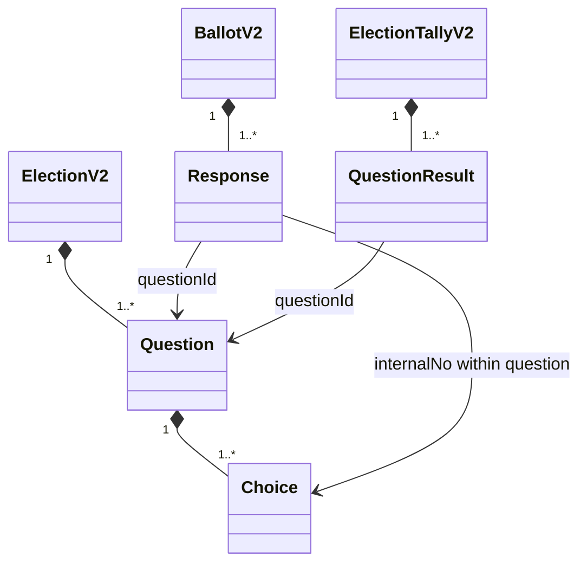
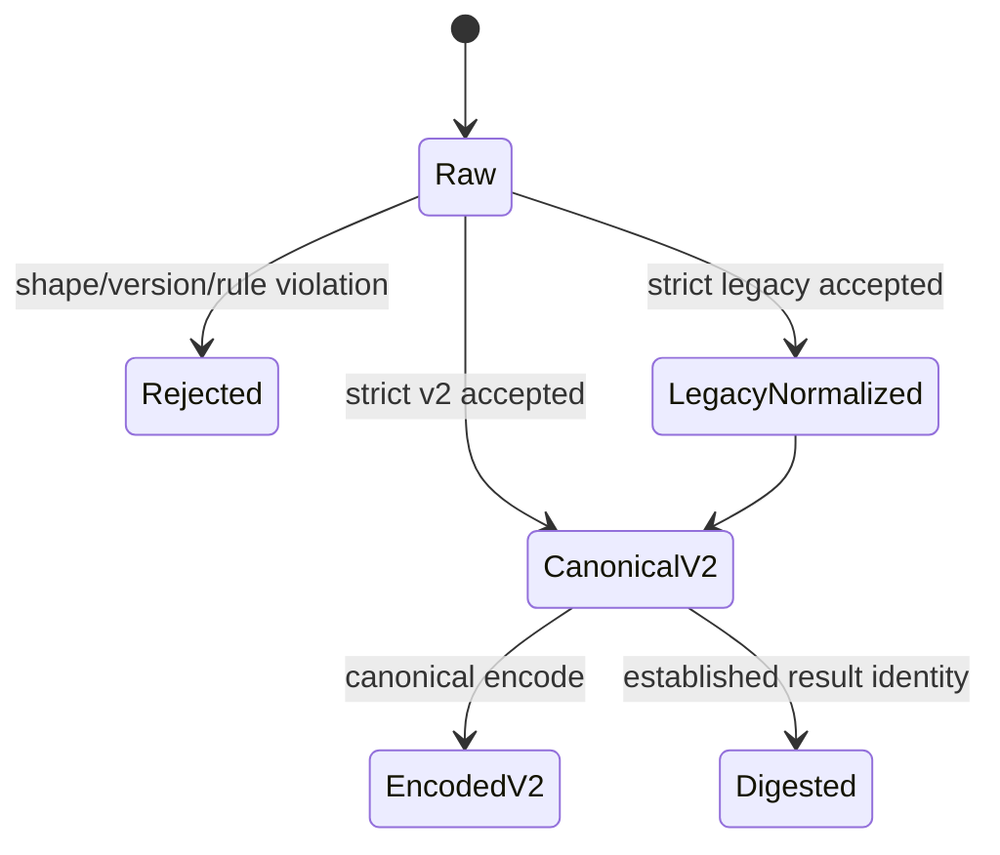

# Domain Entities — election-canonical-schema

## Context

[unit-of-work](../../../inception/units-generation/unit-of-work.md)、[unit-of-work-story-map](../../../inception/units-generation/unit-of-work-story-map.md)、[requirements](../../../inception/requirements-analysis/requirements.md)、[components](../../../inception/application-design/components.md)、[component-methods](../../../inception/application-design/component-methods.md)、[services](../../../inception/application-design/services.md) をU1のcanonical domain modelへ具体化する。全entityはvalidated constructor/decoderからのみ生成する。

## Aggregate model

## ElectionV2 aggregate

| Attribute | Type | Invariant |
|---|---|---|
| schemaVersion | literal `2` | required |
| electionId | string | non-empty、exact保存 |
| kind | string | required、version contract内field |
| questions | ordered `Question[]` | 1件以上、questionId一意、v2 authoringでは`legacy-question`禁止 |
| voters | ordered `string[]` | 1件以上、non-empty、一意 |

ElectionV2はquestion/choice/voter identityのaggregate root。definition順はrecord/result/canonical encodeの順序正本である。lifecycle stateやfilesystem pathはこのentityに含めない。

## Question and Choice

`QuestionId`はbranded string value object。whitespace-onlyをrejectするが、受理値をnormalizeしない。

| Entity | Attribute | Type | Invariant |
|---|---|---|---|
| Question | questionId | QuestionId | Election内一意 |
| Question | text | string | non-empty |
| Question | choices | Choice[] | 1件以上 |
| Choice | internalNo | integer | Question内一意 |
| Choice | label | string | required |
| Choice | description | string optional | absentとnullを区別、null不可 |

Choice identityは `(questionId, internalNo)`。`internalNo`単独はElection-wide identityではない。

## Response

| Attribute | Type | Invariant |
|---|---|---|
| questionId | QuestionId | definition/targetに存在 |
| choiceInternalNo | integer | referenced question choiceに存在 |
| goa | branded integer 1..8 | smart constructorのみ |
| reservation | string or null | GoA 2/3/6ではnon-empty string |
| rationale | string or null | provenance text、集計identityではない |

Responseはimmutable value object。resolution identityはU2が付与する `(voter, questionId)` であり、Response単独にvoterを複製しない。

## BallotV2

共通attribute: schemaVersion、electionId、voter、voterKind、responses、submittedAt、optional receivedAt。

- OriginalBallotV2: `kind="original"`。対象question集合をちょうど1回ずつ覆う。
- AmendBallotV2: `kind="amend"` と `ref: BallotRef`。対象questionのnon-empty subsetだけを置換候補として持つ。

Ballotはappend-only event valueで、decoderは過去ballotとのsupersessionを行わない。ref existence、receipt order、latest resolutionはU2/U3が所有する。

## QuestionResult

Discriminated union:

- EstablishedQuestionResult: questionId、kind `established`、winner、definition-complete choiceCounts、GoA counts。
- HoldQuestionResult: questionId、kind `hold`、closed hold reason、GoA counts。

Resultはquestion単位でimmutable。複数resultのcomplete/mixed lifecycleとpreservation checkはU2が所有する。

## ElectionTallyV2

| Attribute | Type | Invariant |
|---|---|---|
| schemaVersion | literal `2` | required |
| runId | non-empty string | run identity |
| targetQuestionIds | ordered QuestionId[] | unique definition subset |
| results | QuestionResult[] | 全definition questionをちょうど1件ずつ被覆、definition順canonicalizable |
| preservedResultDigest | `sha256:<hex>` | established canonical resultsのidentity |
| talliedAt | UTC timestamp string | valid shape |

U1はshape/referenceを保証する。resultsがcurrent complete setか、target/preservedがstateと整合するか、run historyがappend-onlyかはU2/U3が保証する。

## Legacy normalization values

Legacy entityはcanonical modelに残さない。decoder内部adapterだけが次を生成する。

- questionId: literal `legacy-question`
- questions/responses/results: single-element ordered arrays
- legacy tally runId: `legacy-` + domain-separated canonical identity
- lifecycle: scalar holdはpartial、establishedはtallied相当

同じlegacy payloadはfile path、mtime、read timeに依存せず同じcanonical valueになる。

## Entity lifecycle

Rejected入力からpartial entityを返さない。CanonicalV2はimmutable dataとして下流unitへ渡し、mutationが必要な処理は新しいcanonical valueを構築する。

## Relationship constraints

- Response.questionId → Election.questions.questionId は必須参照。
- Response.choiceInternalNo → referenced Question.choices.internalNo は必須参照。
- QuestionResult.questionId → Election.questions.questionId は必須参照。
- Established winner/counts → referenced Question choices は完全参照。
- Ballot voter → Election.voters は必須参照。
- Legacy `legacy-question`は一Election内に1件だけで、新規v2 authoringではこの予約ID自体を拒否する。
