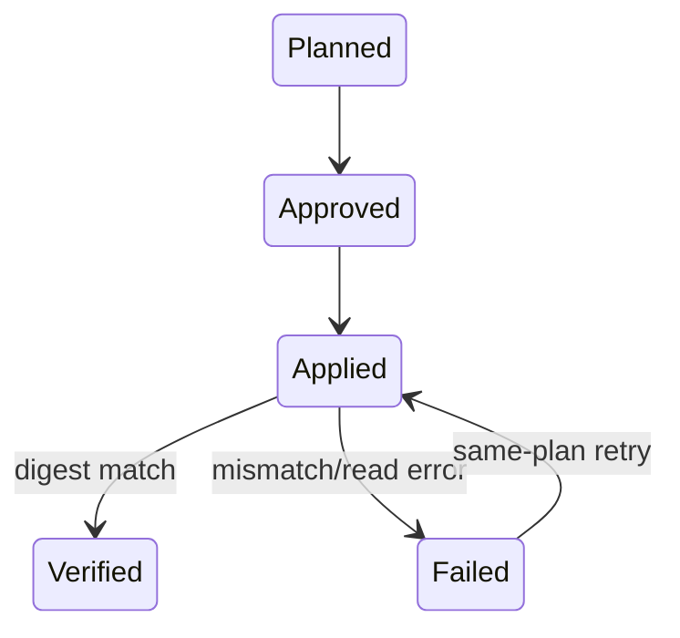

# Domain Entities — election-legacy-migration

## Context

[unit-of-work](../../../inception/units-generation/unit-of-work.md)、[unit-of-work-story-map](../../../inception/units-generation/unit-of-work-story-map.md)、[requirements](../../../inception/requirements-analysis/requirements.md)、[components](../../../inception/application-design/components.md)、[component-methods](../../../inception/application-design/component-methods.md)、[services](../../../inception/application-design/services.md) をU6 entitiesへ展開する。

## MigrationPlan

operationId、electionId、source/target paths、registry before/after、ordered filesystem operations、preconditions、before canonical digest、plan digestを持つimmutable plan。

## MigrationReceipt

plan digest、status (`planned|applied|verified|failed`)、completed steps、after digest、failure/recovery detailを持つ。same plan retryのledger。

## FidelityResult

before/after digest、canonical question IDs、result/run counts、match boolean、findingsを持つ。raw path差はfindingにしない。

## Lifecycle

## Ownership

U1 owns canonical identity、U3 owns store read/layout、U6 ownsplan/apply/fidelity orchestration。U6はschemaやtally policyを所有しない。
