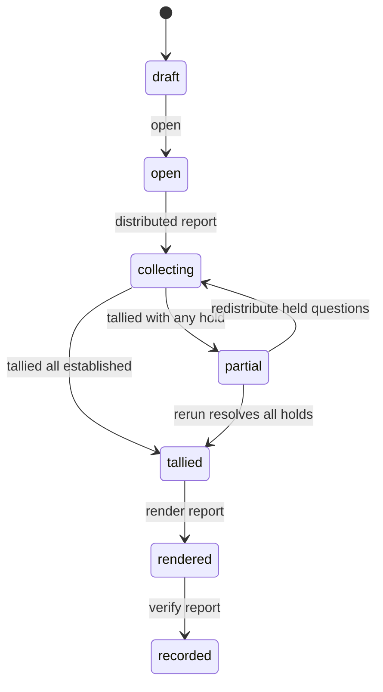
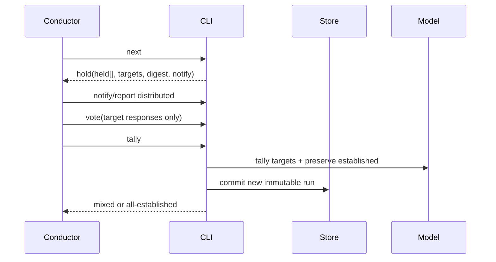

# Business Logic Model — election-mixed-lifecycle-cli

## Context and boundary

[unit-of-work](../../../inception/units-generation/unit-of-work.md)、[unit-of-work-story-map](../../../inception/units-generation/unit-of-work-story-map.md)、[requirements](../../../inception/requirements-analysis/requirements.md)、[components](../../../inception/application-design/components.md)、[component-methods](../../../inception/application-design/component-methods.md)、[services](../../../inception/application-design/services.md) のU5を詳細化する。CLIはU1〜U4を同期orchestrateし、business ruleやstorage schemaを再実装しない。

## Lifecycle

partialではestablished resultsをcurrent snapshotからpreservedとして保持し、targetはhold IDsだけ。draft/open/collectingの初回targetはall questions。

## Directive generation

`handleNext`はcanonical state/snapshot/statusをreadし、次を返す。

- open: `distribute` all target questions。
- collecting + pendingあり: `collect-wait`、pending voters、target IDs。
- collecting + coverage完了: `tally-ready`、target IDs、preserved digest。
- partial: `hold`、`held[{questionId,reason}]`、target IDs、preserved digest、next verb `notify`。
- tallied: `render`。
- rendered: `verify`。
- recorded: `done`。

すべてのdirectiveはelectionId、schemaVersion、targetQuestionIds、preservedResultDigest、verb、reportを固定fieldとして持つ。read-onlyである。

## Command flows

### Open / notify / vote

OpenはU1 decode後にU3へcanonical definition/viewを保存する。NotifyはU4 transportでvoterごと1 view pathを配送する。Voteはcurrent targetをU3から取得し、U1 ballot decoderへtarget IDsを渡し、valid ballotだけをpendingへappendする。established question responseはcoverage errorで拒否する。

### Tally

1. expected collecting stateとtarget/preservedをread。
2. pendingをU3でintegrateしcanonical ledgerを得る。
3. U2でresponsesをresolve、partition validate、target tally、mixed assembly。
4. runId/talliedAtをmintしU3 `commitTallyRun`を呼ぶ。
5. result/lifecycleをstdoutへ返す。state transition自体はreportでcommitする既存separationを維持する場合、tally writeはcandidateとして固定しreportがstate/timelineを完了する。

### Report

Reportはdirective発行時のexpected state、candidate runId、target IDs、preserved digestとdisk currentを照合する。U3 outcomeがsame runのrepairable residueならforward repairする。異run、target/digest mismatch、invalid transitionを拒否する。duplicate successful reportはtimeline/stateからidempotent successまたは既存contractどおり明示refusalを一貫して返す。

### Render / verify

RenderはU4へcanonical current/history/materialized/timelineを渡しrecord draftを保存する。VerifyはU4 findingsが0、U2 history/preservation check成功の場合だけverifiedを返す。findingありでrecordedへ進めない。

## Hold-only rerun sequence

## Error model and UX

stdoutはsuccess/directive JSONのみ、stderrは分類済み一行error、exit 1。errorは`decode | store | invalid-transition | stale-directive | coverage | preservation | verification | transport`に分類し、次の安全な操作を含める。question textではなくIDを必ず表示する。

## Verification scenarios

- 初回single/multi loopとmixed→rerun→done。
- established questionをvote/amend targetへ含めて拒否。
- stale runId/target/digest report拒否。
- retryでU3 forward repairを完了しduplicate timelineなし。
- raw malformed tally/status/verifyをfail-closed。
- directive-only machine executor。

## Review — Iteration 1

- **Verdict:** READY
- **Reviewer:** amadeus-architecture-reviewer-agent
- **Date:** 2026-08-13T12:02:13Z
- **Iteration:** 1
- **Scope decision:** none

### Findings

- None. lifecycle、directive、command delegation、report guards、rerun sequenceがU1〜U4の公開境界と整合し、CLIへのpolicy漏出を避けている。

### Validation Tool Results

| Tool | Result |
|---|---|
| required-sections | PASS: 3成果物 |
| upstream-coverage | PASS: 3成果物×6 upstream |
| answer-evidence | PASS |
| question-budget | PASS: 4/8 |

### Summary

machine-readable target/digestを全commandへ通すため、stale rerunとestablished改変をorchestration境界で拒否できる。
