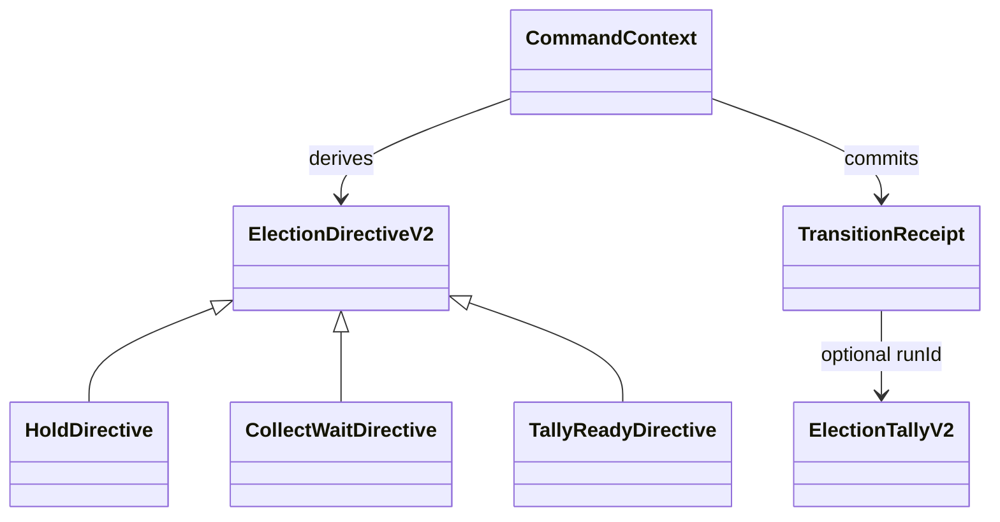

# Domain Entities — election-mixed-lifecycle-cli

## Context

[unit-of-work](../../../inception/units-generation/unit-of-work.md)、[unit-of-work-story-map](../../../inception/units-generation/unit-of-work-story-map.md)、[requirements](../../../inception/requirements-analysis/requirements.md)、[components](../../../inception/application-design/components.md)、[component-methods](../../../inception/application-design/component-methods.md)、[services](../../../inception/application-design/services.md) をU5 command/directive entityへ展開する。

## ElectionDirectiveV2

kind、electionId、targetQuestionIds、preservedResultDigest、verb、reportを共通fieldに持つdiscriminated union。HoldDirectiveは`held: {questionId,reason}[]`、CollectWaitDirectiveはpending voters、TallyReadyDirectiveはexpected state/run preconditionを追加する。

## CommandContext

project root、resolved election directory、canonical StoredElection、current tally、target partition、expected stateを一invocation内に束ねるimmutable context。command handler間でglobal mutable stateを共有しない。

## TransitionReceipt

result、from/to state、runId optional、target IDs、preserved digest、repair outcome、committedAtを持つ。report retryのsemantic identityとなる。

## CliError

closed category、message、questionId/runId optional、安全なnext actionを持つ。内部stack/pathをstdout JSONへ漏らさない。

## Relationships

## Ownership boundary

U5 entitiesはorchestration metadataだけを所有する。Question/Response/ResultはU1、policy draftはU2、stored receiptはU3、record/deliveryはU4のentityを参照する。
