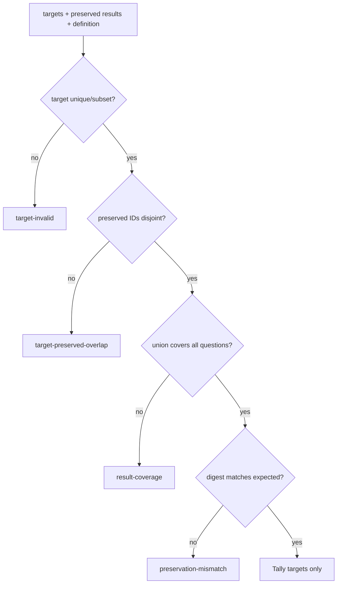

# Business Logic Model — election-question-tally

## Context and boundary

[unit-of-work](../../../inception/units-generation/unit-of-work.md)、[unit-of-work-story-map](../../../inception/units-generation/unit-of-work-story-map.md)、[requirements](../../../inception/requirements-analysis/requirements.md)、[components](../../../inception/application-design/components.md)、[component-methods](../../../inception/application-design/component-methods.md)、[services](../../../inception/application-design/services.md) のU2を詳細化する。入力はU1のvalidated canonical values、出力はnew immutable valuesまたはtyped errorである。

## Response resolution

1. ballotsをappend順で走査する。
2. 各ballotのresponsesを `(voter, questionId)` keyへ展開する。
3. key未登録なら採用する。登録済みなら`receivedAt ?? ""`を比較し、大きいresponseを採用する。
4. receipt axis同値ではappend順が後のresponseを採用する。
5. outputはdefinition voter順 × target question順へ正規化する。

Legacy unstamped ballotの空文字はすべてのstamped receiptより前に並ぶ。unstamped同士はappend順を保つ。submittedAtはidentity/provenanceでありresolution orderに使用しない。

Complexityは全responses Rに対してO(R)、map memory O(V×Q)。

## Target/preserved partition validation

初回runはpreserved empty、targetsはall questions。rerunはtargetsがcurrent hold IDs、preservedがcurrent established resultsである。U2はこのpartitionを明示入力として検証し、disk stateから推測しない。

## Per-question tally

target questionごとに次を独立実行する。

1. resolved responsesをquestionIdで選ぶ。
2. GoA 8が1件以上ならhold `block`。
3. voter rosterが2件の場合:
   - resolved voterが2未満 → `quorum-short`
   - discuss(GoA5)が1以上 → `discussion-needed`
   - abstain(GoA4)が1以上 → `quorum-short`
   - favor(1/2/3/6)=1 かつ against(7/8)=1 → `split`
4. rosterが3件以上の場合:
   - discussが2以上 → `discussion-needed`
   - favor+against=0 → `quorum-short`
5. GoA4をwinner populationから除外し、question-owned choicesごとに票数を数える。
6. maximum countのchoiceが複数ならhold `tie`、一意ならestablished winner。
7. choiceCountsはdefinition choice順、GoA countsは固定field順で返す。

他questionのGoA、reservation、choiceは一切参照しない。questionごとの処理合計はO(R+C)。

## Early tally

questionごとに、received responseからfavor/against/blockとmissing voter数を計算する。

- GoA8が1件でもあればfalse。
- `favor > against + missing` のときだけwinner方向が未投票で覆らない。
- ただし2-voter quorum/discuss/abstain等のpolicyを満たせない場合はfalse。
- あるquestionのtrueは別questionのpending/holdを変更しない。

outputはtargetQuestionId→boolean map。全体booleanへ丸めない。

## Late response classification

入力はquestionId→talliedAt boundary、ballot receivedAt、responses。

- boundaryなしのtarget/collecting question responseはonTime。
- `receivedAt > boundary`ならそのresponseだけlate。
- established questionのlate responseはcurrent tallyへ戻さない。
- late GoA8は`reexamRequired=true`として監査対象にするが、自動的にestablishedを解除しない。
- 同一ballot内で一部onTime/一部lateを表現できる。

## Mixed result assembly

1. preserved resultsをdefinition順mapへ入れる。
2. target tally resultsを同じmapへ追加する。ID collisionは事前検査済み。
3. definition全questionsを順に走査してcomplete `QuestionResult[]`を作る。
4. established subsetのcanonical digestをU1 helperで再計算する。
5. expected preserved digestがある場合、入力preserved subsetのdigestと一致を再確認する。
6. holdが1件以上ならlifecycle `partial`、0件なら`tallied`。

outputはfull result set、new preservedResultDigest、lifecycle、target question results。established input objectをmutationしない。

## Failure and retry semantics

U2はpureでwriteしないためretryは同一入力に同一output/errorを返す。`target-invalid | target-preserved-overlap | result-coverage | response-coverage | preservation-mismatch | tally-invariant`を区別する。error時はpartial resultを返さず、U3 commitを呼べない形にする。

## Verification scenarios

- 2問でestablished/holdのmixed result。
- hold問だけのnew responsesでrerunし、preserved established bytes/digest一致。
- established questionをtargetまたはamendへ入れて拒否。
- 同じvoterの別question responsesが互いにsupersedeしない。
- receipt orderとappend tie-break、legacy unstamped fallback。
- ballot内の一部responseだけlate。
- choice internalNoが別questionで同じでもcountが混ざらない。
- questionごとのearly tally true/false混在。

## Review — Iteration 1

- **Verdict:** READY
- **Reviewer:** amadeus-architecture-reviewer-agent
- **Date:** 2026-08-13T11:55:15Z
- **Iteration:** 1
- **Scope decision:** none

### Findings

- None. resolution key、receipt ordering、target/preserved partition、per-question policy、mixed assembly、late/early isolationが明示され、U1/U3との依存方向に循環はない。

### Validation Tool Results

| Tool | Result | Interpretation |
|---|---|---|
| required-sections | PASS: 3成果物 | 必須構造を満たす |
| upstream-coverage | PASS: 3成果物×6 upstream | 追跡欠落なし |
| answer-evidence | PASS | E-OC1証跡あり |
| question-budget | PASS: 5/8 | Standard予算内 |
| relative-link check | PASS | 壊れた参照なし |

### Summary

established resultを再計算対象から構造的に除外し、commit前にdigest mismatchを拒否できるため実装可能かつdata-safeである。
