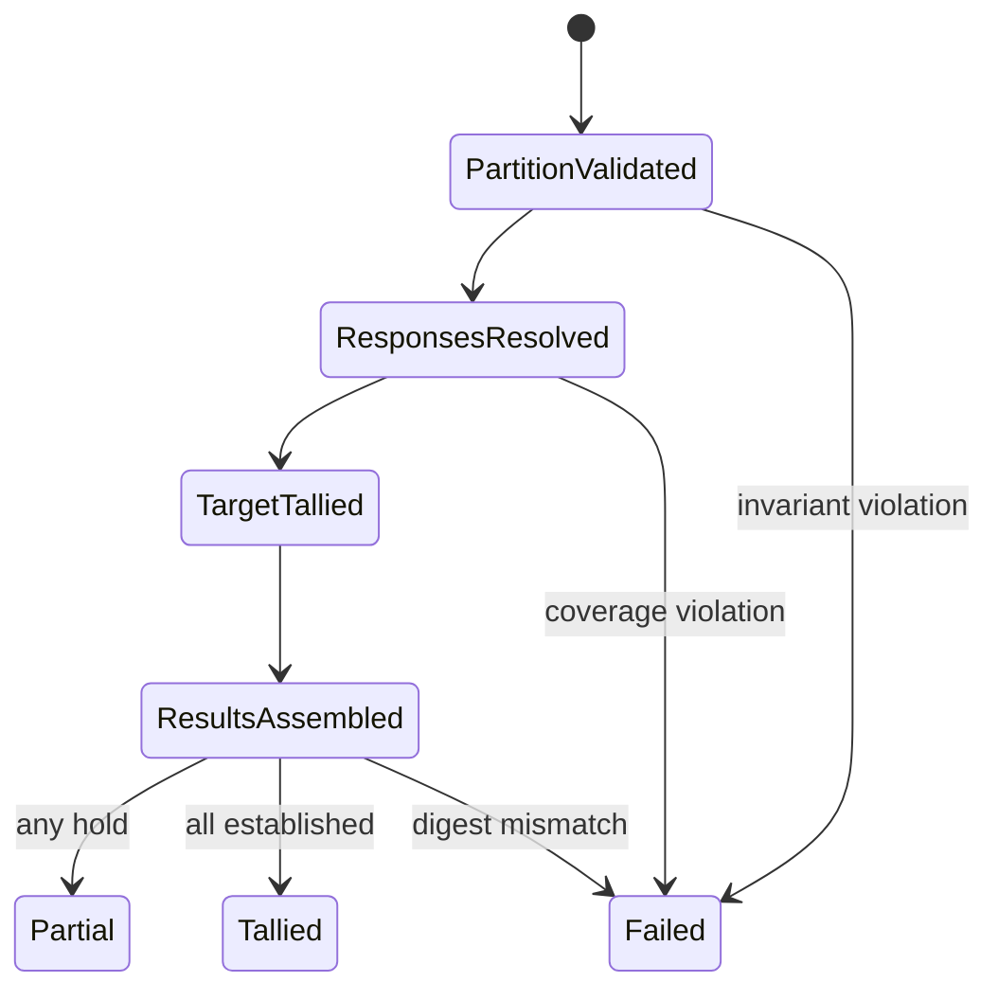

# Domain Entities — election-question-tally

## Context

[unit-of-work](../../../inception/units-generation/unit-of-work.md)、[unit-of-work-story-map](../../../inception/units-generation/unit-of-work-story-map.md)、[requirements](../../../inception/requirements-analysis/requirements.md)、[components](../../../inception/application-design/components.md)、[component-methods](../../../inception/application-design/component-methods.md)、[services](../../../inception/application-design/services.md) をU2のpure policy typesへ展開する。

## ResolvedResponse

| Attribute | Type | Meaning |
|---|---|---|
| voter | VoterId | key part 1 |
| questionId | QuestionId | key part 2 |
| response | Response | latest canonical response |
| ballotIdentity | BallotRef | provenance |
| receivedAt | string optional | ordering axis |
| appendIndex | non-negative integer | receipt tie-break |

identityは `(voter, questionId)`。同voterの別questionは別entityとして解決される。

## TallyPartition

| Attribute | Type | Invariant |
|---|---|---|
| targetQuestionIds | ordered QuestionId[] | unique、hold-only on rerun |
| preservedResults | EstablishedQuestionResult[] | targetとdisjoint |
| expectedPreservedDigest | digest or null | initial runはnull |

partitionは全definition questionsをtargetまたはpreservedのどちらか一方へ割り当てる。

## QuestionTally

questionId、QuestionResult、対象resolved responses、tally boundaryを持つimmutable result。choice countsとGoA countsはQuestionResultに格納し、reservation text自体はballot provenanceへ残す。

## LateClassification

```text
LateClassification = {
  onTime: ResponseOccurrence[];
  late: Array<ResponseOccurrence & { reexamRequired: boolean }>;
}
```

ResponseOccurrenceはvoter、questionId、response、ballot identity、receivedAtを保持する。同一ballotのresponsesが両配列へ分かれることを許す。

## ElectionTallyDraft

| Attribute | Type | Invariant |
|---|---|---|
| targetResults | QuestionResult[] | target IDsをちょうど被覆 |
| results | QuestionResult[] | 全definition questionsをdefinition順で被覆 |
| preservedResultDigest | digest | established subsetのcanonical identity |
| lifecycle | `partial | tallied` | hold有無から導出 |

runId/talliedAtとdisk commit metadataはU3が付与する。

## PolicyError

closed union: `target-invalid`, `target-preserved-overlap`, `result-coverage`, `response-coverage`, `preservation-mismatch`, `tally-invariant`。errorはquestionId/voter/path等のdeterministic contextを持つが、partial draftを含めない。

## State relationships



## Ownership boundaries

- U1 owns canonical input entity validity and digest primitive。
- U2 owns response resolution、tally policy、partition/preservation、derived lifecycle。
- U3 owns persistence、run identity、atomic repair。
- U5 owns command/state transitionとhuman-facing directive。
