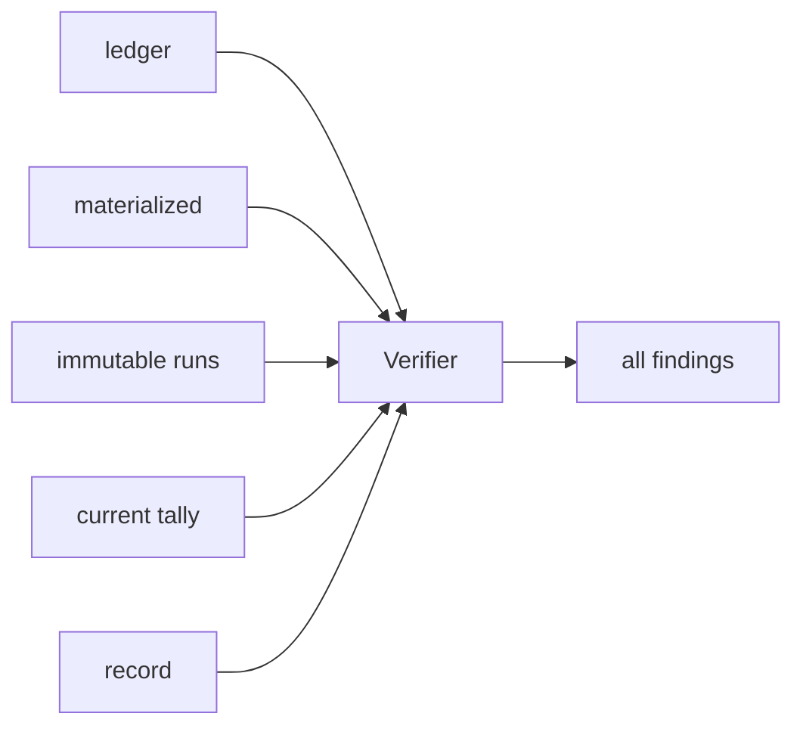

# Business Logic Model — election-record-transport

## Context and boundary

[unit-of-work](../../../inception/units-generation/unit-of-work.md)、[unit-of-work-story-map](../../../inception/units-generation/unit-of-work-story-map.md)、[requirements](../../../inception/requirements-analysis/requirements.md)、[components](../../../inception/application-design/components.md)、[component-methods](../../../inception/application-design/component-methods.md)、[services](../../../inception/application-design/services.md) のU4を詳細化する。U4はvalidated canonical valuesをrender/verify/deliverし、tallyやstate transitionを再実装しない。

## Record rendering

1. election/tally/materialized ballots/timelineをvalidated inputとして受ける。
2. global summaryにelectionId、runId、lifecycle、established/hold件数、held question IDsを出す。
3. definition questionsを順に走査し、`## Question <id>: <text>` sectionを1件ずつ生成する。
4. established sectionはwinner、choice counts、GoA frequencyを固定順で出す。hold sectionはreason、countsを出す。
5. reservationは`(voter, questionId)`へ帰属させ、GoA 2/3/6 responseをdefinition voter順で全件転記する。
6. question-specific late responsesとrun lineageを表示し、global timelineはreceipt順で末尾に置く。
7. newline/field順を固定し、同一canonical inputからbyte-identical Markdownを返す。

summaryはnavigation用で、完全な裁定の正本はquestion sections。summaryとsectionsが矛盾する場合verifyは失敗する。

## Record verification

Verifierは次を独立に再計算する。

- definition question IDsとrecord section IDsの全単射。
- ledger/materializedのvoter×question coverageとlatest response provenance。
- current tallyとlatest history foldのresults/digest。
- resultごとのwinner/counts/GoA、reservation必要数/本文、late attribution。
- summary counts/held IDsとquestion sections。
- timeline receipt monotonicityとrunId/question IDs。

findingは全件列挙し、`missing-question | duplicate-question | result-mismatch | count-mismatch | reservation-mismatch | history-mismatch | digest-mismatch | timeline-order | summary-mismatch`を区別する。

## Distribution view

U1が生成したDistributionViewV2をvoter固有pathへ保存し、既存`distribute` portは `(root, electionId, voters, transport)`のまま各voterへshort notificationを送る。notificationはelectionIdとviewPathだけを持ち、question text/choice/response/peer statusを本文へ複製しない。

Viewは全questionsをdefinition順で含み、各questionのchoicesだけをvoter/election seedで決定的shuffleする。shuffleはquestionIdをseedへ含め、別questionの同internalNoを混同しない。

## Delivery accounting

- agmsg successはnotify時にdelivery recordをbookする。
- subagent directiveはconductor report後に`reported-by-conductor` provenanceでbookする。
- `(voter, distributionRun)`をdedupe keyとし、rerunで対象hold questionsのviewを再配送した場合も別runとして追跡する。
- transport failureはvoter単位outcomeで返し、成功timelineを作らない。

## Error handling

Rendererはinvalid canonical inputを受けない。Verifierは可能な限り全findingを返す。Transportは`send-failed | voter-unknown | view-missing`を維持し、record/verification errorと混ぜない。

## Verification scenarios

- mixed 2-question recordのsummary/sections完全一致。
- questionごとのreservation/GoA/counts、同internalNoの分離。
- section欠落/重複/順序改ざんとhistory/current不一致の検出。
- multi-question viewにpeer signalがないこと。
- voterごと1通知、subagent report booking、rerun delivery dedupe。

## Review — Iteration 1

- **Verdict:** READY
- **Reviewer:** amadeus-architecture-reviewer-agent
- **Date:** 2026-08-13T11:59:47Z
- **Iteration:** 1
- **Scope decision:** none

### Findings

- None. record rendering/verificationとtransport deliveryの責務が分離され、question attribution、blind view、independent-source verificationが明確である。

### Validation Tool Results

| Tool | Result | Interpretation |
|---|---|---|
| required-sections | PASS: 3成果物 | 必須構造を満たす |
| upstream-coverage | PASS: 3成果物×6 upstream | 追跡欠落なし |
| answer-evidence | PASS | E-OC1証跡あり |
| question-budget | PASS: 4/8 | Standard予算内 |

### Summary

既存portを拡張せずpayloadだけを多問化し、record側はquestion sectionを正本にするため、変更面と監査性のバランスが取れている。
