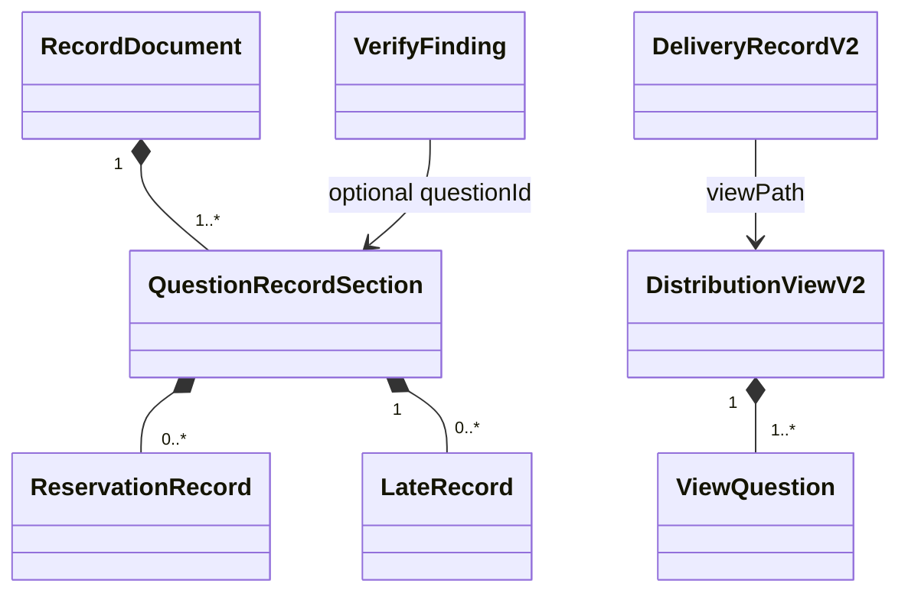

# Domain Entities — election-record-transport

## Context

[unit-of-work](../../../inception/units-generation/unit-of-work.md)、[unit-of-work-story-map](../../../inception/units-generation/unit-of-work-story-map.md)、[requirements](../../../inception/requirements-analysis/requirements.md)、[components](../../../inception/application-design/components.md)、[component-methods](../../../inception/application-design/component-methods.md)、[services](../../../inception/application-design/services.md) をU4 view/record/delivery entitiesへ展開する。

## DistributionViewV2

electionId、voter、ordered questionsを持つ。各view questionはquestionId、text、ordered display choicesを持ち、choiceはdisplayNo、internalNo、label、optional description。peer/recommendation fieldsは型に存在しない。

## RecordDocument

global summary、ordered QuestionRecordSection[]、timeline sectionからなるrender-only entity。QuestionRecordSectionはquestionId/text、result kind、ruling、choice counts、GoA counts、ReservationRecord[]、LateRecord[]を持つ。

## ReservationRecord

identity `(voter, questionId, ballotIdentity)`、GoA、reservation textを持つ。record行数だけでなくidentity/本文をverificationに使う。

## DeliveryRecordV2

| Attribute | Type | Invariant |
|---|---|---|
| electionId | string | required |
| distributionRunId | string | rerunを区別 |
| voter | string | definition voter |
| viewPath | string | voter固有existing path |
| transport | agmsg/subagent | closed |
| provenance | spawn-exit/reported-by-conductor | closed |
| at | timestamp | normalized |

dedupe identityは `(distributionRunId, voter)`。

## VerifyFinding

closed kind、questionId optional、expected/actual、source pathsを持つ。question-specific findingはquestionId必須。複数findingをordered listとして返し、severity推測はcallerへ委ねる。

## Relationships

## Ownership boundary

U1 ownsview/result input shapes、U2 owns counts/lifecycle、U3 ownsfiles、U4 ownsrender/verify/delivery entities、U5 ownswhen to invoke and transition。
