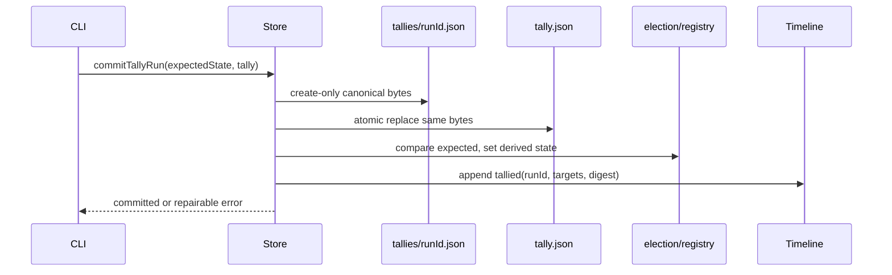

# Business Logic Model — election-v2-store

## Context and ownership

[unit-of-work](../../../inception/units-generation/unit-of-work.md)、[unit-of-work-story-map](../../../inception/units-generation/unit-of-work-story-map.md)、[requirements](../../../inception/requirements-analysis/requirements.md)、[components](../../../inception/application-design/components.md)、[component-methods](../../../inception/application-design/component-methods.md)、[services](../../../inception/application-design/services.md) のU3を詳細化する。U1 codecとU2 tally draftを消費し、filesystem transaction outcomeを返す。

## Canonical read pipeline

`load/ledger/status/tallySnapshot/history/verify`は共通して、read bytes → JSON parse → U1 decoder → canonical typeの順に処理する。missingとcorruptを区別し、`JSON.parse as T`やmalformedをnull扱いするfallbackを禁止する。legacy decodeはmemory内だけで、read-only verbは一切writeしない。

## Store layout

```text
<election>/
  election.json
  ledger.json
  pending/<voter>.json
  ballots/<voter>.json
  tallies/<runId>.json
  tally.json
  timeline.json
  record.md
```

- `election.json`: canonical v2 definition + global state。legacyはdual-read。
- `pending/<voter>.json`: arrival sequenceとordered BallotV2 events。gitignored blind lane。
- `ledger.json`: materialized append-only ballot/late event history。
- `ballots/<voter>.json`: tally runで固定したresolved response view。監査用でledgerを置換しない。
- `tallies/<runId>.json`: immutable complete ElectionTallyV2 run。
- `tally.json`: latest complete canonical snapshot。

## Append pending

1. election/state/targetをcanonical readする。
2. U1でballotをvalidate済みであることを型で要求する。
3. voter pending fileをstrict decodeする。missingは空eventsとして扱うがcorruptは拒否。
4. arrival sequenceとreceivedAtを付けてevents末尾へ追加する。
5. temp fileを書き、fsync/atomic renameの既存helperでvoter fileを置換する。
6. shared ledger/election stateは変更しない。

同一ballot identityのduplicate appendはidempotent no-opかconflictをdigestで判別する。同identity・同bytesはno-op、異bytesは拒否する。

## Integrate pending

1. target votersのpending filesをすべてstrict readし、arrival sequenceで全eventsをstable sortする。
2. full integrated ledger bytesをtempへ書きatomic replaceする。
3. per-voter materialized filesをcanonical v2で生成する。
4. ledger/materializedのdurable write確認後だけpending filesを消費済みとしてremove/rotateする。
5. 途中失敗時はpendingを残し、ledger側のballot identity dedupeでretryを冪等化する。

pending cleanupは履歴削除ではなくblind stagingの消費であり、正式履歴はledgerとmaterialized filesに残る。

## Commit tally run



History pathが既存ならbytes digestを比較する。同一なら作成済みstepとして進み、異なるなら`run-conflict`。Currentが同runId/同bytesなら置換済み、異runならhistory chainとexpected stateに従わなければ拒否する。

state/timelineが失敗してもhistory/currentを削除しない。同runId retryが不足stepだけを前進回復する。timeline duplicateはrunId event存在で防ぐ。

## State and registry

global stateはcanonical `draft | open | collecting | partial | tallied | rendered | recorded`。legacy `hold` readはpartialへ正規化する。writeはexpected current stateを比較してからnextへ進め、registry rowとelection stateの片方だけが更新された場合は同じtransition retryで収束する。read時に両者が矛盾すればcorruptとして拒否し、自動推測しない。

## Status and history fold

statusはdefinition、pending/ledger、current tallyをcanonical readし、question statusesとpending votersを導出する。history foldはrun orderで全runsを読み、各runのfull results、target IDs、preserved digestをU2 invariantで検証し、最後のrunがtally.jsonと一致することを要求する。

## Failure taxonomy

`missing | corrupt | io-error | duplicate | run-conflict | state-conflict | history-mismatch | registry-mismatch`。write APIはどのstepまでdurableかをoutcomeに含め、callerが同runId retryと新run作成を区別できるようにする。

## Verification scenarios

- legacy definition/ledger/tallyをstatus/verifyしてbyte不変。
- multi-question ballot eventsのpending→ledger/materialized意味一致。
- history create後のcurrent/state/timeline各failureから同runId repair。
- 同runId異bytes conflict、timeline duplicateなし。
- mixed partial snapshotからhold-only runを追記し、prior established result不変。
- corrupt pending/ledger/tally/registryをfail-closed拒否。

## Review — Iteration 1

- **Verdict:** READY
- **Reviewer:** amadeus-architecture-reviewer-agent
- **Date:** 2026-08-13T11:57:42Z
- **Iteration:** 1
- **Scope decision:** none

### Findings

- None. evidence-before-state順序、create-only history、current snapshot、retry dedupe、legacy read-only、blind stagingの境界が実装可能な形で整合する。

### Validation Tool Results

| Tool | Result | Interpretation |
|---|---|---|
| required-sections | PASS: 3成果物 | 必須構造を満たす |
| upstream-coverage | PASS: 3成果物×6 upstream | 追跡欠落なし |
| answer-evidence | PASS | E-OC1証跡あり |
| question-budget | PASS: 5/8 | Standard予算内 |

### Summary

multi-file transactionを削除rollbackで擬似atomic化せず、immutable evidenceとidempotent forward repairで扱うため、既存single-writer filesystem modelに適合する。
