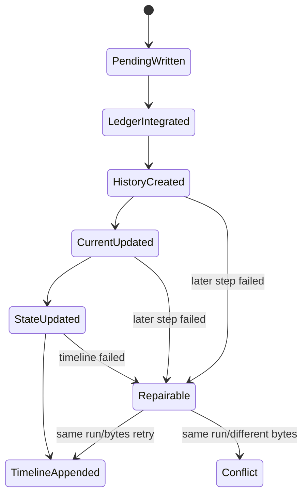

# Domain Entities — election-v2-store

## Context

[unit-of-work](../../../inception/units-generation/unit-of-work.md)、[unit-of-work-story-map](../../../inception/units-generation/unit-of-work-story-map.md)、[requirements](../../../inception/requirements-analysis/requirements.md)、[components](../../../inception/application-design/components.md)、[component-methods](../../../inception/application-design/component-methods.md)、[services](../../../inception/application-design/services.md) をU3 stored recordsへ具体化する。

## StoredElectionV2

canonical ElectionV2とglobal stateを持つaggregate。stateは`draft|open|collecting|partial|tallied|rendered|recorded`。registry entryはelectionId、directory、state、updatedAtを持ち、StoredElectionとstate一致が必要。

## PendingVoterFileV2

| Attribute | Type | Invariant |
|---|---|---|
| schemaVersion | 2 | required |
| electionId | string | directory electionと一致 |
| voter | string | filename/definition voterと一致 |
| events | PendingBallotEvent[] | arrivalSequence昇順、append-only |

PendingBallotEventはarrivalSequence、canonical BallotV2、ballot digestを持つ。pending fileはblind staging entityで、正式historyへ統合後だけcleanup可能。

## LedgerFileV2

schemaVersion、ordered ballot events、late response occurrencesを持つ。ballot identity/digestは一意で、retry時のdedupe keyとなる。late occurrenceはquestionIdを必須にする。

## MaterializedVoterFileV2

voterとtally runごとのresolved responsesを保持し、どのledger eventから選ばれたかのBallotRefを含む。record verifierがledgerと独立にcount/attributionを比較する証拠である。

## TallyRunFileV2

U1 ElectionTallyV2にstore metadataを加える。

| Attribute | Type | Meaning |
|---|---|---|
| runId | string | filename identity |
| previousRunId | string or null | history chain |
| tally | ElectionTallyV2 | complete canonical snapshot |
| contentDigest | digest | idempotency/conflict check |

fileはcreate-only。previousRunIdはcurrent snapshotが指すrunと一致する。

## CurrentTallyFileV2

latest TallyRunFileのtallyとrun metadataをcanonical bytesで保持する。cacheではなくcurrent read contractだが、historyから再構築・検証可能。historyと異なるcurrentはcorrupt。

## TimelineEventV2

既存kind/at/receivedAt/detail/voterにoptional runId、questionIds、preservedResultDigestを追加する。tallied eventは3 fieldを必須とし、runId一意。

## CommitOutcome

`created | repaired-history | repaired-current | repaired-state | repaired-timeline | already-committed` とStoreErrorを区別する。callerは成功outcomeを同じcommitted semanticとして扱える。

## Lifecycle

## Ownership boundaries

U1 owns stored bytesのdecode/encode、U2 owns tally/preservation validity、U3 owns layout/durability/repair、U5 owns command transition intent。U3はhold targetやwinnerを独自計算しない。
