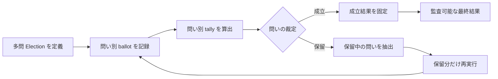

# Scope Document — Election CLI 多問対応

## Upstream Basis

本スコープは [Intent Statement](../intent-capture/intent-statement.md) と [Issue #2813](https://github.com/amadeus-dlc/amadeus/issues/2813) を正本とする。両者が列挙する能力はすべて SETTLED であり、縮小や別 Intent への分割は行わない。Feasibility Assessment と Constraint Register は、この `self-feature` スコープでは生成対象外である。

## In Scope

1. 複数の問いと安定した問い識別子を持つ Election 定義
2. 問いごとの choice・GoA・留保を保持する ballot と保存契約
3. 問いごとの裁定を第一級データとして返す tally
4. 同一 Election 内で成立と保留が混在する部分成立モデル
5. 保留中の問いだけを抽出し、成立済み結果を維持したまま再実行する経路
6. 既存単問 Election と保存済みデータの後方読み取り
7. 新規書き込みを追記型・非破壊に保つ互換性契約
8. 多問の入力、結果表示、再実行を扱う Election CLI
9. 単問回帰、多問集計、部分成立、部分再実行、互換読み取りの自動テスト
10. 多問対応で不要になった関連 bundled norm の週次 distillation 経路による縮約

## Out of Scope

- Election の投票者選定、quorum、認可、solo/team トリガー規則そのものの再設計
- 外部データベース、長時間稼働サービス、ネットワーク API の新設
- 既存履歴を一括変換または破壊的に再書き込みする移行
- CLI 以外の GUI または Web UI
- Issue #2813 と無関係な Election 機能や bundled norm の全面整理
- 品質ゲート、規範、互換性要件の免除

## Capability Dependencies and Sequence

| 順序 | 能力群 | 依存先 | 早期に検証する事項 |
|---:|---|---|---|
| 1 | 問い識別子、ballot、保存形式、単問互換読み取り | なし | 旧形式を読めること、新形式が追記型であること |
| 2 | 問い別 tally、部分成立・部分保留 | 1 | 最悪 GoA への全体丸めを避け、問い単位で裁定できること |
| 3 | 保留分抽出、部分再実行、CLI 入出力 | 1, 2 | 成立済み結果を保持し、保留中の問いだけを再実行できること |
| 4 | 回帰・統合検証 | 1–3 と並行 | 単問互換と多問シナリオを分離して検証できること |
| 5 | 関連 norm の縮約 | 1–4 | 実装済み契約を参照して重複規範だけを安全に減らせること |

実装順序は、依存関係を守りながら互換読み取りと部分成立の高リスク箇所を早期に検証する。特定日付のハードデッドラインは設けず、全受入条件と品質ゲートの達成を完了条件とする。

## Value Stream Map

## Constraints and Assumptions

- Bun-only TypeScript モノレポの既存 CLI・短命プロセス構成を維持する。
- 既存の単問 API と保存データは後方読み取り可能にするが、要求されていない一般的な互換レイヤーは追加しない。
- 追記型履歴を維持し、既存裁定の意味を後から書き換えない。
- 問い識別子は再実行と監査で安定して対応付けられる必要がある。
- full autonomy は Intent 内の通常判断とゲートに限定し、新規権限、不可逆操作、スコープ外変更、規範・品質免除には使用しない。

## Completion Boundary

スコープ完了は、Issue #2813 の全受入条件がコード、保存データ、CLI、テスト、関連 norm の間で追跡可能になり、単問回帰と多問の部分成立・部分再実行が自動検証で成功した時点とする。
