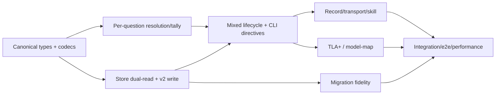

# Component Dependency — Election CLI 多問対応

## 依存規則

[Requirements](../requirements-analysis/requirements.md)、[Components](components.md)、CodeKB の [Architecture](../../../../codekb/amadeus/architecture.md) と [component-inventory](../../../../codekb/amadeus/component-inventory.md) に基づく。依存は CLI/application → domain/ports、adapter → domain の一方向とし、domain から filesystem/process/prose への逆依存を禁止する。

## Dependency matrix

行が依存元、列が依存先。`S` は process 内同期 call、`D` は data/schema contract、`—` は直接依存なし。

| From \ To | C1 Model | C2 Store | C3 CLI | C4 Record | C5 Transport | C6 Skill/Migrate/Norm | C7 Formal/Test |
|---|---:|---:|---:|---:|---:|---:|---:|
| C1 Model | — | — | — | — | — | — | D |
| C2 Store | S | — | — | — | — | D | D |
| C3 CLI | S | S | — | S | S | D | D |
| C4 Record | S | — | — | — | — | — | D |
| C5 Transport | — | D | — | — | — | — | D |
| C6 Skill/Migrate/Norm | S | S | D | — | — | — | D |
| C7 Formal/Test | D | D | D | D | D | D | — |

禁止する循環:

- Model → Store/CLI/Record
- Store → CLI
- Record → Store/CLI
- Transport → CLI business policy

## Data flow: 初回実行

```mermaid
flowchart TD
    A[definition JSON] -->|decode| M[Canonical ElectionV2]
    M -->|save v2| S[Store]
    M -->|blind view per voter| V[views/*.json]
    B[ballot JSON] -->|decode against all target IDs| R[responses[]]
    R --> P[pending/voter.json]
    P -->|integrate at tally| L[ledger]
    L --> T[per-question tally]
    T --> H[tallies/runId.json immutable]
    H --> C[tally.json current]
    C --> O[record.md + directive]
```

## Data flow: hold-only rerun

1. C3 は current results から hold question IDs を順序付きで抽出する。
2. C1 は established results の canonical digest を計算する。
3. C3 は両者を directive に含める。
4. C1 は ballot coverage を target IDs のみに限定し、established question response を拒否する。
5. C1 は target だけを tally し、preserved established results と結合する。
6. C2 は新 run を追記し、current snapshot を更新する。
7. C4/C7 は前後 digest と history chain を独立検証する。

## Shared resources

| Resource | Writer | Readers | 調停 |
|---|---|---|---|
| `election.json` | C2 open | C2/C3/C4/C6/C7 | canonical v2、read-only verb は不変 |
| `pending/<voter>.json` | C2 vote | C2 tally/status | voter ごと1 writer、materialize 前は共有 ledger に出さない |
| `ledger.json` | C2 integrate/append | C2/C3/C4/C7 | arrival order、append-only |
| `tallies/<runId>.json` | C2 commit | C2/C3/C4/C6/C7 | create-only、runId content-address conflict check |
| `tally.json` | C2 commit/repair | C2/C3/C4/C6/C7 | current snapshot、atomic replace |
| `timeline.json` | C2 command/report | C3/C4/C7 | append-only、runId/question IDs を保持 |
| `record.md` | C3経由C4 | C4/C7/human | deterministic render、self-verify |
| `model-map.json` | formal update | formal plugin/C7 | source identity と実装 identity を同時更新 |
| `memory/team.md` | completion-time norm update | workflow/C7/human | `always-elect` の一意性、旧 workaround 非再出現 |

## Failure propagation

- C1 decode failure: write 前に C3 が停止し、store は無変更。
- C2 pending failure: ballot accepted と報告しない。
- C2 history/snapshot partial failure: 同 runId/同 bytes の report retry だけを repair として許可。
- C4 verification failure: recorded へ進めず、既存 tally/history を変更しない。
- C5 delivery failure: voter 単位の outcome として返し、成功扱いの timeline を捏造しない。
- C7 formal mismatch: model-map/identity gate を失敗させ、実装完了証拠に含めない。

## Build order DAG



この DAG は実装順を示す。parallel build は所有ファイルが交差しない場合だけ許可し、`amadeus-election.ts` を共有する unit は直列化する。
