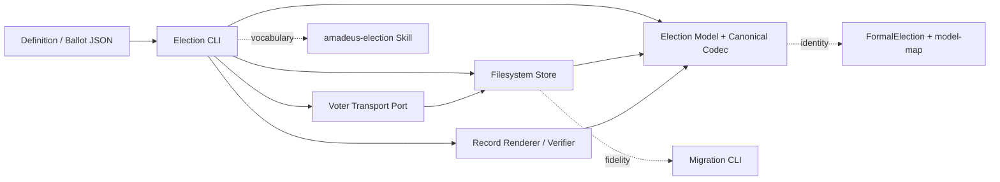

# Components — Election CLI 多問対応

## 設計コンテキスト

本設計は [Requirements](../requirements-analysis/requirements.md)、CodeKB の [Architecture](../../../../codekb/amadeus/architecture.md)、[Component Inventory](../../../../codekb/amadeus/component-inventory.md) を具体化する。既存の layered modular CLI と所有境界を維持し、新規の常駐サービス、DB、HTTP API、GUI、AWS resource は追加しない。

## コンポーネント構成

依存方向は CLI から下位 port へ向け、Model は filesystem、process、record prose に依存しない。Store は canonical codec を使用するが、Model は Store を知らない。

## C1: Election Model と Canonical Codec

正本: `packages/framework/core/tools/amadeus-election-model.ts`

責務:

- `ElectionV2` aggregate、`Question`、`Response`、`QuestionResult`、`ElectionTally` を定義する。
- question ID の一意性、question-owned choice、voter と response coverage を fail-closed で検証する。
- legacy single-question input を予約 ID `legacy-question` を持つ canonical v2 へ正規化する。
- `voter × questionId` を key に amend を解決し、対象 question ごとに tally する。
- receipt axis と question ごとの tally boundary を使い、ballot 内の response を late/on-time に分類する。
- established result の preserved digest と rerun target の非交差を純粋関数で検証する。

公開境界:

- `decodeElection`, `decodeBallot`, `decodeTally`: `unknown` から canonical 型を返す。
- `buildDistributionView`: 全 question を含む blind view を生成する。
- `resolveResponses`, `tallyQuestions`, `deriveLifecycle`: filesystem に依存しない決定的演算。

所有しないもの: directory 解決、atomic write、CLI transition、human-facing prose。

## C2: Election Store

正本: `packages/framework/core/tools/amadeus-election-store.ts`

責務:

- definition、pending ballots、ledger、current tally、immutable tally history、registry、timeline の filesystem 永続化。
- すべての read boundary で C1 の versioned decoder を通し、raw cast を排除する。
- 新規 write は canonical schema v2 のみとし、read-only 操作で legacy file を書き換えない。
- voter ごとの pending 1ファイルに `responses[]` を保存し、blind materialization を維持する。
- `tallies/<runId>.json` を create-only で追記し、その内容から `tally.json` current snapshot を atomic に更新する。

公開境界:

- `load`, `ledger`, `status`, `tallySnapshot` は canonical 型だけを返す。
- `appendPending`, `integratePending`, `commitTallyRun`, `appendTimeline` は単一 writer 前提で原子的に失敗する。

所有しないもの: tally business rule、再実行対象の裁定、record 表現。

## C3: Election CLI Application Service

正本: `packages/framework/core/tools/amadeus-election.ts`

責務:

- `open/notify/vote/status/tally/render/verify/next/report` の短命 command orchestration。
- current snapshot から `targetQuestionIds` を導出し、held-only rerun の machine-readable directive を生成する。
- report 時に expected state、target IDs、preserved digest を照合して transition を commit する。
- legacy/new の違いを command 分岐へ漏らさず、C1/C2 が返す canonical 型だけを扱う。

公開境界:

- stdout の JSON directive/result と exit code。
- TypeScript から直接検証できる `handle*` 関数。

状態所有:

- global lifecycle は `draft | open | collecting | partial | tallied | rendered | recorded`。
- `partial` は established と hold が混在し、次の vote/tally 対象が hold question に限定された状態である。
- individual result の正本は C1 の `QuestionResult[]`、永続正本は C2 の current snapshot/history とする。

## C4: Election Record Renderer / Verifier

正本: `packages/framework/core/tools/amadeus-election-record.ts`

責務:

- definition 順に question section を描画し、ruling、choice counts、GoA frequency、reservations、hold reason を question ID へ帰属させる。
- current snapshot、materialized responses、timeline という独立ソースを再計算して完全性を検証する。
- question/result の欠落、重複、順序違反、誤帰属、preserved digest 不一致を finding として列挙する。

所有しないもの: store read、state transition、hold policy。

## C5: Election Transport Port

正本: `packages/framework/core/tools/amadeus-election-transport.ts`

責務:

- voter ごとに一つの view path を agmsg/subagent へ配送する。
- view の内容は C1/C2 が所有し、transport は question/response の意味を解釈しない。
- delivery record と timeline provenance を維持する。

多問化では通知 API を増やさない。payload の view が `questions[]` を持つため、question ごとの個別送信を避ける。

## C6: Election Skill、Migration、Norm Update

正本:

- `packages/framework/core/skills/amadeus-election/SKILL.md`
- `scripts/amadeus-election-migrate.ts`
- `amadeus/spaces/default/memory/team.md`

Skill は canonical definition/ballot/directive vocabulary と、複数 hold question を含む forwarding loop を説明する。Migration は legacy directory/registry の移動前後に canonical digest を比較し、schema の破壊的 bulk rewrite は行わない。実装・テスト証拠が成立した後だけ、team norm の `cid:requirements-analysis:always-elect` を多問契約へ更新する。検証 suite は active memory の source scan により `E-SRA-RAS13` と `election-cli-canonical` の再出現を拒否し、週次 distillation 後も同じ条件を確認する。

## C7: FormalElection と Verification Suite

正本:

- `amadeus/spaces/default/specs/tla/FormalElection.tla`
- `amadeus/spaces/default/specs/tla/FormalElection.cfg`
- `amadeus/spaces/default/specs/tla/model-map.json`
- `tests/` の election unit/integration/e2e/PBT

責務:

- question ID 一意性、voter × question response、mixed result、established 不変性、held-only transition を有限モデルで検証する。
- model-map の source/implementation identities で TypeScript 実装との対応を固定する。
- canonical round-trip と不正入力 reject を別々の property として検証する。

## データ所有

| データ | 所有コンポーネント | 不変条件 |
|---|---|---|
| `ElectionV2.questions[]` | C1 | 1件以上、ID一意、choice 1件以上 |
| `BallotV2.responses[]` | C1、保存はC2 | voter × question で一意、対象 coverage 完全 |
| pending voter file | C2 | materialize 前は他 voter の共有 ledger に出さない |
| `ElectionTally.results[]` | C1、保存はC2 | definition 順、question ごと1件 |
| current snapshot | C2 | 最新 run の canonical view |
| immutable run history | C2 | create-only、過去 established を変更しない |
| directive | C3 | target IDs と preserved digest を保持 |
| record | C4 | question ID ごとに再検証可能 |

## Failure boundary

decode/validation の失敗は typed error と exit code 1 で command commit 前に停止する。history write 後に snapshot 更新が失敗した場合、同じ `runId` の再 report は history 内容を照合して snapshot 更新だけを冪等に再試行する。異なる内容で同一 `runId` を再利用した場合は拒否する。
