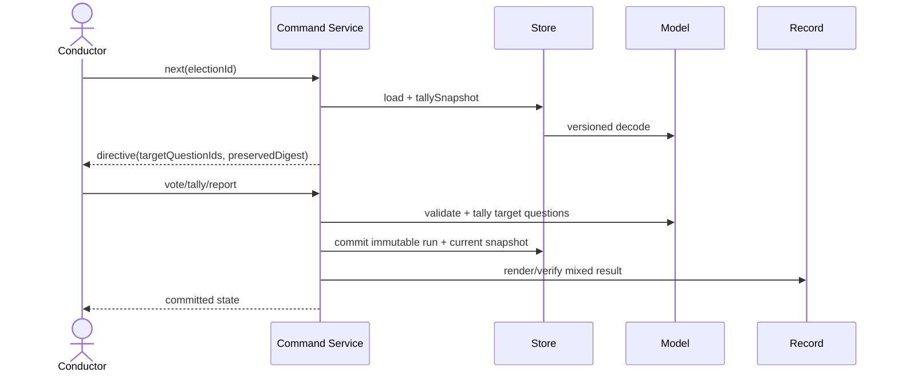

# Services — Election CLI 多問対応

## サービス境界

[Requirements](../requirements-analysis/requirements.md)、[Components](components.md)、CodeKB の [architecture](../../../../codekb/amadeus/architecture.md) と [Component Inventory](../../../../codekb/amadeus/component-inventory.md) に基づき、外部・常駐サービスは追加しない。Application service は `amadeus-election.ts` の一プロセス内 orchestration、domain service は pure functions、infrastructure service は filesystem/transport adapter とする。

## S1: Election Command Service

責務は、一回の CLI invocation で一つの command を完結させること。プロセス間 session state は持たず、すべてを store から canonical decode して開始する。

Orchestration は choreography ではなく明示的な command orchestration とする。理由は単一 writer、短命 CLI、machine-readable forwarding loop が既存契約だからである。

## S2: Canonicalization Service

外部入力と disk input の両方を同じ decoder へ通す同期 pure service。legacy/new の schema 判別、予約 ID 補完、canonical ordering を所有する。

- 入力: `unknown`
- 出力: canonical v2 または typed decode error
- lifecycle: invocation 内のみ
- scaling: question/response 数に対して O(Q + R) または O((Q + R) log n)
- failure: 曖昧な schema は fail-closed。既存データを暗黙に書き換えない。

## S3: Tally / Preservation Service

対象 question IDs、resolved responses、既存 established results を入力に、question result の完全集合と preserved digest を返す pure service。

- 同一 question の choices/GoA/reservations だけを集計する。
- target と preserved の intersection が空でなければ拒否する。
- output は definition 順に正規化する。
- 全問 established なら terminal、hold があれば partial とする。

## S4: Persistence Service

Filesystem adapter として、pending blind lane、ledger、tally history、current snapshot、registry、timeline を単一 writer で管理する。

通信は process 内同期 call。retry queue や background job は追加しない。write failure は command を失敗させ、同じ runId での前進回復を許す。lock/atomic rename の既存方針を維持する。

## S5: Delivery Service

agmsg/subagent port を介し、voter ごとに一つの view path を配送する。配送は question ごとに fan-out せず、voter 数にだけ比例する。transport failure は既存の delivery outcome と timeline provenance で表現する。

## S6: Verification Service

次の独立証拠を join する。

| 証拠 | 検査 |
|---|---|
| canonical definition | question ID / choice invariant |
| ledger + pending/materialized | voter × question coverage、blind lifecycle |
| immutable tally runs | established preservation、run chaining |
| current tally snapshot | history fold との一致 |
| record | question section、ruling、GoA、留保の完全性 |
| TLA+ receipt/model-map | formal source/implementation identity |
| team norm + active memory scan | `always-elect` の多問契約と旧 workaround 非再出現 |

## CLI experience

GUI はないため UX 面は JSON directive と stderr の可読性で担保する。partial state では、利用者が次に必要な操作を推測しないよう、`held[]`、`targetQuestionIds`、`preservedResultDigest`、`verb`、`report` を同時に返す。長い question text は識別子に使わず、すべて stable ID で参照する。

## Infrastructure / scaling

AWS service、network、database、常駐 daemon は不要である。単一ローカル workspace、短命 Bun process、filesystem atomicity が deployment topology の全体である。question 数への固定上限は追加せず、配列走査と ID map を使い、全組合せ事前計算を避ける。
