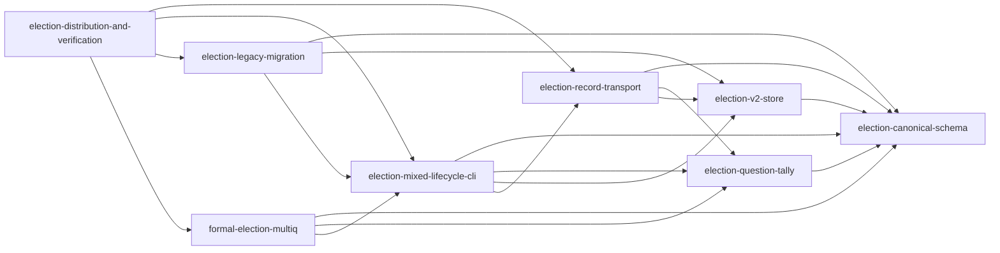

# Unit Dependency — Election CLI 多問対応

## 入力と制約

本DAGは [components](../application-design/components.md)、[component-methods](../application-design/component-methods.md)、[services](../application-design/services.md)、[component-dependency](../application-design/component-dependency.md)、[decisions](../application-design/decisions.md)、[requirements](../requirements-analysis/requirements.md) の ownership と data flow を unit topology に写像する。direct dependency のみを示し、推奨順序、critical path、Bolt sequence は示さない。

## Dependency DAG



矢印 `A --> B` は「A depends on B」を表す。

```yaml
units:
  - name: election-canonical-schema
    kind: library
    depends_on: []
  - name: election-question-tally
    kind: library
    depends_on: [election-canonical-schema]
  - name: election-v2-store
    kind: library
    depends_on: [election-canonical-schema]
  - name: election-record-transport
    kind: library
    depends_on: [election-canonical-schema, election-question-tally, election-v2-store]
  - name: election-mixed-lifecycle-cli
    kind: service
    depends_on: [election-canonical-schema, election-question-tally, election-v2-store, election-record-transport]
  - name: election-legacy-migration
    kind: service
    depends_on: [election-canonical-schema, election-v2-store, election-mixed-lifecycle-cli]
  - name: formal-election-multiq
    kind: spec
    depends_on: [election-canonical-schema, election-question-tally, election-mixed-lifecycle-cli]
  - name: election-distribution-and-verification
    kind: packaging
    depends_on: [election-record-transport, election-mixed-lifecycle-cli, election-legacy-migration, formal-election-multiq]
```

## Integration contracts

| From | To | Contract |
|---|---|---|
| U2 | U1 | canonical Question/Response/Result types、digest ordering |
| U3 | U1 | versioned decoder/encoder、canonical bytes |
| U4 | U1/U2/U3 | definition順 result、materialized ballots、view path |
| U5 | U1/U2/U3/U4 | typed domain calls、store transaction outcomes、record/transport ports |
| U6 | U1/U3/U5 | canonical fidelity digest、resolved directory/registry、CLI verify contract |
| U7 | U1/U2/U5 | state/transition abstraction、implementation identity |
| U8 | U4/U5/U6/U7 | skill vocabulary、runtime CLI、migration corpus、TLC/model-map receipt |

## Parallel topology

経済的な優先順位を意味しない、DAG上の独立集合は次のとおり。

- `{election-question-tally, election-v2-store}` は相互依存しない。
- `formal-election-multiq` と `election-legacy-migration` は共通の下位依存を持つが相互依存しない。
- U8 は統合/配布証拠を所有するため、その4 direct dependency が満たされるまで完了できない。

## Acyclicity argument

全 edge は canonical contract から embedded library、standalone CLI/service、spec、packaging の方向へ進む。U1 へ戻る edge、U5 から U6/U7/U8 への逆 edge、U8 から下流へ戻る edgeはない。したがって cycle は存在しない。

## Review — Iteration 1

- **Verdict:** READY
- **Reviewer:** amadeus-architecture-reviewer-agent
- **Date:** 2026-08-13T11:47:01Z
- **Iteration:** 1
- **Scope decision:** none

### Findings

- None. 8 unitはcanonical kindを一つずつ持ち、direct dependencyだけで構成されたDAGはcycle-freeである。全unitがcapability storyと要件へ追跡され、経済的なBolt順序は適切に未決定のまま残されている。

### Validation Tool Results

| Tool | Result | Interpretation |
|---|---|---|
| required-sections | PASS: 3成果物、edge_block=ok、missing_unit_kinds=[] | Markdown構造とmachine-readable DAGが有効 |
| upstream-coverage | PASS: 3成果物すべて6 upstreamを参照 | 上流追跡に欠落なし |
| answer-evidence | PASS: evidence-present | full autonomy の E-OC1 根拠を確認 |
| question-budget | PASS: 5 / Standard ceiling 8 | 質問予算内 |
| relative-link check | PASS: 5 Markdown files | 壊れたローカル参照なし |

### Summary

domain、persistence、orchestration、formal、distribution/verification の所有境界が実装可能なunitへ分かれ、依存方向はapplication designと整合する。Delivery Planningが複数のtopological pathから経済的順序を選べるため READY とする。
