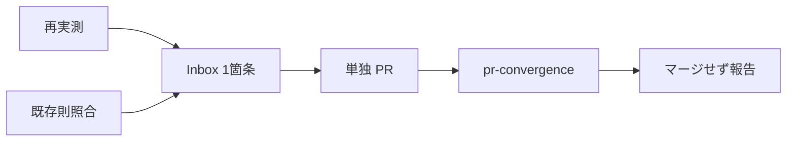

# Business Logic Model — coverage-quick-norm

上流: `requirements.md` のみ(units-generation / application-design は SKIP、expected-absent)。

## 対象成果物

単一の追記先: `amadeus/spaces/default/memory/project.md` の `## Learnings Inbox(未蒸留)`。蒸留済み本文は読み取り専用。

## 情報の流れ

1. 起草前に既存則(single-owner、numbers-from-command-output-only、advisory vs blocking)を全文照合する。
2. 引用数値をコマンドで再取得する。
3. Inbox 末尾へ1箇条を追加する。
4. origin/main 起点の単独 PR を作り、pr-convergence まで進めてマージせず停止する。

Text fallback: 再実測と既存則照合のあと Inbox に1件書き、単独 PR を収束させてマージせず止める。

## Review — Iteration 1

- **Verdict:** READY
- **Reviewer:** amadeus-architecture-reviewer-agent
- **Date:** 2026-08-14T06:30:50Z
- **Iteration:** 1
- **Scope decision:** none

Information architecture maps FR-1 to FR-15 onto one Inbox entry. Optional frontend-components omitted. No contradiction with single-owner or numbers-from-command-output-only.

### Findings

- None
