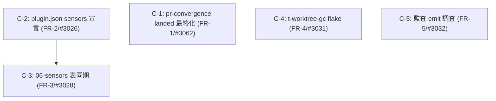

# Component Dependency — 260814-open-bug-batch-6

## 依存グラフ(変更ユニット間)

テキストフォールバック: FR-2 → FR-3 のみ依存(表の最終行数 14 が FR-2 の宣言追加を前提)。FR-1 / FR-4 / FR-5 は相互独立で並行可能。

## ファイル交差

- FR-1: `plugins/github-pr-convergence/**` — 他 FR と交差なし
- FR-2: `plugins/formal-model-check/plugin.json` + ステージ frontmatter — FR-3 の docs と別ファイル(依存は分母の数値のみ)
- FR-3: `docs/harness-engineering/06-sensors(.ja).md` + docs 検証テスト
- FR-4: `tests/integration/t-worktree-gc.test.ts`
- FR-5: 調査主体(是正時 `packages/framework/core/tools/amadeus-lib.ts` / `otel/*`)— core 変更時は bt-ledger-resync(model-map ピン等)が発火しうる唯一のユニット

## 並行 intent との交差

intent 260814-priority-bug-batch(#3065/#3034/#3040/#3035)の変更面と本 intent の対象ファイルの交差は実装開始時に `git diff --name-only` で実測し、交差があれば当該ユニットを直列化する(requirements 制約)。

## ビルド・投影依存

- FR-1 / FR-2 はプラグイン正本の変更 → `bun run build` で全ハーネス投影を再生成(FR-2 は `.claude/sensors/` 13→14 の実測が受け入れ)
- FR-5 の是正が発生した場合のみ core 変更 → model-map.json 実装ハッシュピン・coverage 台帳の resync を同一変更で行う
