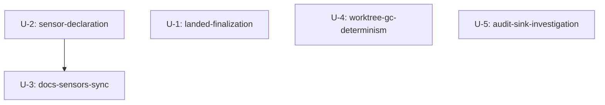

# Unit Dependency DAG — 260814-open-bug-batch-6

トポロジーのみを記述する(実装順・クリティカルパスの選定は delivery-planning の所掌)。



テキストフォールバック: 依存辺は U-2 → U-3 の1本のみ(表の最終行数 14 が U-2 の sensors 宣言追加を前提とするため)。U-1 / U-4 / U-5 は入次数・出次数ともに 0 で、任意の並行実行が可能。

## ファイル交差(排他制約)

| ペア | 交差 |
| --- | --- |
| U-1 × 他 | なし(`plugins/github-pr-convergence/**` は U-1 単独所有) |
| U-2 × U-3 | なし(plugin.json+frontmatter vs docs+docs テスト。依存は数値のみ) |
| U-4 × 他 | なし(単一テストファイル) |
| U-5 × 他 | なし(是正発生時も core/otel は U-5 単独所有) |

補足: 全 unit 共通で `tests/.coverage-registry.json` regen(新規テストファイル追加時)と、U-5 是正時のみ model-map ピン resync が発生しうる — 並行実装時はこれら共有台帳の更新を conductor 統合断面で直列化する。

## 検証(独立実装可能性)

各 unit は単独で PR を構成でき、他 unit の未着地は受け入れ述語を阻害しない(U-3 のみ U-2 着地後に最終値 14 を実測する順序制約を持つ)。片側だけで価値を出荷できない境界はない。

## 機械可読エッジブロック

```yaml
units:
  - name: landed-finalization
    kind: library
    depends_on: []
  - name: sensor-declaration
    kind: spec
    depends_on: []
  - name: docs-sensors-sync
    kind: spec
    depends_on: [sensor-declaration]
  - name: worktree-gc-determinism
    kind: library
    depends_on: []
  - name: audit-sink-investigation
    kind: library
    depends_on: []
```

## 統合ポイント

- U-2 → U-3: `.claude/sensors/` の投影件数(14)と宣言集合(共有データ。API・イベントなし)
- 全 unit → 共有台帳: `tests/.coverage-registry.json`(新規テスト追加時の regen)、U-5 是正時のみ `amadeus/spaces/default/specs/tla/model-map.json`

## 並行開発機会

依存を持たない集合 {U-1, U-2, U-4, U-5} は同時着手可能(有効なトポロジカル順序は複数存在)。U-3 のみ U-2 の後。
