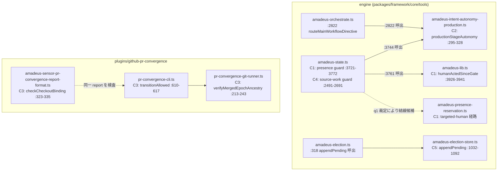

# Components — intent 260816-priority-bug-batch-3

requirements.md の FR-1〜FR-5 が触る既存コンポーネント 5 領域の境界と責務を、RE 差分リフレッシュ(codekb `architecture.md` / `component-inventory.md`、observed `89053172e`)の実測に基づいて確定する。本 intent は新規コンポーネントを追加しない — すべて既存コンポーネントの欠陥修正であり、境界は現行のまま維持する。

## コンポーネント一覧(修正対象)

### C1: ゲート presence 解決(FR-1 / #3153)

- **所在**: `packages/framework/core/tools/amadeus-state.ts` `assertHumanPresentForGateResolution`(:3721-3772)、`packages/framework/core/tools/amadeus-lib.ts` `humanActedSinceGate`(:3926-3941)・`resolveGatePresence` / `scanPresenceLedger`(:3822-3882)、`packages/framework/core/tools/amadeus-presence-reservation.ts`(targeted-human 経路、`humanTurnIsFresh`)
- **責務**: ゲート解決(approve / reject)時に人間の実在を fail-closed で検証する
- **公開面**: `amadeus-state.ts approve` / `reject` の state guard(呼出 :4178 / :4860)
- **修正点**: autonomy の human-required 宣言(`authorizationReason`)を承認可否へ結線する(方式 = 選挙 E-260817-PBB3-FIX-METHODS q1 の裁定)。あわせて `GATE_APPROVED` に承認根拠の機械識別フィールドを追加

### C2: Intent autonomy production(FR-2 / #3152)

- **所在**: `packages/framework/core/tools/amadeus-intent-autonomy-production.ts` `productionStageAutonomy`(:295-328)・`emitAuthorizationRefusal`(:354-370)
- **責務**: occurrence 単位の autonomy 認可判定と、human-required 時の監査記録
- **公開面**: 呼出元 2 箇所 — `amadeus-orchestrate.ts:2822`(`routeMainWorkflowDirective`)、`amadeus-state.ts:3744`
- **修正点**: `INTENT_AUTONOMY_HUMAN_REQUIRED` の発行を同一 occurrence 高々1行・ゲート未提示0行へ(方式 = 同選挙 q2 の裁定)。認可側の `already-decided` arm(:901-913)と対称にする

### C3: pr-convergence report lifecycle(FR-3 / #3149)

- **所在**: `plugins/github-pr-convergence/tools/pr-convergence-cli.ts` `transitionAllowed`(:610-617)・stale 判定(:907-919)、`amadeus-sensor-pr-convergence-report-format.ts` `checkAttestationEnvironment` / `checkCheckoutBinding`(:285-302 / :323-335)、`pr-convergence-git-runner.ts` `verifyMergedEpochAncestry`(:213-243)
- **責務**: Bolt PR 配送の収束 report の lifecycle 遷移と、blocking センサーによる report 検証
- **公開面**: pr-convergence CLI の `create` / `report` verb、`pr-convergence-report-format` センサー(default_severity: blocking)
- **修正点**: (クラスA)converged-at-merged-head の最終化経路 — CLI とセンサーのどちらを正とするかは同選挙 q3 の裁定。(クラスB)孤児化 created の回復経路 — 同 q4 の裁定
- **運用注意**: 本 intent 自身の Bolt PR 配送が同機構を使う(自己適用)。attestation は self-install 投影(`.claude/plugins/...`)からの起動を要する(cid:code-generation:c2-pr-record-in-head-checkout)

### C4: workspace source-work ガード(FR-4 / #3156)

- **所在**: `packages/framework/core/tools/amadeus-state.ts` :2491-2691(`intentBirthCommit` :2498-2504、`recordBranchSourceWork` :2511-2521、`boltRefHasSourceWork` :2556-2563、`mergedPrSourceWork` :2595-2609、`intentScopedSourceWork` :2622-2632、`gitHasSourceWork` :2650-2679、`workspaceHasWork` :2685-2691)、判定点 `evaluateStageArtifacts` :2726
- **責務**: code-producing stage の完了時に intent 帰属のソース作業の実在を検証する(sibling intent の誤帰属を防ぐ attribution 原則を維持)
- **修正点**: 3 プローブの判定起点が `intentBirthCommit` 固定であることによる「record 初コミット後追い」形状の取りこぼしを解消する新プローブ(または既存プローブの拡張)。方式裁定は不要 — Issue 完了条件が実装形を規定済み(マージ済み Bolt PR のコードコミットが record ブランチ履歴に包含されることの検出)

### C5: 選挙 store append(FR-5 / #3046)

- **所在**: `packages/framework/core/tools/amadeus-election-store.ts` `appendPending`(:1032-1092、採番 :1063、書込 :1088)、`readAllPending`(:527-549、一意性検査 :545-547)、`pendingPath`(:489-491)
- **責務**: 選挙 ballot の pending 追記と全体順序の決定的導出
- **公開面**: 本番呼出元は `amadeus-election.ts:318` の1箇所のみ
- **修正点**: 並行 voter の read-then-write TOCTOU の解消(方式 = 同選挙 q5 の裁定)。破壊的変更許容(互換シム禁止)

## コンポーネント図

テキストフォールバック: engine 側は amadeus-state.ts(C1 presence guard / C4 source-work guard)が amadeus-intent-autonomy-production.ts(C2)と amadeus-lib.ts を呼び、amadeus-orchestrate.ts:2822 も C2 を呼ぶ(#3152 の2発火点)。q1 裁定により C1 から amadeus-presence-reservation.ts への結線が候補。選挙系は amadeus-election.ts:318 → amadeus-election-store.ts(C5)の1本。plugin 側は pr-convergence-cli.ts(C3)が git-runner の祖先検査を呼び、センサーが同じ report を独立検査する。

## 境界の不変条件

- C1/C2/C4 は `amadeus-state.ts` / `amadeus-intent-autonomy-production.ts` を共有する — unit 分割時は write scope の直列化が必要(codekb `architecture.md` の交差分析、requirements.md 前提節)
- C3 は plugin 境界内で完結し、C5 は election store 内で完結する(他領域と交差なし)
- 監査台帳は append-only を維持。`GATE_APPROVED` へのフィールド追加は audit-format.md の同一変更内更新と event-registry 基数 pin の非破壊(既存イベントの意味論変更なし)を要する

## Review — Iteration 1

- **Verdict:** READY
- **Reviewer:** amadeus-architecture-reviewer-agent
- **Date:** 2026-08-17T01:56:57Z
- **Iteration:** 1
- **Scope decision:** none

5成果物はrequirements.mdのFR-1〜FR-5・選挙E-260817-PBB3-FIX-METHODSの裁定(established 2件/tieのユーザー裁定3件)と整合し、混入検査(後方互換レイヤー・フォールバック・移行シム)もクリーンでBLOCKERなし。ADRのConsequences節欠落とq1決定済みなのに条件付き表現が残る箇所をFOLLOW-UPとして指摘。

### Findings

- FOLLOW-UP | decisions.md の ADR-1〜5 はいずれも Context / Decision / 実装契約 / Alternatives Rejected / Reversibility の構成で、ステージ契約が明示する『Each ADR includes: Context, Decision, Consequences, Alternatives Considered』の Consequences に相当する独立節がない。ADR-1 実装契約項目3(milestone ゲートの gate-start 事実上必須化)のように帰結を示す記述は実装契約内に分散して存在するが、Consequences として明示的に整理されていない(5件全ADR共通)。
- FOLLOW-UP | components.md のコンポーネント図エッジラベル『q1 裁定により結線候補』(ST -.-> PR)と component-dependency.md のファイル交差表『(q1 裁定次第で)amadeus-presence-reservation.ts』は、q1 が選挙 established 2-0(tie ではない)で確定済みであり、ADR-1 実装契約項目2が humanTurnIsFresh(presence-reservation)との定義共有を無条件でコミットしているにもかかわらず、依然『裁定次第/候補』という条件付き表現のまま残っている。P3(既決の上位規範は蒸し返さない)に照らし、units-generation/functional-design で再度この結線の要否を議論してしまうリスクがあるため訂正を推奨。
- FOLLOW-UP | components.md の『境界の不変条件』節は『C1/C2/C4 は amadeus-state.ts / amadeus-intent-autonomy-production.ts を共有する』と記すが、components.md 自身の C4 記述(所在は amadeus-state.ts のみ)および component-dependency.md のファイル交差表(FR-4 の交差は amadeus-state.ts のみで amadeus-intent-autonomy-production.ts への言及なし)と整合しない。amadeus-intent-autonomy-production.ts を共有するのは C1/C2 のみで、C4 はこれを共有しない。summary文がC4の結合度を過大に述べている。
- NIT | component-dependency.md の FR-4/FR-1/FR-2 直列化の根拠として cid:code-generation:c1-coverage-single-owner を引用しているが、当該学習の本文は『同一worktreeでのcoverage計測を並行実行すると相互破壊する』ことを対象としており、『同一ファイルPRの並行によるmerge conflict』を直接支持する文言ではない。直列化の結論自体は妥当だが、citationの射程がやや広く適用されている。
