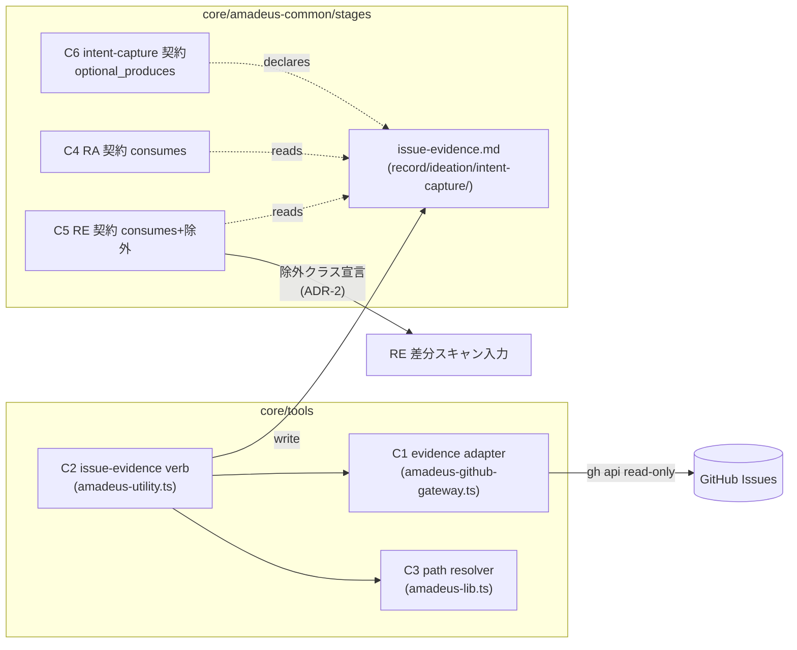

# Components — インセプション固定費バッチ(#3181 + #2415)

上流入力: `requirements.md`(FR-EVD-1〜8 / FR-EXC-1〜6)、codekb `architecture.md`・`component-inventory.md`(現行構成 — 変更対象コンポーネントの現状はこの2つが正)。ADR は `decisions.md`。

## 変更・新設コンポーネント一覧

| # | コンポーネント | 種別 | 担当 Unit | 規模見積(LOC) | 責務 |
|---|---|---|---|---|---|
| C1 | evidence gateway adapter(`packages/framework/core/tools/amadeus-github-gateway.ts` 内) | 既存ファイルへの追加 | U1 (#3181) | 〜80 | Issue 本文+コメント一覧の read-only 取得。readiness 検査・redaction 維持。mutation permit 非対象 |
| C2 | `issue-evidence` verb(`packages/framework/core/tools/amadeus-utility.ts` 内 handler) | 既存 CLI への verb 追加 | U1 (#3181) | 〜140 | `issue-evidence fetch` — 取得・検証・record への artifact 書込。loud fail(readiness/API 失敗は非0終了+部分書込なし) |
| C3 | issue-evidence path resolver(`packages/framework/core/tools/amadeus-lib.ts` 内) | 既存ファイルへの追加 | U1 (#3181) | 〜30 | artifact パスの決定的解決(`<record>/ideation/intent-capture/issue-evidence.md`)。git 呼び出しなしの純関数。必要性の根拠は ADR-1(engine 外実行コンテキスト) |
| C4 | RA 契約(`packages/framework/core/amadeus-common/stages/inception/requirements-analysis.md`) | 契約改訂 | U1 (#3181) | 〜25 行(md) | `consumes:` へ issue-evidence(required:false)追加+「確定事実は再導出せず消費」の明文化(FR-EVD-3)+ Sensors 節 :185 の列挙 parenthetical へ issue-evidence を追記(FR-EVD-7 の文書同期) |
| C5 | RE 契約(`packages/framework/core/amadeus-common/stages/inception/reverse-engineering.md`) | 契約改訂 | U1+U2 共有 | 〜50 行(md) | U1 面: issue-evidence 消費(Focus 導出 — FR-EVD-4)。U2 面: Step 2 への除外クラス宣言(FR-EXC-1/2、ADR-2)+「codekb 本体は工程記録を新規引用しない」(ADR-3) |
| C6 | intent-capture 契約(`packages/framework/core/amadeus-common/stages/ideation/intent-capture.md`) | 契約改訂 | U1 (#3181) | 〜15 行(md) | `optional_produces:` へ issue-evidence 追加(producing 宣言 — ADR-1、スキーマ実在根拠は ADR-1 記載) |
| C7 | 除外クラスの落ちる実証テスト+帰属検査述語 | 新設テスト | U2 (#2415) | 〜250(test) | 正準 pathspec の実効(既知非ゼロ区間で正件数・specs/** 非除外)を pin(FR-EXC-2/5 AC) |

規模較正の注記: 上記は正味実装の見積。過去実測(units-generation LOC 較正の学習)では FD/ノルム必須要素(Result 化・エラー処理・監査・テスト)込みの実績が見積の 2.1〜2.6 倍に達した — U1 の総枠は tests 込み 〜700 LOC、U2 は 〜350 LOC(md 含む)を上限目安とし、units-generation の unit-of-work.md で再較正する。

## コンポーネント境界と所有

- **C1↔C2 境界**: C2(verb)は C1(adapter)だけを通して GitHub と会話する — gateway の「唯一のプロセス境界」ヘッダ契約を維持。C2 は gh 引数を組み立てない。
- **C2↔C3 境界**: 書込先パスは C3 の純関数だけが決める。C2 はパスを合成しない(codekb-path と同じ流儀)。
- **C4/C5/C6**: 契約 markdown は `packages/framework/core/` が正本。dist・self-install は `bun run build` の投影(編集禁止)。
- **U1/U2 の共有ファイルは C5 のみ**: 同一ファイルの別節(consumes/frontmatter+Focus 面 vs Step 2 走査対象面)だが、delivery-planning で直列化する(requirements 制約)。

## 公開インターフェース(概要 — 詳細は component-methods.md)

- C1: `createEvidenceGitHubGatewayAdapter(runner)` → `{ readiness(), viewIssue(repo, n), listComments(repo, n) }`
- C2: CLI `bun .claude/tools/amadeus-utility.ts issue-evidence fetch --issues <n[,n...]> [--repo <owner/repo>]`
- C3: `issueEvidencePath(projectDir, intent?, space?)` / `relativeIssueEvidencePath(...)`
- C7: `RE_SCAN_EXCLUDED_PATHSPECS`(正準 `:(glob)` 形の定数列挙 — 契約とテストが同一定義を参照し drift を防ぐ)

## 図(コンポーネント関係)

テキストフォールバック: C2(utility verb)→ C1(gateway adapter)→ GitHub(read-only)。C2 は C3 が解決したパスへ issue-evidence.md を書く。C6 が producing を宣言し、C4(RA)と C5(RE)が consume する。C5 は同時に RE スキャン入力への除外クラス宣言(ADR-2)を持つ。

## Review — Iteration 2

- **Verdict:** READY
- **Reviewer:** amadeus-architecture-reviewer-agent
- **Date:** 2026-08-17T23:32:51Z
- **Iteration:** 2
- **Scope decision:** none

All iteration-1 findings resolved with credible, well-evidenced fixes: ADR-3 now has 2 rejected alternatives, ADR-1 reconciles optional_produces against FR-EVD-2's AC with specific schema/graph evidence and a stated reason for not using plain produces; the two new ADR-3 counterexample citations (architecture.md:3450 and :5513) were independently spot-checked against the in-scope file and both verified accurate. No new issues found.

### Findings

- FOLLOW-UP | decisions.md ADR-1's optional_produces evidence (amadeus-stage-schema.ts:37/:428-430, amadeus-graph.ts:860) rests on conductor-attested file:line facts outside this reviewer's 9-file scope and could not be independently re-verified by this reviewer; accepted as credible given specificity and consistency with cited precedent (functional-design.md/infrastructure-design.md), but a developer implementing ADR-1 should re-confirm these exact line numbers against current HEAD before coding, since attested evidence can drift from a design snapshot to implementation time.
