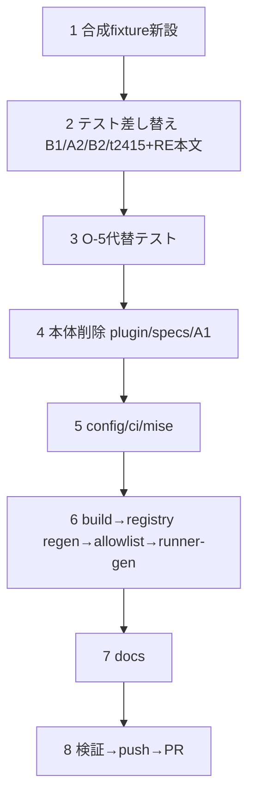

# Component Dependency — 260821-fmc-retirement(削除の順序依存)

上流入力: `components.md`、`component-methods.md`、requirements NFR-1。

## 実装順序(単一 Bolt 内の作業順 — 各段の理由つき)

```
1. 合成 fixture プラグイン新設(tests/fixtures/conformance-fixture-plugin/)
   ↓ 先に受け皿を作る — B1/A2 の差し替え先が存在しないと 2 が赤くなる
2. テスト差し替え: B1 16 件 + A2 温存 4 件の fixture 再配線、B2 44 件の参照除去、
   t2415 ×2 と RE ステージ本文(正本)の同時更新(同意述語ドリフト防止)
   ↓
3. O-5 代替テスト 2 本の追加(TDD: 公開 seam 経由 Red→Green)
   ↓
4. 本体削除: plugins/formal-model-check(43)+ specs/tla・tla-evidence(21)
   + A1 92 件 + A2 再分類 4 件の削除
   ↓ テストと本体は同一コミット群 — 中間状態でスイートを回さない
5. 設定・CI: config.json 2 項除去、ci.yml job+needs+require_result 除去、
   detect-ci-changes 2 パターン除去、mise.toml JDK 除去
   ↓
6. 再生成(順序固定): bun run build(dist/self-install/runner 消滅)
   → bun tests/gen-coverage-registry.ts(build 後 — c5-regen-needs-build)
   → patch-allowlist 該当エントリ除去 → runner-gen check green
   ↓
7. docs: 全面削除 4 + 部分除去 16 + 索引 4 + 休眠明記 1 文(中立表現)
   ↓
8. ローカル即時検査(typecheck / lint / targeted: t341・B1・A2温存・O-5代替)
   → push → PR → リモート CI 正本
```

## Mermaid(依存グラフ)



テキストフォールバック: 1→2→3→4→5→6→7→8 の直列(分岐なし)。

## 危険な逆順(禁止)

- 本体削除(4)をテスト差し替え(2)より先に行う → B1/A2 が即赤(NFR-1 違反)
- registry regen(6)を build 前に行う → stale dist で enumeration 欠落(cid:code-generation:c5-regen-needs-build)
- t2415 だけ直して RE ステージ本文を残す(または逆)→ 同意述語ドリフト(cid:code-generation:cg2-agreeing-predicate-drift)
- ci.yml の require_result だけ残して job を消す → ci-success が永久 pending(FR-CI-1 の同一変更要求)
