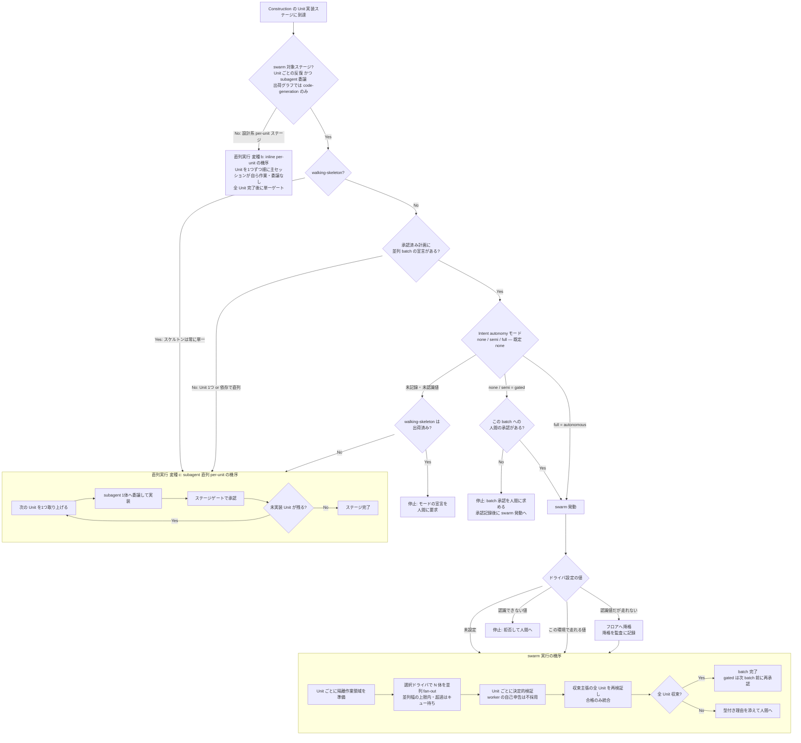

# Unit 実行モデルの概念整理 — 直列/並列実行の契約確定と swarm・ドライバ語彙の是正

## Summary(要約)

swarm の実行モデルは「発動するか(人間の autonomy 付与+決定的判定)」と「発動時にどのバックエンドで走るか(ドライバ選択)」の2軸で構成され、権限構造そのものは一貫している。しかし語彙がこの2軸を反映していない — とりわけ設定変数 `AMADEUS_USE_SWARM` は boolean トグル時代の名前のまま「ドライバ選択」へ転用されており、「未設定でも swarm が動く」という読み手の論理矛盾を生む。本 RFC は現行契約(AS-IS)を確定し、概念名の再設計によって語彙と実体を一致させる。

## Motivation(動機)

2026-08-16 のセッションで、`AMADEUS_USE_SWARM` を ON/OFF スイッチと解釈した読み手(ユーザー)と実際の契約(ドライバ選択)が食い違い、「設定がなくても普通に動くのは論理的におかしくないか」という混乱が実際に発生した。調査の結果、混乱の原因は権限構造の欠陥ではなく命名・語彙の残骸であることが確定した(Reference-level §7)。過去の実行履歴でも、swarm の真のスイッチ(autonomy 付与)は監査記録の中にあり、設定変数を見ている読み手には見えなかった(evidence 参照)。語彙が実体とずれたままでは、利用者・エージェント・文書のすべてが同じ誤読を再生産する。

## Guide-level explanation(ガイドレベルの説明)

本 RFC 承認後の世界では、利用者は次の2つの独立した概念だけを覚えればよい:

1. **swarm の発動形態を決める**のは設定変数ではなく Intent autonomy(RFC 0001、既定 `none`)。`none`・`semi` は batch ごとに人間承認で停止する gated 並列、`full` は連続実行(§2 の発動条件表参照)。
2. **発動時の実行バックエンド**はドライバ設定 `AMADEUS_SWARM_DRIVER=subagent|claude-ultra|codex-ultra|pi`(名称確定済み。未設定=ハーネス既定)。既定値を明示的に書いても拒否されない。

「swarm を使いたくない」は「並列 batch を計画しない(delivery plan 側の判断)」で表現し、「swarm を止めながら進める」は gated(none / semi)の batch 承認で表現する。設定変数ではどちらも表現しない。

## Reference-level explanation(リファレンスレベルの説明)

> 本節は2部構成 — **Part 1: AS-IS(§1〜§6)** が現行契約のありのまま、**Part 2: TO-BE(§7〜§8)** が問題提起と改善仕様。実装の実測記録(file:line)は evidence に分離した。

### Part 1: AS-IS — 現行契約(ありのまま)

> 本部は現行契約の記述のみを置き、問題の指摘を含めない(問題提起は Part 2 の §7)。同一事実が複数箇所に現れる場合(§1 の対比表・§4 の図は要約投影)、規範の正は §2・§3・§5・§6 の表と条文である。

#### 1. 概念と責務(契約上の登場物)

| 概念 | 契約 |
|---|---|
| swarm 実行 | Construction Bolt の複数 Unit を、Unit ごとの隔離作業領域で並列実装する実行形態 |
| 直列実行 | swarm 機構を使わない、エンジンの既定実行モデルの総称。3変種を持つ(下表)。swarm と交換可能なのは変種 (c) のみ |
| 発動権限 | 人間が付与する Intent autonomy(RFC 0001)。監査に記録される |
| 発動判定 | 決定的な判定機構。承認済み計画と付与済み権限を照合するだけで、エージェント(LLM)の裁量判断は入らない |
| ドライバ | swarm 発動後の実行バックエンド。`subagent`(標準の並列サブエージェント)/ `claude-ultra` / `codex-ultra`(各ハーネス固有の高並列機構)/ `pi`(pi ハーネスの標準) |
| 検証・統合 | 決定的な検証機構が所有する。worker の自己申告を信用せず、統合前に再検証する |

**直列実行の3変種**(エンジンの既定実行モデルの内訳):

| 変種 | 対象ステージ | 契約 | 実装主体 |
|---|---|---|---|
| (a) 単発実行 | Unit 反復を持たないステージ | ステージを1回実行し、成果物をゲートで承認する | 主セッション、または委譲された subagent |
| (b) inline per-unit | 設計系 per-unit ステージ(functional-design / nfr-requirements / nfr-design / infrastructure-design) | Unit を1つずつ順に、主セッションが自ら作業する(委譲なし)。全 Unit 完了後に単一ゲート | 主セッション |
| (c) subagent 直列 per-unit | code-generation(swarm 不発動時) | Unit を1つずつ順に、subagent 1体へ委譲する。Bolt の作業領域1つの中で直列。全 Unit 完了後に単一ゲート | subagent(1体ずつ) |

swarm 実行が代替できるのは **変種 (c) のみ**である((a)(b) に swarm 版は存在しない)。

**直列実行(変種 (c))と swarm 実行の対比**(swarm と交換可能な範囲での対比。どちらも実装主体は subagent であり、両者を分けるのは並列度・隔離・検証機構である):

| | 直列実行 変種 (c) | swarm 実行 |
|---|---|---|
| 同時実行数 | Unit 1つずつ | 複数 Unit 並列 |
| 作業領域 | Bolt の worktree 1つ | Unit ごとに隔離 worktree |
| 検証機構 | 通常のステージゲート | prepare → check → finalize(worker の自己申告を信用せず、再検証つき統合) |
| 実装主体 | subagent(1体ずつ委譲) | subagent N 体、または ultra ドライバの worker 群 |

「swarm」の語は現行 (a) 実行形態 (b) 検証ツール名 (c) 設定変数名 (d) 監査イベント接頭辞の4役を兼ねる。

#### 2. 発動の契約 — 設定変数は関与しない

swarm 実行が始まるのは、次のすべてが成立するときに限る:

1. 現在のステージが Construction の並列実装対象ステージである(「Unit ごとの反復」と「subagent 委譲」の両方を宣言したステージに限る — **出荷ステージグラフでは code-generation の1つだけ**。設計系の per-unit ステージはインライン実行のため常に直列で swarm の対象外。opt-in のローカルパックが同条件のステージを追加しうる)
2. walking-skeleton(最初の構造スライス)ではない — スケルトンは常に単一で実装する
3. 人間が承認した delivery plan が、依存のない複数 Unit を並列 batch として宣言している
4. Intent autonomy モード(`none` / `semi` / `full`)が state に記録されている(現行の intent 初期化は既定 `none` を記録する。未記録のときの挙動は決定表の該当2行)
5. スケジューリングが `gated`(モードが `none` または `semi`)の場合、当該 batch への人間の承認が記録済みである

どれか1つでも欠ければ直列実行に落ちる。

> **誤解しやすい点(補足)**: `none` / `semi` / `full` は Intent autonomy モード(RFC 0001 の正本)、`autonomous` / `gated` はそこから機械導出されるスケジューリング投影であり、**別の語彙**である。写像は `full → autonomous`、`none`・`semi` → `gated`(下表)。つまり **`none` を選んでも swarm は発動する**(batch ごとに人間承認で停止する gated 形態)。`none` は「並列なし」ではなく「gated 並列」を意味する。

**モード対応表**(2層の語彙の写像のみを持つ。モードは sealed な3値、intent 誕生時の既定は `none`。発動可否と承認の要否は下の決定表が正):

| Intent autonomy モード | スケジューリング投影(機械導出) |
|---|---|
| `none`(既定) | `gated` |
| `semi` | `gated` |
| `full` | `autonomous` |

**発動・不発動条件表**(1表で全ケースを網羅する決定表。各列が前提条件、右端が帰結。`—` はその条件が帰結に影響しないことを示す):

| 並列実装対象ステージ | 非 walking-skeleton | 計画に並列 batch 宣言 | Intent autonomy モード | batch への人間承認 | 帰結 |
|---|---|---|---|---|---|
| ✗ | — | — | — | — | **不発動** — 直列実行(設計系 per-unit ステージは変種 (b)、Unit 反復のないステージは変種 (a)) |
| ✓ | ✗(skeleton) | — | — | — | **不発動** — 直列実行 変種 (c)(スケルトンは常に単一) |
| ✓ | ✓ | ✗ | — | — | **不発動** — 直列実行 変種 (c) |
| ✓ | ✓ | ✓ | 未記録・未認識値(walking-skeleton **出荷前**) | — | **不発動** — 直列実行 変種 (c) で黙認(幅≥2でも停止しない) |
| ✓ | ✓ | ✓ | 未記録・未認識値(walking-skeleton **出荷後**) | — | **不発動(待機)** — 停止してモードの宣言を人間に要求 |
| ✓ | ✓ | ✓ | `none` / `semi`(= gated) | 未記録 | **不発動(待機)** — 承認を求めて停止 |
| ✓ | ✓ | ✓ | `none` / `semi`(= gated) | 記録済み | **発動** — batch 終端で再停止(次 batch は再承認) |
| ✓ | ✓ | ✓ | `full`(= autonomous) | 不要 | **発動** — 連続実行 |

補足: (a) モードの値域は `none` / `semi` / `full` の3値で閉じる(RFC 0001)。現行の intent 初期化は既定 `none` を記録するが、それ以前に誕生した intent の state にはフィールド未記録が実在するため、「未記録」行はレガシーで到達しうる正常経路である(skeleton 出荷前の黙認/出荷後の宣言要求という2分岐は RFC 0001 付録の記述とも一致する) (b) 発動後にドライバ設定が認識できない値だった場合は swarm を開始せず中止して人間へ返す(§3 の拒否 — 発動判定とは別段)。

前3列を通過すれば **swarm は常に発動へ向かい**、モードが決めるのは「batch ごとに人間が承認するか(`none`・`semi`)、連続で走るか(`full`)」だけである。swarm 自体を避ける手段はモードの側にはなく、並列 batch を計画しない(delivery plan 側の判断)ことだけがそれにあたる。

**ドライバ設定はこの判定に一切関与しない**。逆に、計画が並列を宣言している場合に無断で直列化することも許されない(計画の拘束力)。

#### 3. ドライバ選択の契約 — 設定変数が関与するのはここだけ

発動が確定した後、実行バックエンドを次の決定表で選ぶ(現行の設定変数は `AMADEUS_USE_SWARM`):

| 設定値 | claude 上 | codex 上 | kiro / kiro-ide / kimi 上 | pi 上 |
|---|---|---|---|---|
| 未設定 | subagent | subagent | subagent | pi |
| `claude-ultra` | claude-ultra | 降格→subagent | 降格→subagent | 降格→pi |
| `codex-ultra` | 降格→subagent | codex-ultra | 降格→subagent | 降格→pi |
| `pi` | 降格→subagent | 降格→subagent | 降格→subagent | pi |
| 空文字・`subagent` 明示・未知値 | 拒否(swarm 中止、人間へ) | 同左 | 同左 | 同左 |

対象ハーネスは6種(claude / codex / kiro / kiro-ide / kimi / pi)。kiro 系3種は固有の高並列機構を持たないため同一の列になる。

契約は3規則に要約できる:

- **未設定 = ハーネス既定のフロア**(pi 以外は `subagent`、pi は `pi`)。swarm の可否とは無関係
- **認識できる値だが、この実行環境で走れない**(他ハーネス固有、または必要なツールがセッションに無い)場合は、フロアへ**降格して記録する**(監査に `SWARM_DEGRADED`)。無音のフォールバックはしない
- **認識できない値は拒否**(fail-closed)。フロアへ落とさず swarm を中止して人間へ返す。なお現行契約では既定値 `subagent` の明示も拒否される

#### 4. 実行形態の決定と両機序の全体フロー(契約)

Unit 実装がどの機序で走るかは、次の判定連鎖で一意に決まる。終端は3種類 — **直列実行の機序(変種 (b) または (c))** / **swarm 実行の機序** / **停止(人間へ)** — であり、どの経路も必ずいずれか1つに到達する(重複・脱落なし)。変種 (a)(単発実行)は Unit 実装ステージ以外の形態のため本図の範囲外。



テキストフォールバック: Construction の Unit 実装ステージに到達 → (1) swarm 対象ステージか(Unit ごとの反復かつ subagent 委譲 — 出荷グラフでは code-generation のみ)。No(設計系 per-unit ステージ)なら**直列実行 変種 (b)**(Unit を1つずつ順に主セッションが自ら作業・委譲なし・全 Unit 後に単一ゲート)へ (2) walking-skeleton なら**直列実行 変種 (c)** へ (3) 承認済み計画に並列 batch の宣言がなければ直列実行 変種 (c) へ (4) Intent autonomy モード(既定 none)を読む — フィールド欠落・未認識値なら**停止**(破損時防御) (5) `none`・`semi`(= gated)は当該 batch への人間の承認を検査し、なければ**停止**して承認を求める(承認記録後に発動)。承認済みまたは `full`(= autonomous)なら swarm 発動 → ドライバ設定で分岐: 未設定またはこの環境で走れる値は**swarm 実行の機序**へ、認識値だが走れない場合は降格を監査に記録してから同機序へ、認識できない値は**停止**(拒否)。直列実行 変種 (c) の機序 = 次の Unit を1つ取り上げ → subagent 1体へ委譲 → ステージゲートで承認 → 未実装 Unit が残る限り反復。swarm 実行の機序 = Unit ごとに隔離作業領域を準備 → 選択ドライバで N 体並列 fan-out(並列幅の上限内)→ Unit ごとの決定的検証(自己申告不採用)→ 収束主張の全 Unit を再検証して合格のみ統合 → 全収束なら batch 完了(gated は次 batch 前に再承認)、未収束が残れば型付き理由を添えて人間へ。

読み方の要点: 判定連鎖の上段(1〜3)は「どちらの機序か」を、中段(4〜5)は「swarm を今進めてよいか」を、下段(ドライバ)は「swarm 実行のバックエンド」を決める。**swarm を有効にするのは autonomy 側であり、ドライバ設定ではない** — 設定が未設定でも上・中段が揃えば swarm はフロアドライバで発動する。

#### 5. 実行・検証・統合の契約

- 各 Unit は隔離された作業領域で実装され、他 Unit・本線に触れない
- Unit の収束は、プロジェクトの検証コマンドの成功と保護対象ファイルの無改変によってのみ確定する。**worker の成功申告は収束の根拠にならない**
- 統合前に、収束を主張されたすべての Unit を再検証する。主張と実態が食い違う Unit は統合を拒否される
- 再試行は有限予算(既定2回、上限3回)の範囲でのみ許され、予算の消費は原子的に記録される
- 複数リポジトリを対象とする intent では、batch ごとに対象リポジトリの指定が必須である(単一リポジトリの intent は自動推論)
- 収束しなかった Unit・統合の失敗は、autonomy のモードに関わらず、**型付きの理由**(実装不能 / 予算枯渇 / 再試行上限到達 / 検証不一致)を付して必ず人間へ返す(fail-closed)

#### 6. 設定・状態・可観測性の契約

| 面 | 名前 | 意味 | 既定 |
|---|---|---|---|
| 設定変数 | `AMADEUS_USE_SWARM` | ドライバ選択(§3)。発動可否には関与しない | 未設定=ハーネス既定フロア |
| 設定変数 | `AMADEUS_SWARM_RETRY_CAP` | Unit あたり再試行予算の上書き | 2(上限3) |
| 階層設定 | `swarm.unit.concurrency.limit`(legacy 名 `max-parallel-units`) | 同時実行 Unit 数の上限(超過 Unit はキュー待ちし、slot が空き次第順に実行)。同時実行数の絞りであり、**1 にしても swarm 実行のまま**(隔離・検証・統合は残る)。project→space→intent の順で解決、呼び出しは狭める方向のみ | 上限4(範囲 1..4) |
| 状態 | Intent Autonomy Mode(RFC 0001) | 発動可否と進行粒度を決める状態(§2)。正本は Intent 監査。`none`・`semi`=gated(batch ごとに人間承認)、`full`=autonomous | 現行 init は誕生時に `none` を記録(レガシー intent には未記録あり — §2) |

可観測性: swarm のライフサイクルは監査イベント `SWARM_STARTED`(batch 開始)/ `SWARM_UNIT_CONVERGED` / `SWARM_UNIT_FAILED`(Unit の帰結)/ `SWARM_DEGRADED`(ドライバ降格)/ `SWARM_BATON_RETURNED`(人間への返還)/ `SWARM_COMPLETED`(batch 完了)として全件記録される。

### Part 2: TO-BE — 問題提起と改善仕様

#### 7. 問題提起 — 概念モデルの不整合(観察、非規範)

AS-IS の契約は Part 1(§1〜§6)で閉じている。本節は契約ではなく Part 1 への観察であり、§8 の動機である。収載基準は「誤読・誤操作を引き起こす乖離であり、実証または構造的必然があるもの」。各項の末尾に是正の帰属先を明記する(本 RFC §8 / RFC 0001 amendment / 別 Issue の3区分)。

1. **名前と意味論の乖離**: `AMADEUS_USE_SWARM` は「使うか」ではなく「どのドライバか」。boolean トグル時代の名前が転用後も残存している(実証: 本 RFC 起草セッションの混乱) — 帰属: 本 RFC §8.1
2. **スイッチの所在が名前から読めない**: 実 ON/OFF は autonomy 付与だが、設定変数名が ON/OFF を示唆し、2軸が混同される(実証: 同上+過去の kimi 実行の誤解釈) — 帰属: 本 RFC §8.1
3. **既定値の明示不能**: `subagent` は正当なドライバ名なのに設定に書くと拒否される。「未設定」だけがフロアを意味する非対称(構造的必然) — 帰属: 本 RFC §8.2
4. **「swarm」の多義と語彙断絶**: (i) 「swarm」の語が実行形態・検証ツール名・設定変数名・監査イベント接頭辞の4役を兼ね、対になる直列実行側に名前がない(実証: 「非 swarm は何と呼ぶか」に答えが存在しなかった) (ii) 利用者ガイドは同じ機構を「並列 Bolt バッチ」と呼んで「swarm」を使わず、用語集の Swarm 定義は発動条件に触れないため、「swarm」で検索した読者が発動条件に到達できない(実証: 本 RFC 起草セッション) — 帰属: 本 RFC §8.4
5. **読取責務の非自明さ**: ドライバ設定を読むのは実行を指揮する側で、検証機構は降格の事実だけを記録として受け取る。この分担がどこにも仕様として書かれていない(構造的必然) — 帰属: 本 RFC §8.5
6. **ドライバ名 `subagent` の衝突**: ドライバ値 `subagent` は「swarm 実行内の worker 起動手段」を指すが、直列実行も同じ subagent ツールで Unit を(1体ずつ)委譲するため、「subagent を使っている = swarm」という誤読を構造的に誘う。ultra 系ドライバは swarm 専用語なので起きない混同が、`subagent` だけ swarm の外の語彙と衝突する(§1 の対比表参照。実証: 本 RFC 起草セッションの誤読) — 帰属: 本 RFC §8.4
7. **検証機構側の片側ゲート**: swarm の発動権限検査は発動判定機構にのみ存在し、検証機構自身は autonomy を検査しない。逸脱したエージェントが検証機構の準備コマンドを直接呼べば、権限なしで作業領域の fork と `SWARM_STARTED` の発行が技術的に可能(構造的必然。逸脱の実例は未観測 — evidence 参照) — 帰属: 別 Issue(未起票。防御の二重化は本 RFC のリネームと独立に裁定する)
8. **モード名 `none` の意味論**: `none` は「自律なし=並列なし」を示唆するが、実際の契約は gated 並列 — swarm は発動し、batch ごとに人間承認で停止する(実証: kimi 実行時の混乱、および本 RFC 起草セッションでの説明誤り2回) — 帰属: RFC 0001 amendment(実施の判断は同 RFC の承認者の専権)。なお本 RFC の草稿は一時、RFC 0001 付録の「mode 未宣言は黙認/宣言要求」の記述を誤りとして送致対象に含めていたが、独立レビューの実測(未記録 state の実在と2分岐挙動のテスト固定)により同記述が正確であると確認し、撤回した

9. **ドライバ決定表の面間 drift**: コード(6ハーネス・`pi` 受理)/ 出荷 docs(4列・「3値 enum」・`pi` 非対応と明記)/ ハーネス別 SKILL.md(記述粒度が面ごとに不揃い — ランタイム degrade の記述は claude 面のみ)が同じ決定表を各自の版で持ち、互いに食い違っている(実証: 独立レビューの突合。evidence 参照) — 帰属: 本 RFC §8.6(実装 intent で §3 を正本として全面同期)

9項中7項(1〜6、9)は本 RFC が §8 で是正する。7 は防御構造の問題として別 Issue へ、8 は RFC 0001 の領分としてその amendment 判断へ送致し、本節は記録のみを行う。語彙起因は 1〜4・6・8〜9 であり、権限構造(発動=人間の付与、ドライバ=設定、検証=決定的機構)自体は一貫している。

#### 8. TO-BE 仕様(案 A: 概念に対する最小命名変更)

権限構造・発動条件・検証と統合の契約・監査語彙・再試行予算はすべて**無変更**。変えるのは「ドライバ選択」という概念の名前と、その値域の対称性、および語彙の定義だけである。

**問題→是正の対応**(§7 のうち本 RFC 帰属分。対応の正本はこの表とし、以降の本文には対応タグを重複記載しない):

| §7 の問題 | 是正する節 |
|---|---|
| 1 名前と意味論の乖離 | §8.1 |
| 2 スイッチの所在が名前から読めない | §8.1 |
| 3 既定値の明示不能 | §8.2 |
| 4 「swarm」の多義と語彙断絶 | §8.4 |
| 5 読取責務の非自明さ | §8.5 |
| 6 ドライバ名 `subagent` の衝突 | §8.4 |
| 9 ドライバ決定表の面間 drift | §8.6(§3 を正本に全面同期) |

(§8.3 は §8.1 の派生 — 旧変数の遮断。§8.6 は §8.1〜§8.4 の波及面の棚卸しを兼ねる)

**8.1 設定変数のリネーム**

```
旧: AMADEUS_USE_SWARM=claude-ultra|codex-ultra|pi               # 未設定=フロア、フロアの明示は不可
新: AMADEUS_SWARM_DRIVER=subagent|claude-ultra|codex-ultra|pi   # 未設定=ハーネス既定フロア、全ドライバ名を明示可(名称は裁定済み・確定)
```

名前が意味論(「swarm 発動時のドライバ」)をそのまま表し、「USE_SWARM なのに未設定で動く」という誤読の根を断つ。同名の変数を `auto` 含む5値で設計した不着地の先行案(Prior art 参照)とは異なり、本設計は4値・`auto` なし — 未設定がハーネス既定フロアを与えるため、暗黙の capability probe を持ち込まない。

**8.2 新決定表**(変更セルは太字)

既定(未設定)は **`subagent`**。ただし pi ハーネスのみ **`pi`**(subagent ツールを持たないため)。以下は明示値の解決表:

| AMADEUS_SWARM_DRIVER | claude 上 | codex 上 | kiro / kiro-ide / kimi 上 | pi 上 |
|---|---|---|---|---|
| **`subagent`** | **subagent** | **subagent** | **subagent** | **降格→pi** |
| `claude-ultra` | claude-ultra | 降格→subagent | 降格→subagent | 降格→pi |
| `codex-ultra` | 降格→subagent | codex-ultra | 降格→subagent | 降格→pi |
| `pi` | 降格→subagent | 降格→subagent | 降格→subagent | pi |
| 空文字・未知値 | 拒否 | 同左 | 同左 | 同左 |

- `subagent` の明示が正当な選択になる。pi 上の `subagent` 明示は「認識できるがこの環境で走れない値」として既存の降格規則に従う(新規則の発明ではなく既存規則への包摂)
- 拒否の意味論は不変(fail-closed)

**8.3 旧変数の loud reject(互換エイリアスなし)**

`AMADEUS_USE_SWARM` が**値を問わず設定されていたら**拒否して停止し、新変数名への移行を1行で案内する。無音の読み替え・別名サポートは置かない(互換レイヤー禁止のノルムと、旧 boolean 値を明示拒否してきた前例に一貫)。この検査は恒久ゲートの新設を伴わない。

**8.4 語彙の定義(glossary 追記)**

用語集に次の語彙セットを定義する(いずれも裁定済み・確定):

- **直列実行の包含名と3変種の正式名**: 包含名 = **直列実行**(エンジンの既定実行モデルの総称。「直列実行」という語は常にこの総称を指す)。変種名 = **単発実行** / **インライン直列実行** / **委譲直列実行**(AS-IS §1 のラベル (a)/(b)/(c) にそれぞれ対応)。swarm と交換可能なのは委譲直列実行のみであることを1文で明記する
- **実行形態の2値定義(code-generation の軸)**: 「**委譲直列実行 = subagent 委譲(1体ずつ)** | **並列実行 ≡ swarm 実行 = swarm ドライバ委譲**(ドライバの1つとして subagent が現れる場合がある)」。並列実行と swarm 実行はこの軸上で同義であり、swarm は並列実行機構の固有名である(3値フラットな列挙「直列|並列|swarm」は並列と swarm が全重複するため不採)。swarm 実行の項に「発動条件は本 RFC §2 の決定表による」の1文を足し、利用者ガイドの「並列 Bolt バッチ」がその利用者向け呼称であることを併記して橋を架ける
- **subagent の二役の区別**: 「ドライバ `subagent` は swarm 実行内の worker 起動手段を指し、委譲直列実行における subagent 委譲(1体ずつ)とは別概念」の1文を定義に含める
- **同名の外部機能との識別**: 「Kimi プラットフォームの『Agent Swarm』(タスクをプラットフォーム側が自動判定で最大数百のサブエージェントへ水平分解する機能)は、amadeus の swarm 実行とは無関係の別機能。名称の一致は偶然であり、amadeus の発動条件・ドライバ選択・監査の対象外」の識別注記を swarm 実行の定義に含める(kimi ハーネス利用時にこの外部機能が自動発動すると、amadeus の swarm が起動したように見える誤認が実際に発生した)

検証ツール名・`SWARM_*` 監査接頭辞・`AMADEUS_SWARM_RETRY_CAP` は意味論と名前が既に一致しているため**変更しない**。

**8.5 読取責務の仕様化**

「ドライバ設定を読み、決定表を適用するのは実行を指揮する側の責務であり、検証機構は降格の事実のみを記録として受け取る」という現行の分担を仕様文書に1文で明記する。挙動は変えない。

**8.6 波及面(実装 intent の棚卸し対象)**

ドライバ設定を読む面、決定表を記す文書、用語集、当該テスト群、全ハーネス配布と自己インストール面。全数列挙は実装 intent の調査段で確定する(Unresolved 参照)。

## Drawbacks(欠点)

- 設定変数のリネームは全ハーネス配布・docs・利用者環境に波及する破壊的変更で、互換エイリアスを置かない方針(ノルム)ゆえ移行は一斉切替になる
- 語彙だけの問題に RFC+実装 intent のコストを払う判断であり、実害(誤設定による事故)は現状 fail-closed が防いでいる

## Rationale and alternatives(理由と代替案)

- **案 A(推奨): 設定変数を `AMADEUS_SWARM_DRIVER` へリネーム**(§8)。不整合1〜3を解消し、4は用語定義、5は仕様文書の1文で閉じる。発動権限は RFC 0001 のまま不変
- **案 B: `AMADEUS_TEAM_MODE=none|subagent|swarm` の3値モード設定**。発動軸を設定変数にマージする案。スイッチが autonomy と設定の2つになり新たな混同を生む・`subagent` は swarm の一形態であり「非 swarm」と同格に並べる分類が実体と不一致・`pi` と将来ドライバが3値に収まらない、の3点で不採
- **案 C: 何もしない**。fail-closed のため事故は起きないが、誤読は文書とセッションで再生産され続ける(本 RFC の動機がその実証)
- 案 A が最小変更で不整合の大半を閉じ、権限構造に触れないため RFC 0001 と衝突しない

## Prior art(先行事例)

- RFC 0001(intent-autonomy-modes): 発動権限側の正本。本 RFC は「権限は設定変数に置かない」という同 RFC の構造を前提として保存する
- 旧 `AMADEUS_USE_SWARM=1`(boolean)→ ドライバ選択への転用(intent 260713-swarm-driver-migration)。値の意味論は移行しつつ名前を残した結果が本 RFC の動機
- **同名変数の先行設計(不着地)**: intent 260713 は `AMADEUS_SWARM_DRIVER` という同名の変数を、`auto` を含む5値+capability probe+明示不可時 hard error の設計で起草したが、製品には着地しなかった(`codekb/amadeus/re-scans/260713-swarm-driver-migration.md:36-40`、`codekb/amadeus/code-quality-assessment.md` SD-01 ほか)。本 RFC §8.1 の4値・`auto` なし設計はこの歴史的代替案の再評価であり、`auto` を採らない理由は「未設定=ハーネス既定フロア」が同じ目的を暗黙の probe なしで達成するため
- 設定変数の意味論変更を loud reject で守る前例: 旧 boolean 値 `"1"` の拒否(現行契約 §3 — 専用分岐ではなく未知値の catch-all で拒否し、コメントで旧値を名指しする形)

## Unresolved questions(未解決の問題)

- 実装までに: リネームの波及面の全数棚卸し(§8.6)と、旧名検出時のエラーメッセージ文言
- スコープ外: 発動権限(autonomy)の再設計(RFC 0001 の領分)、ドライバの追加・削除、`max-parallel-units` の設定面、検証機構側での発動権限の二重検査(§7 項7として記録、別 Issue へ送致)、RFC 0001 の `none` 意味論の是正(§7 項8として記録、amendment 判断へ送致)

## Future possibilities(将来の可能性)

- ドライバ語彙の拡張(新ハーネスのネイティブ高並列機構)は §8.1 の設定にそのまま値を足すだけで済む
- 並列実行の機構スイッチ(例: `AMADEUS_SWARM_ENABLED`)の後付けは加算的変更として可能。導入する場合は幅ノブ(`swarm.unit.concurrency.limit`)と**別の boolean**として設計し(幅=量、スイッチ=モードの分離 — 1つのキーに2概念を兼ねさせない)、「計画は並列宣言×スイッチ OFF」の裁定規則を含めて RFC 事項とする(本 RFC の裁定 2026-08-16: 現時点では不採 — 既存2手段〈計画で並列 batch を作らない/gated の batch 承認〉で目的の大半を表現できるため)
- ドライバ決定表を機械可読な単一定義(データ)へ寄せ、エージェント向け運転指示・利用者文書の決定表をそこから生成して drift を塞ぐ
