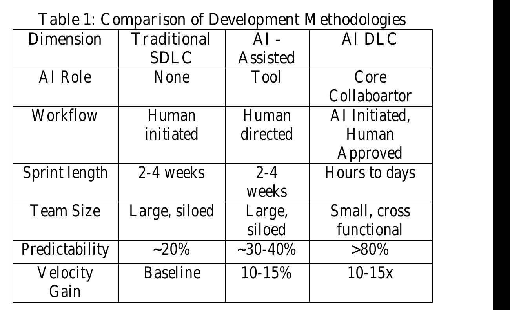
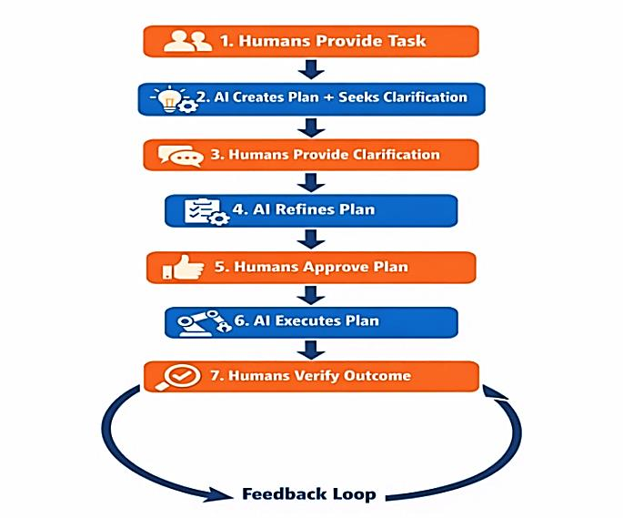
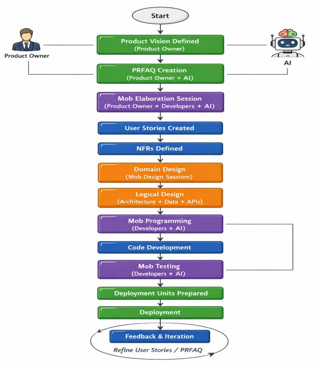

# AI-Driven Development Lifecycle (AI-DLC): Reimagining Software Engineering for the AI Era

**Author:** Nitin Addla  
**Affiliation:** Independent Researcher, USA  
**Journal:** International Journal of Artificial Intelligence, Data Science, and Machine Learning, Grace Horizon Publication, Volume 7, Issue 1, 266-270, 2026  
**ISSN:** 3050-9262  
**DOI:** https://doi.org/10.63282/3050-9262.IJAIDSML-V7I1P145  
**Received:** 26/01/2026  
**Revised:** 27/02/2026  
**Accepted:** 01/03/2026  
**Published:** 03/03/2026

## Abstract

The software industry stands at an inflection point.
Artificial intelligence is no longer a peripheral tool it is becoming a central collaborator in how software is conceived, built, and operated.
Yet most organizations are failing to capture the full potential of AI in their development workflows, trapped between two anti-patterns: over-reliance on autonomous AI and under-utilization of AI for narrow tasks.
The AI-Driven Development Lifecycle (AI-DLC) is a transformative methodology introduced by AWS in 2025 that reimagines software engineering by positioning AI as a core collaborator throughout the entire development process.
Based on over 100 customer experiments across industries and geographies, AI-DLC has demonstrated 10-15x productivity gains, 40-60% improvement in development velocity, and 40-60% reduction in defects, with verified ROI of 300-500% within 12 months [1][2].

**Keywords:** AI-DLC, Software Engineering, Artificial Intelligence, Development Lifecycle, Mob Programming, Agile, Devops, Productivity.

## 1. Introduction

Despite widespread adoption of AI coding tools, real-world productivity gains have been disappointing.
Research from Thought Works (2025) showed only 10-15% velocity gains when software is built using AI under conventional approaches [8].
A study by Metr.org found that developers using AI were actually 20% less productive than those who did not a paradox explained by the gap between perceived and real productivity [9].

The root cause lies not in the AI tools themselves, but in how they are applied.
Software development time is consumed primarily by alignment meetings, dependency waiting, context-switching, and process overhead - not just coding.
Existing methodologies fail to address this systemic problem [1][7].

This paper presents the AI-Driven Development Lifecycle (AI-DLC), a methodology that addresses the entire system of human collaboration and process overhead, not just the coding bottleneck.
The paper is organized as follows: Section 2 describes the core methodology; Section 3 details the three phases; Section 4 outlines key principles; Section 5 addresses brownfield projects; Section 6 covers tooling; Section 7 discusses organizational enablers; Section 8 presents customer success stories; and Section 9 provides a getting-started guide.

## 2. The AI-DLC Methodology

### 2.1. Definition

AI-DLC (AI-Driven Development Life Cycle) is a revolutionary approach to software development that places artificial intelligence at the center of the development process.
Unlike traditional methods that retrofit AI into existing workflows, AI-DLC reimagines the entire development lifecycle with AI as a core collaborator rather than just a tool [1][2].
AI-DLC is a set of rituals, tools, and roles working together to create great outcomes for customers while building systems at scale production-grade applications that work as if an engineer has written every line [1].

### 2.2. Core Differentiators

Table 1 compares AI-DLC against traditional SDLC and AI-Assisted approaches across key dimensions.

### 2.3. The Plan-Execute Workflow Pattern

The foundational collaboration pattern in AI-DLC is the Plan-Execute cycle.
This cycle ensures that AI never makes unilateral decisions.
Every plan is reviewed and approved before execution, and every output is validated before proceeding [1][7].

**Fig 1:** The Plan-Execute Cycle Ensures Human Oversight At Every Decision Gate.
Adapted From [1].

## 3. The Three Phases of AI-DLC

AI-DLC operates through three main phases, each with specific objectives, activities, artifacts, and outcomes [1][2].
Figure 2 illustrates the overall workflow.

**Table 2: AI-Driven Software Development Lifecycle (AI-DLC) Phases and Key Activities**

| Inception | Construction | Operations |
| --- | --- | --- |
| Intent | Domain Design | Deployment |
| Units (via Mob Elaboration) | Logical Design | Telemetry Analysis |
|  | Code Generation | Anomaly Detection |
|  | Automated Testing (via Bolts) | Incident Resolution |

**Fig 2:** The three-phase AI-DLC workflow with roles and artifacts.
Adapted from [1].

### 3.1. Phase 1: Inception

The objective of the Inception phase is to transform high-level business intents into well-defined Units for development.
The key ritual is Mob Elaboration, where product owners, developers, QA, and operations come together in a single session (typically 4 hours to half a day).
Using AI to facilitate, the team refines the business intent, creates user stories, and aligns on what will be built.
Work that previously took multiple quarters can be completed in hours [1][7].

Key outputs of this phase include: PRFAQ (Press Release/FAQ), User Stories with acceptance criteria, Non-Functional Requirements (NFRs), Risk Descriptions, Measurement Criteria, and Suggested Bolts (implementation iterations) [1].

### 3.2. Phase 2: Construction

The objective of the Construction phase is to transform Units into tested, operations-ready Deployment Units through iterative development.
The key ritual is Mob Programming, where small, cross-functional "single-pizza" teams (full-stack developer + business person + specialist) work co-located, building rapidly with AI [1][2].

Traditional Agile uses 2-4 week sprints.
AI-DLC uses "Bolts" iterations that can be as short as hours or days.
This enables true synchronous collaboration and eliminates the waiting cycles inherent in longer sprints [1].
The Construction phase is adaptive: a simple defect fix skips requirements analysis and goes directly to code generation, while a greenfield application traverses all stages [7].

### 3.3. Phase 3: Operations

The objective of the Operations phase is to deploy, monitor, and maintain systems in production with AI-assisted operational efficiency.
Key activities include Deployment Automation, Telemetry Analysis, Anomaly Detection, and Incident Resolution [1].
Security and compliance are integrated throughout captured as NFRs in Inception, applied as best practices in Construction, and continuously monitored in Operations [1][7].

## 4. Key Principles Of AI-DLC

The AI-DLC Method Definition Paper defines 10+ core principles [1][7].
Key among them are:

- **Principle 1: Plan-Verify-Generate:** AI must always create a plan, have it verified by humans, and only then generate output.
  This prevents AI from making unilateral assumptions [1].
- **Principle 2: Mob Collaboration:** Human communication overhead is a primary bottleneck.
  Mob rituals compress multi-week alignment cycles into hours [1][2].
- **Principle 3: Semantic Context Building:** AI performs best when given semantically rich, concise context.
  Rather than dumping large codebases into context, AI-DLC builds semantic representations (call graphs, component maps, data flows) that allow AI to navigate large brownfield projects accurately [1].
- **Principle 4: Developer Code Ownership:** Every developer must understand every line of AI-generated code.
  If you cannot debug it, you cannot own it.
  This is non-negotiable for production-grade software [1][7].
- **Principle 5: Adaptive Workflows:** AI-DLC avoids prescribing opinionated workflows for different development pathways.
  Instead, it adopts a truly AI-First approach where AI recommends the Level 1 Plan based on the given pathway intention [1].
- **Principle 6: Context Window Management:** More context is not always better.
  AI-DLC prescribes disciplined context management trimming irrelevant history, resetting when needed, and disabling unused tools to preserve the context window for meaningful work [1].
- **Principle 7: Flow State Preservation:** Contiguous, uninterrupted work sessions dramatically improve AI-assisted productivity.
  Amazon engineering teams using AI-DLC have adopted "no meetings in the afternoon" policies to protect developer flow state [1][7].

## 5. Brownfield Projects: Semantic Context Building

One of AI-DLC's most powerful innovations is its approach to brownfield (existing) codebases a challenge that defeats most AI coding tools [1][3].

Large codebases overwhelm AI context windows.
AI makes changes across dozens of files when only a few need modification, resulting in unreviewed, unowned code that never reaches production [1].
The AI-DLC solution involves AI analyzing the codebase and building a semantic representation call graphs, component maps, data flows, and API contracts.
This semantic map is far smaller than the raw code but captures its meaning.
When making changes, AI uses the semantic map to identify exactly which files need modification, keeping changes narrow, targeted, and reviewable [1][7].
The Mimicry Principle further enhances this: rather than describing desired behavior in natural language, AI-DLC instructs AI to mimic existing code patterns.
This leverages the LLM's attention mechanism pattern recognition to produce code that naturally follows existing authentication, logging, and error handling conventions [1].

## 6. Tooling: Implementing AI-DLC

### 6.1. Steering Files / Workflow Scaffolds

AI-DLC principles are operationalized through Steering Files (also called Rules or Workflow Scaffolds) customizations for AI coding agents that embed AI-DLC behavior directly into the tool.
Rather than requiring developers to craft elaborate prompts, a simple statement of intent triggers the full AI-DLC workflow [1][4].
The scaffolds evaluate context, dynamically construct an appropriate development pathway, embed human approval checkpoints at every decision gate, and log every artifact, decision, and conversation for auditability [1].

### 6.2. Primary Tools

The primary tools used in AI-DLC include: Amazon Q Developer (primary AI coding assistant with AI-DLC workflow implemented via Project Rules) [10], Kiro (AI-native IDE with built-in Steering File support), Amazon Q CLI (command-line AI tool for terminal-based workflows), and Git (version control for all AI-DLC artifacts) [1][4].

### 6.3. Open-Source Availability

The AI-DLC workflow is open-sourced at https://github.com/awslabs/aidlc-workflows.
This includes Amazon Q Developer Rules and Kiro Steering Files that bring AI-DLC principles to life in real projects [6].

### 6.4. Adaptive Workflow Stages

Figure 3 illustrates the adaptive workflow stages across the three phases, showing mandatory and conditional stages.

**Fig 3:** Adaptive Workflow Stage Diagram.

## 7. Organizational Enablers

AI-DLC is not just a technical methodology it requires organizational change [1][2].

### 7.1. Team Structure

Traditional large, siloed teams give way to small, cross-functional "single-pizza" teams consisting of 1-2 full-stack developers, 1 business/product person, 1 specialist (security, data, etc.), and AI as a team member [1].

### 7.2. DevOps Maturity

AI-DLC amplifies the importance of CI/CD pipelines.
If development velocity increases 10x but deployment pipelines remain slow, the gains are lost.
Organizations must invest in end-to-end working development environments, mature CI/CD pipelines with fast feedback loops, and comprehensive automated test suites [1][2].

### 7.3. Measuring Effectiveness

Traditional metrics (lines of code, code acceptance rate) are insufficient.
AI-DLC recommends measuring end-to-end cycle time (from business decision to production deployment), predictability rate (commitments delivered vs. made, target: >80%), defect rate normalized to velocity, and A/B comparison (same work done with vs. without AI-DLC) [1][7].

### 7.4. Technical Debt Opportunity

AI-DLC creates a new opportunity to address technical debt.
Rewrites that previously took years can now be completed in weeks.
Organizations should reconsider the traditional inertia toward patching over rewriting [1].

## 8. Customer Success Stories

### 8.1. Wipro (Healthcare)

Three distributed teams across three countries had months of work planned.
Using AI-DLC Mob Programming for 20 hours (4 hours/day x 5 days), they completed all planned work.
The team reported not just faster delivery, but better quality and higher team satisfaction [1][2].

### 8.2. Dun & Bradstreet (FinTech)

A stock trading application planned for a 2-month build was completed in 48 hours using AI-DLC.
The application was released to production the following week [1][2].

### 8.3. Verified Aggregate Results

Table 3 summarizes verified aggregate results across multiple organizations including KFinTech, S&P Global, Persistent, and RazorPay [1][2].

**Table 3: Verified Aggregate Results across AI-DLC Customer Deployments**

| Metric | Result |
| --- | --- |
| Development Velocity Improvement | 40-60% |
| Decrease in defects and quality issues | 40-60% |
| ROI within 12 months | 300-500% |
| Predictability Rate | >80% |

## 9. Getting Started with AI-DLC

### 9.1. Adoption Timeline

Table 4 outlines the recommended adoption timeline for organizations beginning their AI-DLC journey [1][7].

**Table 4: AI-DLC Adoption Timeline**

| Stage | Duration | Activity |
| --- | --- | --- |
| Basic Oriented | 1 Day | Self-guided learning with AI-DLC resources |
| Unicorn Gym Workshop | 2 Days | Handson workshop with real business problem |
| Full Organizational Adoption | 3-6 Months | Gradual expansion with champion support |

### 9.2. Pre-Adoption Checklist

Before beginning AI-DLC adoption, organizations should: ensure developers have access to Amazon Q Developer or equivalent AI tools; identify suitable initial projects (complex enough to benefit, not business-critical); prepare teams with basic AI tool familiarity; set clear expectations and success metrics; and establish executive sponsorship [1][7].

### 9.3. Scaling Approach

The recommended scaling approach follows six steps: (1) Pilot start with one team through the Unicorn Gym workshop; (2) Document capture outcomes and lessons learned; (3) Champion identify internal champions to lead adoption; (4) Expand gradually roll out to additional teams; (5) Community establish a community of practice for knowledge sharing; (6) Integrate embed AI-DLC principles into organizational standards [1].

## 10. The AI-Native Builders Community

AWS has established the AI-Native Builders Community an open community where thought leaders cross-pollinate ideas, discuss the AI-native development manifesto, and define the roles of the future [11].
The community is actively shaping what it means to be an "AI-native" development team, how team structures and roles are evolving, and what the AI-native development manifesto should contain.
Join at: https://ai-nativebuilders.org/ [11].

## 11. Conclusion

AI-DLC represents a fundamental reimagination of software engineering not an incremental improvement, but a paradigm shift.
It addresses the three core challenges that limit AI's effectiveness in software development: rigid, one-size-fits-all workflows (solved by adaptive, AI-recommended workflow planning); inflexible depth within stages (solved by context-aware depth modulation); and reduced human oversight (solved by mandatory human-in-the-loop at every decision gate) [1][7].

The methodology achieves the seemingly contradictory goals of dramatically higher velocity and higher quality, because it addresses the entire system not just the coding bottleneck.
By compressing human alignment cycles through Mob rituals, building semantic context for AI to work accurately, and maintaining developer ownership of every line of code, AI-DLC creates the conditions for the paradigm leap that AI promises but has so far failed to deliver [1][2][3].

The future of software engineering is not AI replacing developers it is AI and developers working together in a new way, with AI handling the mechanical and planning tasks, while humans provide the judgment, creativity, and accountability that define engineering excellence [1].

## References

[1] AI-DLC Method Definition Paper.
AWS.
https://prod.d13rzhkk8cj2z0.amplifyapp.com/

[2] Raja, S.P. (2025).
AI-Driven Development Life Cycle: Reimagining Software Engineering.
AWS DevOps Blog.
https://aws.amazon.com/blogs/devops/ai-driven-development-life-cycle/

[3] AWS. (2025).
Open-Sourcing Adaptive Workflows for AI-DLC.
AWS DevOps Blog.
https://aws.amazon.com/blogs/devops/open-sourcing-adaptive-workflows-for-ai-driven-development-life-cycle-ai-dlc/

[4] AWS. (2025).
Building with AI-DLC using Amazon Q Developer.
AWS DevOps Blog.
https://aws.amazon.com/blogs/devops/building-with-ai-dlc-using-amazon-q-developer/

[5] Mishra, A. & Raja, S.P. (2025).
AWS re:Invent 2025 Session DVT214: Introducing AI-Driven Development Lifecycle.

[6] AWS Labs. (2025).
AI-DLC Open-Source Workflows.
GitHub.
https://github.com/awslabs/aidlc-workflows

[7] AWS. (2025).
AI-DLC Methodology FAQ.
Internal resource with principles, phases, workflow, and benefits.

[8] ThoughtWorks. (2025).
Practical Analysis of AI-Assisted Development Velocity.
ThoughtWorks Research Report.

[9] Metr.org. (2025).
Controlled Experiment: Developer Productivity with Unstructured AI Use.
Metr.org Study.

[10] AWS. (2025).
Amazon Q Developer Documentation.
https://docs.aws.amazon.com/amazonq/latest/qdeveloper-ug/

[11] AI-Native Builders Community. (2025).
https://ai-nativebuilders.org/

[12] S. K. Sunkara, "Artificial Intelligence and Machine Learning in Pharma: Revolutionizing Drug Development and Clinical Trials," 2025 12th International Conference on Reliability, Infocom Technologies and Optimization (Trends and Future Directions) (ICRITO), Noida NCR, India, 2025, pp. 1-5, doi: 10.1109/ICRITO66076.2025.11241250.
