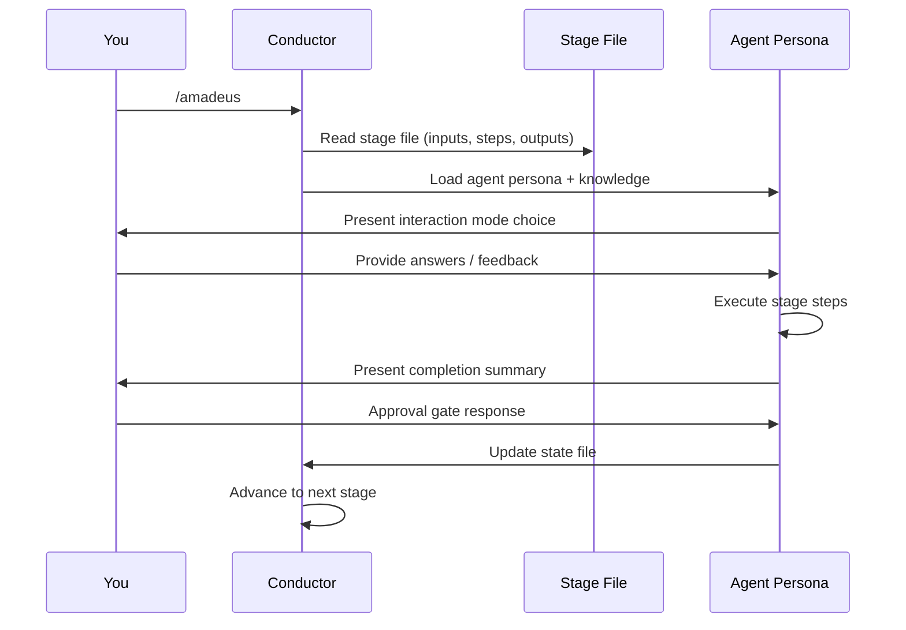
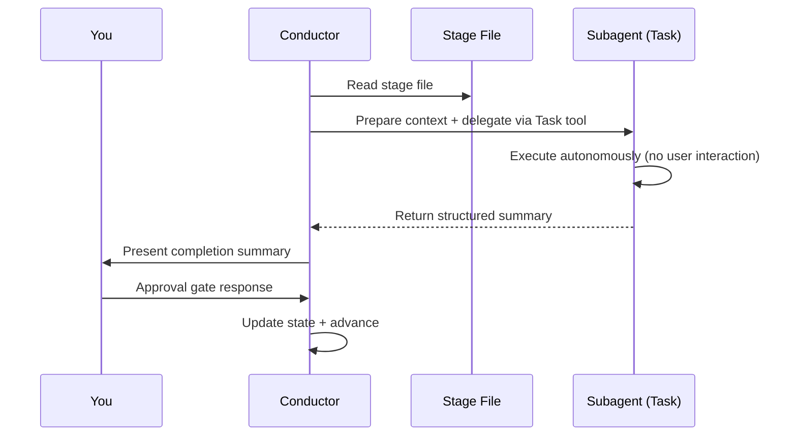

# Your First Workflow

> 言語: [English](02-your-first-workflow.md) | **日本語**

この章では、AI-DLC ワークフローの完全な 1 回の実行を順を追って説明し、各ステップで何が見えて、どんな決定を下すのかを解説します。例では、REST API を構築する `feature` スコープのワークフローを使います。

---

## ワークフローの開始

```
/amadeus Build a REST API for inventory management
```

セッション開始時に、Claude Code は `settings.json` の `companyAnnouncements` エントリを通じて AI-DLC のウェルカムメッセージをレンダリングします。これは AI-DLC の仕組みを説明し、ステージマップとスコープの選択肢を表示します。

```
# Welcome to AI-DLC

**AI-DLC** (AI-Driven Development Life Cycle) is an adaptive methodology that
structures AI-assisted software development into repeatable, traceable phases
while keeping you in control at every decision point.

## How It Works

- **You decide, AI executes.** Every material decision goes through an approval gate.
- **Adaptive scope.** Choose a scope or let AI auto-detect from your intent.
- **Traceable artifacts.** Every stage produces versioned documents in the intent's record dir.
- **11 domain experts.** Specialized agent personas guide each stage.
```

---

## Initialization フェーズ(自動)

3 つの初期化ステージは、`amadeus-utility init` の内部で決定論的に実行されます — これは 1 秒を大きく下回って完了する単一のツール呼び出しです。初期化とやり取りすることはありません。これは最初の intent をアクティブなスペースへ auto-birth させ、ワークフローのためにそのレコードディレクトリをブートストラップします。

### Stage 0.1: Workspace Scaffold

フレームワークは最初の intent を誕生させ、そのレコードディレクトリを `amadeus/spaces/<space>/intents/<YYMMDD>-<label>/` に作成します(名前付きスペースを使わない限り `<space>` は `default`):

```
Intent born — record dir scaffolded:
  amadeus/spaces/default/intents/<YYMMDD>-<label>/initialization/   (3 stage artifact dirs)
  amadeus/spaces/default/intents/<YYMMDD>-<label>/ideation/         (7 stage artifact dirs)
  ...
Space-level dirs ensured:
  amadeus/spaces/default/knowledge/                             (team knowledge — empty; you add files)
```

### Stage 0.2: Workspace Detection

決定論的なルールベースのスキャナが、プロジェクトの 1 階層下と既知のソースディレクトリ(`src/`、`app/`、`lib/`、`pages/`、`components/`、`tests/`)を走査します。ソースファイル、フレームワーク設定、パッケージマニフェストに基づいて、グリーンフィールドかブラウンフィールドかを分類します。

### Stage 0.3: State Initialization

オーケストレーターは、あなたのスコープ、深さ、テスト戦略、そしてスキャナの分類に基づく完全なステージ計画とともに、intent の `amadeus-state.md`(そのレコードディレクトリ配下)を書き込みます。また、あなたの入力を分析し、スコープを確認します:

```
─── Scope Detection ───────────────────────────────────────────────────────────
Detected scope: feature (Standard depth, Standard test strategy, all 32 stages)
▸ Approve scope? [Yes / Change scope / Change depth / Change test strategy]
> Yes
```

検出されたスコープを受け入れる、別のスコープ(例: `mvp`)に変更する、または深さレベルやテスト戦略を調整することができます。指針については [Scopes, Depth, and Test Strategy](05-scopes-and-depth.ja.md) を参照してください。

---

## Ideation フェーズ(インタラクティブ)

Initialization の後、ワークフローは Ideation に入ります。ここから先の各ステージは、承認ゲート付きでインタラクティブに実行されます。

### Stage 1.1: Intent Capture (amadeus-product-agent)

ターミナル下部のステータスラインが更新されます:

```
[AIDLC] IDEATION > Intent Capture [▓▓▓▓▓░░░░░] 4/7 -- product
```

これは次を表示します: 現在のフェーズ、ステージ表示名、フェーズ進捗バー、フェーズ進捗比率、リードエージェント。バーと比率は同じスコープを共有します — どちらも現在のフェーズ内の `[x]` ステージを数えるため、比率が進むたびにバーも進みます。残りコンテキスト(`ctx:N%`)は常に右側に表示され、減るにつれて色分けされます。

amadeus-product-agent はインタラクションモードの選択を求めます:

```
▸ Choose interaction mode:
  (1) Guide Me — agent asks structured questions
  (2) Grill Me — one question at a time, in depth, with recommended answers
  (3) Edit File — write directly to the artifact
  (4) Chat — freeform discussion
```

- **Guide Me** は質問を 1 つずつ順に案内します
- **Grill Me** は共通理解が確認できるまで深く掘り下げてあなたにインタビューします
- **Edit File** は成果物を直接編集用に開きます
- **Chat** は自由に議論でき、エージェントが決定を抽出します

各モードの詳細は [Interaction Modes](07-interaction-modes.ja.md) を参照してください。ステージの途中でモードを切り替えることができます。

### 承認ゲート

エージェントが作業を完了すると、完了サマリと承認ゲートが表示されます:

```
# Intent Capture & Framing Complete

| Artifact | Contents |
|----------|----------|
| intent-capture.md | Problem statement, target users, success criteria |
| intent-capture-questions.md | 5 questions, all answered |

**Review:** `<record>/ideation/intent-capture/` (the intent's record dir)

▸ How would you like to proceed?
  (1) Approve — Continue to Market Research
  (2) Request Changes — Provide revision feedback
```

続けるには **Approve** を、フィードバックを提供するには **Request Changes** を選びます。修正プロセスの詳細は [Interaction Modes](07-interaction-modes.ja.md) を参照してください。

承認後、進捗行が表示されます:

```
Progress: 4/32 overall | 1/7 IDEATION stages complete. Next: Market Research
```

### 残りの Ideation ステージ

ワークフローは Market Research、Feasibility & Constraints、Scope Definition、Team Formation、Rough Mockups、Approval & Handoff へと続きます。それぞれが同じパターンに従います: エージェントが作業し、あなたがレビューし、あなたが承認します。

一部のステージは **条件付き** です — あなたのスコープに基づいてスキップされることがあります。ステージがスキップされるとき、オーケストレーターは理由を示し、自動的に前進します。

---

## Inception フェーズ

Inception は要求を詳細化し、ソリューションを設計します。Stage 2.1(Reverse Engineering)は **サブエージェント** として実行される点で特筆に値します — コンダクターがコードスキャンのために amadeus-developer-agent へ、続いて統合のために amadeus-architect-agent へ委譲します。このステージは **ブラウンフィールド** プロジェクト(既存コードベース)でのみ実行されます。

```
─── Stage 2.1: Reverse Engineering (subagent) ──────────────────────────────
Delegating to amadeus-developer-agent for code scan...
[Running in background — no interaction needed]
...
Developer scan complete. Delegating to amadeus-architect-agent for synthesis...
...
✓ 9 reverse engineering artifacts produced
```

残りの Inception ステージ(Requirements Analysis から Delivery Planning まで)は、あなたとインラインで実行されます。

---

## Construction フェーズ

Construction は **Bolt ごと** にソリューションを構築します。[Bolt](glossary.ja.md) は、1 つの Unit(または依存関係でリンクされた小さな Unit のグループ)についてステージ 3.1〜3.5 を 1 周することです。各 Bolt はレビュー可能なスライスを出荷します。2.8 の計画がシーケンスを決め、最初の Bolt を **walking skeleton** — アーキテクチャを証明する最小のエンドツーエンドスライス — として印付けます。

```
─── Construction: Bolt 1 — notification-core (walking skeleton) ───────────
```

walking skeleton は **常にゲートされます** — 他のどの Bolt が走る前にも、その設計成果物と生成コードをあなたがレビューします。承認の直後、**ラダープロンプト** がちょうど 1 回だけ発火します:

```
The walking skeleton shipped. How should the remaining Bolts run?
  ▸ Continue autonomously
  ▸ Gate every Bolt
```

あなたの回答は `amadeus-state.md` に `Construction Autonomy Mode` として記録され、このワークフローの残りすべての Bolt を統制します(セッション再開でもそれを尊重します)。Stage 3.5(Code Generation)は、Bolt 内の各 Unit についてサブエージェントとして実行されます。そのステージファイル内の Unit ごとのゲートは抑制され — 単一の Bolt レベル(またはバッチレベル)のゲートがそれを置き換えます。

依存関係が満たされ、かつ互いに依存しない Bolt は **並列バッチ** で実行されます — オーケストレーターが単一のターンで複数の `Task` 呼び出しを発行します。失敗は常に停止して retry / skip / abort を尋ねます。自律モードを選んでいる場合でも同様です。

すべての Bolt が完了した後、ステージ 3.6(Build and Test)と 3.7(CI Pipeline)がソリューション全体に対して 1 回ずつ実行されます。

---

## Operation フェーズ

Operation はソリューションをデプロイし、監視します。7 つのステージはすべて条件付きです — `poc` や `bugfix` のような小さいスコープでは、このフェーズ全体をスキップすることがあります。

最終ステージ(4.7 Feedback & Optimization)の後、ワークフローは完了です。

---

## 実行モードの仕組み

ワークフローを通じて、2 つの実行モードに出会います:

### インライン実行

ほとんどのステージはインラインで実行されます。コンダクターがエージェントペルソナをロードし、あなたの会話の中でステージのステップを直接実行します。あなたはエージェントとリアルタイムでやり取りします。



<!-- Text fallback: You invoke /amadeus. The conductor reads the stage file and loads the agent persona with knowledge. The agent presents an interaction mode, you provide input, the agent executes steps and presents a completion summary. You respond at the approval gate, and the conductor reports the outcome so the engine advances state. -->

### サブエージェント委譲

2 つのステージ(2.1 Reverse Engineering、3.5 Code Generation)はサブエージェントとして実行されます。コンダクターがバックグラウンドのサブプロセスへ委譲します — 実行中にあなたがやり取りすることはありません。Workspace detection(0.2)は現在、サブエージェントとしてではなく `amadeus-utility init` の内部で決定論的に実行されます。



<!-- Text fallback: The conductor reads the stage file, prepares context, and delegates via the Task tool. The subagent executes autonomously without user interaction and returns a structured summary. The conductor presents the summary to you, you respond at the approval gate, and the conductor reports the outcome so the engine advances state. -->

---

## 生成される成果物

`feature` スコープのワークフローが終わる頃には、intent のレコードディレクトリ(`amadeus/spaces/<space>/intents/<YYMMDD>-<label>/`)に次が含まれます:

```
amadeus/spaces/<space>/intents/<YYMMDD>-<label>/
├── amadeus-state.md          # Workflow state (all stages marked [x])
├── audit/                  # Full decision audit trail (per-clone shards, merged by timestamp)
├── ideation/               # Intent, market research, scope, mockups
├── inception/              # Requirements, stories, design, units
├── construction/           # Per-unit code + test artifacts
├── operation/              # Deployment, observability, incident plans
└── verification/           # Phase boundary verification reports
```

(チーム知識は 1 階層上、スペースレベルの `amadeus/spaces/<space>/knowledge/` — `intents/` の兄弟 — に置かれるため、すべての intent をまたいで蓄積されます。チームが確約したプラクティスと学習は、その隣、スペースのメモリ層 `amadeus/spaces/<space>/memory/` に置かれ、同様に intent をまたいで永続化されます。)

---

## ステータスライン

ワークフローを通じて、ターミナルのステータスラインが現在位置を表示します:

```
[AIDLC] IDEATION > Intent Capture [▓▓▓▓▓░░░░░] 4/7 -- product
```

| セグメント | 意味 |
|---------|---------|
| `IDEATION` | 現在のフェーズ |
| `> Intent Capture` | 現在のステージ表示名 |
| `[▓▓▓▓▓░░░░░]` | フェーズ進捗バー(10 文字、`n/m` 比率と同じスコープ) |
| `4/7` | フェーズ内のステージ進捗 |
| `-- product` | このステージのリードエージェント |
| `ctx:N%` | 残りコンテキスト(常に表示、減るにつれて色分け) |

---

## 次のステップ

- [Spaces and Intents](03-spaces-and-intents.ja.md) — ワークスペースが多数の実行をどう保持するか、そしてそれらの開始と切り替え方法
- [Phases and Stages](04-phases-and-stages.ja.md) — 5 フェーズと 32 ステージすべての詳細な内訳
- [Interaction Modes](07-interaction-modes.ja.md) — Guide Me、Grill Me、Edit File、Chat の解説
- [Session Management](11-session-management.ja.md) — 再開、やり直し、ステージ間のジャンプ
- [Glossary](glossary.ja.md) — 用語リファレンス
