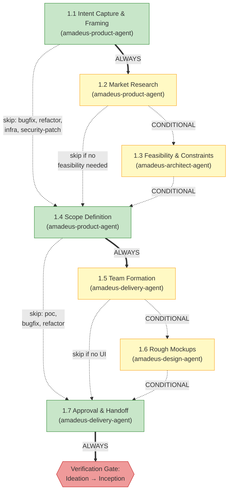
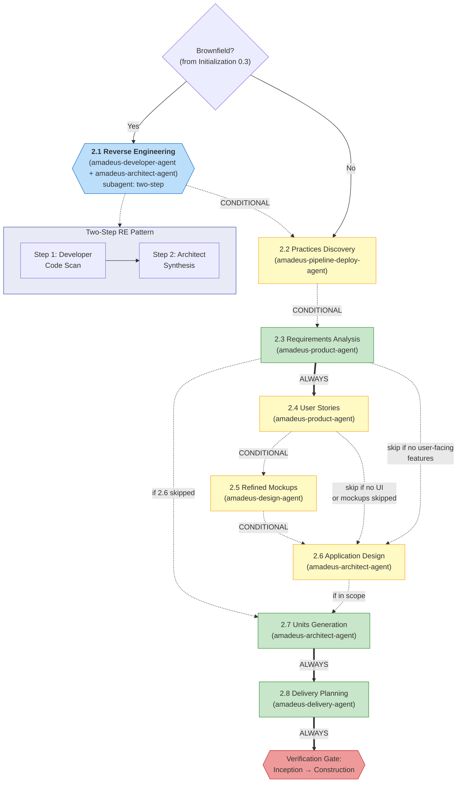
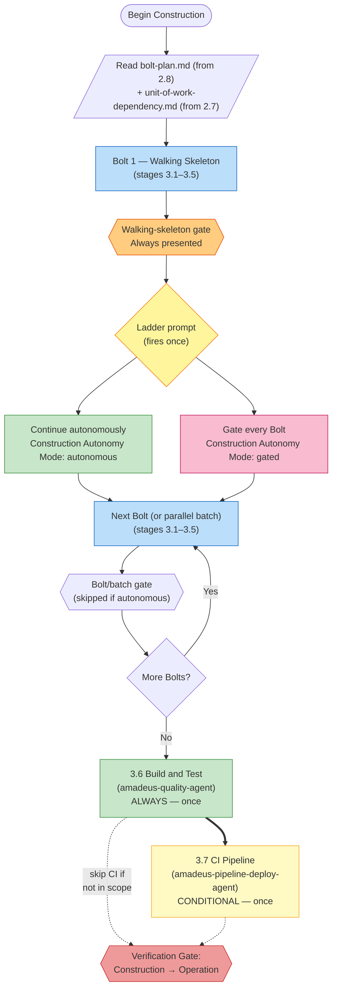
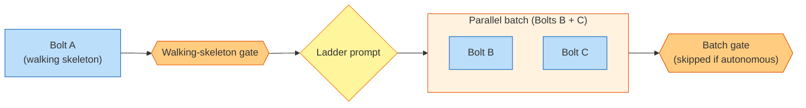
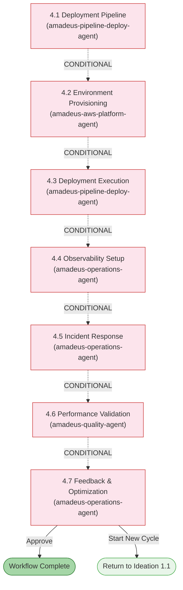

# フェーズとステージ

AI-DLC のライフサイクルは、32 のステージを含む 5 つのフェーズで構成されています。本章では各フェーズを説明し、そのステージを列挙し、それらがどのように接続されるかを示します。

> **ハーネスに関する注記。** 本ガイドが説明する方法論 — フェーズ、ステージ、エージェント、ゲート — は、どのハーネスでも同一です。ハーネスによって仕組みが異なる箇所(ゲートの描画方法、サブエージェントのディスパッチ方法、設定の配置場所)については、その差分を明示し、各ハーネスの章に表としてまとめています:
> [他のハーネスで実行する](harnesses/README.ja.md)。特記がない限り、ここでの例は Claude Code を用います。

---

## ライフサイクル概要

```mermaid
graph LR
    subgraph INITIALIZATION["INITIALIZATION (0.1-0.3)"]
        Z1["Workspace Scaffold"]
        Z4["State Init"]
        Z1 -.->|"3 stages"| Z4
    end

    subgraph IDEATION["IDEATION (1.1-1.7)"]
        I1["Intent Capture"]
        I7["Approval & Handoff"]
        I1 -.->|"7 stages"| I7
    end

    subgraph INCEPTION["INCEPTION (2.1-2.8)"]
        N1["Reverse Engineering"]
        N7["Delivery Planning"]
        N1 -.->|"8 stages"| N7
    end

    subgraph CONSTRUCTION["CONSTRUCTION (3.1-3.7)"]
        C1["Functional Design"]
        C7["CI Pipeline"]
        C1 -.->|"7 stages per unit"| C7
    end

    subgraph OPERATION["OPERATION (4.1-4.7)"]
        O1["Deployment Pipeline"]
        O7["Feedback & Optimization"]
        O1 -.->|"7 stages"| O7
    end

    Z4 -->|"auto-proceed"| I1
    I7 -->|"Verification Gate 1"| N1
    N7 -->|"Verification Gate 2"| C1
    C7 -->|"Verification Gate 3"| O1
    O7 -.->|"Feedback Loop"| I1

    style INITIALIZATION fill:#f3e5f5,stroke:#9c27b0
    style IDEATION fill:#e8f5e9,stroke:#4caf50
    style INCEPTION fill:#e3f2fd,stroke:#2196f3
    style CONSTRUCTION fill:#fff3e0,stroke:#ff9800
    style OPERATION fill:#fce4ec,stroke:#e91e63
```

<!-- Text fallback: Linear flow: INITIALIZATION (0.1-0.3) auto-proceeds to IDEATION (1.1-1.7), which passes through Verification Gate 1 to INCEPTION (2.1-2.8), through Verification Gate 2 to CONSTRUCTION (3.1-3.7), through Verification Gate 3 to OPERATION (4.1-4.7). A feedback loop returns from 4.7 back to 1.1. -->

フェーズは順番に実行されます。各フェーズ境界(Initialization → Ideation を除く)では、**検証ゲート**が自動トレーサビリティチェックを実行し、下流のステージがそれらの上に構築される前に、欠落したリンク、孤立した成果物、不整合を検出します。

---

## Phase 0: Initialization

**目的:** ワークスペースをブートストラップする — docs ディレクトリのスキャフォールド、ワークスペースの検出、状態の初期化。ウェルカムメッセージは、セッション開始時に `settings.json` の `companyAnnouncements` エントリを介して表示されます(ステージではありません)。

Initialization のステージは、承認ゲートなしで**自動的に**実行されます。3 つすべてが単一の決定論的なツール呼び出し(`amadeus-utility init`)の内部で実行され、1 秒を大きく下回る時間で完了します。

| # | ステージ | リード | 主要成果物 | 条件 |
|---|-------|------|---------------|-----------|
| 0.1 | Workspace Scaffold | orchestrator | 最初の intent の record ディレクトリ(`amadeus/spaces/<space>/intents/<YYMMDD>-<label>/`) | ALWAYS |
| 0.2 | Workspace Detection | orchestrator | `amadeus-state.md`(ワークスペースの状態) | ALWAYS |
| 0.3 | State Initialization | orchestrator | `amadeus-state.md`、`audit/` シャード | ALWAYS |

**実行に関する注記:**
- 3 つのステージはすべて `amadeus-utility init` の内部でインラインに実行されます — LLM サブエージェントへの委譲も、ステージごとのプロンプトもありません。
- ワークスペース検出はルールベースのスキャナーです(ファイル拡張子、既知の設定ファイル名、パッケージマニフェスト)。
- このフェーズ中にユーザーの操作は不要です。

---

## Phase 1: Ideation

**目的:** イニシアチブを検証する — intent の把握、実現可能性の評価、スコープの定義、チームの編成、そして先へ進むための承認の取得。

<!-- Text fallback: 1.1 Intent Capture (ALWAYS) flows to 1.2 Market Research (CONDITIONAL) or directly to 1.4. 1.2 flows to 1.3 Feasibility (CONDITIONAL) or to 1.4. 1.3 flows to 1.4 Scope Definition (ALWAYS). 1.4 flows to 1.5 Team Formation (CONDITIONAL) or to 1.7. 1.5 flows to 1.6 Rough Mockups (CONDITIONAL, skip if no UI) or to 1.7. 1.6 flows to 1.7 Approval & Handoff (ALWAYS), then Verification Gate 1. -->

| # | ステージ | リード | サポート | 主要成果物 | 条件 |
|---|-------|------|-----------|---------------|-----------|
| 1.1 | Intent Capture & Framing | amadeus-product-agent | amadeus-architect-agent | Intent ステートメント、ステークホルダーマップ | ALWAYS |
| 1.2 | Market Research | amadeus-product-agent | — | 競合分析、内製 vs 購入 | CONDITIONAL |
| 1.3 | Feasibility & Constraints | amadeus-architect-agent | amadeus-aws-platform-agent, amadeus-compliance-agent | 実現可能性評価、制約レジスタ、RAID ログ | CONDITIONAL |
| 1.4 | Scope Definition | amadeus-product-agent | amadeus-delivery-agent | スコープ定義、intent バックログ | ALWAYS |
| 1.5 | Team Formation | amadeus-delivery-agent | — | チーム評価、モブ編成計画 | CONDITIONAL |
| 1.6 | Rough Mockups | amadeus-design-agent | amadeus-product-agent | ワイヤーフレーム、ユーザーフロー、コンセプトデック | CONDITIONAL |
| 1.7 | Approval & Handoff | amadeus-delivery-agent | amadeus-product-agent | イニシアチブブリーフ、意思決定ログ | ALWAYS |

**ステージの色:** 緑 = ALWAYS(すべてのスコープで実行)。黄 = CONDITIONAL(一部のスコープではスキップ)。

---

## Phase 2: Inception

**目的:** 要件を精緻化する — コードベースの分析、要件の抽出、アーキテクチャの設計、作業単位への分解、そしてデリバリーの計画。

<!-- Text fallback: Brownfield check (from stage 0.3). If yes, 2.1 Reverse Engineering runs with two-step delegation (developer code scan then architect synthesis). Then 2.2 Practices Discovery (CONDITIONAL — discovers the team's way of working and promotes it to the team/project rule files at an affirmation gate), 2.3 Requirements Analysis (ALWAYS), optionally 2.4 User Stories, optionally 2.5 Refined Mockups, optionally 2.6 Application Design, 2.7 Units Generation (ALWAYS), and 2.8 Delivery Planning (ALWAYS) passes through Verification Gate 2. -->

| # | ステージ | リード | サポート | 主要成果物 | 条件 |
|---|-------|------|-----------|---------------|-----------|
| 2.1 | Reverse Engineering | amadeus-developer-agent | amadeus-architect-agent | 9 個の RE 成果物 | Brownfield プロジェクト |
| 2.2 | Practices Discovery | amadeus-pipeline-deploy-agent | amadeus-quality-agent, amadeus-developer-agent, amadeus-devsecops-agent | `team-practices.md`、`discovered-rules.md`、`evidence.md`(affirmation 時に `amadeus/spaces/<space>/memory/team.md` / `memory/project.md` へ昇格) | CONDITIONAL |
| 2.3 | Requirements Analysis | amadeus-product-agent | — | `requirements.md` | ALWAYS |
| 2.4 | User Stories | amadeus-product-agent | amadeus-design-agent | `stories.md`、`personas.md` | ユーザー向け機能 |
| 2.5 | Refined Mockups | amadeus-design-agent | amadeus-product-agent | ハイファイモックアップ、インタラクション仕様 | UI プロジェクト |
| 2.6 | Application Design | amadeus-architect-agent | amadeus-aws-platform-agent, amadeus-design-agent | アプリ設計成果物、ADR | 実行計画に応じて |
| 2.7 | Units Generation | amadeus-architect-agent | amadeus-delivery-agent | `unit-of-work.md`、`unit-of-work-dependency.md`(DAG)、`unit-of-work-story-map.md` | ALWAYS |
| 2.8 | Delivery Planning | amadeus-delivery-agent | amadeus-architect-agent | `bolt-plan.md`、`team-allocation.md`、`risk-and-sequencing-rationale.md`、`external-dependency-map.md` | ALWAYS |

**主要な挙動:** ステージ 2.1 は、2 ステップの Reverse Engineering パターンを用いて**サブエージェント**として実行されます — 最初に amadeus-developer-agent によるコードスキャン、次に amadeus-architect-agent による合成です。これは brownfield(既存コードベース)プロジェクトでのみ実行されます。

---

## Phase 3: Construction

**目的:** ソリューションを構築する — 設計、実装、テストを、レビュー可能なスライスで行う。

### Construction が現在の形になっている理由

かつて Construction は、[作業単位](glossary.ja.md)ごとにステージを 1 つずつ実行し、各ステージの後に承認ゲートを設けていました。3 ユニットのプロジェクトでは、テスト済みのコードが 1 行も出荷される前に 15 個のゲートを通過することを意味しました。顧客はこれを「子守り」と呼びました。

最初の修正は、すべての質問、すべての設計成果物、そしてすべてのユニットにわたるコード生成をまとめて実行し、最後に 1 回だけレビューするというものでした。これは振り子を逆方向に振らせました。15 ユニットの実行では、build-and-test ゲートで 15,000 行のコードが到達しうる状態になりました。単一のレビューで検証するには多すぎます。

現在の形はその中間の道です: Construction は **Bolt ごと**に実行されます。各 [Bolt](glossary.ja.md) は、あるユニット(または依存関係でつながった小さなユニット群)に対するステージ 3.1〜3.5 の 1 回の通過です。最初の Bolt は **walking skeleton** です — ゲート付きかつインタラクティブで、アーキテクチャを実証する最小の end-to-end スライスです。それが出荷されると、**ラダープロンプト**がちょうど 1 回だけ発火します:「残りは自律的に続行しますか、それとも Bolt ごとにゲートしますか?」。あなたの回答は状態に記録され、ワークフロー内の残りすべての Bolt を統制します。ステージ 3.6(Build and Test)と 3.7(CI Pipeline)は、最後にすべてに対して 1 回だけ実行されます。

この形により、早期の信頼チェックポイントと意図的な自律性の選択が得られ、2.8 ですでに計画された Bolt に合わせたサイズのレビュー可能なスライスが提供されます。

### Construction のフロー

<!-- Text fallback: Begin Construction → read bolt-plan.md and unit-of-work-dependency.md → execute Bolt 1 (walking skeleton, stages 3.1–3.5) → walking-skeleton gate (always) → ladder prompt (fires once, choose autonomous or gated) → loop executing remaining Bolts (each covers 3.1–3.5) with or without per-Bolt gate depending on mode → once all Bolts are done, run 3.6 Build and Test then optionally 3.7 CI Pipeline → Verification Gate 3. -->

### 並列 Bolt バッチ

2 つの Bolt が依存関係の前提条件を共有し(たとえば Bolt B と C がともに A のみに依存する場合)、かつ互いに依存しない場合、それらは単一の**バッチ**として並行実行されます。バッチの末尾にある単一のゲートが、その中のすべての Bolt をカバーします。

<!-- Text fallback: Bolt A (walking skeleton) runs first, followed by its gate and the ladder prompt. When B and C both depend only on A, they form a parallel batch that executes concurrently. A single batch-level gate covers both Bolts (or is skipped if the user chose "Continue autonomously"). -->

コンダクター(ライブの `/amadeus` セッション)は、1 ターンで複数の `Task` 呼び出しを発行することで並列 Bolt をディスパッチします — Claude Code に組み込まれた並列性により、各 Bolt の Code Generation ステージが並行して実行されます。質問の収集と設計成果物の生成は、依然として Bolt ごとに実行されます(それらは軽量であり、質問への回答はいずれにせよユーザーを通じて直列化する必要があるためです)。

### 失敗時の halt-and-ask

失敗は、自律モードであっても常に Construction を停止します。それが、自律モードが中断する唯一の場面です。

- 単独の Bolt が失敗した場合、Construction は直ちに停止し、**retry**(その Bolt だけを再実行)、**skip**(`[S]` とマークして続行 — 依存する Bolt もおそらく失敗します)、または **abort**(Construction 全体を停止)を提示します。
- 並列バッチ内の 1 つの Bolt が失敗し、他が成功した場合、コンダクターはバッチ全体の完了を待ち、成功した Bolt の成果物をディスク上に保存し、失敗した Bolt に対してのみ同じ retry / skip / abort の選択肢を提示します。

### ステージリファレンス

| # | ステージ | リード | サポート | 主要成果物 | 実行 |
|---|-------|------|-----------|---------------|------|
| 3.1 | Functional Design | amadeus-architect-agent | amadeus-developer-agent | `business-logic-model.md`、`business-rules.md` | Bolt ごと(実行計画により CONDITIONAL) |
| 3.2 | NFR Requirements | amadeus-architect-agent | amadeus-devsecops-agent, amadeus-compliance-agent, amadeus-quality-agent | セキュリティ、パフォーマンス、信頼性の NFR | Bolt ごと(CONDITIONAL) |
| 3.3 | NFR Design | amadeus-architect-agent | amadeus-aws-platform-agent | NFR 設計仕様 | Bolt ごと(CONDITIONAL) |
| 3.4 | Infrastructure Design | amadeus-aws-platform-agent | amadeus-devsecops-agent, amadeus-compliance-agent | インフラ仕様、IaC 設計 | Bolt ごと(CONDITIONAL) |
| 3.5 | Code Generation | amadeus-developer-agent | — | アプリケーションコード + コードドキュメント | Bolt ごと(ALWAYS、Bolt 内のユニットごと) |
| 3.6 | Build and Test | amadeus-quality-agent | amadeus-devsecops-agent | テスト結果、品質レポート | ALWAYS、最後に 1 回 |
| 3.7 | CI Pipeline | amadeus-pipeline-deploy-agent | — | CI 設定、品質ゲート | CONDITIONAL、最後に 1 回 |

**主要な挙動:**

- 各 Bolt 内では、ステージ 3.1〜3.4 の質問は、成果物が生成される前に Bolt のユニット全体にわたって単一のインタラクティブなパスで収集されます。単一の Bolt レベルの回答ゲートが、設計成果物の開始前にすべての回答を確認します。
- `stages/construction/code-generation.md` 内のユニットごとの承認ゲートは、通常の Bolt 実行中は**コンダクターによって抑制されます**。単一の Bolt レベル(またはバッチレベル)のゲートがそれを置き換えます。
- ラダープロンプトは、ワークフローごとにちょうど 1 回だけ発火します — walking-skeleton ゲートの後です。あなたの回答は `amadeus-state.md` に `Construction Autonomy Mode` として記録され、セッション再開時にも尊重されます。
- 並列バッチには、複数の `Task` 実行可能なサブエージェントスロットが利用可能である必要があります — 並行性の制約については [エージェント](06-agents.ja.md) を参照してください。

---

## Phase 4: Operation

**目的:** デプロイして運用する — デプロイパイプラインのセットアップ、環境のプロビジョニング、可観測性の設定、そしてフィードバックループの確立。

<!-- Text fallback: All Operation stages are CONDITIONAL. 4.1 through 4.7 flow sequentially. Stage 4.7 can either complete the workflow or loop back to start a new Ideation cycle at 1.1. -->

| # | ステージ | リード | サポート | 主要成果物 | 条件 |
|---|-------|------|-----------|---------------|-----------|
| 4.1 | Deployment Pipeline | amadeus-pipeline-deploy-agent | — | CD 設定、デプロイ戦略、ロールバック runbook | CONDITIONAL |
| 4.2 | Environment Provisioning | amadeus-aws-platform-agent | amadeus-devsecops-agent, amadeus-compliance-agent | 環境インベントリ、検証レポート | CONDITIONAL |
| 4.3 | Deployment Execution | amadeus-pipeline-deploy-agent | amadeus-developer-agent | デプロイログ、スモークテスト、ヘルスチェック | CONDITIONAL |
| 4.4 | Observability Setup | amadeus-operations-agent | — | ダッシュボード、アラーム、SLO 設定 | CONDITIONAL |
| 4.5 | Incident Response | amadeus-operations-agent | — | SSM runbook、インシデント計画、エスカレーションマトリクス | CONDITIONAL |
| 4.6 | Performance Validation | amadeus-quality-agent | — | 負荷テスト結果、NFR 検証マトリクス | CONDITIONAL |
| 4.7 | Feedback & Optimization | amadeus-operations-agent | amadeus-aws-platform-agent | SLO レポート、コスト分析、フィードバックループ文書 | CONDITIONAL |

**主要な挙動:**
- 7 つのステージすべてが **conditional** です — `mvp`、`poc`、`bugfix`、`refactor` スコープでは、フェーズ全体がスキップされる場合があります
- ステージ 4.7 は**終端ステージ**です — 承認されると、ワークフローは完了します
- 4.7 から 1.1 へ戻る**フィードバックループ**により、反復的な開発サイクルが可能になります

---

## フェーズ遷移と検証ゲート

各フェーズ境界(Ideation → Inception、Inception → Construction、Construction → Operation)で、フレームワークは**フェーズ境界検証**を実行します。この自動チェックは以下を検証します:

- 完了したフェーズから必要なすべての成果物が存在すること
- 成果物間のトレーサビリティリンクが無傷であること(例: すべての要件がストーリーに対応している)
- 孤立した成果物や欠落した参照がないこと
- 関連する成果物間の整合性

検証が失敗した場合、コンダクターは問題を報告し、続行するか、戻って修正するかを尋ねます。

---

## ステージ実行モードリファレンス

| モード | ステージ | ユーザーの操作 | 説明 |
|------|--------|-----------------|-------------|
| インライン(自動続行) | 0.1, 0.2, 0.3 | なし | `amadeus-utility init` の内部で決定論的に実行、承認ゲートなし |
| インライン | その他のすべてのステージ | 完全 | エージェントが会話内で作業し、末尾に承認ゲート |
| サブエージェント(シンプル) | 3.5 | 承認ゲートのみ | コード生成がバックグラウンドで実行 |
| サブエージェント(2 ステップ) | 2.1 | 承認ゲートのみ | Developer スキャン + Architect 合成 |

---

## 次のステップ

- [スコープ、深度、テスト戦略](05-scopes-and-depth.ja.md) — スコープがどのステージを実行するかを制御する方法
- [エージェント](06-agents.ja.md) — 11 個のエージェントとその役割
- [はじめてのワークフロー](02-your-first-workflow.ja.md) — 注釈付きのウォークスルー
- [用語集](glossary.ja.md) — 用語リファレンス
