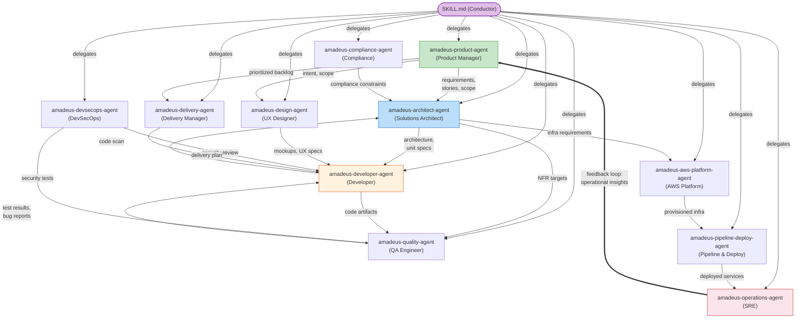

# エージェント

AI-DLC は、コンダクターがステージ中にアクティブ化する 11 個のドメインエキスパートのエージェントペルソナを使用します。本章では、エージェント設計の背後にある哲学、各エージェントが何をするか、そしていつ登場するかを説明します。

---

## 哲学: 小さなモブ、広範なエージェント

数十の狭い専門家(これはウォーターフォールのハンドオフチェーンを再現します)ではなく、AI-DLC は **11 個の広範に有能なエージェント**を使用し、それぞれが複数のステージとフェーズにまたがって参加します。

### なぜ 30 ではなく 11 なのか?

人間のソフトウェアチームでは、3〜5 人のモブが要件からデプロイまで機能全体をカバーします。各人は複数の専門分野にまたがる広範なスキルセットを持ち込みます。AI-DLC はこのモデルを反映します:

- **各エージェントは、多くのタスクにわたってドメイン全体をカバーします。** amadeus-architect-agent は、実現可能性、アプリケーション設計、ユニット生成、機能設計、NFR 要件、NFR 設計を扱います — 3 フェーズにまたがる 6 ステージです。狭い専門家モデルでは、ほぼ同一の知識ベースを持つ 6 個の別々のエージェントが必要になります。

- **エージェントが少ないほどハンドオフが少なくなります。** すべてのエージェント境界は、潜在的な情報損失点です。同じ amadeus-architect-agent が Application Design と Functional Design の両方をリードするとき、明示的なハンドオフ成果物を必要とせずに、自然にコンテキストを保持します。

- **サポート役割は、増殖せずにコラボレーションを可能にします。** 「security-reviewer-agent」「compliance-reviewer-agent」「cost-reviewer-agent」を作成するのではなく、amadeus-devsecops-agent と amadeus-compliance-agent が、他のエージェントがリードするステージにサポートエージェントとして参加します。インラインステージ(出荷されたグラフのすべてのマルチエージェントステージ)では、コンダクターは各サポートエージェントを `Task` としてディスパッチするのではなく、自身のコンテキスト内でペルソナとして採用します。`Task` は `mode: subagent` ステージのために予約されています。いずれの場合も、すべての委譲はコンダクターが実行します — エージェントが互いを呼び出すことは決してありません。

- **知識のロードはエージェントごとです。** 各エージェントは、`.claude/knowledge/<agent-name>/` から方法論の知識を、space レベルの `amadeus/knowledge/<agent-name>/`(チームが作成した場合)からチームの知識をロードします。エージェントが少ないほど、管理する知識ディレクトリが少なく、矛盾するガイダンスの機会も少なくなります。

---

## エージェント連携マップ

以下の図は、ワークフロー中にエージェントがどのように情報を交換するかを示しています。実線の矢印は主要な成果物のフローを示します。破線の矢印は助言またはレビューの関係を示します。operations から product へのフィードバックループが、ライフサイクル全体を閉じます。

<!-- Text fallback: The SKILL.md conductor delegates to all 11 agents. Key flows: amadeus-product-agent sends requirements/stories to amadeus-architect-agent, who sends specs to amadeus-developer-agent. amadeus-developer-agent sends code to amadeus-quality-agent, who sends test results back. amadeus-aws-platform-agent provisions infrastructure for amadeus-pipeline-deploy-agent, who deploys for amadeus-operations-agent. The feedback loop: amadeus-operations-agent sends operational insights back to amadeus-product-agent, closing the cycle. -->

---

## 11 個のエージェント

> **出荷されたエージェントが知っている内容をカスタマイズしたい?** `.claude/agents/*.md` にある出荷された 11 個のエージェントファイルを編集しないでください — それらはフレームワークファイルであり、アップグレード時に上書きされます。代わりに、あなたの会社標準を space レベルの `amadeus/knowledge/<agent-name>/` に追加してください。完全なワークフローについては [知識](08-knowledge.md) を参照してください。既存の 11 個のための知識だけでなく、*新しい*エージェントが欲しいチームは、必須のフロントマターを持つファイルを `.claude/agents/<slug>.md` に配置できます — そのファイルはユーザー所有です。[コントリビューティング: エージェントの追加](../reference/11-contributing.md#adding-an-agent) を参照してください。

以下の各エージェントには、**深掘りページ**があります — 完全な責務、リードおよびサポートするステージ、ロードする知識です。[エージェント深掘りインデックス](agents/README.md) は全 11 個を列挙します。エージェントごとのリンクは各見出しの下にインラインで示されています。

### [amadeus-product-agent](agents/product-agent.md)

**ドメイン:** 要件、ユーザーストーリー、スコープ、市場調査

amadeus-product-agent は、プロダクトマネージャーおよびビジネスアナリストとして機能します。intent を把握し、市場調査を実施し、スコープを定義し、要件を抽出し、ユーザーストーリーを生成します。Ideation および Inception フェーズで最も活動的なエージェントです。

- **リード:** intent-capture, market-research, scope-definition, requirements-analysis, user-stories
- **サポート:** rough-mockups, approval-handoff, refined-mockups
- **特別なツール:** WebSearch(市場調査用)

### [amadeus-design-agent](agents/design-agent.md)

**ドメイン:** UX/UI デザイン、ワイヤーフレーム、インタラクションデザイン、アクセシビリティ

amadeus-design-agent は、ワイヤーフレーム、モックアップ、インタラクション仕様を作成します。ユーザー向け機能では amadeus-product-agent と、設計が実装可能であることを保証するために amadeus-developer-agent と密接に協力します。

- **リード:** rough-mockups, refined-mockups
- **サポート:** user-stories, application-design
- **特別なツール:** WebSearch(デザイン調査用)

### [amadeus-delivery-agent](agents/delivery-agent.md)

**ドメイン:** チーム編成、キャパシティプランニング、デリバリーの順序付け

amadeus-delivery-agent は、エンジニアリングマネージャーとして機能します。チームのキャパシティを評価し、モブ編成を行い、デリバリーの順序付けを計画し、フェーズハンドオフを管理します。

- **リード:** team-formation, approval-handoff, delivery-planning
- **サポート:** scope-definition, units-generation
- **特別なツール:** 共通セット以外はなし

### [amadeus-architect-agent](agents/architect-agent.md)

**ドメイン:** アプリケーション設計、ドメインモデリング、NFR、コンポーネント分解

amadeus-architect-agent は、中心的な設計権威です。最も広範なステージ関与(3 フェーズにまたがる 9 ステージ)を持ち、opus モデル上で動作します — 他の 7 個の高判断エージェント(product、design、developer、quality、devsecops、compliance、aws-platform)とともにです。delivery、pipeline-deploy、operations のみが sonnet 上で動作します。これらの出力は主にテンプレート化された計画、CI/CD YAML、runbook のスキャフォールディングだからです。

- **リード:** feasibility, application-design, units-generation, functional-design, nfr-requirements, nfr-design
- **サポート:** intent-capture, reverse-engineering(合成), delivery-planning

### [amadeus-aws-platform-agent](agents/aws-platform-agent.md)

**ドメイン:** AWS インフラ、CDK/CloudFormation、コスト最適化

amadeus-aws-platform-agent は、インフラを設計し、環境をプロビジョニングし、コストを最適化します。AWS CLI および CDK コマンドを実行するための Bash アクセスを持ちます。

- **リード:** infrastructure-design, environment-provisioning
- **サポート:** feasibility, application-design, nfr-design, feedback-optimization
- **特別なツール:** Bash(`aws`、`cdk` コマンド用)

### [amadeus-compliance-agent](agents/compliance-agent.md)

**ドメイン:** 規制スキャン、データ分類、リスク評価

amadeus-compliance-agent は、純粋に助言的な役割で機能します — リードステージを持ちません。規制上の制約を、他のエージェント、特に amadeus-architect-agent と amadeus-devsecops-agent がリードするステージに供給します。

- **リード:** なし(サポートのみ)
- **サポート:** feasibility, nfr-requirements, infrastructure-design, environment-provisioning
- **特別なツール:** WebSearch(規制調査用)

### [amadeus-devsecops-agent](agents/devsecops-agent.md)

**ドメイン:** 脅威モデリング、セキュリティスキャン、DevSecOps パイプライン

amadeus-devsecops-agent は、セキュリティの観点から設計をレビューし、セキュリティ要件を定義し、セキュリティを CI/CD パイプラインに統合します。amadeus-compliance-agent と同様に、サポート役割で機能します。

- **リード:** なし(サポートのみ)
- **サポート:** practices-discovery, nfr-requirements, infrastructure-design, build-and-test, environment-provisioning
- **特別なツール:** Bash(セキュリティスキャン用)

### [amadeus-developer-agent](agents/developer-agent.md)

**ドメイン:** コード実装、コード分析、ワークスペース検出

amadeus-developer-agent は、3 つのフェーズにまたがります — Inception のリバースエンジニアリングから Operation のデプロイサポートまでです。既存コードベースのコードスキャンを実行し、実装コードを生成します。

- **リード:** reverse-engineering(コードスキャン), code-generation
- **サポート:** practices-discovery, functional-design, deployment-execution

ワークスペース検出(workspace-detection)は、かつて amadeus-developer-agent のサブエージェントでしたが、現在はルールベースのファイルおよびマニフェスト検出を用いて `amadeus-utility init` の内部で決定論的に実行されます。
- **特別なツール:** Bash(ビルドおよび実行コマンド用)

### [amadeus-quality-agent](agents/quality-agent.md)

**ドメイン:** テスト戦略、テスト生成、パフォーマンス検証

amadeus-quality-agent は、テスト戦略を定義し、テストスイートを生成し、品質ゲートを検証し、パフォーマンステストを実行します。

- **リード:** build-and-test, performance-validation
- **サポート:** practices-discovery, nfr-requirements
- **特別なツール:** Bash(テスト実行用)

### [amadeus-pipeline-deploy-agent](agents/pipeline-deploy-agent.md)

**ドメイン:** CI/CD パイプライン、デプロイ戦略、リリース実行

amadeus-pipeline-deploy-agent は、CI/CD パイプラインを構成し、デプロイ戦略を計画し、ロールバック機能を伴うリリースを実行します。

- **リード:** practices-discovery, ci-pipeline, deployment-pipeline, deployment-execution
- **サポート:** なし
- **特別なツール:** Bash(パイプラインおよびデプロイコマンド用)

### [amadeus-operations-agent](agents/operations-agent.md)

**ドメイン:** 可観測性、インシデント対応、SLO 追跡、フィードバックループ

amadeus-operations-agent は、モニタリングをセットアップし、インシデント対応手順を定義し、運用上の洞察を次の反復のために amadeus-product-agent に戻すことでライフサイクルループを閉じます。

- **リード:** observability-setup, incident-response, feedback-optimization
- **サポート:** performance-validation
- **特別なツール:** Bash(可観測性およびモニタリングコマンド用)

---

## フェーズ参加

この表は、どのエージェントがどのフェーズでアクティブか、そしてリード(L)またはサポート(S)のどちらを務めるかを示します。

| エージェント | Phase 0 | Phase 1 | Phase 2 | Phase 3 | Phase 4 |
|-------|---------|---------|---------|---------|---------|
| amadeus-product-agent | — | L (intent-capture, market-research, scope-definition), S (rough-mockups, approval-handoff) | L (requirements-analysis, user-stories), S (refined-mockups) | — | — |
| amadeus-design-agent | — | L (rough-mockups) | L (refined-mockups), S (user-stories, application-design) | — | — |
| amadeus-delivery-agent | — | L (team-formation, approval-handoff), S (scope-definition) | L (delivery-planning), S (units-generation) | — | — |
| amadeus-architect-agent | — | L (feasibility), S (intent-capture) | L (application-design, units-generation), S (reverse-engineering, delivery-planning) | L (functional-design, nfr-requirements, nfr-design) | — |
| amadeus-aws-platform-agent | — | S (feasibility) | S (application-design) | L (infrastructure-design), S (nfr-design) | L (environment-provisioning), S (feedback-optimization) |
| amadeus-compliance-agent | — | S (feasibility) | — | S (nfr-requirements, infrastructure-design) | S (environment-provisioning) |
| amadeus-devsecops-agent | — | — | S (practices-discovery) | S (nfr-requirements, infrastructure-design, build-and-test) | S (environment-provisioning) |
| amadeus-developer-agent | — | — | L (reverse-engineering), S (practices-discovery) | L (code-generation), S (functional-design) | S (deployment-execution) |
| amadeus-quality-agent | — | — | S (practices-discovery) | L (build-and-test), S (nfr-requirements) | L (performance-validation) |
| amadeus-pipeline-deploy-agent | — | — | L (practices-discovery) | L (ci-pipeline) | L (deployment-pipeline, deployment-execution) |
| amadeus-operations-agent | — | — | — | — | L (observability-setup, incident-response, feedback-optimization) |

### 観察

- **amadeus-architect-agent** は最も広範な関与を持ちます(3 フェーズにまたがる 9 ステージ)。これは opus 上で動作し、他の 7 個の高判断エージェントも同様です。**amadeus-delivery-agent**、**amadeus-pipeline-deploy-agent**、**amadeus-operations-agent** のみが sonnet 上で動作します
- **amadeus-developer-agent** は 3 フェーズにまたがります: Inception、Construction、Operation
- **amadeus-compliance-agent** と **amadeus-devsecops-agent** は純粋にサポート役割で機能し、他のエージェントがリードするステージに参加します
- **amadeus-operations-agent** は、洞察を amadeus-product-agent に戻すことでライフサイクルループを閉じます

---

## エージェントのツールアクセス

すべてのエージェントは、**完全なセッションツールセット**を継承します — Claude Code の組み込みツールすべてに加えて、セッションにプロビジョニングされた任意の MCP ツールです。出荷される唯一の制限は `disallowedTools: Task` です(コンダクターのみがサブエージェントを生成します)。11 個のエージェントのいずれも `tools:` の許可リストを宣言していません。したがって以下の表は、エージェントごとの付与のセットではありません — 各ペルソナが、そのステージ作業で行使すると*期待される*ツールを記録したものです。

| ツール | 行使が期待されるエージェント |
|------|-------------|
| Read, Edit, Write, Glob, Grep, AskUserQuestion | 全 11 エージェント |
| Bash | amadeus-aws-platform-agent, amadeus-devsecops-agent, amadeus-developer-agent, amadeus-quality-agent, amadeus-pipeline-deploy-agent, amadeus-operations-agent |
| WebSearch | amadeus-product-agent, amadeus-design-agent, amadeus-compliance-agent |
| Task | なし(`disallowedTools: Task` により全エージェントでブロック) |

ペルソナを本当に狭めるには、そのフロントマターに任意の `tools:` 許可リストを追加します — ただし、そうすると、完全修飾された `mcp__<server>__<tool>` id もリストされていない限り、継承された MCP アクセスが失われます。この実装は現在、そのような制限を出荷していません。

### MCP サーバーは共有であり、エージェントごとではない

上記の表は、各ペルソナが使用すると期待される組み込みツールを示しています。実際には、すべてのエージェントがそれらすべてを継承します。MCP サーバーも同じ「すべて継承」モデルに従います: プロジェクトまたはユーザーのハーネス設定で MCP サーバーを宣言すると、ハーネスがそれらをセッションにプロビジョニングし、すべてのエージェントがそれらを継承します — エージェントごとの付与はありません。認証情報を持たないサーバーは、ブロッカーではなく単に利用不可となります。特定のエージェントがサーバーに到達するのを止めるには、そのエージェントの `tools:` 許可リストを、保持すべき完全修飾された `mcp__<server>__<tool>` id に狭めます。この実装は現在、そのような制限を出荷していません。

サーバーレジストリと認証情報については [はじめに](01-getting-started.md) を、MCP が Claude Code のネイティブなツールモデルにどのようにマッピングされるかについては [ハーネスプリミティブのマッピング](../reference/14-claude-features.md#mcp-servers) を参照してください。

---

## レビュアーエージェント

11 個のドメインエキスパートエージェントに加えて、AI-DLC は **2 個の品質ゲートレビュアーエージェント**を出荷します。それらは成果物を生成しません — ビルダーが生成したものをレビューし、それに異議を唱え、ゲートで顧客(またはレビューボード)を代表します。

| レビュアー | レビュー対象 | 動作モデル |
|----------|---------|---------|
| `amadeus-product-lead-agent` | 要件、ユーザーストーリー、UX/モックアップ成果物 — 完全性、ビジネス整合性、テスト可能性 | sonnet |
| `amadeus-architecture-reviewer-agent` | 技術設計成果物 — 健全性、実装可能性、壊れた相互参照、達成不可能な NFR 目標 | sonnet |

## コンポーザーエージェント

もう 1 個のエージェントが、両グループの外に位置します: `amadeus-composer-agent`、適応型ワークフローのコンポーザーです。コンダクターは、compose リクエスト(`/amadeus compose`、コールドスタート時の compose 提案、`--report`、または `--new-scope`)でこれをディスパッチします。タスクとワークスペースのスキャンを読み取り、SKIP ごとの根拠を伴う EXECUTE/SKIP ステージグリッドを提案し、ゲートでのあなたの承認の後にのみ、作成されたスコープ(front/report)を作成するか、決定論的な `recompose` 動詞が適用する pending ステージのフリップ(進行中)を提案します。そのペルソナは意図的に維持寄りです: 存在を正当化し、不在を問い詰め、「速くするため」にステージを剥ぎ取ることは決してありません。[スコープと深度 - 適応型コンポーザー](05-scopes-and-depth.md#the-adaptive-composer) を参照してください。

レビュアーは、ステージが `reviewer:` フィールドを宣言した場合にのみ発火します。現在、product lead は `rough-mockups`、`refined-mockups`、`requirements-analysis`、`user-stories` をレビューします。architecture reviewer は `application-design`、`units-generation`、`functional-design`、`nfr-requirements`、`nfr-design`、`infrastructure-design`、`code-generation` をレビューします。

**レビュアーステップ。** ステージ本体が成果物を生成した後、学習の儀式と承認ゲートの前に、コンダクターは指定されたレビュアーを**別のサブエージェント**として呼び出します。レビュアーは、ステージ定義、Q&A、成果物を読み取り(ビルダーの `memory.md` や計画は決して読みません — 独立した判断を形成します)、次に判定を伴う `## Review` セクションを追記します: **READY** または **NOT-READY**。NOT-READY の場合、ビルダーは発見事項に対処するために再実行し、レビュアーが再チェックし、`reviewer_max_iterations` 回(デフォルト 2)までループします。上限後も発見事項が残る場合、ワークフローは未解決の発見事項を記録したうえで承認ゲートに進みます — レビュアーは決してブロックせず、人間が常に最終決定権を持ちます。

(重要: 示されているようにバッククォートで囲んだプレーンなエージェント名を使用してください — それらを Markdown リンクにしないでください。エージェントごとのレビュアードキュメントページはまだ存在しません。)

---

## 次のステップ

- [フェーズとステージ](04-phases-and-stages.md) — 完全なステージフローの文脈でエージェントを見る
- [知識](08-knowledge.md) — エージェントが方法論とチーム知識をどのようにロードするか
- [ルールと学習ループ](09-rules-and-the-learning-loop.md) — エージェントの挙動を制約する行動ルール
- [用語集](glossary.md) — 用語リファレンス
