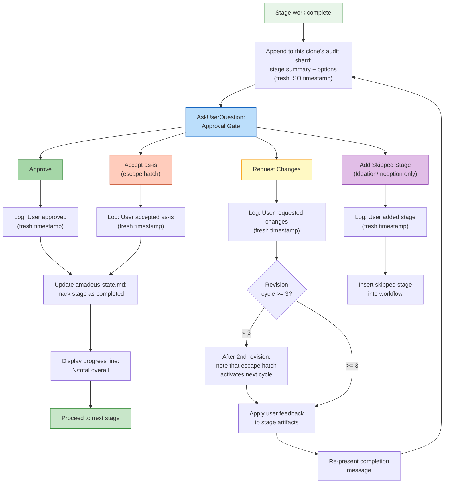

# インタラクションモード

> 言語: [English](07-interaction-modes.md) | **日本語**

AI-DLC は、ステージ中にエージェントと対話する 4 つの方法に加えて、あらゆる意思決定ポイントであなたを制御下に保つ承認ゲートを提供します。

> **ハーネスに関する注記。** ゲートと質問は、ハーネスによって描画が異なります: Claude Code は `AskUserQuestion` ウィジェットを使用します。Kiro と Codex は番号付きの散文の選択肢を描画します(番号または自由記述で回答)。質問ファイルが真実の源です。*セマンティクス* — ゲートがいつ発火するか、何を尋ねるか、あなたが制御下に留まること — は、エンジンに存在するため同一です。[他のハーネスで実行する](harnesses/README.ja.md) を参照してください。

---

## 質問インタラクションモード

ステージがあなたの入力を収集するとき、エージェントは 4 つのインタラクションモードを提示します。現在のステージに最適なモードを選択します。

```
▸ Choose interaction mode:
  (1) Guide Me — agent asks structured questions
  (2) Grill Me — one question at a time, in depth, with recommended answers
  (3) Edit File — write directly to the artifact
  (4) Chat — freeform discussion
```

### Guide Me

エージェントが、構造化されたプロンプトを用いて各質問をインタラクティブに案内します。エージェントに会話をリードさせ、何も見落とされないようにしたい場合に最適です。

- エージェントが質問を 1 つずつ(またはバッチで)提示します
- あなたは各質問に直接回答します
- 回答は、トレーサビリティのためにステージの質問ファイルに記録されます

### Grill Me

エージェントがあなたを執拗にインタビューします — 厳密に 1 つずつ、それぞれに推奨される回答とその根拠を添えて — あなたとエージェントが共通の理解に達するまで。ステージが成果物を生成する前に、計画や設計をストレステストしたい場合に最適です。

- エージェントがコードベースや先行成果物から判定できる事実は、尋ねられずに調べられます。決定事項のみがあなたに提示されます
- 不確かな事実は、確認のために確信度タグ付きの見積もりとして提示されます
- 深度設定は上限ではなくガイドラインです: 「continue」で延長し、いつでも「done」で停止できます
- セッションは、何かが生成される前にあなたが明示的に確認する合意サマリーで終わります
- すべての質問と回答はステージの質問ファイルに書き込まれ、それぞれが個別に監査ログに記録されます
- Construction および Operation フェーズでは、このオプションは例外的な使用としてマークされます — その時点までにほとんどの決定は既に下されているはずだからです

完全な規律は `amadeus-common/protocols/grilling-protocol.md` に存在し、ワークフローの外でも読み取り専用の `/amadeus-grilling` セッションスキルとして利用できます。grilling の規律は、[Matt Pocock の grilling skill](https://github.com/mattpocock/skills/blob/main/skills/productivity/grilling/SKILL.md)(mattpocock/skills、MIT ライセンス)から適応されています。

### Edit File

エージェントが質問ファイルを作成(または開き)、あなたがそれを直接編集します。すでに何が欲しいかわかっており、質問に答えるより書き留めることを好む場合に最適です。

- 質問ファイルは、空白の回答フィールドとともに intent の record ディレクトリに現れます
- あなたは自分のペースで回答を記入します
- エージェントは完成したファイルを読み取って先へ進みます

### Chat

エージェントとの自由記述の会話。アイデアを探索するとき、または要件がまだ十分に定義されていないときに最適です。

- あなたはエージェントと自由に議論します
- エージェントは会話から決定事項を抽出します
- 抽出された決定事項は、真実の源として質問ファイルに書き戻されます

### ステージ途中でのモード切り替え

ステージ中の任意の時点でモードを切り替えられます。4 つのモードすべてが、決定事項の正式な記録として質問ファイルに収束します。切り替えても進捗は失われません — すでに取得された回答はファイルに残ります。

---

## 承認ゲート

すべてのステージ(3 つの Initialization ステージを除く)は、承認ゲートで終わります。これは、ワークフローが進む前にエージェントの作業をレビューするあなたのチェックポイントです。

### 標準ゲート

デフォルトの承認ゲートは 2 つのオプションを提示します:

```
▸ How would you like to proceed?
  (1) Approve — Continue to [next stage]
  (2) Request Changes — Provide revision feedback
```

- **Approve** はステージを完了としてマークし、`amadeus-state.md` を更新し、進捗ラインを表示し、次のステージへ進みます
- **Request Changes** は具体的なフィードバックを提供できます。エージェントは作業を修正し、承認ゲートを再提示します

ゲートは実際の人間の承認を必要とします: プロンプトを入力するか `AskUserQuestion` ウィジェットに回答すると、監査台帳に人間のターン(`HUMAN_TURN` イベント)が記録され、承認(および明確化質問への回答)は、前回のゲート解決以降に 1 つが記録されていない限り拒否されます。そのため、自動操縦で動作するモデルが、人間が何も行動していないのに承認を捏造することはできません。ゲートウィジェットが人間のターンを記録しないハーネスでは、1 つが記録に残るように短いメッセージ(たとえば「approve」)を一度入力してください。(台帳にまだ人間のターンがないハーネスでは、ゲートはフェイルオープンし、これを必要としません。)

### 承認ゲートのフロー



<!-- Text fallback: Stage completes, audit log records the options. AskUserQuestion presents the approval gate. Approve: log response, update state, show progress, proceed. Request Changes: log response, check revision count (if <3, note escape hatch coming, revise and re-present; if >=3, Accept-as-is option becomes available). Accept as-is: log and mark complete. Add Skipped Stage (Ideation/Inception only): log and insert stage. -->

---

## 3 ストライクのリビジョン脱出ハッチ

同じステージで 3 回以上変更を要求した場合、第 3 のオプションが現れます:

```
▸ This is revision cycle 4. How would you like to proceed?
  (1) Approve — Continue to [next stage]
  (2) Request Changes — Provide revision feedback
  (3) Accept as-is — Archive current version and move on
```

**Accept as-is** は、ステージ成果物の現在のバージョンをアーカイブし、ワークフローを進めます。これにより、完璧が善の敵となるとき、無限のリビジョンループを防ぎます。

### アクティブ化の仕組み

| リビジョンサイクル | 何が起こるか |
|----------------|-------------|
| 1 回目 | 標準の 2 オプションゲート |
| 2 回目 | 標準の 2 オプションゲート、加えて注記:「あと 1 回のリビジョンで、『Accept as-is』オプションが利用可能になります。」 |
| 3 回目以降 | Accept as-is を伴う 3 オプションゲート |

リビジョンカウントは、次のステージに進むとリセットされます。

---

## スキップされたステージの追加オプション

**Ideation** および **Inception** フェーズ中、承認ゲートには、以前スキップされたステージをワークフローに追加し直す条件付きオプションが含まれる場合があります:

```
▸ How would you like to proceed?
  (1) Approve — Continue to Scope Definition
  (2) Request Changes — Provide revision feedback
  (3) Add Market Research — Include Market Research which was skipped
```

このオプションは、次の場合にのみ現れます:
- 現在のステージが Ideation または Inception にある
- 先のステージがスコープルーティング中にスキップされた
- スキップされたステージが現在のコンテキストに関連している

このオプションを選択すると、スキップされたステージがワークフロー計画に挿入されます。ワークフローは追加されたステージを通じて通常どおり続行します。

---

## ステージのスキップとナビゲーション

承認ゲートを超えて、追加のナビゲーションオプションがあります:

| コマンド | 効果 |
|---------|--------|
| `/amadeus --stage <name>` | 特定のステージにジャンプ(間のステージは `[S]` とマーク) |
| `/amadeus --phase <name>` | フェーズの開始にジャンプ |

詳細は [セッション管理](11-session-management.ja.md) と [CLI コマンド](12-cli-commands.ja.md) を参照してください。

---

## 進捗トラッキング

すべての承認の後、進捗ラインが現れます:

```
Progress: 13/32 overall | 3/7 IDEATION stages complete. Next: Approval & Handoff
```

これは以下を示します:
- 全ステージにわたる合計進捗
- 現在のフェーズ内の進捗
- 次のステージの名前

---

## 次のステップ

- [はじめてのワークフロー](02-your-first-workflow.ja.md) — 文脈の中でインタラクションモードを見る
- [状態と監査](10-state-and-audit.ja.md) — 決定事項がどのように追跡されるか
- [セッション管理](11-session-management.ja.md) — 再開、やり直し、ジャンプ
- [用語集](glossary.ja.md) — 用語リファレンス
