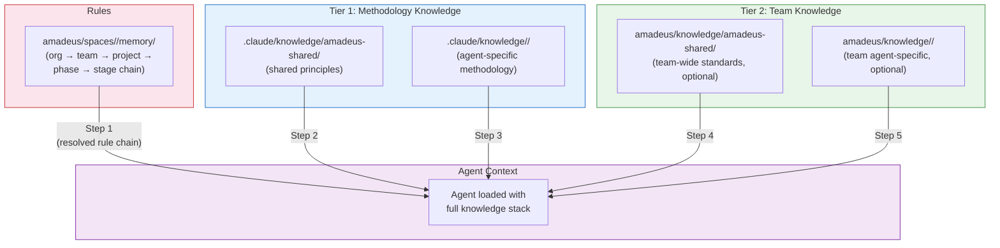
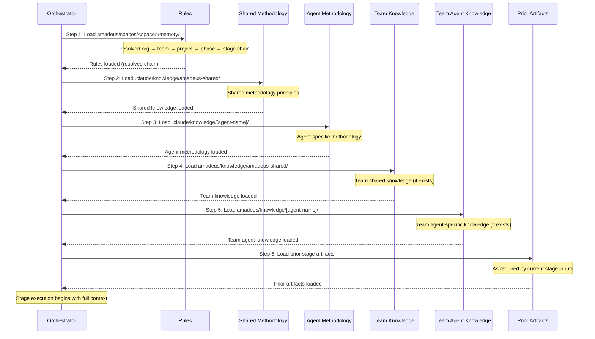

# 知識

AI-DLC は、エージェントが方法論の専門知識(フレームワークに同梱)とあなたのチーム固有の標準(あなたが管理)の両方を活用できる 2 層の知識システムを使用します。

---

## 2 層の知識アーキテクチャ



<!-- Text fallback: The resolved rule chain loads first, then Tier 1 methodology knowledge (shared, then agent-specific), then Tier 2 team knowledge (shared, then agent-specific). All feed into the agent context for stage execution. -->

### Tier 1: 方法論知識

**場所:** `.claude/knowledge/`

フレームワークに同梱されます。AI-DLC のステージがどのように実行されるかを定義する、共有原則とエージェントごとの方法論リファレンスを含みます。フレームワークをアップグレードすると更新されます。

```
.claude/knowledge/
├── amadeus-shared/                       # すべてのエージェントがロード
│   ├── ai-dlc-principles.md        # 中核的な方法論の原則
│   ├── audit-format.md             # 68 イベントの監査タクソノミー
│   ├── brownfield.md               # Brownfield のセーフガードとリバースエンジニアリングのガイダンス
│   ├── knowledge-readme-template.md # チームが Tier 2 にコピーできる任意の README テンプレート
│   ├── state-template.md           # 状態ファイルのスキーマ
│   └── verification.md             # フェーズ境界検証ルール
├── amadeus-architect-agent/                 # amadeus-architect-agent がアクティブなときにロード
├── amadeus-developer-agent/                 # amadeus-developer-agent がアクティブなときにロード
├── amadeus-product-agent/                   # amadeus-product-agent がアクティブなときにロード
└── ...                              # エージェントごとに 1 ディレクトリ
```

> **チームの知識を注入するために Tier 1 ファイルを編集しないでください。** `.claude/knowledge/` と `.claude/agents/*.md` はフレームワークファイルです — アップグレードのたびに上書きされ、変更は消えます。会社標準、アーキテクチャの好み、ドメインコンテキストを追加したい場合は、**Tier 2**(下記)に追加してください。エージェントの挙動を制約したい場合は、**ルール**を追加してください([ルールと学習ループ](09-rules-and-the-learning-loop.md) を参照)。

### Tier 2: チーム知識

**場所:** アクティブな space — `amadeus/knowledge/`(`amadeus/spaces/<space>/knowledge/` の省略形)

ユーザーが管理します。あなたの会社固有の標準、ポリシー、規約を含みます。これは space の `memory/`、`codekb/`、`intents/` の兄弟です — したがってチーム知識は、いずれか 1 つの intent の record の内部ではなく、space 内のすべての intent にまたがって蓄積されます。これは**自由形式であり、ブートストラップ時は空**です: エンジンは、最初の `/amadeus` で空の `amadeus/knowledge/` ディレクトリを作成するだけです。固定のファイルセットも、義務付けられた構造もありません。下記の規約 — `amadeus-shared/` ディレクトリに加えてエージェントごとに 1 つ — は、エージェントペルソナが探すものなので、進めながら欲しいサブディレクトリを作成してください:

```
amadeus/knowledge/                  # ブートストラップ時は空。必要なサブディレクトリを作成する
├── amadeus-shared/                 # 存在すれば、すべてのエージェントがロード
│   ├── company-coding-standards.md
│   └── company-architecture-principles.md
├── amadeus-architect-agent/           # 存在すれば、amadeus-architect-agent がアクティブなときにロード
│   └── company-architecture-patterns.md
├── amadeus-developer-agent/           # 存在すれば、amadeus-developer-agent がアクティブなときにロード
│   └── company-coding-conventions.md
├── amadeus-devsecops-agent/           # 存在すれば、amadeus-devsecops-agent がアクティブなときにロード
│   └── company-security-policy.md
├── amadeus-quality-agent/             # 存在すれば、amadeus-quality-agent がアクティブなときにロード
│   └── company-testing-standards.md
└── ...                        # コンテンツがある場合のみ、エージェントごとにディレクトリを追加
```

---

## 会社標準の追加

あなたの会社固有のファイルを、適切な `amadeus/knowledge/` ディレクトリに配置します。それらは、エージェントがアクティブ化されるときに自動的にロードされます — 設定変更は不要です。

### チーム全体の標準(すべてのエージェントがロード)

`amadeus/knowledge/amadeus-shared/` に追加:

```
amadeus/knowledge/amadeus-shared/company-coding-standards.md
amadeus/knowledge/amadeus-shared/company-architecture-principles.md
amadeus/knowledge/amadeus-shared/naming-conventions.md
```

### エージェント固有の標準(そのエージェントがアクティブなときのみロード)

`amadeus/knowledge/<agent-name>/` に追加:

| ディレクトリ | ファイル例 |
|-----------|--------------|
| `knowledge/amadeus-architect-agent/` | アーキテクチャパターン、ADR テンプレート、設計原則 |
| `knowledge/amadeus-developer-agent/` | コーディング規約、フレームワークガイド、API パターン |
| `knowledge/amadeus-devsecops-agent/` | セキュリティポリシー、脅威モデルテンプレート、スキャンルール |
| `knowledge/amadeus-quality-agent/` | テスト標準、カバレッジ閾値、パフォーマンス基準 |
| `knowledge/amadeus-aws-platform-agent/` | AWS アカウント構造、CDK 規約、タグ付けポリシー |
| `knowledge/amadeus-compliance-agent/` | 規制要件、データ分類、監査標準 |
| `knowledge/amadeus-operations-agent/` | SLO 定義、インシデント手順、モニタリング標準 |
| `knowledge/amadeus-product-agent/` | プロダクト戦略、ペルソナ定義、優先順位付けフレームワーク |
| `knowledge/amadeus-design-agent/` | デザインシステム、アクセシビリティ標準、UX ガイドライン |
| `knowledge/amadeus-delivery-agent/` | スプリントテンプレート、キャパシティモデル、見積もりガイドライン |
| `knowledge/amadeus-pipeline-deploy-agent/` | CI/CD パターン、デプロイチェックリスト、ロールバック手順 |

### ディレクトリはどこから来るのか

チームが作成します。最初の `/amadeus` で、エンジンは space レベルの空の `amadeus/knowledge/` ディレクトリを作成します — そしてその中には何も作成しません。スキャフォールドコマンドも、シードされたエージェントごとのサブディレクトリも、ガイダンス README もありません。`amadeus-shared/` とエージェントごとのサブディレクトリは、エージェントペルソナが探す規約です。コンテンツを持つものを作成してください。エージェント slug に正確に一致させてください(`architect/` ではなく `amadeus-architect-agent/`) — タイプミスのディレクトリ名は静かに無視されます。

---

## 実践例: 最初の知識ファイルの追加

あなたのチームが、特定のパターンで Amazon API Gateway を使用しているとします — すべてのルートの前に認可 Lambda、リクエスト検証 JSON スキーマ、標準レスポンスエンベロープです。amadeus-architect-agent が新しい API を設計するたびに、そのパターンをデフォルトにさせたいとします。

**ステップ 1 — 必要な知識ディレクトリを作成する。** 最初の `/amadeus` で、エンジンは空の `amadeus/knowledge/` ディレクトリを作成します。エージェントごとのスキャフォールドもシードされた README もないので、エージェントサブディレクトリを自分で作成してください — ここでは `amadeus/knowledge/amadeus-architect-agent/` です。エージェント slug に正確に一致させます。

**ステップ 2 — 適切なエージェントディレクトリに焦点を絞った知識ファイルを作成する:**

```
amadeus/knowledge/amadeus-architect-agent/api-gateway-standards.md
```

ファイル名のルール:
- 小文字、ハイフン区切り、説明的
- ファイルごとに 1 トピック — `architecture.md` ではなく `api-gateway-standards.md`
- ディレクトリ内の任意の `.md` ファイルがロードされる — 命名規約は不要だが、説明的な名前は週次レビューの際に役立つ

**ステップ 3 — コンテンツを簡潔なリファレンス資料として書く。** エージェントはファイルを文字通りにロードするので、引き締めておきます:

```markdown
# API Gateway Standards

All new HTTP APIs use Amazon API Gateway REST APIs (not HTTP APIs) with:

## Authorization
- Lambda authorizer in front of every route
- Token source: `Authorization` header, Bearer scheme
- Authorizer result cached for 300 seconds

## Request validation
- Every request body validated against a JSON schema attached to the method
- Reject at the gateway layer — do not validate in handlers

## Response envelope
All successful responses follow:
  { "data": <payload>, "requestId": "<uuid>", "timestamp": "<iso-8601>" }

Error responses follow:
  { "error": { "code": "<short-code>", "message": "<human-readable>" }, "requestId": "<uuid>" }
```

**ステップ 4 — ワークフローを実行する。** 次の `/amadeus` 呼び出しで、amadeus-architect-agent はステージ開始時にこのファイルを自動的にロードします(下記のロード順のステップ 5)。設定も、CLI フラグも、登録も不要です — ファイルの存在が登録です。

**避けるべきよくある間違い:**

| 誤り | 正しい |
|-------|-------|
| `.claude/agents/amadeus-architect-agent.md` を編集する | `amadeus/knowledge/amadeus-architect-agent/` 配下にファイルを追加する |
| `.claude/knowledge/amadeus-architect-agent/architecture-guide.md` を編集する | `amadeus/knowledge/amadeus-architect-agent/` 配下にファイルを追加する |
| すべてを `knowledge/amadeus-shared/` に入れる | 標準が本当に全 11 エージェントに適用される場合を除き、エージェント固有のディレクトリを使う |
| API、認証、データ、ロギングをカバーする 1 つの大きな `company-standards.md` | `api-gateway-standards.md`、`auth-standards.md` などに分割する |

---

## 知識がロードされていることの確認

チームが知識をロールアウトする前に、エージェントが実際にファイルを見ていることを確認します。

**オプション 1 — 承認ゲートでエージェントに尋ねる。** ワークフロー中の任意のゲートで、次のように応答します:

```
What team knowledge are you using for this stage?
```

エージェントは、ロードした Tier 2 ファイルを列挙します。ファイルが欠けている場合、ファイル名の拡張子が `.md` であること、ディレクトリがエージェント名に正確に一致していること(例: `architect/` ではなく `amadeus-architect-agent/`)を確認してください。

**オプション 2 — エージェントの監査証跡を確認する。** すべてのステージ開始は、ステージとそのリードエージェントを記録する `STAGE_STARTED` 監査イベントを発行します。ステージを実行した後、次を検査します:

```
<record>/audit/        # per-clone シャード。glob してタイムスタンプでマージ
```

あなたのステージの最新の `STAGE_STARTED` エントリを見つけ、**Agent** フィールドが、知識ディレクトリにあなたのファイルを保持するエージェントであることを確認します — それにより、正しいペルソナがアクティブ化され、その `amadeus/knowledge/<agent>-agent/` ディレクトリがスコープ内にあったことがわかります。監査証跡はどのエージェントが実行したかを記録するのであり、読んだ個々のファイルは記録しません。特定のファイルがロードされたことを確認するにはオプション 1 を使ってください。

**オプション 3 — 高速なワークフローを実行してスモークテストする。** 軽量な end-to-end チェックには、対象エージェントを行使する小さなスコープを使います:

```
/amadeus poc Prototype a new inventory API
```

amadeus-architect-agent は Application Design 中に実行されます。ロードされた Tier 2 ファイルは、その出力に目に見えて影響します(この例では、生成されたアーキテクチャが Lambda authorizer を伴う API Gateway を参照するはずです)。

---

## 時間をかけた知識の管理

知識ファイルは、放っておけばよいものではありません。標準が進化するにつれ、チーム知識のボールトは、コードと同じように剪定とリファクタリングが必要です。

### 既存ファイルの更新

その場でファイルを編集します。知識は各ステージ開始時に再ロードされるので、次の `/amadeus` 呼び出しで変更が反映されます。再起動も、キャッシュも、登録もありません。

### 古くなった知識の削除

ファイルを削除します。更新するレジストリも、クリーンアップする設定もありません。エージェントが今や削除された標準に依存していた場合、以後の実行は単にそれを適用しなくなります。

### 大きくなりすぎたファイルの分割

単一ファイルが複数のトピックをカバーするようになった場合(よくあるドリフト)、分割します:

```
api-standards.md          →   api-gateway-standards.md
                              api-versioning-standards.md
                              api-error-handling-standards.md
```

より小さく焦点を絞ったファイルは、更新しやすく、レビューしやすく、矛盾を含む可能性が低くなります。

### エージェント固有から共有への昇格

もともと 1 つのエージェントのために書かれた標準が、チーム全体に適用されると判明した場合、上に移動します:

```
amadeus/knowledge/amadeus-architect-agent/naming-conventions.md
  →  amadeus/knowledge/amadeus-shared/naming-conventions.md
```

`amadeus-shared/` ディレクトリは、すべてのエージェントがロードします(ロード順のステップ 4)。

### レビューの頻度

四半期ごとの剪定をスケジュールしてください — アクティブなすべてのプロジェクトは、古くなった知識を蓄積します。古くなった、または矛盾するファイルは、等しい重みで文字通りにロードされるため、エージェントを積極的に混乱させます。レトロでの短い週次またはスプリントレビューで十分なことが多いです: 各ファイルを開き、まだ現実を反映しているか確認し、そうでないものを削除または更新します。

---

## 知識 vs ルール: どちらを使うか

知識ファイルとルールはどちらもエージェントの挙動をカスタマイズしますが、互換ではありません。この表を使って判断してください:

| 知識を使う場面… | ルールを使う場面… |
|-----------------------|--------------------|
| エージェントが参照すべき**参照資料**を提供している | エージェントが従わなければならない**行動ルール**を述べている |
| 「これらは私たちが使うパターンです」 | 「決して X しない」/「常に Y する」 |
| コンテンツが情報的・文脈的 | コンテンツが規範的・交渉不可 |
| 特定のドメインまたはエージェントに適用 | ステージとエージェントにまたがって適用 |
| 長文の散文、図、または表でよい | 短く、命令的で、それぞれ 1 行であるべき |
| 例: API Gateway 標準、コーディング規約、ドメイン用語集 | 例:「PII を決してログに記録しない」「すべてのデータアクセスはリポジトリ層を通さなければならない」「scan 操作で DynamoDB を使う設計はすべて却下する」 |

有用な経験則: **ルールが違反されたときに人間のレビュアーがステージの出力を却下するなら、それは space メモリ層(`amadeus/spaces/<space>/memory/`)に属します。** レビュー時に背景コンテキストとしてルールを使うなら、それは知識です。

ルールと知識は異なる面に位置し、それがロードの挙動が異なる理由です。知識ファイルは、エージェントがステージ中に比較検討する参照資料です。ルールは、フレームワークがワークフローに先立ってコンパイルする厳格加算的なチェーン — org、次に team、次に project、次に phase、次に stage — を通じて解決されます。適用可能なすべてのルールがエージェントに到達し、何も静かに落とされることはありません。層間の矛盾は、team または project ルールが最初に書かれる受理時に捕捉され、ステージの途中で調停されることはありません。

完全なルールモデル — ファイルの場所、5 層チェーン、学習ループ、受理時の矛盾チェック — については、[ルールと学習ループ](09-rules-and-the-learning-loop.md) を参照してください。

---

## 知識のロード順

ステージが開始されるとき、コンダクターは厳格な 6 ステップ順で知識をロードします:



<!-- Text fallback: Six steps: 1. Rules (the resolved org → team → project → phase → stage chain), 2. Shared methodology knowledge, 3. Agent-specific methodology knowledge, 4. Team shared knowledge (if exists), 5. Team agent-specific knowledge (if exists), 6. Prior stage artifacts. -->

| ステップ | ソース | ロードされるもの | 優先度 |
|------|--------|-----------|----------|
| 1 | `amadeus/spaces/<space>/memory/` | 解決された org → team → project → phase → stage ルールチェーン | 行動ルール — 適用可能なすべてのルールがロード(厳格加算的) |
| 2 | `.claude/knowledge/amadeus-shared/` | 共有の方法論原則 | フレームワークレベルのデフォルト |
| 3 | `.claude/knowledge/<agent>/` | エージェント固有の方法論 | エージェントの専門知識 |
| 4 | `amadeus/knowledge/amadeus-shared/` | チーム全体の標準 | あなたの会社のデフォルト |
| 5 | `amadeus/knowledge/<agent>/` | チームのエージェント固有の標準 | あなたの会社 + エージェントの専門知識 |
| 6 | 先行ステージ成果物 | 前のステージからの出力 | ランタイムコンテキスト |

**要点:**
- ステップ 1〜5 はディスク上のファイルからロードされます
- ステップ 6 は、現在のステージが宣言した入力に基づいて、オーケストレーターがランタイムに追加するコンテキストです
- ステップ 4〜5 は、ディレクトリが存在しファイルを含む場合のみロードされます
- [ルール](09-rules-and-the-learning-loop.md) は参照資料ではなく行動上の制約です — 解決されたチェーンが最初にロードされ、適用可能なすべてのルールがエージェントに到達します

---

## ベストプラクティス

### 知識ファイルを焦点を絞ったものに保つ

各ファイルは 1 トピックをカバーすべきです。1 つの大きなファイルより多くの小さなファイルを優先してください — これにより、古くなった標準の更新と削除が容易になります。

### 横断的関心事には共有ディレクトリを使う

すべてのエージェントに適用される標準(命名規約、コーディングスタイル、コミットメッセージ形式)は `knowledge/amadeus-shared/` に入れます。ドメインに固有の標準(アーキテクチャパターン、セキュリティポリシー)はエージェントディレクトリに入れます。

### ワークフロー前に知識をレビューする

知識ファイルは各ステージ開始時にロードされます。古くなった、または矛盾する知識はエージェントを混乱させます。定期的に知識ディレクトリをレビューし剪定してください。

### Tier 1 のコンテンツを重複させない

エージェントが方法論の原則をどのように適用するかを**制約**したい場合は、Tier 1 ファイルを重複させるのではなくルールを追加してください。[ルールと学習ループ](09-rules-and-the-learning-loop.md) を参照してください。

### チームコンテキストを注入するためにエージェントファイルを編集しない

`.claude/agents/*.md` は、エージェントのペルソナ、ツールアクセス、知識ロードシーケンスを定義します。それらを編集してチーム知識を追加するのはよくある間違いです — 変更はフレームワークのアップグレード時に上書きされます。常に代わりに `amadeus/knowledge/<agent>/` を使ってください。

### ディレクトリ名をエージェント slug に一致させる

space レベルの `amadeus/knowledge/` ディレクトリは、ブートストラップ時は空です — 標準を蓄積するにつれ、`amadeus-shared/` とエージェントごとのサブディレクトリを自分で作成します。ディレクトリ名はエージェント slug に正確に一致しなければなりません(例: `architect/` ではなく `amadeus-architect-agent/`)。タイプミスの名前は静かに無視されます。ローダーがエージェント自身のディレクトリを名前で辿り、何も見つけないからです。

---

## 次のステップ

- [ルールと学習ループ](09-rules-and-the-learning-loop.md) — 厳格加算的なルールチェーンと、フレームワークがワークフローをまたいで新しいルールをどのように学習するか
- [はじめに](01-getting-started.md) — ワークスペースシェルと、知識ディレクトリがどこに現れるか
- [カスタマイズ](13-customization.md) — 完全なカスタマイズガイド
- [用語集](glossary.md) — 用語リファレンス
