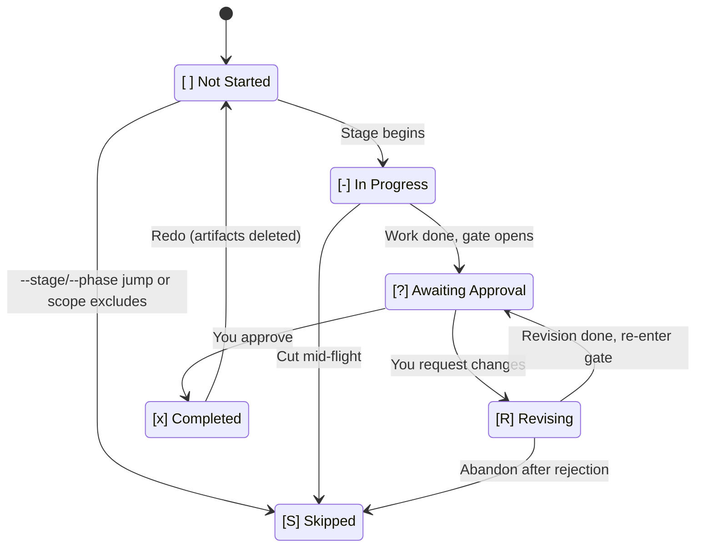
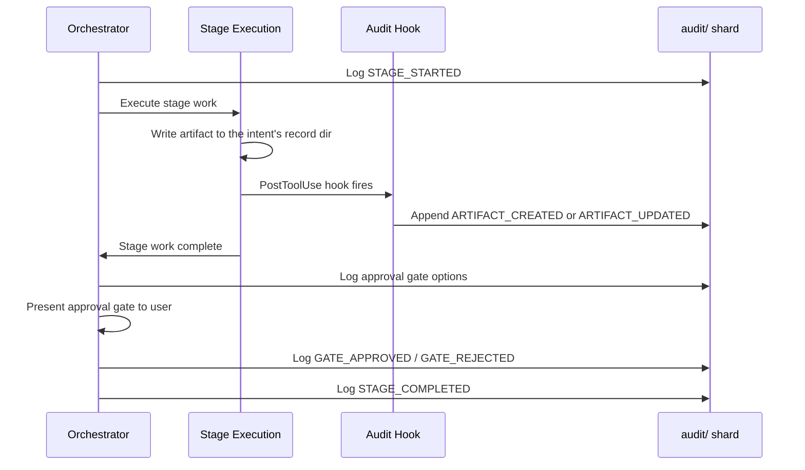

# 状態トラッキングと監査証跡

AI-DLC は、intent から本番までの完全なトレーサビリティを提供する 2 つの永続ファイルを維持します。**状態ファイル**はワークフローのどこにいるかを追跡し、**監査証跡**はその過程のすべての決定・アクション・イベントを記録します。

---

## 状態ファイル (`amadeus-state.md`)

各 intent は `amadeus/spaces/<space>/intents/<YYMMDD>-<label>/amadeus-state.md`(その intent のレコードディレクトリ配下)に専用の状態ファイルを持ちます — これがその intent のワークフロー進捗に関する単一の情報源です。エンジンはセッション開始のたびにアクティブな intent の状態ファイルを読み、何が完了し、何が進行中で、次に何が来るかを判断します。

### 何が含まれるか

| セクション | 目的 |
|---------|------|
| **Project Information** | プロジェクト説明、種別(greenfield/brownfield)、スコープ、開始日、現在のフェーズ、アクティブなエージェント |
| **Scope Configuration** | 実行するステージ、スキップするステージ(理由付き)、深度レベル |
| **Workspace State** | プロジェクトルート、検出された言語、フレームワーク、ビルドシステム |
| **Execution Plan Summary** | 総ステージ数、完了数、進行中のステージ |
| **Runtime State** | 現在のステージのリビジョン数 |
| **Stage Progress** | ステージごとの完了状況を追跡するチェックボックス |
| **Current Status** | ライフサイクルフェーズ、現在/次のステージ、ステータス、最終更新タイムスタンプ |
| **Session Resume Point** | 最後に完了したステージ、次のアクション、保留中の成果物 |

### 6 状態チェックボックス

ステージの進捗は 6 状態のチェックボックス表記を使います。

| チェックボックス | 意味 |
|----------|------|
| `[ ]` | 未着手 |
| `[-]` | 進行中 |
| `[?]` | あなたの承認待ち(ゲートが開いている) |
| `[R]` | 修正中(ゲートを却下したため、ステージが修正されている) |
| `[x]` | 完了 |
| `[S]` | スキップ(スコープで除外、`skip` によるカット、または `--stage`/`--phase` ジャンプによるバイパス) |

正常系ではステージは `[ ]` → `[-]` → `[?]` → `[x]` と遷移します。ゲートで却下すると、ステージは修正中の間 `[R]` へ移り、準備ができると `[?]` に戻り、承認されると最終的に `[x]` になります。`/amadeus --status` はチェックボックスを読んで誰がブロックしているかを教えてくれます — `[?]` なら「\<stage\> の承認待ち」、`[R]` なら「\<stage\> を修正中(3 回中 N 回目)」と表示されます。

正規の状態機械リファレンス(遷移表、監査イベントのエミッター)については、[Developer Reference: State Machine](../reference/12-state-machine.ja.md) を参照してください。

### 状態遷移

<!-- テキストによる代替説明: [ ] 未着手は、ステージが開始すると [-] 進行中へ遷移する。[-] 進行中は、ステージ作業が完了しゲートが開くと [?] 承認待ちへ遷移する。[?] 承認待ちは、承認すると [x] 完了へ、変更を要求すると [R] 修正中へ遷移する。[R] 修正中は、修正が完了すると [?] 承認待ちへ戻る。[ ] 未着手、[-] 進行中、[R] 修正中はいずれも、ジャンプ・スコープ除外・放棄によって [S] スキップへ遷移しうる。[x] 完了は、やり直し時に [ ] 未着手へ戻る(成果物は削除される)。 -->

### 正常・修正・スキップ・やり直し・ジャンプのフロー

- **正常フロー**: `[ ]` -> `[-]` -> `[?]` -> `[x]`(ステージ開始、作業完了、ゲート開放、承認)
- **修正フロー**: `[?]` -> `[R]` -> `[?]` -> `[x]`(却下、ステージ修正、ゲート再開放、承認)
- **スコープスキップフロー**: `[ ]` -> `[S]`(このワークフローのスコープ外のステージ、init 時にマーク)
- **やり直しフロー**: `[x]` または `[-]` -> `[ ]` -> `[-]`(やり直しを要求、成果物が削除され、ステージが再実行)
- **ジャンプフロー**: ステージ A で `[-]`、ステージ B へのジャンプを要求、間のステージは `[S]` にマークされる

---

## 監査証跡 (`audit/`)

監査証跡は intent のレコードディレクトリ配下 `amadeus/spaces/<space>/intents/<YYMMDD>-<label>/audit/` に存在します。これは **クローンごとのシャード**(`<host>-<clone>.md`)として書き込まれる追記専用のイベントログです。各クローンは自分のシャードにのみ追記するため、兄弟 worktree からの同時追記が git 上で衝突することはありません。読み手は `audit/*.md` を glob し、ISO タイムスタンプでマージソートして、決定とイベントの完全な時系列履歴を再構築します。

### 68 イベントのタクソノミー

イベントは 18 のカテゴリに整理されています。

| カテゴリ | 件数 | イベント |
|----------|------:|--------|
| **Workflow Lifecycle** | 4 | `WORKFLOW_STARTED`, `WORKFLOW_COMPLETED`, `WORKFLOW_PARKED`, `WORKFLOW_UNPARKED` |
| **Phase Lifecycle** | 4 | `PHASE_STARTED`, `PHASE_COMPLETED`, `PHASE_VERIFIED`, `PHASE_SKIPPED` |
| **Stage Lifecycle** | 6 | `STAGE_STARTED`, `STAGE_AWAITING_APPROVAL`, `STAGE_REVISING`, `STAGE_COMPLETED`, `STAGE_SKIPPED`, `STAGE_JUMPED` |
| **Session** | 4 | `SESSION_STARTED`, `SESSION_RESUMED`, `SESSION_COMPACTED`, `SESSION_ENDED`(フック発火) |
| **Initialization** | 3 | `WORKSPACE_SCAFFOLDED`, `WORKSPACE_SCANNED`, `WORKSPACE_INITIALISED` |
| **Navigation** | 4 | `SCOPE_CHANGED`, `SCOPE_DETECTED`, `DEPTH_CHANGED`, `TEST_STRATEGY_CHANGED` |
| **Interaction** | 4 | `DECISION_RECORDED`, `GATE_APPROVED`, `GATE_REJECTED`, `QUESTION_ANSWERED` |
| **Artifact** | 3 | `ARTIFACT_CREATED`, `ARTIFACT_UPDATED`(audit-logger フック), `ARTIFACT_REUSED` |
| **Subagent** | 1 | `SUBAGENT_COMPLETED`(log-subagent フック) |
| **Utility** | 1 | `HEALTH_CHECKED` |
| **Error/Recovery** | 2 | `ERROR_LOGGED`, `RECOVERY_COMPLETED` |
| **Construction Bolt** | 4 | `BOLT_STARTED`, `BOLT_COMPLETED`, `BOLT_FAILED`, `AUTONOMY_MODE_SET` |
| **Worktree** | 7 | `WORKTREE_CREATED`, `WORKTREE_MERGED`, `WORKTREE_DISCARDED`, `STATE_FORKED`, `STATE_MERGED`, `AUDIT_FORKED`, `AUDIT_MERGED` |
| **Practices** | 4 | `PRACTICES_DISCOVERED`, `PRACTICES_AFFIRMED`, `PRACTICES_OVERRIDE`, `PRACTICES_SECTION_EMPTY` |
| **Merge Dispatch** | 3 | `MERGE_DISPATCH_INVOKED`, `MERGE_DISPATCH_RETURNED`, `MERGE_DISPATCH_FALLBACK` |
| **Sensors** | 5 | `SENSOR_FIRED`, `SENSOR_PASSED`, `SENSOR_FAILED`, `SENSOR_BUDGET_OVERRIDE`, `GUARDRAIL_LOADED` |
| **Learning Loop** | 3 | `MEMORY_EMPTY`, `RULE_LEARNED`, `SENSOR_PROPOSED` |
| **Swarm** | 6 | `SWARM_STARTED`, `SWARM_UNIT_CONVERGED`, `SWARM_UNIT_FAILED`, `SWARM_BATON_RETURNED`, `SWARM_COMPLETED`, `SWARM_DEGRADED` |

### 何がいつ記録されるか

- **すべてのステージの開始と完了**は `STAGE_STARTED` と `STAGE_COMPLETED` イベントで記録される
- **intent のレコードディレクトリへのすべてのファイル書き込み**(`audit/` シャード自体を除く)は audit-logger フックによって自動的に記録される
- **すべての承認ゲートの決定**(承認、変更要求、現状受け入れ)が記録される
- **あなたが提供したすべての質問への回答**が記録される
- **すべてのサブエージェント完了**が log-subagent フックによって記録される
- **すべてのエラーとリカバリ**が記録される

### 監査ログの読み方

各エントリは以下のフィールドを持つ構造化フォーマットに従います。

- **Timestamp** — ISO 8601 タイムスタンプ
- **Event** — 68 種類のイベントタイプのいずれか
- **Details** — イベント固有のデータ(ステージ名、決定、成果物パスなど)

エントリは時系列で追記されます。特定のステージの履歴を確認するには、その `STAGE_STARTED` と `STAGE_COMPLETED` のエントリ、およびその間のすべてを検索します。

### 監査イベントフロー

ステージが実行され成果物を生成すると、監査証跡は一連のシーケンス全体を記録します。

<!-- テキストによる代替説明: オーケストレーターはこのクローンの audit/ シャードに STAGE_STARTED を記録する。ステージ実行が成果物を書き込む。PostToolUse フックが発火し、ARTIFACT_CREATED または ARTIFACT_UPDATED イベントを追記する。ステージが完了する。オーケストレーターは承認ゲートの選択肢、続いてユーザーの決定、続いて STAGE_COMPLETED を記録する。 -->

---

## 状態と監査がどのように連携するか

状態ファイルと監査証跡は相補的な目的を果たします。

| 観点 | 状態ファイル | 監査証跡 |
|---------|-----------|-------------|
| **目的** | 現在位置と進捗を追跡 | イベントの完全な履歴を記録 |
| **読み手** | オーケストレーター(ルーティングと再開のため) | ユーザーと監査担当者(トレーサビリティのため) |
| **更新パターン** | 状態変化のたびに上書き | 追記専用(変更されない) |
| **セッション再開** | どこから続けるかを判断する主要な情報源 | 元のプロジェクト説明と決定コンテキストを提供 |
| **Git ポリシー** | バージョン管理にコミット | コミット(`audit/` 配下のクローンごとのシャード。マージ衝突なし) |

オーケストレーターはすべてのルーティング決定に `amadeus-state.md` を使います。ルーティングのために `audit/` シャードを読むことはありません。監査証跡は、intent から本番までのすべての決定をたどれるようにするトレーサビリティ記録です。

状態ファイルが破損した場合は、`STAGE_STARTED` と `STAGE_COMPLETED` イベントを確認することで監査証跡から再構築できます。修復手順については [Troubleshooting](15-troubleshooting.ja.md) を参照してください。

---

## 次のステップ

- [Session Management](11-session-management.ja.md) — セッション再開に状態がどう使われるか
- [Artifacts Reference](14-artifacts-reference.ja.md) — intent のレコードディレクトリに何が保存されるか
- [Troubleshooting](15-troubleshooting.ja.md) — 状態破損の修復
- [Glossary](glossary.ja.md) — 状態ファイル、監査証跡、チェックポイント、コンパクションの定義
