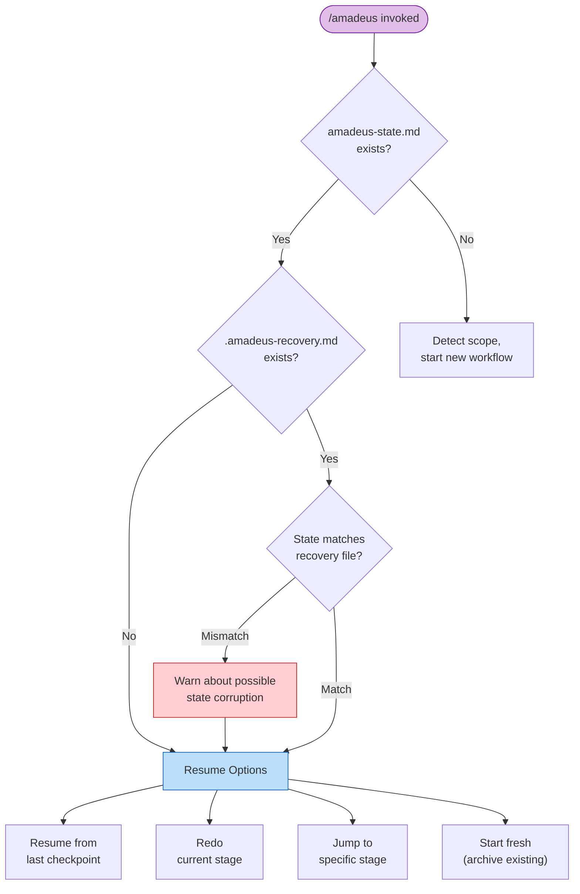

# セッション管理

> 言語: [English](11-session-management.md) | **日本語**

ワークフローは複数のハーネスセッションにまたがることがあります。AI-DLC はすべての進捗をディスクに永続化するため、いつでも再開、やり直し、ジャンプ、あるいは新規開始が可能です。

> **ハーネスに関する注記。** セッション再開はすべてのハーネスで動作します(状態はハーネスではなく
> intent のレコードディレクトリに存在するため)。セッションの*ライフサイクルイベント*は異なります。Claude Code は
> `SESSION_STARTED/RESUMED/ENDED` と `SESSION_COMPACTED` を発火し、Kiro は
> `SESSION_STARTED` のみ、Codex は `SESSION_ENDED` を推論し、コンパクション後の
> ミッション再注入を追加します。[他のハーネスでの実行](harnesses/README.ja.md) を参照してください。
>
> ワークフローを開始したハーネスとは*別のハーネス*で再開することも、同じ理由でサポートされます。
> ただし Kimi はマシンローカルの呼び出し元 carrier を追加で保持しており、この carrier は
> ハーネス跨ぎの引き継ぎで陳腐化しえます。Kimi セッションが「is not the main conductor」で
> コマンドを拒否する場合は、後述の [ハーネス跨ぎの引き継ぎ](#ハーネス跨ぎの引き継ぎ) を参照してください。

---

## 再開フロー

`/amadeus` を実行し、アクティブな intent の `amadeus-state.md`(そのレコードディレクトリ配下)が前回のセッションから存在する場合、AI-DLC はステータスサマリーを提示し、4 つの再開オプションを提供します。


```mermaid
flowchart TD
    START(["/amadeus invoked"])
    STATE_EXISTS{"amadeus-state.md\nexists?"}
    RECOVERY_CHECK{".amadeus-recovery.md\nexists?"}
    CORRUPTION{"State matches\nrecovery file?"}
    WARN["Warn about possible\nstate corruption"]
    RESUME_MENU["Resume Options"]

    OPT_RESUME["Resume from\nlast checkpoint"]
    OPT_REDO["Redo\ncurrent stage"]
    OPT_JUMP["Jump to\nspecific stage"]
    OPT_FRESH["Start fresh\n(archive existing)"]

    SCOPE_DETECT["Detect scope,\nstart new workflow"]

    START --> STATE_EXISTS
    STATE_EXISTS -->|Yes| RECOVERY_CHECK
    STATE_EXISTS -->|No| SCOPE_DETECT

    RECOVERY_CHECK -->|Yes| CORRUPTION
    RECOVERY_CHECK -->|No| RESUME_MENU
    CORRUPTION -->|Mismatch| WARN --> RESUME_MENU
    CORRUPTION -->|Match| RESUME_MENU

    RESUME_MENU --> OPT_RESUME
    RESUME_MENU --> OPT_REDO
    RESUME_MENU --> OPT_JUMP
    RESUME_MENU --> OPT_FRESH

    style START fill:#e1bee7,stroke:#7b1fa2
    style RESUME_MENU fill:#bbdefb,stroke:#1565c0
    style WARN fill:#ffcdd2,stroke:#c62828
```

<!-- テキストによる代替説明: /amadeus が呼び出される。状態ファイルが存在する場合、リカバリファイルの有無を確認する。リカバリファイルが存在し、ステージが状態と一致しない場合、破損の可能性を警告する。その後、4 つの再開オプションを表示する。状態ファイルが存在しない場合、スコープ検出とともに新しいワークフローを開始する。 -->

### 4 つの再開オプション

| オプション | 何が起きるか | 何が保持されるか | 何が失われるか |
|--------|-------------|-------------------|-------------|
| **最後のチェックポイントから再開** | 進行中または次の保留中ステージから続行する。タスクサイドバーは状態ファイルから再構築される。 | すべての成果物、状態、監査証跡 | 前回セッションのインメモリの会話コンテキスト |
| **現在のステージをやり直す** | 現在のステージの成果物ディレクトリを削除し、チェックボックスを `[ ]` にリセットして、最初から再実行する。 | 他のすべての成果物と状態 | 現在のステージの成果物と途中作業 |
| **ステージへジャンプ** | 特定のステージへスキップする。スキップされるステージと下流成果物の無効化の可能性を警告する。 | 既存のすべての成果物 | 現在とターゲットの間のステージは `[S]`(スキップ)にマークされる |
| **新規開始** | アクティブな intent のレコードディレクトリを `amadeus/spaces/<space>/intents/` 配下にアーカイブし(要確認)、新しい intent を生成する。 | 過去のすべての成果物のアーカイブコピー | アクティブなワークフロー状態(新しい intent + 状態ファイルが作成される) |

---

## リカバリのブレッドクラム

Claude Code が会話コンテキストをコンパクトする前に、`validate-state.ts` フックはアクティブな intent のレコードディレクトリに `.amadeus-recovery.md` という隠しリカバリファイルを書き込みます。このファイルには以下が含まれます。

- 最後の検証のタイムスタンプ
- 現在のステージ名(`amadeus-state.md` から抽出)
- 状態ファイルの有効性ステータス

次に `/amadeus` を呼び出すと、AI-DLC は `.amadeus-recovery.md` を `amadeus-state.md` と比較します。「Current stage」フィールドが異なる場合、コンテキストコンパクションによる状態破損の可能性を警告します。

---

## ハーネス跨ぎの引き継ぎ

ワークフロー状態はハーネス非依存です。レコードディレクトリがワークフローのすべてであり、
どのハーネスでも他のハーネスが中断した地点から引き継げます。ただし1つだけ引き継がれないものがあります —
Kimi の**呼び出し元 carrier** です。これは `amadeus/.amadeus-sessions/` 配下の clone ごとのファイル群で、
呼び出し元が周辺の subagent ではなく main conductor であることを証明します。

| ファイル | 役割 |
|------|------|
| `kimi-active-subagents.json` | role marker。どのセッションが main で、どの subagent role がアクティブか |
| `.current-session` | このディレクトリで最後に開始したセッションの、ホストが刻んだ ID |
| `kimi-subagent-transition-deny` / `kimi-session-ended-deny` | subagent 遷移中およびセッション終了後に fail-closed を保つラッチ |

これらは gitignore 対象で、clone ごと(かつ worktree ごと)です。ワークフローがハーネス・マシン・worktree を
またいで移動しても carrier は移動しないため、Kimi セッションは carrier を陳腐化した状態で見つけ、
`unpark` を含むすべての変更系 verb を拒否することがあります。

### 拒否メッセージから原因を読む

拒否メッセージは原因と、それを修復するコマンドを示します。原因は4種類です。

| 原因 | 何が起きたか | 最初の一手 |
|------|---------------|------------|
| `marker-absent` | この project dir 配下に role marker がない — このセッションがここで SessionStart を実行していないか、marker が別のディレクトリ(サブディレクトリや別 worktree)に書かれた | Kimi セッションを再起動する |
| `session-mismatch` | `.current-session` が marker と異なるセッションを指す — 別のハーネスまたは別のセッションが最後にこのワークスペースを取った | Kimi セッションを再起動する |
| `deny-latch` | 遷移ラッチ、セッション終了の tombstone、または残存した marker のロックがまだ存在する | Kimi セッションを再起動する |
| `active-role` | subagent role がまだアクティブとして記録されている | subagent の終了を待つ。待てない場合は role を明示して takeover する |

### 第1層 — セッションを再起動する(推奨)

Kimi を再起動すると `SessionStart` が再発火し、marker を新しいセッションへ再バインドし、
`.current-session` を刻み直し、2種の deny ラッチと残存 marker ロックを retire します。
これにより `marker-absent` / `session-mismatch` / `deny-latch` は手作業なしで解消します。
セッション ID をホスト自身が供給する経路であるため、こちらを優先します。

### 第2層 — 実行中のセッションから引き継ぐ

再起動が常に可能とは限りません。hook が未配線(`SessionStart` がフレームワークへ届かないハーネス)の場合や、
セッションを止められない場合があります。変更系 verb はすべて同じゲートの背後にあるため、
このままでは復帰経路がありません。そこで1つの verb だけが意図的にゲートの外に置かれています。

```bash
bun <harness-dir>/tools/amadeus-state.ts session-takeover --confirm \
  [--confirm-roles "<role>[,<role>]"] [--session-id <id>] [--project-dir <path>]
```

これはバイパスではありません。ゲートが読む carrier を修復するものであり、次の条件を満たす場合に限り実行されます。

- **`--confirm` が渡されていること** — このフラグが人間の承認であり、なければ何も書かずに拒否する
- **人間のターンが裏付けていること** — この clone の台帳上、*最後の takeover より後*に実セッション由来の
  `HUMAN_TURN` が存在する必要がある。したがって1回の承認が認可できる takeover はちょうど1回で、
  連続実行はできない
- **残存 role を明示していること** — subagent role がアクティブなままなら verb は拒否して role 名を表示し、
  残存集合をちょうど名指しした `--confirm-roles "<role>"` を与えたときにのみ続行する
- **束縛先セッションが判ること** — 既定ではホストが刻印した
  `amadeus/.amadeus-sessions/.current-session` へ再バインドする。このファイルが不在または空の場合、
  verb は「no --session-id was given」で拒否するので、`--session-id <id>` で束縛先を明示する

`--project-dir` は修復対象のレコードツリーを指します — 別 worktree で走っていたワークフローを
引き継ぐのはこの経路です。takeover が成功すると、修復した原因を載せた `RECOVERY_COMPLETED` 行が追記されます。
この行はゲート自身が再バインドの成立を確認した後にのみ発行されます。呼び出し元がすでに認可済みの場合、
verb は `taken_over: false` を報告し、何も書きません。

takeover 後は `next` / `report` / `park` / `unpark` が再び通ります。

> かつては `AMADEUS_HARNESS_TYPE` を Kimi 以外の値にするとゲートが沈黙しました。何かを修復するのではなく
> 認可境界そのものを無効化する挙動で、既知のエスケープハッチでした。この抜け道は塞がれています。
> ゲートはハーネスを実プロセス証拠 — インストールされたツール自身のパス、次に判定対象ワークスペースの
> ハーネスディレクトリ — から判定するため、どちらの向きにも環境変数で結論を動かせません。
> 拒否からの復帰手段は SessionStart の再発火と、人が確認する `session-takeover` verb の 2 つだけです。
> この環境変数は intent birth の provenance ラベリングという本来の役割を保ちます。

---

## コンテキストコンパクション

Claude Code はコンテキストウィンドウが一杯になると、それ以前の会話コンテキストを自動的に要約します。これを**コンパクション**と呼びます。この実装には、コンパクションイベントをまたいでワークフロー状態を保護するセーフガードがあります。

### 保持されるものと失われるもの

| 保持される | 失われる |
|-----------|------|
| すべてのレコードディレクトリ成果物(ディスク上のファイル) | インメモリの会話コンテキスト(それまでの議論) |
| `amadeus-state.md`(ステージ進捗、スコープ、プロジェクト情報) | まだファイルに書き込まれていない進行中の途中作業 |
| `audit/` シャード(決定とアクションの完全な履歴) | タスク ID(再開時に状態ファイルから再構築される) |
| `.amadeus-recovery.md`(ステージのチェックポイント) | エージェントのペルソナコンテキスト(エージェントファイルから再ロードされる) |

### コンパクション後のリカバリ方法

1. `/amadeus` を実行する — AI-DLC は状態ファイルを読み、再開オプションを提供する
2. リカバリのブレッドクラムが不一致を警告する場合は、**現在のステージをやり直す**を選び、コンパクション中に進行していたステージを再実行する
3. 警告が出ない場合は、**最後のチェックポイントから再開**を選び、通常どおり続行する

コンパクションは長いセッションの通常の一部です。ディスク上の状態ファイルと成果物により、完了済みの作業が失われることはありません。

---

## ステージジャンプ

ユーティリティコマンドを使って、ワークフロー内を前後にジャンプできます。

### 特定のステージへジャンプ

```
/amadeus --stage code-generation
/amadeus --stage 3.5
```

前方へジャンプする場合、現在位置とターゲットの間のステージは `[S]`(スキップ)にマークされます。オーケストレーターは以下について警告します。

- スキップされるステージ
- 下流ステージが期待するが見つからなくなる成果物
- トレーサビリティへの潜在的な影響

後方へジャンプする場合、ターゲットステージは `[ ]`(未着手)にリセットされ再実行されます。以前に完了した下流ステージは `[x]` のままですが、その成果物は古くなる可能性があります。

### フェーズの先頭へジャンプ

```
/amadeus --phase construction
/amadeus --phase 3
```

これは指定したフェーズの最初のステージへジャンプします。スキップされるステージと成果物の無効化に関する同じ警告が適用されます。

### ジャンプとスコープの組み合わせ

状態ファイルのないプロジェクトでは、`--stage` または `--phase` を `--scope` と組み合わせられます。

```
/amadeus --stage code-generation --scope fix
```

これは指定したスコープで新しいワークフローを作成し、ターゲットステージへ直接ジャンプします。

---

## セッションスキル

3 つの読み取り専用スキルは、現在のワークフローを変更せずにレポートします。それぞれコマンドのように入力でき、`/` スキルピッカーに表示されます。

| スキル | 何をするか | 出力 |
|-------|--------------|--------|
| `/amadeus-session-cost` | 決定論的なコストビューを出力する — 所要時間、ステージの結果、メモリエントリ、センサー発火、記録された学習 | ターミナルのみ |
| `/amadeus-replay` | その場にいなかったステークホルダー向けに、読みやすいセッションのナラティブを描画する — 何がなぜ決定されたか | ターミナルのみ |
| `/amadeus-outcomes-pack` | ワークフローを再実行せずにチームがシステムを所有・継続できるよう、引き継ぎドキュメントを生成する | `OUTCOMES.md` を書き出す |

(4 つ目の読み取り専用セッションスキル `/amadeus-grilling` はワークフローレポートではなく、プランや設計についての単独の grilling インタビューを実行します。[インタラクションモード](07-interaction-modes.ja.md) を参照してください。)

**これらは読み取り専用です。** いずれもワークフローのステージポインタを進めず、監査イベントも発火しないため、途中のどの時点でも — ステージの途中であっても — 安全に実行できます。`/amadeus-session-cost` と `/amadeus-replay` はターミナルに出力し、何も書き込みません。`/amadeus-outcomes-pack` だけがファイル(ワークスペースルートの `OUTCOMES.md`)を書き出します。

**これらがレポートするすべての数値はデータプレーンから直接得られます。** 各スキルは `bun .claude/tools/amadeus-runtime.ts summary --json` — `runtime-graph.json` に対する実体化ビュー — から数値を読み取ります。スキルが見積もったり数え直したりすることはありません。数値の周辺の散文(ナラティブ、決定の根拠)だけが監査証跡と成果物から合成される部分です。トークン見積もりは意図的に存在しません。旧来のファイルサイズからトークンへの経験則は当て推量であり、削除されました。

```
/amadeus-session-cost      # いつでも「今どこにいるか」を素早く把握
/amadeus-replay            # 非同期レビュー向けにセッションをナラティブ化
/amadeus-outcomes-pack     # ワークフロー終了時 — 引き継ぎドキュメントを書き出す
```

各スキルは読み取るためにコンパイル済みの `runtime-graph.json` を必要とします。ワークフローが最初のステージを開始する前に実行すると、短い「まだセッションデータがありません」という注記を表示して停止します。

---

## 次のステップ

- [State Tracking and Audit Trail](10-state-and-audit.ja.md) — 状態ファイルの構造とチェックポイント表記
- [Skills and Runner Commands](17-skills.ja.md) — 読み取り専用セッションビュー(`/amadeus-session-cost`, `/amadeus-replay`, `/amadeus-outcomes-pack`)とランナーファミリー
- [CLI Commands](12-cli-commands.ja.md) — `--stage`、`--phase`、その他フラグの完全なリファレンス
- [Troubleshooting](15-troubleshooting.ja.md) — コンパクションからのリカバリと状態破損
- [Glossary](glossary.ja.md) — コンパクション、リカバリのブレッドクラム、セッションの定義
