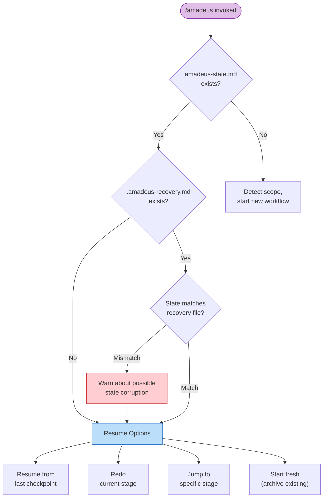

# Session Management

A workflow may span multiple harness sessions. AI-DLC persists all progress to disk so you can resume, redo, jump, or start fresh at any time.

> **Harness note.** Session resume works on every harness (the state lives in
> the intent's record dir, not the harness). Session *lifecycle events* differ: Claude Code
> emits `SESSION_STARTED/RESUMED/ENDED` and `SESSION_COMPACTED`; Kiro emits only
> `SESSION_STARTED`; Codex infers `SESSION_ENDED` and adds a post-compaction
> mission re-inject. See [Running on other harnesses](harnesses/README.md).

---

## Resume Flow

When you run `/amadeus` and the active intent's `amadeus-state.md` (under its record dir) exists from a previous session, AI-DLC presents a status summary and offers four resume options.



<!-- Text fallback: /amadeus invoked. If state file exists, check for recovery file. If recovery file exists and stage doesn't match state, warn about possible corruption. Then show four resume options. If no state file exists, start a new workflow with scope detection. -->

### Four resume options

| Option | What happens | What is preserved | What is lost |
|--------|-------------|-------------------|-------------|
| **Resume from last checkpoint** | Continue from the in-progress or next pending stage. Task sidebar is rebuilt from the state file. | All artifacts, state, audit trail | In-memory conversation context from the prior session |
| **Redo current stage** | Delete the current stage's artifact directory, reset its checkbox to `[ ]`, and re-execute from scratch. | All other artifacts and state | Current stage's artifacts and partial work |
| **Jump to stage** | Skip to a specific stage. Warns about skipped stages and potential downstream artifact invalidation. | All existing artifacts | Stages between current and target are marked `[S]` (skipped) |
| **Start fresh** | Archive the active intent's record dir under `amadeus/spaces/<space>/intents/` (requires your confirmation), then birth a new intent. | Archived copy of all prior artifacts | Active workflow state (a new intent + state file is created) |

---

## Recovery Breadcrumb

Before Claude Code compacts conversation context, the `validate-state.ts` hook writes a hidden recovery file at `.amadeus-recovery.md` in the active intent's record dir. This file contains:

- Timestamp of the last validation
- Current stage name (extracted from `amadeus-state.md`)
- State file validity status

On the next `/amadeus` invocation, AI-DLC compares `.amadeus-recovery.md` against `amadeus-state.md`. If the "Current stage" fields differ, it warns you about possible state corruption from context compaction.

---

## Context Compaction

Claude Code automatically summarizes earlier conversation context when the context window fills up. This is called **compaction**. This implementation has safeguards to preserve workflow state across compaction events.

### What is preserved vs. lost

| Preserved | Lost |
|-----------|------|
| All record-dir artifacts (files on disk) | In-memory conversation context (prior discussion) |
| `amadeus-state.md` (stage progress, scope, project info) | Partial in-progress work not yet written to files |
| `audit/` shards (full history of decisions and actions) | Task IDs (rebuilt from state file on resume) |
| `.amadeus-recovery.md` (stage checkpoint) | Agent persona context (reloaded from agent files) |

### How to recover after compaction

1. Run `/amadeus` — AI-DLC reads the state file and offers resume options
2. If the recovery breadcrumb warns about a mismatch, choose **Redo current stage** to re-execute the stage that was in progress during compaction
3. If no warning appears, choose **Resume from last checkpoint** to continue normally

Compaction is a normal part of long sessions. The state file and artifacts on disk ensure no completed work is lost.

---

## Stage Jumps

You can jump forward or backward in the workflow using utility commands.

### Jump to a specific stage

```
/amadeus --stage code-generation
/amadeus --stage 3.5
```

When jumping forward, stages between the current position and the target are marked `[S]` (skipped). The orchestrator warns you about:

- Stages that will be skipped
- Artifacts that downstream stages may expect but will not find
- Potential impact on traceability

When jumping backward, the target stage is reset to `[ ]` (not started) and re-executed. Previously completed downstream stages remain marked `[x]` but their artifacts may become stale.

### Jump to the start of a phase

```
/amadeus --phase construction
/amadeus --phase 3
```

This jumps to the first stage of the specified phase. The same warnings about skipped stages and artifact invalidation apply.

### Combining jumps with scope

For projects without a state file, you can combine `--stage` or `--phase` with `--scope`:

```
/amadeus --stage code-generation --scope bugfix
```

This creates a new workflow with the specified scope and jumps directly to the target stage.

---

## Session Skills

Three read-only skills report on the current workflow without changing it. Each is typed like a command and appears in the `/` skill picker:

| Skill | What it does | Output |
|-------|--------------|--------|
| `/amadeus-session-cost` | Prints a deterministic cost view — duration, stage outcomes, memory entries, sensor firings, learnings captured | Terminal only |
| `/amadeus-replay` | Renders a readable session narrative for stakeholders who weren't in the room — what was decided and why | Terminal only |
| `/amadeus-outcomes-pack` | Generates a handover document so the team can own and continue the system without re-running the workflow | Writes `OUTCOMES.md` |

(A fourth read-only session skill, `/amadeus-grilling`, is not a workflow report — it runs a standalone grilling interview about a plan or design. See [Interaction Modes](07-interaction-modes.md).)

**They are read-only.** None advances the workflow stage pointer, and none emits an audit event, so they are safe to run at any point — including mid-stage. `/amadeus-session-cost` and `/amadeus-replay` print to the terminal and write nothing; `/amadeus-outcomes-pack` is the only one that writes a file (`OUTCOMES.md` at the workspace root).

**Every number they report comes straight from the data plane.** Each skill reads its figures from `bun .claude/tools/amadeus-runtime.ts summary --json` — the materialised view over `runtime-graph.json`. The skills never estimate or recount; the prose around the numbers (the narrative, the decision rationale) is the only part synthesised from the audit trail and artefacts. There is deliberately no token estimate — the old file-size-to-token heuristic was guesswork and has been removed.

```
/amadeus-session-cost      # quick "where are we" snapshot, any time
/amadeus-replay            # narrate the session for async review
/amadeus-outcomes-pack     # at workflow close — write the handover doc
```

Each skill needs a compiled `runtime-graph.json` to read. If you run one before a workflow has started its first stage, it prints a short "no session data yet" note and stops.

---

## Next Steps

- [State Tracking and Audit Trail](10-state-and-audit.md) — State file structure and checkpoint notation
- [Skills and Runner Commands](17-skills.md) — The read-only session views (`/amadeus-session-cost`, `/amadeus-replay`, `/amadeus-outcomes-pack`) and the runner family
- [CLI Commands](12-cli-commands.md) — Full reference for `--stage`, `--phase`, and other flags
- [Troubleshooting](15-troubleshooting.md) — Compaction recovery and state corruption
- [Glossary](glossary.md) — Definitions for compaction, recovery breadcrumb, session
