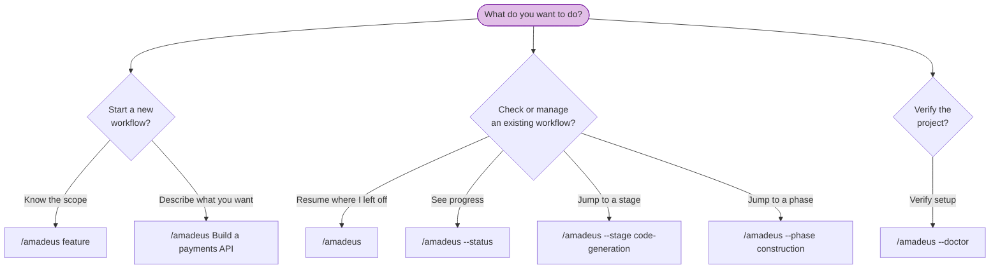

# CLI コマンド

> 言語: [English](12-cli-commands.md) | **日本語**

すべての AI-DLC コマンドはオーケストレーターの呼び出しから始まります。この章は、あらゆる呼び出しパターンとフラグの完全なリファレンスです。

> **呼び出しのプレフィックスはハーネスによって異なります。** Claude Code と Kiro IDE では
> `/amadeus` と入力します。Codex CLI では `$amadeus`(または `/skills` → amadeus)です。以下のフラグと
> 挙動はどちらでも同一で、変わるのはプレフィックスだけです。例では
> `/amadeus` を使います。Codex では `$amadeus` に置き換えてください。[Codex CLI での実行](harnesses/codex-cli.ja.md) を参照してください。

---

## クイックリファレンス

| コマンド | 説明 |
|---------|-------------|
| `/amadeus [scope]` | 明示的なスコープで新しいワークフローを開始 |
| `/amadeus [description]` | 新しいワークフローを開始。スコープは説明から自動検出(豊富/未マッチな散文には compose の提案が出る) |
| `/amadeus compose "<task>"` | 適応的コンポーザーを強制: タスクに合わせた EXECUTE/SKIP プランを提案 |
| `/amadeus compose --report <path>` | スキャンレポートから composer 実行(トリアージ結果をコンパクトな修正・出荷ランに) |
| `/amadeus --new-scope "<task>"` | 既存スコープがマッチしてもカスタムスコープの合成を composer に強制 |
| `/amadeus` | 既存ワークフローを再開(intent が存在する場合)、または最初の intent を生成して新規開始 |
| `/amadeus --status` | 読み取り専用のステータスサマリーを表示 |
| `/amadeus --doctor` | セットアップのヘルスチェックを実行 |
| `/amadeus --migrate [path]` | 本家 v2 ワークスペースをプレビューし、明示承認後に移行 |
| `/amadeus --stage <slug\|#>` | 特定のステージへジャンプ |
| `/amadeus --stage <slug> --single` | ワークフローを進めずに 1 ステージを単独実行 |
| `/amadeus --phase <name\|#>` | フェーズの先頭へジャンプ |
| `/amadeus --scope <name>` | アクティブなスコープを変更 |
| `/amadeus --depth <level>` | 深度レベルを上書き(minimal, standard, comprehensive) |
| `/amadeus --test-strategy <level>` | テスト戦略を上書き(minimal, standard, comprehensive) |
| `/amadeus --version` | フレームワークのバージョンを出力 |
| `/amadeus --help` | 使い方情報を表示 |

---

## コマンド決定木



<!-- テキストによる代替説明: 新しいワークフローの開始: /amadeus feature(既知のスコープ)または /amadeus Build a payments API(自動検出。最初の intent が自動生成される)を使う。既存ワークフローの管理: /amadeus(再開)、/amadeus --status(進捗表示)、/amadeus --stage(ステージへジャンプ)、/amadeus --phase(フェーズへジャンプ)。セットアップ検証: /amadeus --doctor(ヘルスチェック)。 -->

---

## 詳細リファレンス

### `/amadeus [scope]` — 明示的なスコープで開始

9 つの名前付きスコープのいずれかで新しいワークフローを開始します。

**構文:**

```
/amadeus enterprise
/amadeus feature
/amadeus mvp
/amadeus poc
/amadeus bugfix
/amadeus refactor
/amadeus infra
/amadeus security-patch
```

**挙動:** フレームワークはスコープキーワードを認識し、何を作りたいかを尋ね、Initialization フェーズを実行して最初のドメインステージを開始します。状態ファイルが既に存在する場合は、代わりに再開オプションを提供します。

**例:**

```
/amadeus bugfix
> What would you like to fix?
> The login API returns 500 when email contains a plus sign
```

---

### `/amadeus [description]` — 自動検出で開始

作りたいものを説明すると、エンジンが適切なスコープを自動検出します。

**構文:**

```
/amadeus Build a REST API for inventory management
/amadeus Fix the login timeout bug
```

**挙動:** エンジンは説明内のキーワードを分析します(例: "fix" は bugfix を示唆)。明確にマッチした場合は、マッチしたスコープを示す 1 行の確認を尋ねます。豊富または未マッチな散文には、サイレントなデフォルトではなく compose の提案(下記 `/amadeus compose` 参照)が出ます。ワークフローが始まる前に、確認または上書きします。

**例:**

```
/amadeus Fix the null pointer in ProfileSerializer
> Detected scope: bugfix (Minimal depth, Minimal test strategy, 8 stages)
> Approve scope? [Yes / Change scope / Change depth / Change test strategy]
```

---

### `/amadeus compose` — 適応的コンポーザー

既存スコープがマッチする場合でも composer を強制します。3 つの局面で機能します。

```
/amadeus compose "harden the deployment pipeline and add observability"
/amadeus compose --report sonar.json
/amadeus compose            (ワークフロー途中: 保留中のステージを再構成)
```

**挙動:** コンダクターが composer エージェントをディスパッチし、そのエージェントはあなたのタスク(またはスキャンレポート、または実行中ワークフローの状態)を読み、読み取り専用の `detect` スキャンを実行し、すべての SKIP に理由を付けた EXECUTE/SKIP グリッドを提案します。ゲートで承認、編集、または却下します。承認時: 既存スコープにマッチすれば直接生成され、カスタムグリッドは実際のスコープ(インストール済みツリー内の 2 ファイル)としてオーサリングされ、同じターンでそのスコープ上にワークフローが生成されます。進行中の提案は `recompose` 動詞を介して保留中ステージのサフィックスフリップとして反映されます(監査ロック下、strict 検証、`RECOMPOSED` を監査)。`--new-scope` は合成を強制し、`--report <path>` はトリアージ結果を intent にシードします。`/amadeus-compose` スキルは同じ経路への入力可能なショートカットです。ワークフロー途中では、チャットで単にそう言うこともできます(「market research をスキップできますか?」)。コンダクターは再構成リクエストを認識し、同じゲートと動詞を通してルーティングします。文字どおりの `compose` は不要です(Kiro と Codex では、文字どおりの動詞が文書化された信頼できる経路のままです)。

完全なフローについては [スコープと深度 - 適応的コンポーザー](05-scopes-and-depth.ja.md#the-adaptive-composer) を参照してください。

---

### `/amadeus` — 既存ワークフローを再開

状態ファイルが存在する場合、引数なしで実行すると再開します。

**構文:**

```
/amadeus
```

**挙動:** `amadeus-state.md` を読み、`.amadeus-recovery.md` で破損をチェックし、4 つの再開オプションを提示します。チェックポイントから再開、現在のステージをやり直す、ステージへジャンプ、または新規開始。詳細は [Session Management](11-session-management.ja.md) を参照してください。

状態ファイルが存在しない場合、フレームワークはこれを新しいワークフローとして扱い、スコープ/説明を尋ねます。

---

### Initialization — 自動、コマンド不要

スキャフォールドコマンドはありません。出荷される `dist/<harness>/` ワークスペースシェルは
事前ビルド済み(`.claude/` エンジンと `amadeus/spaces/default/memory/`)で到着し、
エンジンは最初の `/amadeus`(または作りたいものを説明したとき)で最初の intent を**自動生成**します。生成は 3 つの Initialization ステージ
(Workspace Scaffold、Workspace Detection、State Init)を単一の決定論的な
ツール呼び出しとして実行します。intent のレコードディレクトリを
`amadeus/spaces/<space>/intents/<YYMMDD>-<label>/` に作成し(`audit/` シャードディレクトリ、
フェーズごとの成果物ディレクトリ、`verification/`)、空の space レベルの
`amadeus/knowledge/` ディレクトリを作成し、ルールベースのワークスペーススキャンを実行し、その
intent の `amadeus-state.md` をスコーププランとともに書き込みます。
init シーケンスイベント(`WORKFLOW_STARTED`、`WORKSPACE_SCAFFOLDED`、
`WORKSPACE_SCANNED`、`WORKSPACE_INITIALISED`、およびステージごとの
`STAGE_STARTED`/`STAGE_COMPLETED`)を記録します。スコープの指定(`/amadeus --scope feature`)は
初期スコープをシードします。指定がなければ `poc` にデフォルトします。最初の実行前にチーム知識
やガードレールを追加するには、出荷される `amadeus/spaces/default/memory/`
ファイルを編集します。space レベルの `amadeus/knowledge/` ディレクトリは最初の intent が存在すると(空で)作成され、そこから自由形式のファイルを追加します。

ウェルカムメッセージは `settings.json` の `companyAnnouncements`
エントリを介してセッション開始時にレンダリングされます。

**マルチリポジトリワークスペース。** ワークスペースルートに複数の兄弟
コードリポジトリ(それぞれ `.git` を持つ直下の子ディレクトリ)がある場合、生成ステップは
intent が扱うリポジトリの集合を `intents.json` の行に記録します。デフォルトでは
すべての兄弟リポジトリを**自動検出**します。intent を特定のサブセットにスコープするには、
生成ツールは `--repos a,b`(リポジトリディレクトリ名のカンマ区切りリスト)を受け付けます。
これらはエンジンがあなたのために実行する決定論的な `amadeus-utility intent-birth` ステップのフラグであり、
あなたが入力する `/amadeus` フラグではありません。Construction 中、各 git
操作(worktree、swarm、Bolt)は 1 つのリポジトリを対象とし、コンダクターは
`--repo <name>` を渡してそれをアンカーします(intent が複数のリポジトリにまたがる場合のみ必須)。記録されたリポジトリのない intent は単一リポジトリのデフォルトです(git はワークスペース/プロジェクトディレクトリで実行)。[Artifacts Reference](14-artifacts-reference.ja.md) を参照してください。

---

### `/amadeus --status` — 読み取り専用ステータス

何も変更せずに現在のワークフロー進捗を表示します。

**構文:**

```
/amadeus --status
```

**挙動:** アクティブな intent の `amadeus-state.md` を読み、以下を表示します。現在のフェーズ、現在のステージ、完了/総ステージ数、スコープ、深度、ステージ進捗リスト。アクティブなワークフローがない場合、進行中のワークフローがないことを報告します。

---

### `/amadeus --migrate [path]` — 本家 v2 ワークスペースを移行

`<project>/aidlc` または明示的に指定したパスに対して、変更を加えない dry-run を
実行します。コンダクターは完全な計画を表示し、番号付き Yes/No ゲートで停止します。
人間が明示的に承認した場合だけ内部 apply コマンドを実行します。この経路は Intent を
作成・再開・進行しません。公開 `--apply` とワークフローフラグとの併用は拒否されます。

自然言語でルーティングするには、`aidlc`／AI-DLC の名前と、移行／変換を表す語の両方が
必要です。自然言語では常に `<project>/aidlc` を使います。別の移行元を選ぶ場合は、明示的な
フラグにパスを渡してください。

前提条件、対応リビジョン、変換内容、復旧方法は
[本家 AI-DLC v2 ワークスペースの移行](18-migrating-upstream-v2.ja.md)を参照してください。

---

### `/amadeus --doctor` — ヘルスチェック

この実装のすべての前提条件、設定、ステージグラフの整合性が揃っていることを検証します。完全にパスすると 0、いずれかが失敗すると 1 で終了します。どちらの場合もフルレポートが stdout に書き出されるため、オーケストレーターはどちらの場合も表示します。`--doctor` は**読み取り専用**です。intent がまだない新しいシェル(`audit/` シャードがない)では何もファイルを作成しないため、最初の intent が生成される前に安全に実行できます。intent が存在すると `HEALTH_CHECKED` 監査行を記録します。

**構文:**

```
/amadeus --doctor
```

**チェック内容:**

| チェック | 検証内容 |
|-------|-------------------|
| Prerequisites | `bun` がインストールされ PATH 上にある |
| Hook presence | `settings.json` が結線するすべてのフック(`hooks` ブロック + `statusLine` コマンド — 11 個すべてのフレームワークフック)が `.claude/hooks/` に存在する。結線されているが欠落しているフックは明確に失敗する。期待されるフックの一覧を `settings.json` から取得するため、そこにフックを追加すると自動でチェックされる |
| Project structure | `.claude/settings.json` が存在する(ファイル存在のみ、内容の検証なし) |
| Workspace shell | `.claude/` + `amadeus/spaces/default/memory/` が存在する(出荷されるシェル) |
| Env scope | `AMADEUS_DEFAULT_SCOPE`(設定されている場合)が有効なスコープを指す |
| Hook heartbeats | `.amadeus-hooks-health/` にフック実行からの最近のタイムスタンプが含まれる |
| State drift | アクティブな intent の `amadeus-state.md` が監査内の最後の `WORKFLOW_COMPLETED` と一致する |
| Cycle detection | `stage-graph.json` にサイクルがない |
| Orphan stage files | グラフ内のすべての slug がディスク上に対応する `<phase>/<slug>.md` を持つ |
| Uncompiled stage files | slug がコンパイル済みグラフにないディスク上のステージ `.md` を表面化する。`amadeus-graph.ts compile` を実行するまで実行されない(アドバイザリ、決して失敗しない) |
| Scope validation | 9 つすべてのスコープ(`.claude/scopes/*.md` から)がクリーンに walk する(スコープ切り詰めギャップのアドバイザリは想定内) |
| Schema validation | すべてのステージの YAML フロントマターが `validateStageFrontmatter` をパスする |
| Graph references | すべての `consumes[].artifact` と `requires_stage[]` のターゲットが解決する |
| Keyword overlap | どのキーワードも複数のスコープに主張されていない |
| Rule drift | populate された org ポリシー見出しと重なるチーム/プロジェクトルール見出しを表面化し、矛盾をレビューできるようにする(アドバイザリ — 決して失敗しない) |
| Paired sensor coverage | ペアのセンサーを指定するすべてのルールが、いずれかのステージが実際に発火するセンサーに解決することを確認する(アドバイザリ — 決して失敗しない) |

**出力例:**

```
✓ bun installed (required for CLI tools and hooks)
✓ amadeus-audit-logger.ts present
✓ amadeus-sync-statusline.ts present
✓ amadeus-validate-state.ts present
✓ amadeus-log-subagent.ts present
✓ amadeus-session-start.ts present
✓ amadeus-session-end.ts present
✓ amadeus-statusline.ts present
✓ settings.json present
✓ AMADEUS_DEFAULT_SCOPE (unset — no project default)
✓ workspace shell ready (.claude/ + amadeus/spaces/default/memory/)
✓ Hook heartbeats: not yet fired (first workflow stage will populate)
✓ State matches last audit event (no drift)
✓ Cycle detection: 0 cycles
✓ Orphan stage files: 32 graph entries all have files
✓ Uncompiled stage files: 0 stage files missing from the compiled graph
✓ Scope validation: 9 scopes valid (29 advisories)
✓ Schema validation: 32/32 stages valid
✓ Graph references: 122 artifacts + edges resolved
✓ Keyword overlap: no conflicts
✓ Rule drift: no team/project rule overlaps org policy
✓ Paired sensor coverage: no sensor-bound rules (0 feedforward-only)
```

---

### `/amadeus --stage <slug|#>` — ステージへジャンプ

slug または番号で特定のステージへ直接ジャンプします。

**構文:**

```
/amadeus --stage code-generation
/amadeus --stage 3.5
/amadeus --stage requirements-analysis
/amadeus --stage 2.3
```

**挙動:** ワークフローがアクティブな場合、ターゲットステージへジャンプします(間のステージを警告付きでスキップ)。ワークフローが存在しない場合は `--scope` と組み合わせられます。

```
/amadeus --stage code-generation --scope bugfix
```

---

### `/amadeus --stage <slug> --single` — 1 ステージを単独実行

`--single` を追加すると、メインワークフローに触れずに単一ステージを単独で実行します。ステージは実行され、成果物を書き込んで停止します。ワークフローの
`Current Stage` は決して進みません — この分離は慣習ではなくエンジンによって
強制されます。フルライフサイクルにコミットせずに、方法論の 1 つの部分(要件
分析、リバースエンジニアリングスキャンなど)を適用するために使います。

```
/amadeus --stage requirements-analysis --single
/amadeus --stage reverse-engineering --single
```

すべての実行可能なステージには、入力可能な 1 単語ランナー — `/amadeus-<slug>`、
`/amadeus --stage <slug> --single` をパッケージ化したもの — も付属します。ランナーファミリー全体(スコープ
ランナー、ステージランナー、`/amadeus-init`、セッションビュー)は
[Skills and Runner Commands](17-skills.ja.md) に文書化されています。

---

### `/amadeus --phase <name|#>` — フェーズへジャンプ

特定のフェーズの最初のステージへジャンプします。

**構文:**

```
/amadeus --phase construction
/amadeus --phase 3
/amadeus --phase ideation
/amadeus --phase 1
```

**挙動:** `--stage` と同じですが、指定したフェーズの最初のステージを対象とします。`--scope` と組み合わせられます。

---

### `/amadeus --scope <name>` — スコープを変更

実行中ワークフローのアクティブなスコープを変更します。

**構文:**

```
/amadeus --scope bugfix
/amadeus --scope enterprise
```

**挙動:** `amadeus-state.md` のスコープ設定を更新し、どのステージを実行しどれをスキップすべきかを再計算し、`SCOPE_CHANGED` 監査イベントを記録します。`--depth` と組み合わせて新しいスコープのデフォルト深度を上書きできます。

まだワークフローのない新しいプロジェクトでは、`--scope <name>` は代わりにワークフローを開始します。`/amadeus <name>` とまったく同じように動作し、ワークスペースが指定したスコープで初期化され、その最初のステージからワークフローが始まります。

---

### `/amadeus --depth <level>` — 深度を上書き

現在または新しいワークフローの深度レベルを上書きします。

**構文:**

```
/amadeus --depth minimal
/amadeus --depth standard
/amadeus --depth comprehensive
```

**挙動:** ワークフローがアクティブな場合、`amadeus-state.md` の Depth フィールドを更新し、`DEPTH_CHANGED` 監査イベントを記録します。`--scope` と組み合わせると新しいスコープのデフォルト深度を上書きします。`--stage` または `--phase` と組み合わせると、ジャンプ先の実行コンテキストの深度を設定します。アクティブなワークフローがない場合はエラーになります。

**有効な値:** `minimal`、`standard`、`comprehensive`(大文字小文字を区別しない)。

**例:**

```
/amadeus --depth minimal                            アクティブなワークフローの深度を変更
/amadeus --scope bugfix --depth comprehensive        包括的な分析を伴う bugfix
/amadeus --stage code-generation --depth minimal     最小限の深度でジャンプ
```

---

### `/amadeus --test-strategy <level>` — テスト戦略を上書き

深度とは独立してテストボリューム戦略を上書きします。

**構文:**

```
/amadeus --test-strategy minimal
/amadeus --test-strategy standard
/amadeus --test-strategy comprehensive
```

**挙動:** 指定しない場合は現在の深度レベルにデフォルトします。ただしスコープが独自のデフォルトを宣言している場合(例: workshop は Minimal にデフォルト)を除きます。独立して設定すると、Standard 深度(フル成果物)と Minimal テスト(Nyquist モデル)のような組み合わせが可能になります。`amadeus-state.md` の `Test Strategy` フィールドを更新し、`TEST_STRATEGY_CHANGED` 監査イベントを記録します。

**有効な値:** `minimal`、`standard`、`comprehensive`(大文字小文字を区別しない)。

**テスト戦略モデル:**
- **Minimal (Nyquist):** 要件あたり 1 テスト、ハッピーパスの下限、ユニットテストのみ(合計 ~5-15)
- **Standard:** コンポーネントあたり 5-8 テスト、ユニット + 統合
- **Comprehensive:** コンポーネントあたり 10-15 テスト、すべてのテストタイプ

各レベルの詳細、デフォルトの挙動、一般的な組み合わせについては [スコープ、深度、テスト戦略](05-scopes-and-depth.ja.md#the-3-test-strategy-levels) を参照してください。

**例:**

```
/amadeus --test-strategy minimal                         アクティブなワークフローの最小テスト
/amadeus --depth standard --test-strategy minimal        フル成果物、最小テスト
/amadeus --scope bugfix --test-strategy comprehensive    徹底的なテストを伴う bugfix
```

---

### `/amadeus --version` — フレームワークバージョン

フレームワークのバージョン(`amadeus <X.Y.Z>`)を出力して終了します。読み取り専用 — ワークフローなしで動作し、再開を促すこともありません。

すべてのインストールには、エンジンディレクトリルートにプレーンテキストの `VERSION` ファイル(例: `.claude/VERSION`)も付属するため、`cat .claude/VERSION` は CLI を実行せずに同じ問いに答えます。

**構文:**

```
/amadeus --version
```

---

### `/amadeus --help` — 使い方情報

利用可能なコマンドとフラグの要約を表示します。

**構文:**

```
/amadeus --help
```

---

## 決定論的 CLI ツール

上記の `/amadeus` フラグに加えて、この実装は 3 つの Bun/TypeScript ツールを出荷しており、ワークフローの実行中にフックが自動的に呼び出します。手動で呼び出すことはめったにありません。これらは、あなたが求めなくても監査証跡、センサー結果、ランタイムグラフを同期させます。ここで文書化するのは、これらが `--doctor` の出力や `audit/` シャードに現れるためであり、またフレームワークが何を見たかを知りたいときに、それぞれが便利なデバッグハンドルになるためです。

いずれも `bun .claude/tools/<tool>.ts <subcommand>` で実行します。

### `amadeus-utility detect` — 読み取り専用のワークスペーススキャン

`bun .claude/tools/amadeus-utility.ts detect --json` はワークスペーススキャン(プロジェクトタイプ、言語、フレームワーク、ビルドシステム)に加えて、解決されたスコープディレクトリとスコープグリッドパスを出力します。純粋な読み取りで、composer は現在のハーネス上でスコープデータがどこにあるかを知るためにこれを実行します。

### `amadeus-utility recompose` — 進行中のプランフリップ

`bun .claude/tools/amadeus-utility.ts recompose --skip <slugs> --add <slugs>`(カンマ区切り)は、ライブの状態ファイル上で、カーソルより先にある PENDING ステージのプランサフィックスをフリップします。監査ロック下で実行し、残りのステージから必要な入力を奪うようなフリップ(および完了/進行中ステージのフリップ、カーソルより後ろのステージ、Construction の最初の EXECUTE ステージ — walking-skeleton アンカー — をどちらの方向にも動かすフリップ、Status が Running でないワークフローに対するあらゆる recompose)を拒否し、派生した状態フィールドを再構築し、`RECOMPOSED` を発火します。通常はワークフロー途中で `/amadeus compose` を介して到達し、直接入力はしません。

### `amadeus-graph validate-grid` — 任意グリッドの依存関係チェック

`bun .claude/tools/amadeus-graph.ts validate-grid --proposal <path> [--strict] [--project-type <t>] [--keywords <csv>]` は任意の `{"<stage>": "EXECUTE"|"SKIP"}` JSON グリッドを検証します。寛容モードは `validate-scope` を反映します(経路外の必須プロデューサーはアドバイザリ)。`--strict` はそれをハード拒否します(recompose の姿勢)。`--keywords` は付与された各キーワードを既存スコープが既に主張しているキーワードと照合します。衝突は既存スコープを名指すハードエラーになります(composer はゲートで付与されたキーワードを書き込む前にこれを実行します)。無効な場合のみ終了コード 1。JSON 結果は stdout に出力されます。

### `amadeus-sensor` — センサーの検査と発火

センサーは、ステージ出力への `Write` または `Edit` のたびに実行される決定論的なチェックです([Rules and the Learning Loop](09-rules-and-the-learning-loop.ja.md) およびリファレンス [Sensor System](../reference/07-sensor-system.ja.md) を参照)。PostToolUse フックがあなたのために発火します。このツールでは、それらを一覧表示、説明、手動発火できます。

| サブコマンド | 何をするか |
|------------|--------------|
| `list` | すべてのフレームワークセンサー(`id`, `kind`, `description`)をアルファベット順に出力 |
| `describe <id>` | 1 つのセンサーの完全なマニフェスト(command、default severity、`matches` glob、timeout)を出力 |
| `fire <id> --stage <slug> --output-path <path>` | ファイルに対してセンサーを実行し、`SENSOR_FIRED` 行とそのペア結果行を発火 |

手動発火は `SENSOR_FIRED` 監査行を発火し、続いて正確に 1 つの終端行(`SENSOR_PASSED`、`SENSOR_FAILED`、または `SENSOR_BUDGET_OVERRIDE`)を発火します。失敗は `<record>/.amadeus-sensors/<stage>/`(intent のレコードディレクトリ内)に詳細ファイルを書き込みます。センサーはアドバイザリです。センサーの失敗はツールの失敗にはならないため、コマンドは 0 で終了します。フレームワークに付属する 4 つのセンサーは `required-sections`、`upstream-coverage`、`linter`、`type-check` です。

```
bun .claude/tools/amadeus-sensor.ts list
bun .claude/tools/amadeus-sensor.ts describe required-sections
bun .claude/tools/amadeus-sensor.ts fire required-sections \
  --stage requirements-analysis \
  --output-path amadeus/spaces/default/intents/<YYMMDD>-<label>/inception/requirements-analysis/requirements.md
```

### `amadeus-learnings` — 学習ゲートツール

これは §13 学習ゲートの決定論的な半分です。ステージが承認された後、オーケストレーターはこれを使って、ステージの `memory.md` 日誌をレビュー可能な学習候補に変え、次にあなたが確認したものを永続化します。通常これを直接呼び出すことはありません — オーケストレーターが `AskUserQuestion` ゲートを挟んで両ステップを駆動します — が、これが発火する監査行を理解できるようここに記載します。

| サブコマンド | 何をするか |
|------------|--------------|
| `surface --slug <stage-slug>` | 承認直後のステージの `memory.md` を読み、構造化された候補(Interpretations、Deviations、Tradeoffs)と保留中のオープンな質問を出力。読み取り専用 |
| `persist --slug <stage-slug> --selections-json <path>` | 確認された学習(確認された学習はプラクティスである)を space メモリレイヤー — `amadeus/spaces/<space>/memory/project.md` / `memory/team.md` — に書き込み(センサーバインドの学習の場合はプロジェクト層センサーをスキャフォールドしてバインド)、`RULE_LEARNED` / `SENSOR_PROPOSED` を発火 |

確認された学習は現在のワークフローではなく、次のワークフローに適用されます。

### `amadeus-runtime` — ランタイムグラフを読む

ランタイムグラフ(intent のレコードディレクトリ内の `runtime-graph.json`)は、このワークフローで実際に起きたことのデータプレーン記録です。どのステージが実行され、各 `memory.md` 日誌がどれだけ埋まり、どのセンサーが発火し、それぞれが何を返したか。構造的な `stage-graph.json` のランタイムミラーです。フレームワークはステージ遷移のたびにこれを再コンパイルします。このツールでは、コンパイルをトリガーしたり 1 ステージの行を読んだりできます。

| サブコマンド | 何をするか |
|------------|--------------|
| `compile` | `audit/` シャードとステージごとの `memory.md` ファイルを walk して `runtime-graph.json` を書き直す。遷移のたびにフックによって自動発火 |
| `read <stage-slug>` | `runtime-graph.json` から 1 ステージの行(タイムスタンプ、エージェント、メモリ内訳、センサー発火、結果)を出力 |
| `summary [--json]` | グラフ全体にわたる決定論的な集計 — ステージ/フェーズ結果の集計、メモリエントリ数、センサー 4 状態の集計、記録された学習、ワークフロー所要時間 — を出力。読み取り専用セッションスキルが読み取るデータソース |

```
bun .claude/tools/amadeus-runtime.ts read requirements-analysis
```

`runtime-graph.json` は gitignore されています。成果物の形状については [Artifacts Reference](14-artifacts-reference.ja.md) を、完全なスキーマについては [Runtime Graph](../reference/13-runtime-graph.ja.md) リファレンス章を参照してください。

### セッションスキル — ワークフローをレポート

3 つの読み取り専用スキルが、`amadeus-runtime summary` がレポートする内容を読みやすい出力に包んで表面化します。コマンドのように入力します。

| スキル | 何をするか |
|-------|--------------|
| `/amadeus-session-cost` | 決定論的なコストビュー(所要時間、ステージの結果、メモリ、センサー、学習)。ターミナルのみ |
| `/amadeus-replay` | 非同期レビュー向けの読みやすいセッションのナラティブ。ターミナルのみ |
| `/amadeus-outcomes-pack` | チーム向けの引き継ぎドキュメント。`OUTCOMES.md` を書き出す |

3 つとも読み取り専用 — ステージ前進なし、監査発火なし — で、すべての数値を `amadeus-runtime summary --json` から取得します。完全なウォークスルーは [Session Management § セッションスキル](11-session-management.ja.md#session-skills) を参照してください。

4 つ目の読み取り専用スキル `/amadeus-grilling <file-or-topic>` は、プランや設計についての一度に 1 問の grilling インタビューを実行します — ワークフローは任意、ターミナルのみ。[インタラクションモード](07-interaction-modes.ja.md) を参照してください。

---

## 環境変数

### `AMADEUS_DEFAULT_SCOPE`

プロジェクトのデフォルトスコープをあらかじめ設定します。ワークフロー初期化時に `.claude/settings.json` の `env` ブロックから読み取られます。

**構文(`.claude/settings.json` 内):**

```json
{
  "env": {
    "AMADEUS_DEFAULT_SCOPE": "workshop"
  }
}
```

**有効な値:** `enterprise`、`feature`、`mvp`、`poc`、`bugfix`、`refactor`、`infra`、`security-patch`、`workshop`。

**優先順位:** 明示的な CLI フラグ > キーワード検出 > `AMADEUS_DEFAULT_SCOPE` > ハードコードされたフォールバック。

**効果の範囲:** ワークフロー初期化時のみ適用されます。intent の `amadeus-state.md` が存在すると、状態ファイルが正となります。完全なウォークスルーは [Customization § プロジェクトごとのデフォルトスコープ](13-customization.ja.md#per-project-default-scope) を参照してください。

---

## 次のステップ

- [Skills and Runner Commands](17-skills.ja.md) — 入力可能な `/amadeus-<scope>` と `/amadeus-<stage>` ランナー、および `--single` の役割
- [Session Management](11-session-management.ja.md) — 再開オプションとステージジャンプの詳細
- [スコープ、深度、テスト戦略](05-scopes-and-depth.ja.md) — スコープ定義、ステージマッピング、テスト戦略レベル
- [Troubleshooting](15-troubleshooting.ja.md) — コマンドが期待どおりに動作しないとき
- [Glossary](glossary.ja.md) — コマンド、ユーティリティコマンド、スコープの定義
