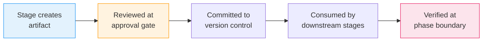

# 成果物リファレンス

すべての AI-DLC ワークフローは、その **intent レコードディレクトリ** —
`amadeus/spaces/<space>/intents/<YYMMDD>-<label>/`(`<space>` は非デフォルトの space が
関与しない限り `default`、`<YYMMDD>-<label>` は intent ディレクトリ。以下 `<record>/` と
表記)配下に成果物を生成します。この章は、ディレクトリ構造、成果物ごとの説明、
ライフサイクル、git ポリシーの完全なリファレンスです。

---

## ディレクトリツリー

```
amadeus/spaces/<space>/intents/<YYMMDD>-<label>/   # intent ごとに 1 つのレコードディレクトリ
  amadeus-state.md                    # ワークフロー状態 (commit)
  audit/                            # 監査証跡 — クローンごとのシャード (commit)
    <host>-<clone>.md               # このクローンのシャード。読み手は glob してタイムスタンプでマージ
  .amadeus-recovery.md                # リカバリのブレッドクラム (gitignore)
  runtime-graph.json                # 実行テレメトリビュー (gitignore)

  verification/                     # フェーズ境界チェック (commit)
    phase-check-initialization.md
    phase-check-ideation.md
    phase-check-inception.md
    phase-check-construction.md
    phase-check-operation.md

  initialization/                   # Phase 0 成果物
    workspace-scaffold/scaffold-report.md
    workspace-detection/workspace-findings.md
    state-init/state-init-summary.md

  ideation/                         # Phase 1 成果物
    intent-capture/
    market-research/                (条件付き)
    feasibility/                    (条件付き)
    scope-definition/
    team-formation/                 (条件付き)
    rough-mockups/                  (条件付き)
    approval-handoff/

  inception/                        # Phase 2 成果物
    reverse-engineering/            (条件付き: brownfield)
    practices-discovery/            (条件付き)
    requirements-analysis/
    user-stories/                   (条件付き)
    refined-mockups/                (条件付き)
    application-design/             (条件付き)
    units-generation/
    delivery-planning/

  construction/                     # Phase 3 成果物
    {unit-name}/                    (作業ユニットごと、繰り返し)
      functional-design/            (条件付き)
      nfr-requirements/             (条件付き)
      nfr-design/                   (条件付き)
      infrastructure-design/        (条件付き)
      code-generation/
    build-and-test/
    ci-pipeline/                    (条件付き)

  operation/                        # Phase 4 成果物
    deployment-pipeline/            (条件付き)
    environment-provisioning/       (条件付き)
    deployment-execution/           (条件付き)
    observability-setup/            (条件付き)
    incident-response/              (条件付き)
    performance-validation/         (条件付き)
    feedback-optimization/          (条件付き)

  archive/                          (オンデマンドで作成)
    {ISO-date}-{stage-name}/
```

**チーム知識はレコードディレクトリにありません。** 1 つ上の space
レベル — `amadeus/spaces/<space>/knowledge/`(`intents/` の兄弟)— に存在するため、1 つの intent の
レコードに閉じ込められるのではなく、space 内のすべての intent にわたって
蓄積されます。エンジンはこれを空で作成します。チームはオプションの `amadeus-shared/`
とエージェントごとのサブディレクトリの下に自由形式のファイルを追加します。
[Knowledge](08-knowledge.md) を参照してください。

**ステージごとのメモリ日誌。** 実行された各ステージは、その成果物のそばにコミットされた
`memory.md` も保持します(例:
`<record>/inception/requirements-analysis/memory.md`)。これはその
ステージの観察日誌です — ステージ開始時にテンプレートから自動作成され、ステージ中に
オーケストレーターによって維持され、承認ゲートで §13
Learnings Ritual によって読まれます。手編集は決してされません。日誌が学習ループにどう
供給されるかについては [Rules and the Learning Loop](09-rules-and-the-learning-loop.md) を
参照してください。

**コードは兄弟リポジトリに存在し、レコードディレクトリにはありません。** `amadeus/` ツリーは
方法、状態、監査、成果物のみを保持します — アプリケーションコードは決して含みません。生成されたコードは
ワークスペースの**コードリポジトリ**に着地します。一般的な単一リポジトリのケースではプロジェクト
ディレクトリ自体、マルチリポジトリワークスペースではワークスペースルートの直下の子である
兄弟リポジトリディレクトリ(それぞれ独自の `.git` を持つ)です。intent は生成時に扱うリポジトリ
を記録します — 自動検出、または `--repos a,b` でスコープ — その
`intents.json` 行(`repos: [...]`)に。Construction は各 git 操作をそれらの 1 つに
アンカーします。記録された `repos` のない intent は単一リポジトリのデフォルトです。
[CLI Commands](12-cli-commands.md) を参照してください。

---

## 成果物のライフサイクル

成果物は、作成から下流ステージによる消費まで予測可能なライフサイクルを流れます。



<!-- テキストによる代替説明: ステージが成果物を作成し、承認ゲートでレビューされ、バージョン管理にコミットされ、下流ステージに消費され、フェーズ境界で検証される。 -->

1. **作成** — リードエージェントがステージ実行中に成果物を生成し、intent のレコードディレクトリの適切なサブディレクトリに書き込む
2. **レビュー** — あなたが承認ゲートで成果物をレビューし、承認または変更要求する
3. **コミット** — 承認後、成果物はバージョン管理の準備が整う(下記の git ポリシー参照)
4. **消費** — 下流ステージが成果物を入力として読む(下記の入力表参照)
5. **検証** — フェーズ境界の検証チェックが、フェーズ内のすべての成果物にわたるトレーサビリティを確認する

---

## フェーズ別の成果物

### Initialization(ステージ 0.1-0.3)

| ステージ | 成果物 | 備考 |
|-------|-----------|-------|
| 0.1 Workspace Scaffold | `scaffold-report.md` | 決定論的(`amadeus-utility init` 内で実行) |
| 0.2 Workspace Detection | `workspace-findings.md`、`amadeus-state.md` を更新 | 決定論的なルールベーススキャナー |
| 0.3 State Init | `state-init-summary.md` | 決定論的 |

ウェルカムメッセージは `settings.json` の `companyAnnouncements` を介してセッション開始時にレンダリングされます — ステージではなく、成果物も生成しません。

### Ideation(ステージ 1.1-1.7)

| ステージ | 主要成果物 | 条件 |
|-------|--------------|-----------|
| 1.1 Intent Capture | `intent-statement.md`, `stakeholder-map.md` | 常時 |
| 1.2 Market Research | `competitive-analysis.md`, `build-vs-buy.md` | 条件付き |
| 1.3 Feasibility | `feasibility-assessment.md`, `constraint-register.md`, `raid-log.md` | 条件付き |
| 1.4 Scope Definition | `scope-document.md`, `intent-backlog.md` | 常時 |
| 1.5 Team Formation | `team-assessment.md`, `mob-composition.md` | 条件付き |
| 1.6 Rough Mockups | `wireframes.md`, `user-flow.md` | 条件付き |
| 1.7 Approval & Handoff | `initiative-brief.md`, `decision-log.md` | 常時 |

### Inception(ステージ 2.1-2.8)

| ステージ | 主要成果物 | 条件 |
|-------|--------------|-----------|
| 2.1 Reverse Engineering | `architecture.md`, `code-structure.md`, `technology-stack.md` を含む 9 ファイル | brownfield のみ |
| 2.2 Practices Discovery | `team-practices.md`, `discovered-rules.md`, `evidence.md`, `practices-discovery-timestamp.md`(affirm 時に space メモリレイヤー — `amadeus/spaces/<space>/memory/team.md` と `memory/project.md` — に昇格) | 条件付き |
| 2.3 Requirements Analysis | `requirements.md` | 常時 |
| 2.4 User Stories | `stories.md`, `personas.md` | ユーザー向け機能 |
| 2.5 Refined Mockups | `mockups.md`, `interaction-spec.md`, `accessibility-checklist.md` | UI プロジェクト |
| 2.6 Application Design | `components.md`, `services.md`, `decisions.md` | 新しいコンポーネントが必要なとき |
| 2.7 Units Generation | `unit-of-work.md`, `unit-of-work-dependency.md`, `unit-of-work-story-map.md` | 常時 |
| 2.8 Delivery Planning | `bolt-plan.md`, `team-allocation.md`, `risk-and-sequencing-rationale.md`, `external-dependency-map.md` | 常時 |

### Construction(ステージ 3.1-3.7)

ステージ 3.1-3.5 は作業ユニットごとに繰り返されます。成果物は `construction/{unit-name}/{stage-name}/` に入ります。ステージ 3.6-3.7 はすべてのユニットの後に一度だけ実行されます。

| ステージ | 主要成果物 | 条件 |
|-------|--------------|-----------|
| 3.1 Functional Design | `business-logic-model.md`, `business-rules.md` | プランごと、ユニットごと |
| 3.2 NFR Requirements | `security-requirements.md`, `performance-requirements.md` | プランごと、ユニットごと |
| 3.3 NFR Design | `security-design.md`, `performance-design.md` | プランごと、ユニットごと |
| 3.4 Infrastructure Design | `deployment-architecture.md`, `infrastructure-services.md` | プランごと、ユニットごと |
| 3.5 Code Generation | `code-generation-plan.md`, `code-summary.md`(コードはワークスペースルートへ) | 常時、ユニットごと |
| 3.6 Build and Test | `build-instructions.md`, `test-results.md` | 常時、すべてのユニットの後 |
| 3.7 CI Pipeline | `ci-config.md`, `quality-gates.md` | 条件付き、すべてのユニットの後 |

### Operation(ステージ 4.1-4.7)

| ステージ | 主要成果物 | 条件 |
|-------|--------------|-----------|
| 4.1 Deployment Pipeline | `cd-config.md`, `deployment-strategy.md`, `rollback-runbook.md` | 条件付き |
| 4.2 Environment Provisioning | `environment-inventory.md`, `validation-report.md` | 条件付き |
| 4.3 Deployment Execution | `deployment-log.md`, `smoke-test-results.md` | 条件付き |
| 4.4 Observability Setup | `dashboards.md`, `alarms.md`, `slo-config.md` | 条件付き |
| 4.5 Incident Response | `runbooks.md`, `incident-plan.md`, `escalation-matrix.md` | 条件付き |
| 4.6 Performance Validation | `load-test-plan.md`, `nfr-validation-matrix.md` | 条件付き |
| 4.7 Feedback & Optimization | `slo-report.md`, `cost-analysis.md`, `feedback-loop.md` | 条件付き |

---

## 質問ファイル

ユーザー入力を収集するすべてのステージは、`{stage-name}-questions.md` という名前の同じ場所にある質問ファイルを生成します。質問は文字付きの選択肢(A-E)に加えて必須の `X. Other (please specify)` オプションを使い、回答を記録するための `[Answer]:` タグを持ちます。

各ステージでの回答方法を選べます。

| モード | 仕組み |
|------|-------------|
| **Guide Me** | インタラクティブなウォークスルー、最大 4 問ずつのバッチ |
| **Grill Me** | 一度に 1 問、深く、推奨回答付き — 共有理解が確認されるまで |
| **I'll Edit the File** | 質問ファイルを直接編集し、完了したら「done」と合図 |
| **Chat** | 自由形式の会話。決定が抽出されファイルに書き込まれる |

ステージの途中でモードを切り替えられます。質問ファイルが常に情報源です。

---

## コミットするものと Gitignore するもの

出荷される `.gitignore` はこの分割をエンコードしています(ビジョン §5.1)。共有作業 —
方法、レジストリ、状態、監査、成果物 — はコミットされ、ユーザーごとのセッション
カーソルとマシンローカルの派生状態は無視されます。

| コミット | Gitignore |
|--------|-----------|
| `amadeus-state.md` | `amadeus/active-space`, `intents/active-intent`(ユーザーごとのカーソル) |
| `audit/*.md`(クローンごとのシャード) | `.amadeus-recovery.md` およびその他の `intents/*/.amadeus-*` / `intents/.amadeus-*`(一時的なブレッドクラム。後者は intent なしのフォールバックルート) |
| すべてのステージ成果物 | `runtime-graph.json`(監査シャードから再導出可能) |
| `verification/` フェーズチェック結果 | `amadeus/.amadeus-clone-id`(このクローンのシャードを命名。マシンローカルのままにする必要がある) |
| space レベルの `amadeus/knowledge/` チーム知識ファイル | `amadeus/.amadeus-sessions/`(会話ごとの session→intent マップ) |
| ステージごとの `memory.md` 日誌。space `memory/` レイヤー | `.amadeus-hooks-health/`, `.amadeus-sensors/`(ハートビート、アドバイザリな発見) |

---

## 入力と依存関係

各ステージは以前のステージの成果物を入力として読みます。主要な依存関係チェーン:

- **Intent Capture** の成果物は Market Research、Feasibility、Scope Definition、Rough Mockups に流れる
- **Requirements Analysis** の成果物は User Stories、Application Design、すべての Construction ステージに流れる
- **Application Design** と **Units Generation** の成果物はすべてのユニットごとの Construction ステージに流れる
- **すべての Construction 成果物**は Build and Test と CI Pipeline に流れる
- **Infrastructure Design** の成果物は Operation ステージに流れる

ステージごとの完全な入力表については、[Orchestration Reference](../reference/00-overview.md) を参照してください。

---

## フェーズ境界検証

各フェーズ遷移で、トレーサビリティを確認する検証チェックが実行されます。

| チェックファイル | 遷移 | 検証内容 |
|-----------|-----------|-------------------|
| `phase-check-initialization.md` | Initialization から Ideation | ワークスペーススキャフォールド、スコーププラン、エージェントの利用可能性 |
| `phase-check-ideation.md` | Ideation から Inception | intent からスコープ、intent バックログへの一貫性 |
| `phase-check-inception.md` | Inception から Construction | 要件からストーリー、アーキテクチャへの整合 |
| `phase-check-construction.md` | Construction から Operation | すべてのユニットのビルドとテスト、CI 設定済み |
| `phase-check-operation.md` | Operation からワークフロー完了 | デプロイ、可観測性、フィードバックループの検証済み |

---

## 次のステップ

- [State Tracking and Audit Trail](10-state-and-audit.md) — 状態ファイルと監査証跡の詳細
- [How a Stage Runs](04-phases-and-stages.md) — ステージ実行と成果物生成
- [Glossary](glossary.md) — 成果物、フェーズ境界検証、質問ファイルの定義
