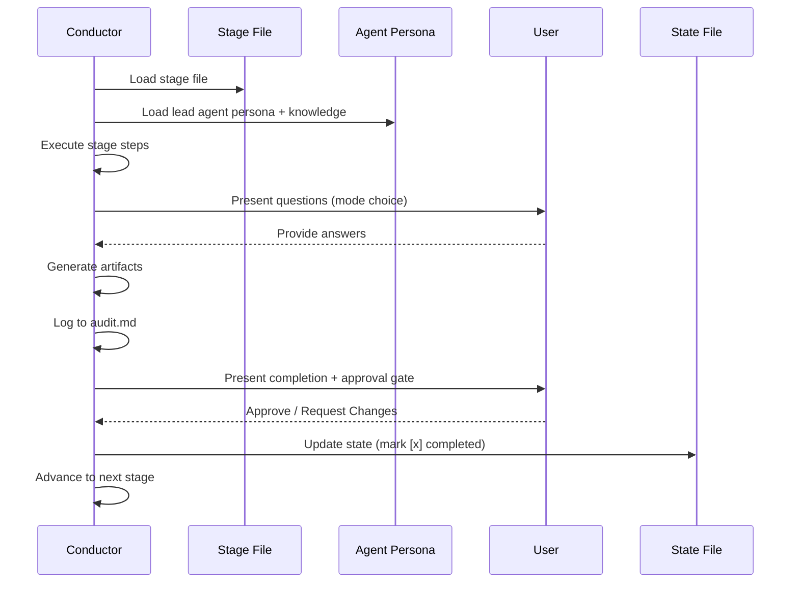
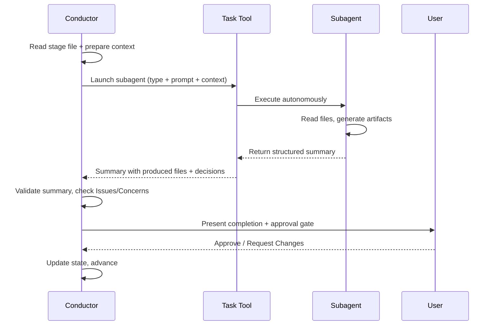

# アーキテクチャ

> **出典**: エンジンとコンダクター(`.claude/tools/amadeus-orchestrate.ts` および `.claude/skills/amadeus/SKILL.md`)と周辺ファイルから導出。

## 概要

AI-DLC はハイブリッド実行モデルを採用します。あるステージはインラインで実行され(コンダクターがエージェントペルソナをロードし、会話内で直接実行する)、別のステージは Claude Code の Task ツールを介してサブエージェントに委譲されます。インラインステージはユーザーインタラクション(質問、明確化、承認)をサポートします。サブエージェントステージは自律的に実行され、構造化されたサマリーを返します。

```mermaid
graph LR
    subgraph INITIALIZATION["INITIALIZATION (0.1-0.3)"]
        Z1["Workspace Scaffold"]
        Z4["State Init"]
        Z1 -.->|"3 stages"| Z4
    end

    subgraph IDEATION["IDEATION (1.1-1.7)"]
        I1["Intent Capture"]
        I7["Approval & Handoff"]
        I1 -.->|"7 stages"| I7
    end

    subgraph INCEPTION["INCEPTION (2.1-2.8)"]
        N1["Reverse Engineering"]
        N7["Delivery Planning"]
        N1 -.->|"8 stages"| N7
    end

    subgraph CONSTRUCTION["CONSTRUCTION (3.1-3.7)"]
        C1["Functional Design"]
        C7["CI Pipeline"]
        C1 -.->|"7 stages per unit"| C7
    end

    subgraph OPERATION["OPERATION (4.1-4.7)"]
        O1["Deployment Pipeline"]
        O7["Feedback & Optimization"]
        O1 -.->|"7 stages"| O7
    end

    Z4 -->|"auto-proceed"| I1
    I7 -->|"Verification Gate 1"| N1
    N7 -->|"Verification Gate 2"| C1
    C7 -->|"Verification Gate 3"| O1
    O7 -.->|"Feedback Loop"| I1

    style INITIALIZATION fill:#f3e5f5,stroke:#9c27b0
    style IDEATION fill:#e8f5e9,stroke:#4caf50
    style INCEPTION fill:#e3f2fd,stroke:#2196f3
    style CONSTRUCTION fill:#fff3e0,stroke:#ff9800
    style OPERATION fill:#fce4ec,stroke:#e91e63
```



## 5つのレイヤー

**Rules**(`rules/`)— 組織およびプロジェクトのガードレール。自己学習型: 人間による修正が永続的な振る舞いのルールになります。合計でわずか約35行 — 非 AI-DLC の会話でのコンテキスト肥大化を避けるため最小限に保たれています。

**Agents**(`agents/*.md`)— 11個のフラットなエージェントファイル。それぞれがドメインエキスパートのペルソナを、ロール、責任、ステージ所有権、コラボレーションパターン、Claude Code ツール、知識のロード順序とともに定義します。すべて `disallowedTools: Task` を持ち — 委譲を行うのはコンダクターだけです。

**Knowledge**(`knowledge/`)— 2層の方法論リファレンス:
- `amadeus-shared/` — 原則、検証、ブラウンフィールドのセーフガード、**監査イベントタクソノミー**(正規のイベントレジストリ)、状態テンプレート
- `amadeus-<agent>-agent/` — エージェントごとの方法論ファイル(アーキテクチャパターン、テスト戦略など)

**Skills**(`skills/amadeus/`)— オーケストレーターのエントリポイント(`SKILL.md`)、ステージプロトコルファイル(`stage-protocol.md`、`stage-protocol-recovery.md`、`stage-protocol-governance.md`)、および5つのフェーズディレクトリにまたがる32個のステージファイル(`stages/initialization/`、`stages/ideation/`、`stages/inception/`、`stages/construction/`、`stages/operation/`)。

**Hooks**(`hooks/`)— 監査発行(Write/Edit 時の PostToolUse)、セッションライフサイクル(SessionStart、SessionEnd)、状態同期(TaskUpdate 時の PostToolUse)、状態検証(PreCompact)、サブエージェント追跡(SubagentStop)、ステータスラインレンダリングのためのフレームワークフック。すべてのフレームワークファイルは `amadeus-*.ts` プレフィックス付き。

## Configuration Layers

> **対象読者**: 新しい関心事(ルール、方法論の一部、センサーバインディング、ドメイン知識事実)がどこに属するかを判断するコントリビューター。
> **信頼できる情報源としての位置づけ**: これがルーティング原則です。コードとこのセクションが食い違う場合、このセクションが優先します。コードの方が誤分類されています。

このリポジトリの設定は、1軸ではなく **2つの直交する軸** に沿って分割されます。

### 軸1 — 誰が作成するか?

- **フレームワーク作成 (Framework-authored)** — AI-DLC 配布物とともに出荷されます。すべてのプロジェクトで同一内容。フレームワークがリリースされると更新されます。ユーザーが自分のワークスペースで編集することはありません。
- **チーム作成 (Team-authored)** — 人間によって(または、このワークスペースで実行されるステージによって作成され、その後人間が承認して)書かれます。このプロジェクト固有。このワークスペースのワークフローをまたいで永続します。編集可能。

### 軸2 — いつ消費されるか?

- **継続的にロードされる(ハーネス設定)** — セッション開始時に読み込まれ、このワークスペースで実行されるすべてのワークフローのすべてのステージで利用可能。`.claude/` の下に存在します。
- **ワークフローごとの成果物** — 特定のステージが出力として生成し、後続のステージが入力として読みます。intent の record dir(`amadeus/spaces/<space>/intents/<YYMMDD>-<label>/`、以下 `<record>/` と表記)の下に存在します。各ワークフロー実行で再生成されます。

### 4つの象限

2つの軸を掛け合わせると4つの象限ができます。3つには内容があり、1つは意図的に空です。

|  | フレームワーク作成 | チーム作成 |
|---|---|---|
| **継続的にロードされる**(ハーネス設定) | `.claude/skills/`、`.claude/agents/`、`.claude/knowledge/`、`amadeus/spaces/<space>/memory/org.md`、`amadeus/spaces/<space>/memory/phases/*.md`、`.claude/scopes/`、`.claude/tools/data/scope-grid.json`、`.claude/tools/data/stage-graph.json` | `amadeus/spaces/<space>/memory/team.md`、`amadeus/spaces/<space>/memory/project.md` |
| **ワークフローごとの成果物** | *(設計上、空)* | `<record>/amadeus-state.md`、`<record>/audit/*.md`(クローンごとのシャード)、`<record>/<phase>/<stage>/*.md`、`.amadeus/worktrees/bolt-*/` |

フレームワークはワークフローごとの成果物を生成しません。なぜなら、そのような出力は配布物とともに出荷しなければならず — それはワークフローごとの出力ではなくフレームワーク作成のハーネス設定になってしまうからです。空のセルはギャップではなく、ルーティングルールの署名です。

> **フレームワーク作成 = 上流から出荷される。あなたのプロジェクトでは不変として扱うこと。** git やファイルシステムがこれを強制するものは何もありません — `.claude/` は編集可能な領域であり、望むなら `org.md` や `phases/*.md` ファイルを編集できます。しかし慣習は次のとおりです: フレームワークのデフォルトを変更するのではなく、`team.md` / `project.md`(右側のセル)でオーバーライドする。これにより、あなたのオーバーライドがレビュー時に可視化され、フレームワークをクリーンにアップグレードでき、同じフレームワークバージョンを共有するプロジェクト間のドリフトを防ぎます。

### 新しい関心事を配置するための境界テスト

新しい関心事が来たとき、2つの質問がその行き先を決めます:

1. **すべてのプロジェクトで同一内容か、プロジェクト固有か?** フレームワーク作成 vs チーム作成。
2. **毎セッション、エージェントコンテキストにロードされるか、特定のステージだけが読むか?** ハーネス設定 vs ワークフローごとの成果物。

具体例:

- *「私たちは常に main へスカッシュマージする」* — プロジェクト固有(他のチームはリベースを使う)かつ継続的にロードされる(コンダクターがすべての Bolt マージで読む)。行き先は `amadeus/spaces/<space>/memory/team.md`。
- *「サービス層では ALWAYS Result<T,E> を使う。NEVER throw する」* — プロジェクト固有かつ継続的にロードされる(エージェントがすべてのコード生成で読む)。行き先は `amadeus/spaces/<space>/memory/project.md`。
- *「トランクベース開発が推奨されるブランチ戦略である」* — すべてのプロジェクトで同一(フレームワークの意見)かつ継続的にロードされる(delivery-planning で読まれる)。行き先は `amadeus/spaces/<space>/memory/org.md`。
- *「5つの一般的なブランチ戦略とそのトレードオフ」* — すべてのプロジェクトで同一(フレームワークのリファレンス)かつ継続的にロードされる(amadeus-pipeline-deploy-agent がブランチ戦略を発見するときに読む)。行き先は `.claude/knowledge/amadeus-pipeline-deploy-agent/branching-strategies.md`。
- *「今回の実行の要件分析」* — プロジェクト固有かつワークフローごと(各実行が新しい分析を生成する)。行き先は `<record>/inception/requirements-analysis/`。
- *「Construction 途中の Bolt-1 の worktree 状態」* — プロジェクト固有かつワークフローごと(各 Bolt で再生成される)。行き先は Bolt worktree 内の record dir のコピー、`.amadeus/worktrees/bolt-1/<record>/amadeus-state.md`。

### ハーネス設定のサブカテゴリ(上段)

上段は **コンテンツの形式** によってさらに分割されます:

- **フレームワークのハーネス機構** → frontmatter / JSON。ワークフローの順序、ステージ定義、成果物生成、ゲートのセマンティクス。ツールが決定論的に読みます。`.claude/skills/`、`.claude/tools/data/` に存在します。
- **フレームワークのドメインリファレンス** → `.claude/knowledge/amadeus-<agent>-agent/` の下のエージェント KB 散文。あるドメインの選択肢メニュー(5つのブランチ戦略、デプロイパターン、テスト方法論)。所有するエージェントがメニューを必要とするときに読みます。
- **フレームワークの方法論デフォルト** → `amadeus/spaces/<space>/memory/org.md` の散文。チームが別途承認するまでフレームワークが推奨するもの。チームの声で書かれます(チームがオーバーライドしなければ、org デフォルトが *即* チームの声になるため)。
- **チームのプラクティス** → `amadeus/spaces/<space>/memory/team.md` の散文。チームの選択 — 「私たちはこう働く」 — で、practices-discovery の承認ゲートで記入されます。意思決定ポイントでエージェントが読みます(delivery-planning がブランチ戦略を読む。コンダクターが `SKILL.md` で walking-skeleton の姿勢を読む)。
- **プロジェクトのオーバーライド** → `amadeus/spaces/<space>/memory/project.md` の散文。チームおよび org のデフォルトをオーバーライドするプロジェクト固有の修正。これも practices-discovery の承認ゲートで記入されます。
- **ガードレール**(`## Forbidden`、`## Mandated`、`## Corrections` セクション)— `org.md`、`team.md`、`project.md` に存在します。エージェント向けの是正ルール — `ALWAYS X`、`NEVER Y`。継続的にエージェントコンテキストにロードされます。

### `.claude/` に直接置くべきでないもの

設定のように見えるが違う2つのケース:

- **ワークフローごとの分析出力。** reverse-engineering の9個のブラウンフィールド成果物(`code-structure.md`、`architecture.md` など)は *今回の* 実行のコードベーススキャンを記述します。これらは `.claude/` ではなく `<record>/inception/reverse-engineering/` に存在します。各ワークフローで再実行されます。
- **実行状態。** `amadeus-state.md` ファイルはワークフローごとの「今の真実」です。`.claude/` ではなく intent の record dir に属します。`audit/` シャードも同様です。

### 行をまたぐ昇格 — practices-discovery の例外

ほとんどのステージは1つの行に書きます。いくつかのステージは両方に書きますが、行をまたぐ書き込みはチームの承認でゲートされます。**practices-discovery(Inception 2.2)は、これを行う唯一のステージです。** その出力は:

- `<record>/inception/practices-discovery/team-practices.md` — ワークフローごとの監査証跡(下段)。
- 承認時、内容が space メモリ層へコピーされます — `amadeus/spaces/<space>/memory/team.md` AND `memory/project.md` — チーム作成のハーネス設定(右上のセル)。

監査証跡のコピーは今回の実行で何が承認されたかを証明します。`.claude/` のコピーは、今後すべてのワークフローがロードするチームの恒常的な設定になります。

このパターン(scan → draft → affirm → publish)は reverse-engineering の構造と一致します。違いは *帰結* です: reverse-engineering の承認は「このスキャンは正確だ」を意味するだけですが、practices-discovery の承認は「フレームワークはこれらの言葉を我々の恒常的な設定に書き込み、今後すべてのワークフローでロードしてよい」を意味します。

承認ゲートがなければ、フレームワークはチームの口に言葉を入れることになり — さらに悪いことに、その言葉はワークフローをまたいで永続します。ゲートがあれば、常にチームがそれを書いたことになります。

このパターンは稀であり、意図的であるべきです。次の3つがすべて真である場合にのみ使用してください:
1. ステージの出力が、チーム、プロジェクト、またはワークスペースに関する構成的な真実である。
2. その真実が、今回の下流ステージだけでなく、今後すべてのワークフロー実行に影響すべきである。
3. チームがその真実を作成する意思がある — ゲートでレビューし承認する、単にフレームワークに書かせるのではなく。

3つのいずれかが偽なら、デフォルトでワークフローごとのみにしてください。

### 相互参照

- [Agent System](05-agent-system.md) — エージェントファイル構造(左上セルの機構)。
- [Knowledge System](10-knowledge-system.md) — `knowledge/` の2層構造。
- [Stage Definition](15-stage-definition.md) — ステージフロントマター仕様(ハーネス機構のフォーマット)。
- [Stage Protocol](04-stage-protocol.md) — ステージごとの実行ルール。

## 実行モデル

**インラインステージ** — コンダクターはリードエージェントのフラットファイル(例 `agents/amadeus-architect-agent.md`)と `knowledge/[agent]/` の知識をペルソナのフレーミングのために読み、その後ステージを会話内で直接実行します。これによりリアルタイムのユーザーインタラクションが可能になります: 質問、曖昧さの解決、承認前の成果物の反復。

ほとんどのステージはインライン実行を使います。これには、3つの Initialization ステージすべて(Workspace Scaffold、Workspace Detection、State Init — すべて `amadeus-utility init` の内部で決定論的に実行される)、すべての Ideation ステージ(Intent Capture、Market Research、Feasibility、Scope Definition、Team Formation、Rough Mockups、Approval & Handoff)、ほとんどの Inception ステージ(Practices Discovery、Requirements Analysis、User Stories、Refined Mockups、Application Design、Units Generation、Delivery Planning)、ほとんどの Construction ステージ(Functional Design、NFR Requirements、NFR Design、Infrastructure Design、Build and Test、CI Pipeline)、およびすべての Operation ステージが含まれます。注: Build and Test(3.6)はユニットごとではなく、すべてのユニット完了後に一度実行されます。

**サブエージェントステージ** — コンダクターはコンテキスト(以前の成果物、プロジェクト説明、ワークスペースの発見事項)を準備し、Claude Code の Task ツールのサブエージェントへ委譲します。サブエージェントは自律的に実行し、構造化されたサマリーを返します。これは、実行中のユーザーインタラクションなしで集中した独立作業から利益を得るステージに使われます。サブエージェント呼び出しが失敗した場合、コンダクターはコンテキストを削減したプロンプトで一度リトライし、その後ユーザーにインライン実行またはスキップして後で再訪するというフォールバックオプションを提示します。

サブエージェント実行を使うステージ: Reverse Engineering(2.1、2ステップ委譲 — コードスキャンに amadeus-developer-agent、その後合成に amadeus-architect-agent)および Code Generation(3.5、amadeus-developer-agent サブエージェント)。Workspace Detection(0.2)はサブエージェントとしてではなく、`amadeus-utility init` 内部で決定論的にインライン実行されます。

```mermaid
flowchart LR
    subgraph INLINE["Mode 1: Inline"]
        direction TB
        IN1["Conductor reads\nstage file"]
        IN2["Load agent persona\n+ knowledge"]
        IN3["Execute stage steps\ndirectly in conversation"]
        IN4["User interaction\navailable"]
        IN5["Approval gate\n(AskUserQuestion)"]
        IN1 --> IN2 --> IN3 --> IN4 --> IN5
    end

    subgraph SUBAGENT["Mode 2: Subagent (simple)"]
        direction TB
        SA1["Conductor reads\nstage file"]
        SA2["Prepare context:\nartifacts + persona"]
        SA3["Task tool call\n(subagent_type specified)"]
        SA4["Subagent executes\n(no user interaction)"]
        SA5["Return structured\nsummary to conductor"]
        SA6["Conductor presents\ncompletion + approval"]
        SA1 --> SA2 --> SA3 --> SA4 --> SA5 --> SA6
    end

    subgraph TWOSTEP["Mode 3: Subagent (two-step RE)"]
        direction TB
        TS1["Conductor reads\nRE stage file"]
        TS2["Task: amadeus-developer-agent\ncode scan"]
        TS3["Developer returns\nscan results"]
        TS4["Task: amadeus-architect-agent\nsynthesis"]
        TS5["Architect produces\n9 artifacts"]
        TS6["Conductor presents\ncompletion + approval"]
        TS1 --> TS2 --> TS3 --> TS4 --> TS5 --> TS6
    end

    style INLINE fill:#e8f5e9,stroke:#4caf50
    style SUBAGENT fill:#e3f2fd,stroke:#2196f3
    style TWOSTEP fill:#fff3e0,stroke:#ff9800
```



### コンダクターのインラインステージ実行



### コンダクターのサブエージェント委譲



## ソース vs 配布物(1つの core、多数のハーネス)

フレームワークは **一度だけ作成され、ハーネスごとに生成されます** — 現在は Claude Code、Kiro CLI、Codex CLI、そして移植先となる任意の高機能 CLI。手作業で作成するソースは、ハーネス中立の `core/` に加え、CLI ごとの薄い `harness/<name>/` サーフェスです。`bun scripts/package.ts` は、コミット済みでドリフトガードされた `dist/<harness>/` ツリーを再生成します:

```
core/                  # hand-authored, harness-neutral (tools, amadeus-common,
                       #   agents, rules, scopes, sensors, knowledge, hooks,
                       #   4 session skills); prose uses the {{HARNESS_DIR}} token
harness/<name>/        # per-CLI surface: manifest.ts + orchestrator skill +
                       #   harness files (+ emit.ts for codex)
scripts/package.ts     # the build: copy core (token→.claude/.kiro/.codex) +
                       #   harness, compile the graph, generate runners, emit;
                       #   `--check` is the byte-parity drift guard
dist/<harness>/        # GENERATED + committed: claude/.claude, kiro/.kiro,
                       #   codex/{.codex,.agents} — never hand-edited
```

`core/` の `.ts` は変換なしでバイトコピーされます。ランタイムの `harnessDir()` シーム(`core/tools/amadeus-lib.ts`)は、実行時に出荷レイアウトからハーネスディレクトリを導出します — ハードコードされたリストではなく、ツール自身のパスからのオープンセットなので、新しいハーネスにここでの編集は不要です — そしてその rules-dir リネームは、`rulesSubdir()` シームが読む、生成された `tools/data/harness.json` にツリーごとに出荷されます。1セットのツールソースがすべてのハーネスで実行されます。[Porting to a New Harness](../harness-engineering/09-porting-to-a-new-harness.md) を参照。

## ディレクトリ構造

出荷される Claude 配布物(`dist/claude/.claude/`、`core/` + `harness/claude/` からバイト単位で再生成):

```
dist/claude/.claude/
+-- VERSION                       # plain-text framework version marker, emitted from core/tools/amadeus-version.ts
+-- CLAUDE.md
+-- settings.json
+-- hooks/
|   +-- amadeus-audit-logger.ts
|   +-- amadeus-sync-statusline.ts
|   +-- amadeus-validate-state.ts
|   +-- amadeus-log-subagent.ts
|   +-- amadeus-session-start.ts
|   +-- amadeus-session-end.ts
|   +-- amadeus-statusline.ts
+-- rules/
|   +-- amadeus.md                # @-import stub -> ../../amadeus/spaces/<space>/memory/ (NOT a copy; re-pointed in place on `space` switch)
+-- agents/
|   +-- amadeus-product-agent.md
|   +-- amadeus-design-agent.md
|   +-- amadeus-delivery-agent.md
|   +-- amadeus-architect-agent.md
|   +-- amadeus-aws-platform-agent.md
|   +-- amadeus-compliance-agent.md
|   +-- amadeus-devsecops-agent.md
|   +-- amadeus-developer-agent.md
|   +-- amadeus-quality-agent.md
|   +-- amadeus-pipeline-deploy-agent.md
|   +-- amadeus-operations-agent.md
+-- knowledge/
|   +-- amadeus-shared/
|   |   +-- ai-dlc-principles.md
|   |   +-- verification.md
|   |   +-- brownfield.md
|   |   +-- audit-format.md
|   |   +-- state-template.md
|   |   +-- knowledge-readme-template.md
|   +-- amadeus-product-agent/
|   |   +-- requirements-guide.md
|   |   +-- product-guide.md
|   |   +-- functional-design-guide.md
|   |   +-- requirements-elicitation.md
|   |   +-- prioritization-frameworks.md
|   |   +-- user-story-patterns.md
|   |   +-- market-research-methods.md
|   +-- amadeus-architect-agent/
|   |   +-- architecture-guide.md
|   |   +-- nfr-design-guide.md
|   |   +-- ddd-patterns.md
|   |   +-- architecture-patterns.md
|   |   +-- nfr-design-patterns.md
|   |   +-- adr-template.md
|   +-- amadeus-developer-agent/
|   |   +-- code-analysis-guide.md
|   |   +-- code-generation-guide.md
|   |   +-- code-generation-patterns.md
|   |   +-- api-design-guide.md
|   |   +-- data-modelling-patterns.md
|   |   +-- re-artifacts.md
|   +-- [... 8 more agent knowledge dirs]
+-- skills/
    +-- amadeus/
        +-- SKILL.md
        +-- stage-protocol.md
        +-- stage-protocol-recovery.md
        +-- stage-protocol-governance.md
        +-- stages/
            +-- initialization/
            |   +-- workspace-scaffold.md
            |   +-- workspace-detection.md
            |   +-- state-init.md
            +-- ideation/
            |   +-- intent-capture.md
            |   +-- market-research.md
            |   +-- feasibility.md
            |   +-- scope-definition.md
            |   +-- team-formation.md
            |   +-- rough-mockups.md
            |   +-- approval-handoff.md
            +-- inception/
            |   +-- reverse-engineering.md
            |   +-- practices-discovery.md
            |   +-- requirements-analysis.md
            |   +-- user-stories.md
            |   +-- refined-mockups.md
            |   +-- application-design.md
            |   +-- units-generation.md
            |   +-- delivery-planning.md
            +-- construction/
            |   +-- functional-design.md
            |   +-- nfr-requirements.md
            |   +-- nfr-design.md
            |   +-- infrastructure-design.md
            |   +-- code-generation.md
            |   +-- build-and-test.md
            |   +-- ci-pipeline.md
            +-- operation/
                +-- deployment-pipeline.md
                +-- environment-provisioning.md
                +-- deployment-execution.md
                +-- observability-setup.md
                +-- incident-response.md
                +-- performance-validation.md
                +-- feedback-optimization.md
```

### ワークスペース: spaces と intents

上のツリーは **エンジン** — ハーネス固有で、ユーザーが閲覧することはありません。エンジンが *ランタイムで読み書きする* すべては、プロジェクトルートの別の中立な `amadeus/` ディレクトリに存在し、2階層のコンテナとして構成されます: **space → intent**。(エンドユーザー向けの説明はユーザーガイドの [Spaces and Intents](../guide/03-spaces-and-intents.md) を参照。このセクションはエンジンが解決するデータモデルです。)

```
amadeus/                                    # neutral, harness-independent, committed to git
+-- active-space                          # cursor: active space name (gitignored, per-user)
+-- spaces/
    +-- default/                          # one space per team; "default" is auto-resolved
        +-- memory/                        # the method — org.md/team.md/project.md, phases/, templates/
        +-- knowledge/                     # space-level domain knowledge (free-form)
        +-- codekb/<repo>/                 # per-repo code knowledge base
        +-- intents/
            +-- active-intent              # cursor: active intent record dir (gitignored, per-user)
            +-- intents.json               # the registry: [{ uuid, slug, dirName, scope, repos, status }]
            +-- <YYMMDD>-<label>/          # one record dir per intent (date-prefixed, short kebab label; UUIDv7 carries identity in intents.json)
                +-- amadeus-state.md          # per-intent workflow state
                +-- audit/<host>-<clone>.md # per-clone audit shards (glob-and-merge by timestamp)
                +-- <phase>/<stage>/*.md    # artifacts + the per-stage memory.md diary
```

**解決 (Resolution)。** 2つのユーザーごとのカーソルがコンテキストを選択します。どちらもエラーになりません(カーソルが欠けている場合はデフォルトにフォールバック):

- **Space** — `amadeus/active-space`、優先順位 `explicit arg > cursor > "default"`(`DEFAULT_SPACE`、`core/tools/amadeus-lib.ts:285`。リゾルバ `activeSpace()`、`amadeus-lib.ts:354-366`)。`listSpaces()` はディスク上に何もなくても常に `default` を報告します(`amadeus-lib.ts:713-728`)。
- **Intent** — `amadeus/spaces/<space>/intents/active-intent`、優先順位 `explicit arg > cursor(amadeus-state.md を保持する実在の record を指す場合)> lone-intent > null`(`activeIntent`、`amadeus-lib.ts:411-435`)。`null` の intent は「まだ record がない」を意味し — オーケストレーターが最初の intent を自動誕生させるために使うシグナルです。

パスヘルパー — `intentsDir`、`knowledgeDir`、`codekbDir`(`amadeus-lib.ts`)、および `memoryDirFor`(`amadeus-graph.ts:234`)— はすべて space 引数を `activeSpace(projectDir)` にデフォルトするので、AI-DLC 自身のリゾルバはカーソルに従います。`/amadeus space <name>` で space を切り替えると、各ハーネスネイティブのルールインクルード(上述の Claude `@`-import スタブ、Kiro の resources glob、Codex の rules dir)も、切り替え先の space の `memory/` に再ポイントされます。`default` では、この再ポイントはバイト単位で同一の no-op なので、単一チームのコミット済みツリーは一切変化しません。

**コミット対象 vs gitignore 対象。** `amadeus/` はチームが作業を共有できるようにチェックインされます。分割(`harness/claude/dot-gitignore:34-54`): 2つのカーソル(`active-space`、`active-intent`)、クローンごとのランタイム(`.amadeus-clone-id`、`.amadeus-sessions/`)、および派生状態(`runtime-graph.json`、record 下の `.amadeus-*`)は **gitignore 対象** です。メソッド(`memory/**`)、知識(`knowledge/**`、`codekb/**`)、`intents.json` レジストリ、各 record の `amadeus-state.md`、`audit/` シャード、成果物は **コミット対象** です。監査はクローンごとのシャード(`audit/<host>-<clone>.md`)としてコミットされます。これは、git が並行 append をマージする必要が決してないようにするためで — 意図的に `merge=union` 属性はありません。

## 主要な設計上の決定

1. **ハイブリッド実行モデル(インライン + サブエージェント)** — ユーザーインタラクション(質問、明確化、承認の反復)を要するステージは、コンダクターが直接会話にアクセスできるインラインで実行されます。集中した自律作業(コードスキャン、コード生成)を行うステージはサブエージェントに委譲されます。純粋なサブエージェントモデルはステージ途中のユーザーインタラクションを妨げ、純粋なインラインモデルは集中したエージェント特化の恩恵を受けられません。

2. **インラインステージのエージェントペルソナ** — インラインステージでは、コンダクターはサブエージェントに委譲するのではなく、エージェントのフラットファイルをコンテキストとしてロードし、その視点をフレーミングします。これにより、サブエージェントのコンテキスト転送のコストとユーザーインタラクションの喪失なしに、ドメインエキスパートのフレーミングの恩恵(Application Design 中はコンダクターがアーキテクトのように考える)が得られます。

3. **2ステップの Reverse Engineering** — Reverse Engineering はコードスキャンに developer サブエージェントを使い、その後合成に architect サブエージェントを使います。これは、Claude Code ではサブエージェントがサブエージェントを起動できないため必要です。コンダクターが橋渡し役となり、developer のコードスキャン結果を architect へ渡し、一貫したアーキテクチャモデルへ合成させます。

4. **amadeus-state.md による状態追跡** — 単一の markdown 状態ファイルが、ステージ完了、現在の状況、ワークスペースコンテキスト、スコープ設定、実行計画、ランタイム状態(リビジョンカウント)を追跡します。ステージプロトコルが更新パターンを一度定義し、各ステージが最終ステップとしてそれを更新します。PostToolUse フックが各書き込み後に状態ファイルの構造を検証します。ステージレベルのタスク ID は、状態ファイルに保存されるのではなく、ランタイムで `TaskList` を介して(「Inception - Requirements Analysis」のような subject でマッチング)解決されます — これは実際のタスクシステムの状態を反映するため、コンテキスト圧縮後もよりロバストです。

5. **共有契約としてのステージプロトコル** — 32ステージすべてが `stage-protocol.md` に従います。承認ゲート、質問フォーマット(4モード: Guide Me / Grill Me / Edit File / Chat)、完了メッセージ、状態追跡、エラーリカバリ、変更処理、§13 Learnings Ritual、フェーズ境界検証。これにより、各ステージファイルに指示を繰り返すことなく、すべてのステージで一貫した振る舞いが保証されます。

6. **2層の知識アーキテクチャ** — 方法論の知識はフレームワークとともに `knowledge/` に出荷されます(共有原則 + エージェントごとの方法論)。ユーザー管理のチーム知識は space レベルの `amadeus/knowledge/`(space の `intents/` の兄弟)に存在し、エンジンが空で作成し、チームが記入します。これにより、フレームワークのアップグレードとチームのカスタマイズが分離されます。

7. **フラットなエージェントファイル** — 各エージェントは `agents/` 内の単一の `.md` ファイルです(`agent.md` + `knowledge/` を持つサブディレクトリではありません)。これは構造を簡素化し、エージェントを発見しやすくします。方法論の知識は別途 `knowledge/[agent]/` に存在します。

8. **スコープ駆動の適応的深度** — 9つの名前付きスコープ(enterprise、feature、mvp、poc、bugfix、refactor、infra、security-patch、workshop)に加え自動検出が、どのステージがどの深度で実行されるかを決定します。各スコープは `.claude/scopes/amadeus-<name>.md` ファイル(アイデンティティ)です。メンバーシップはステージごとの `scopes:` フロントマタータグで、コンパイル時に EXECUTE/SKIP グリッド(`.claude/tools/data/scope-grid.json`、権威)に転置され、SKILL.md 内のサマリーテーブル(情報提供用)へコンパイルされます。自然言語のキーワード→スコープ推論は、各スコープの `.md` フロントマターから `keywords` を読みます。ユーザーは任意の承認ゲートでオーバーライドできます。

9. **最小限のルール** — ガードレール(合計約35行)のみが space メモリ層(`amadeus/spaces/<space>/memory/`、`.claude/rules/amadeus.md` の @-import スタブ経由でプルされる)に存在します。それ以外すべて(検証、ブラウンフィールドのセーフガード、監査フォーマット、適応パターン)は `knowledge/amadeus-shared/` に存在するか、SKILL.md/stage-protocol.md に埋め込まれています。ルールは常にロードされるため、これにより非 AI-DLC の会話でのコンテキスト肥大化を防ぎます。

10. **自己学習ループ** — 人間がエージェントの振る舞いを修正すると、その修正は永続的な Rule になり得ます。§13 Learnings Ritual(ツール・アズ・アクター: `amadeus-learnings.ts` が表面化し永続化。ユーザーが確認する)は、確認された各学習をプラクティスとして space メモリ層 — `amadeus/spaces/<space>/memory/project.md`(デフォルト)、ワンクリックで `memory/team.md` へ昇格 — に書き込むか、Sensor をスキャフォールドし、次のワークフローのコンパイルで適用します。[Rule System](08-rule-system.md) を参照。

11. **フェーズ境界検証** — トレーサビリティチェックがフェーズ遷移時に自動実行されます(Initialization->Ideation 自動進行、Ideation->Inception、Inception->Construction、Construction->Operation)。これにより、下流ステージが不完全な基盤の上に構築する前に、要件から設計へのリンク欠落、孤立した成果物、不整合を捕捉します。

12. **フックベースの監査ログ** — Write/Edit 操作の PostToolUse フックが、成果物の作成と変更を intent の `audit/` シャードへ自動ログします。PreCompact フックがコンテキスト圧縮前に状態ファイル構造を検証します。SubagentStop フックがサブエージェント完了をログします。68イベントタクソノミー(`knowledge/amadeus-shared/audit-format.md` で定義。エミッターレジストリは [State Machine](12-state-machine.md) を参照)は事後分析を可能にします — 主要イベントには `STAGE_STARTED`、`STAGE_COMPLETED`、`DECISION_RECORDED`、`SCOPE_CHANGED`、`RULE_LEARNED` が含まれます。

13. **ネストした委譲なし** — コンダクター(SKILL.md)がすべてのエージェント Task 呼び出しを実行します。エージェントは互いを呼び出したりサブエージェントを起動したりしません。これにより委譲グラフはフラットでデバッグ可能に保たれます。

14. **4オプションのセッション再開** — チェックポイントから再開、現在のステージをやり直す、特定のステージへジャンプ、まっさらから開始(アーカイブ確認付き)。手動の状態ファイル編集なしで、ワークフローナビゲーションの細かい制御をユーザーに与えます。

15. **ステージ/フェーズのジャンプコマンド** — `--stage <slug|#>` と `--phase <name|#>` は特定のステージまたはフェーズへ直接ジャンプします。`--scope <scope>` はワークフロースコープを設定またはオーバーライドします。前方ジャンプは中間ステージを `[S]`(スキップ)としてマークします。後方ジャンプは下流ステージを `[ ]` にリセットし、ターゲットから前方へ再生します。互いに組み合わせ可能です。

## ディレクトリ構造: テスト

```
tests/
+-- run-tests.ts              # Native Bun test runner (all levels, flag-selectable)
+-- run-tests.sh              # POSIX compatibility wrapper for run-tests.ts
+-- gen-coverage-registry.ts  # Generates .coverage-registry.json from covers: headers
+-- .coverage-registry.json   # Machine-checked coverage index (units x test files)
+-- .coverage-ratchet.json    # Coverage floor the registry --check enforces
+-- README.md                 # Discoverable suite index + quick reference
+-- lib/
|   +-- bun-junit-to-meta.ts  # Bun JUnit -> runner metadata glue
+-- harness/                  # Shared TS helpers: fixtures, sdk-drive, tui-drive, windows/
+-- fixtures/                 # State files, stub projects, RE artifacts
+-- hooks/
|   +-- pre-commit            # Git hook: runs the default levels (smoke + unit + integration)
+-- smoke/                    # Level: structural validation (no LLM, seconds)
+-- unit/                     # Level: single-component isolation (no LLM)
+-- integration/              # Level: cross-component contracts + live stage/CLI utilities
+-- e2e/                      # Level: full lifecycle, worktree, rendered terminal journeys
```

すべてのテストは `bun` で実行される `t*.test.ts` ファイルです — シェルテストファイルはありません。4つのディレクトリがスイートの4つのレベルです。

## テスト

プロジェクトのテストスイートは **完全に TypeScript**(`.sh` テストファイルはゼロ)で、4つのレベル — `smoke`、`unit`、`integration`、`e2e` — に構成され、古典的な3層ピラミッド(smoke + unit = L1 Protocol、integration = L2 Stage、e2e = L3 Acceptance)にマップされます。全 TS であることで、スイートは構造上クロスプラットフォームになります: 同じファイルが macOS、Linux、ネイティブ Windows で同一に実行されます。テストはファイルの存在からレンダリングされたターミナルジャーニーまであらゆるものを検証し、フック、エージェント、ステージ、設定への変更がリグレッションを導入しないことを保証します。

### テストレベル

| レベル | ディレクトリ | カバー範囲 |
|-------|-----------|----------------|
| **Smoke**(L1) | `tests/smoke/` | ファイルの存在、エージェント/ステージ/プロトコルの構造、SKILL.md グラフの一貫性、settings.json スキーマ。欠落または誤名のファイルを捕捉する高速な構造チェック。LLM なし。 |
| **Unit**(L1) | `tests/unit/` | 11個のフック、CLI ツール、ステージ/エージェントのフロントマター、知識インベントリ、オーケストレーションエンジンのハンドラ、その他の単一コンポーネント契約。各テストは1つのコンポーネントを分離します。LLM なし。 |
| **Integration**(L2) | `tests/integration/` | コンポーネント間契約(スコープからステージへのマッピング、ステージ-エージェント相互チェック、プロトコル準拠、監査/runtime-graph の end-to-end)と、`claude` CLI または SDK を通じて駆動されるライブステージ/CLI ユーティリティ。ライブファイルは `claude` が不在のときクリーンにスキップします。 |
| **E2E**(L3) | `tests/e2e/` | フルライフサイクルと worktree プリミティブ、加えて、実際の AskUserQuestion ゲートへの回答がディスク状態を進めることを証明するレンダリングターミナル(`tui-drive.ts`)ジャーニー。ライブジャーニーは `claude` + Bedrock 認証情報を要し、`AMADEUS_TUI_LIVE=1` でゲートされます。 |

完全なテスト戦略、カバレッジレジストリ、テストの追加方法については、[Testing](09-testing.md) を参照。

## 相互参照

- [Orchestrator](03-orchestrator.md) — SKILL.md の詳細
- [Stage Protocol](04-stage-protocol.md) — 振る舞いの契約
- [Agent System](05-agent-system.md) — エージェント構造と設定
- [Hooks and Tools](06-hooks-and-tools.md) — フック実装
- [Knowledge System](10-knowledge-system.md) — 2層アーキテクチャ
- [Diagrams](diagrams.md) — すべての Mermaid 図を一箇所に集約
