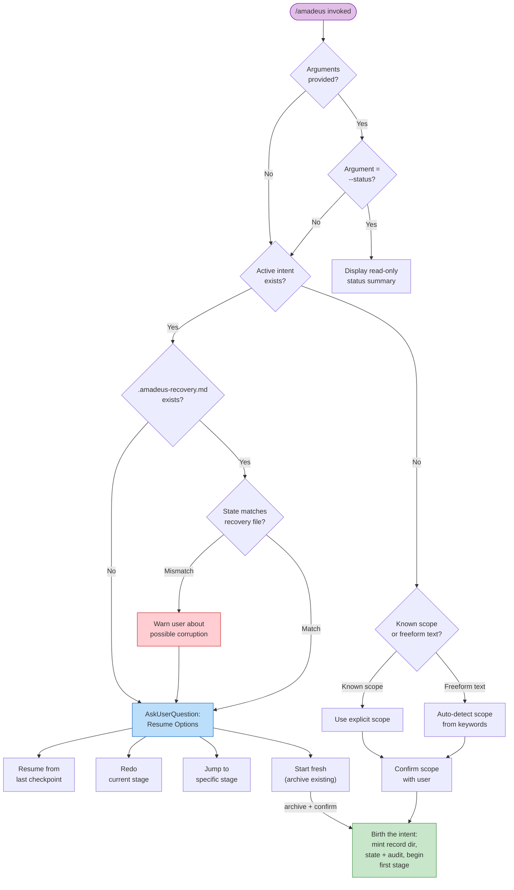
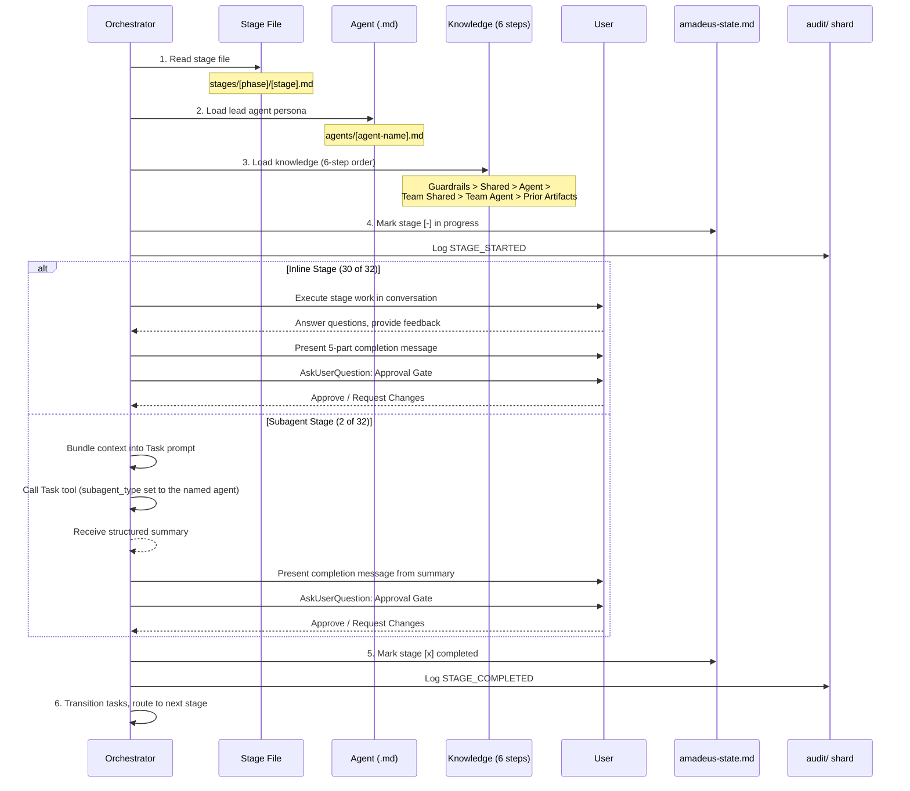
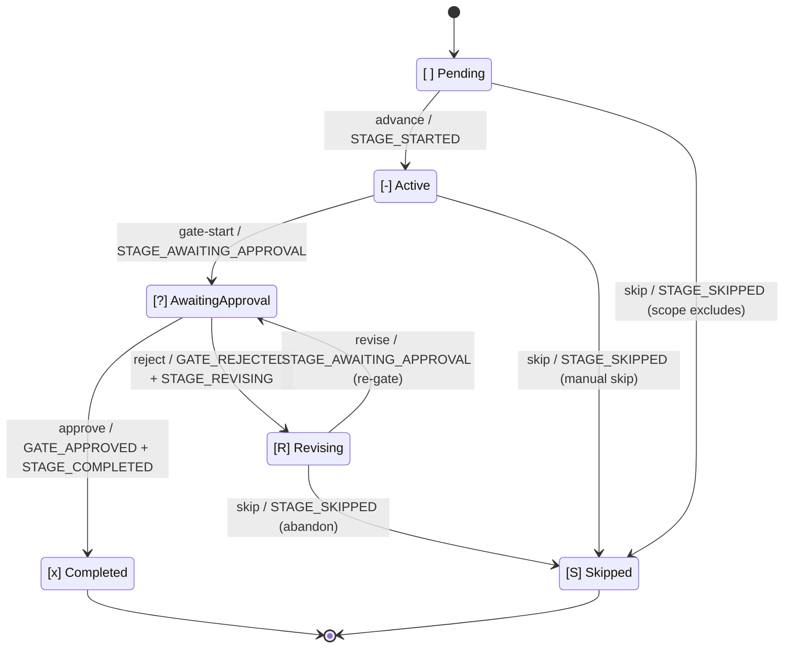

# オーケストレーター

> 言語: [English](03-orchestrator.md) | **日本語**

オーケストレーションは2つのピースに分割されます。決定論的な **エンジン**(`amadeus-orchestrate.ts`、サブコマンド `next`/`report`/`park`)がステージ間のすべての決定 — スコープ判定、ステージルーティング、ジャンプ解決、resume/init ガード、ゲート状況、ワークフロー完了 — を所有し、各 `next` で型付き **ディレクティブ** を発行します。**コンダクター**(`.claude/skills/amadeus/SKILL.md`、`/amadeus` で呼び出される)は、各ディレクティブに対して行動する薄いフォワーディングループ — 名前付きステージの実行、人間への質問、スワームのファンアウト — であり、`report` で結果を報告します。SKILL.md は control プレーンではありません: ルーティングの決定はエンジンとそれが読むコンパイル済みデータ(`tools/data/stage-graph.json`、`tools/data/scope-grid.json`)に存在し、SKILL.md はエンジンが名指しした手の中での実行品質を所有します。

この章は、コンダクター側から見たワークフローの振る舞い — エントリポイント、セッション管理、スコープからステージへのマッピング、ステージ実行・進行プロトコル、意図的な逸脱 — を文書化します。エンジン内部 — `next`/`report` 契約、型付きディレクティブ union、コンダクターペルソナ、複数スキル、スコープの形、スワームレフェリー — については [Engine and Skill System](17-skill-system.ja.md) を参照。ユーザー向けのコマンド使用法については、[ユーザーガイド -- CLI Commands](../guide/12-cli-commands.ja.md) を参照。

> **所有権に関する注記。** この章を通じて、記述される振る舞い — 引数解決、スコープ検出、ジャンプ検証、resume 分岐 — は各 `next` で **エンジン** によって計算され、ディレクティブとしてコンダクターへ配信されます。古い散文が「オーケストレーターが X をする」と言っていた箇所は、「エンジンが X を決定しディレクティブを発行する。コンダクターがそれを実行する」と読み替えてください。決定ロジックは決定論的なツールコードであり、SKILL.md の散文ではありません。

> **パス表記の慣習。** 各 intent の状態、監査証跡、成果物は、その **record dir** の下に存在します — `amadeus/spaces/<space>/intents/<YYMMDD>-<label>/`、以下 `<record>/` と表記。監査証跡は、単一ファイルではなく `<record>/audit/` 下のクローンごとのシャードのディレクトリです。

---

## 目次

- [Entry Points](#entry-points)
- [Session Management](#session-management)
- [Scope-to-Stage Mapping](#scope-to-stage-mapping)
- [Stage Execution Engine](#stage-execution-engine)
- [Stage Advancement Protocol](#stage-advancement-protocol)
- [Task Tracking](#task-tracking)
- [Deliberate Deviations](#deliberate-deviations)
- [Error Handling](#error-handling)
- [Appendix A: Stage Graph Reference](#appendix-a-stage-graph-reference)
- [Appendix B: Hook Reference](#appendix-b-hook-reference)
- [Appendix C: Approval Gate Patterns](#appendix-c-approval-gate-patterns)

---

## Entry Points

コンダクターは `$ARGUMENTS` をエンジンの最初の `next` へ逐語的に渡します — 事前パースは決してしません。エンジンがフラグとフリーフォームテキストをパースし、以下のどの呼び出しパターンが適用されるかを解決し、対応するディレクティブを発行します。パターンはエンジンが解決する入力であり、コンダクター側の分岐ではありません。

### `/amadeus [scope]` -- 明示的スコープ

引数が10個の既知スコープ(`enterprise`、`feature`、`mvp`、`poc`、`bugfix`、`chore`、`refactor`、`infra`、`security-patch`、`workshop`)のいずれかにマッチする場合:

まっさらなワークスペース(まだ intent がない — `amadeus/spaces/*/intents/*/` の下に `amadeus-state.md` がない)上で明示的に名指しされたスコープは、**最初の intent を誕生させます**: エンジンの `next` が `amadeus-utility.ts intent-birth --scope <scope>` を名指しする run-then-continue の `print` ディレクティブ(`--depth` / `--test-strategy` フラグを名指しコマンドに通す)を発行します。コンダクターがそれを実行し、`next` を再実行して最初のステージに着地します。両方の命名形 — 素の位置引数(`/amadeus bugfix`)と明示的フラグ(`/amadeus --scope bugfix`)— は同一の誕生 print を発行します。何を構築するかを記述する(`/amadeus "build the auth service"`)ことも誕生させます。明示的に名指しされたスコープも記述もない素の `/amadeus` は誕生させません(env またはデフォルトで解決されたスコープは誕生シグナルではありません)。何を構築するか記述するかスコープを名指しするようユーザーへ促す no-state エラーを発行します。

1. `amadeus/spaces/<space>/memory/` からガードレールを読む。
2. ユーザーに「What would you like to build?」と尋ねる。
3. Scope-to-Stage Mapping に従って実行するステージを決定する。
4. Initialization フェーズ(workspace-scaffold、workspace-detection、state-init)を単一の決定論的な `amadeus-utility init` 呼び出しとして実行する。ウェルカムメッセージはセッション開始時に `settings.json` の `companyAnnouncements` を介してレンダリングされる。
5. スコープ内のすべてのステージにステージレベルのタスクを作成する。最初のステージは `in_progress` に設定され、残りは `pending`。スコープ外のステージにはタスクが一切作られない。
6. 最初の初期化後ステージを開始する。

### `/amadeus [freeform]` -- AI スコープ検出

引数がフリーフォームテキスト(既知のスコープキーワードでない)の場合:

1. `amadeus/spaces/<space>/memory/` からガードレールを読む。
2. intent をキーワードパターンに対して分析する:
   - "fix" / "bug" / "broken" は `bugfix` にマップ
   - "chore" / "tweak" は `chore` にマップ
   - "refactor" / "clean up" / "simplify" は `refactor` にマップ
   - "infrastructure" / "deploy" / "infra" は `infra` にマップ
   - "security" / "CVE" / "vulnerability" / "patch" は `security-patch` にマップ
   - "proof of concept" / "prototype" / "poc" / "spike" は `poc` にマップ
   - "mvp" / "minimum viable" は `mvp` にマップ
   - それ以外は `feature` にデフォルト
3. 曖昧さ解消ルール: テキストがスコープキーワード AND より長いプロジェクト記述(5語超)の両方を含む場合、マッチは偶発的として扱われ、静かなデフォルトの代わりに COMPOSE OFFER が発火する。
4. 明確なキーワードマッチの場合、ユーザーに確認する: `Starting a "[scope]" workflow for: "[text]". Confirm to proceed, name a different scope, or say "compose" for a tailored plan.`
5. マッチなし / 豊かな散文の場合、適応コンポーザーを提示する: コンポーザーエージェントがタスクの EXECUTE/SKIP グリッドを提案し、人間ゲート付き(下記の compose サーフェスを参照)。
6. 確認時、明示的スコープと同様に進む。元のフリーフォームテキストは `amadeus-state.md` に `Initial Intent` として保存される。
7. ユーザーが検出されたスコープをオーバーライドした場合、ユーザーが選んだスコープを代わりに使う。

### `/amadeus compose` -- 適応コンポーザー

compose サーフェス(先頭の `compose` 動詞、`--new-scope`、または `--report <path>`)は、エンジンにスコープ確認の代わりにコンポーザーディスパッチの `print` を発行させます。この動詞は意図的にワークスペース動詞では **ありません**(ワークスペース動詞は Kiro シームがオフバンドで実行する終端ユーティリティコマンド。compose はコンダクターがディスパッチするワークフロー作業です)。2つのモードが状態ファイルで分岐します:

1. **フロント / レポート(まだワークフローなし):** コンダクターは `amadeus-composer-agent` をディスパッチする。これは読み取り専用の `detect --json` スキャンを実行し、ストックスコープを読み、`amadeus-graph.ts validate-grid` で検証された構造化提案(`mode matched|custom`、グリッド、SKIP ごとの根拠)を返す。コンダクターは approve/edit/reject ゲートをレンダリングする。approve 時、ストックマッチは直接誕生し、カスタムグリッドはスコープデータ(`scopes/amadeus-<name>.md` + `scope-grid.json` エントリ、デフォルトで `keywords: []`)として作成され、同じターンで誕生が続く。
2. **飛行中(ワークフロー実行中):** コンポーザーは PENDING でカーソルより先のステージに対して SKIP/un-SKIP のフリップを提案する。コンダクターはゲート前に pending-proposal マーカー(`amadeus/.amadeus-compose-pending`)を書き込む(Stop フックがそれをターン停止シグナルとして尊重する)。approve 時、`amadeus-utility.ts recompose --skip <slugs> --add <slugs>` を実行する。これは監査ロックの下でプランサフィックスをフリップし、新たな枯渇に対して strict-validate し、派生フィールドを再構築し、`RECOMPOSED` を発行する。検出はチャットファースト: コンダクターの forward 前判断ステップ(新規作業を見つける同じもの)が、素のチャットの再形成リクエスト(「market research をスキップできる?」)を分類し、逐語 forward の代わりに `next compose "<their words>"` としてルーティングする(逐語 forward は Branch 10 に落ちて現在のステージを実行してしまう)。リクエストが特定のステージを命令的に名指しする場合、コンダクターはコンポーザーディスパッチをスキップしてゲート自体を提示し、approve 時に `recompose` を直接実行してよい - これは健全である。なぜなら、その動詞は誰が呼んでも枯渇/凍結/カーソル後方/スケルトンゲートのフリップを拒否するからだ。人間ゲートとマーカーの規律は両パスで同一である。

### space と intent の管理コマンド -- 一覧、作成、切り替え

`space`、`space-create`、`intent` は、space と intent を管理するコマンドです。各コマンドは指定された操作だけを行って終了し、ワークフローステージの実行や進行は行いません。

| コマンド | 振る舞い |
|---|---|
| `/amadeus space` | space を一覧表示する。構造化出力には `--json` を追加する。 |
| `/amadeus space <name>` | アクティブな space を切り替える。space は既に存在している必要がある。 |
| `/amadeus space-create <name>` | フレームワークのベースラインをシードして space を作成する。新しい team/project memory、phase、template の各ディレクトリと、空の `intents/`、`codekb/`、`knowledge/` ディレクトリを作成する。新しい space には切り替えないため、続けて `/amadeus space <name>` を使用する。 |
| `/amadeus intent` | アクティブな space の intent を一覧表示する。構造化出力には `--json` を追加する。 |
| `/amadeus intent <slug>` | アクティブな space 内でアクティブな intent を切り替える。 |

space 名は slug に正規化されます。既存 space の作成や、存在しない space または intent への切り替えは、アクティブカーソルを変更せずに失敗します。

### `/amadeus --status` -- 進捗チェック

ワークフローを進めずに検査する読み取り専用コマンド:

1. アクティブな intent の `amadeus-state.md`(`amadeus/spaces/<space>/intents/<YYMMDD>-<label>/` の下)を読む。
2. 表示する: 現在のフェーズ、現在のステージ、完了率、保留中の決定、アクティブなエージェント。
3. 検証が必要な場合、stage-protocol-governance.md セクション13に従ってフェーズ境界チェックを実行する。
4. ワークフローを進めない — 厳密に読み取り専用。

### `/amadeus --stage <id>` / `/amadeus --phase <name>` -- ステージ/フェーズへジャンプ

特定のステージまたはフェーズへ直接ジャンプします。前方・後方両方のジャンプをサポート。エンジンがターゲットを解決し、スコープメンバーシップを検証し、ジャンプ方向を計算します。`amadeus-jump.ts execute` ツールを名指しする run-then-continue の `print` ディレクティブを発行します。コンダクターはそのツールを実行し、`next` を再実行します — ジャンプ自体の解決や検証はしません。以下の番号付きステップは、ジャンプ計算(エンジン + ツール)が実行することを説明します。

**前方ジャンプ**(ターゲットが現在位置より先):
1. ターゲットを解決: `--stage` は slug(`code-generation`)または表示番号(`3.5`)を受け付ける。`--phase` は名前(`construction`)または番号(`3`)を受け付け、そのフェーズの最初のスコープ内ステージに解決する。
2. 既存の状態ファイルをチェック。なければ自動初期化(3つの Initialization ステージを実行)。
3. ターゲットが現在/指定スコープでスコープ内であることを検証する。
4. 中間のスコープ内ステージを `[S]`(ジャンプによりスキップ)としてマークする。既に完了した `[x]` ステージは変更しない。
5. 欠落した上流成果物について警告し、確認を求める。
6. ステージレベルのタスクを作成し、ターゲットステージから実行を開始する。

**後方ジャンプ**(ターゲットが現在位置より後ろ):
1. 前方ジャンプと同じ解決と検証。
2. すべての下流ステージ(ターゲット以降)を `[ ]`(未開始)にリセットする。ディスク上の成果物は保持され、削除されない。
3. ターゲットステージと後続ステージが再実行されるとき、既存の成果物を検出し、次を提示する: Keep / Modify / Redo from scratch。
4. ステージレベルのタスクを作成し、ターゲットステージから実行を開始する。

`--scope`(スコープを設定/オーバーライド)、`--depth`(深度レベルをオーバーライド)、`--test-strategy`(テスト量をオーバーライド)と組み合わせ可能。

### `/amadeus --scope <scope>` -- スコープを設定/オーバーライド

ワークフロースコープを設定します。単独使用(`/amadeus --scope bugfix`)では `/amadeus bugfix` のように振る舞います。`--stage` または `--phase` と組み合わせると、ジャンプ操作のためのスコープを提供します。`--depth` と `--test-strategy` と組み合わせてデフォルトをオーバーライドできます。

### `/amadeus --depth <level>` -- 深度をオーバーライド

深度レベル(minimal、standard、comprehensive)をオーバーライドします。単独使用時、アクティブなワークフローの深度を更新します。`--scope` と組み合わせると、新しいスコープのデフォルトをオーバーライドします。単独変更については `DEPTH_CHANGED` 監査イベントをログします。

### `/amadeus --test-strategy <level>` -- テスト戦略をオーバーライド

深度とは独立にテスト量戦略(minimal、standard、comprehensive)をオーバーライドします。指定されない場合、現在の深度にデフォルトします。フル成果物に最小限テストのような `--depth standard --test-strategy minimal` の組み合わせを可能にします。単独変更については `TEST_STRATEGY_CHANGED` 監査イベントをログします。

### Intent 誕生 -- Initialization フェーズ

別個のスキャフォールドコマンドはありません(以前の `init` フラグは廃止されました。ワークスペースシェルは `dist/<harness>/` に事前構築済みで出荷されます)。3つの Initialization ステージ(workspace-scaffold、workspace-detection、state-init)は `amadeus-utility intent-birth` の内部で決定論的に実行されます — 最初の `/amadeus`(または `/amadeus <description>`)で自動呼び出しされるか、`/amadeus-init` パッケージングで明示的に実行されます。誕生は、状態を初期化し、スコープルーティングを適用し、ワークフローを最初の初期化後ステージに配置した状態で、intent の record dir を `amadeus/spaces/<space>/intents/<YYMMDD>-<label>/` に鋳造します:

1. record dir ツリーを作成する(冪等 — 既存のディレクトリ/ファイルはスキップ): `audit/` シャードディレクトリ、ステージ成果物ディレクトリ(空)、検証ディレクトリ。
2. 空の space レベル `amadeus/knowledge/` ディレクトリ(space の `intents/` の兄弟)を作成する。固定ファイルセットのないフリーフォーム — 誕生はエージェントごとのサブディレクトリも READMEs もシードしない。チーム自身がファイルを追加する。
3. ワークスペースをスキャンし、intent の `amadeus-state.md` を、実際のフェーズ(例 `--scope feature` なら `IDEATION`)、解決済みスコープ、コンパイル済みスコープグリッド(`scope-grid.json`、各ステージの `scopes:` フロントマターの転置)から導出されたステージプランとともに書く。
4. 完全なイベントシーケンスを発行する: `WORKFLOW_STARTED`、`WORKSPACE_SCAFFOLDED`、`WORKSPACE_SCANNED`、`WORKSPACE_INITIALISED`、最初に実行するフェーズの `PHASE_STARTED`、各 Initialization ステージの `STAGE_STARTED` + `STAGE_COMPLETED`、加えてスコープがスキップする任意のフェーズの `PHASE_SKIPPED` イベント。
5. intent がゼロのワークスペースでのみ自動誕生する。intent が既に存在しアクティブなカーソルがない場合、エンジンは重複を誕生させる代わりにユーザーに1つを選ぶよう(`/amadeus intent <slug>`)促す。再 init フラグはない。
6. 自動誕生 print 経由で誕生に到達した場合、コンダクターは `next` を再実行し最初の初期化後ステージへ続く。明示的な `/amadeus-init` パッケージングは Initialization 後に停止するので、ユーザーはインタラクティブに開始するために再度 `/amadeus` を呼び出す。

### `next --new-intent` -- アクティブ intent と並行した誕生

別の intent が既にアクティブな状態で、新しい intent-birth ディレクティブを要求します。コンダクターは、実行中の intent と無関係な新規作業を認識し、SKILL.md の新規作業オファーを実行し、人間が確認したときにこれを使います。コンダクターに `intent-birth` コマンドをプロンプトから構築させる代わりに、エンジンは fresh-start パスと同じ誕生 `print` を発行します。そのため2番目以降の intent も最初の intent と同一に `--label` シームを担います。新規作業のフリーフォーム記述は引数テキストに乗ります。スコープは明示的な `--scope` から取られ(アクティブ intent のスコープが新しい誕生に勝つことはありません)、スコープフラグが渡されない場合は解決済みスコープにフォールバックします。

姉妹の再入フラグとの関係: `--resume` は既存のアクティブ intent に再入します(park マーカーがあればクリアします — 後述)。`--new-intent` はアクティブ intent には手を触れず、その傍らに全く新しい intent を誕生させます。`--single` は、いずれの main ポインタにも触れずに、単一ステージを合成ワークフロー id の下で隔離実行します。この3つは既存ワークスペースに対する別個の再入操作であり、互いに合成可能なバリアントではありません。

アクティブ intent が park されている場合でも、`next --new-intent` は新しい intent を誕生させます — park されたカーソルがこの誕生を飲み込むことはありません。park されたワークフローに対する単純な `next` は終端の `parked` ディレクティブを発行しますが、`--new-intent` は意図的な再入でありそのパスをバイパスするため、先行 intent が park されたままでも新規作業は開始します。

### Resume(状態ファイルが存在する)

アクティブな intent の `amadeus-state.md` が存在し、ユーザーが `/amadeus` を呼び出すと、エンジンの `next` が既存の状態を検出し、resume/recovery ガードを実行し、resume オプションの質問を運ぶ `ask` ディレクティブを発行します。コンダクターは `AskUserQuestion` を介してそれをレンダリングし、選択を `report --user-input` でフィードバックします。コンダクター自身は状態ファイルの存在で分岐しません。以下のガードロジックがエンジン内で実行されます:

1. エンジンが状態ファイルを読み、ステータスサマリーを準備する。
2. `.amadeus-recovery.md`(intent の record dir 内)をチェックする。存在する場合、その「Current stage」フィールドを `amadeus-state.md` と比較し、圧縮関連の状態破損の可能性を検出する。
3. resume オプション付きの `ask` ディレクティブを発行する。コンダクターがそれを `AskUserQuestion` を介してレンダリングする。
4. 回答時、コンダクターは現在のワークフロー状態にマッチするステージレベルタスクを再作成する。

---

## Session Management

### セッション再開フロー

以下の分岐は **エンジンの** `next` 決定ロジックです — 引数、init、状態ファイルのチェックはすべて `amadeus-orchestrate next` 内部で実行され、1つのディレクティブ(ステータス `print`、スキャフォールド `print`、resume メニューの `ask`、または作業を開始する `run-stage`)を発行します。コンダクター自身のフローは単なるフォワーディングループです: `next` を呼び、ディレクティブに従い、`report`、繰り返す。



### 状態ファイルスキーマ

`amadeus/spaces/<space>/intents/<YYMMDD>-<label>/amadeus-state.md`(intent の record dir)の状態ファイルは、`.claude/knowledge/amadeus-shared/state-template.md` のテンプレートから作成されます。State Version 7 を使用し、以下を含みます:

| セクション | 内容 |
|---------|----------|
| Project Information | プロジェクト説明、種別(greenfield/brownfield)、スコープ、開始日、ライフサイクルフェーズ、アクティブエージェント、worktree パス、Bolt refs、practices affirmed タイムスタンプ |
| Scope Configuration | 実行するステージ、スキップするステージ(理由付き)、深度レベル |
| Workspace State | プロジェクトルート、検出された言語、フレームワーク、ビルドシステム |
| Execution Plan Summary | 総ステージ数、完了数、進行中ステージ |
| Runtime State | 現在のステージのリビジョンカウント |
| Stage Progress | フェーズごとに整理されたステージごとのチェックボックス(下記参照) |
| Current Status | ライフサイクルフェーズ、現在/次のステージ、状況、最終更新タイムスタンプ |
| Session Resume Point | 最後に完了したステージ、次のアクション、保留中の成果物 |

**Stage Progress** は6状態のチェックボックスを使います:
- `[ ]` 未開始
- `[-]` 進行中
- `[?]` 承認待ち(ゲートオープン)
- `[R]` 修正中(ゲートを却下し、ステージが修正されている)
- `[x]` 完了(ユーザーが承認)
- `[S]` スキップ(init 時にスコープ除外、`skip` でカット、または `--stage`/`--phase` ジャンプでバイパス)

Construction フェーズセクションは特別です: Bolt 単位で実行されるため(下記の [Construction Execution](#construction-execution) を参照)、チェックボックスは `bolt-plan.md` で定義された各 Bolt 内の各 Unit ごとに一度ずつ現れます。さらに、`Construction Autonomy Mode: [unset|autonomous|gated]` が **Current Status** の下に記録されます — ラダープロンプトが発火した後に書かれ、セッション再開時に尊重されます。

### リカバリのパンくず

リカバリのパンくず(intent の record dir 内の `.amadeus-recovery.md`)は `validate-state.ts` PreCompact フックによって書かれます。コンテキスト圧縮が発生する前に、ワークフローの最後に既知の良好な状態のスナップショットを記録します。

セッション再開時、オーケストレーターはパンくずの「Current stage」を状態ファイルの「Current Stage」と比較します。異なる場合、圧縮が状態破損を引き起こした可能性があるとユーザーに警告します。これは重要です。なぜなら PreCompact フックは情報提供のみで、圧縮をブロックできないからです。

### Resume オプション

状態ファイルが検出されると、オーケストレーターは4つのオプションを提示します:

**1. Resume from last checkpoint** — 進行中ステージから続行。`amadeus-state.md` を読んで完了/進行中/未開始ステージを判定。現在の状態にマッチするステージタスクを再作成。

**2. Redo current stage** — 現在のステージの部分成果物を破棄して再実行。成果物ディレクトリを完全に削除し、状態チェックボックスを `[ ]` にリセットし、まっさらから再実行。

**3. Jump to stage** — ユーザーが選択できるよう完全なステージリストを提示。下流成果物の無効化について警告。

**4. Start fresh** — 明示的確認の後、アクティブな intent の record dir を `amadeus/spaces/<space>/intents/` の下にアーカイブし、新しい intent を誕生させる。

### セッション再開時のコンテキストロード

| フェーズ / ステージ種別 | ロードされるコンテキスト |
|---|---|
| INITIALIZATION (0.1-0.3) | ガードレールのみ(ワークスペース未検出) |
| IDEATION (1.1-1.7) | これまで完了した `<record>/ideation/` 成果物 + ガードレール |
| INCEPTION -- RE ステージ | `<record>/inception/reverse-engineering/` + ideation 成果物 |
| INCEPTION -- Requirements ステージ | RE 成果物(実行された場合)+ requirements 成果物 |
| INCEPTION -- Design ステージ | Requirements + user stories + application design 成果物 |
| INCEPTION -- Delivery Planning | すべての inception 成果物 |
| CONSTRUCTION -- Code Generation | 現在のユニットの design 成果物 + story design + acceptance criteria + 以前のコード |
| CONSTRUCTION -- Build/Test | 現在のユニットのコード出力 + test plans + build configuration |
| CONSTRUCTION -- CI/Infra | infrastructure design + code generation 出力 |
| OPERATION (4.1-4.7) | Construction 出力 + operation 成果物。後続ステージ(4.4+)は 4.1-4.3 のデプロイ出力もロードする |

---

## Scope-to-Stage Mapping

スコープが、32ステージのうちどれをどの深度で実行するかを決定します。スコープ外のステージは完全にスキップされます — タスクは作られず、承認ゲートも提示されません。すべてのスコープは Initialization フェーズ(0.1-0.3)で始まります。

### 完全なマッピング

権威あるデータは `.claude/scopes/amadeus-<name>.md` ファイルと各ステージの `scopes:` フロントマターに存在し、`.claude/tools/data/scope-grid.json` へコンパイルされます。ライブのコンパイル済みカウントについては `bun .claude/tools/amadeus-utility.ts scope-table` を実行してください。

| スコープ | 含まれるステージ | EXECUTE / Total | 深度 | テスト戦略 |
|---|---|---|---|---|
| `enterprise` | All: 0.1-0.3, 1.1-1.7, 2.1-2.8, 3.1-3.7, 4.1-4.7 | 32 / 32 | Comprehensive | Comprehensive |
| `feature` | All: 0.1-0.3, 1.1-1.7, 2.1-2.8, 3.1-3.7, 4.1-4.7 | 32 / 32 | Standard | Standard |
| `mvp` | 0.1-0.3, 1.1, 1.3 (light), 1.4, 2.1 (if brownfield), 2.2, 2.3, 2.4, 2.5 (if UI), 2.6, 2.7, 2.8, 3.1-3.7 | 22 / 32 | Standard | Standard |
| `poc` | 0.1-0.3, 1.1 (minimal), 2.1 (if brownfield), 2.3 (minimal), 3.5, 3.6 | 8 / 32 | Minimal | Minimal |
| `bugfix` | 0.1-0.3, 2.1 (always), 2.3 (minimal), 3.5, 3.6 | 7 / 32 | Minimal | Minimal |
| `chore` | 0.1-0.3, 3.5, 3.6 | 5 / 32 | Minimal | Minimal |
| `refactor` | 0.1-0.3, 2.1 (always), 2.3 (minimal), 3.1 (refactoring plan), 3.5, 3.6 | 8 / 32 | Minimal | Minimal |
| `infra` | 0.1-0.3, 2.2, 2.3 (infra requirements), 3.2, 3.3, 3.4, 3.7, 4.1, 4.2, 4.3, 4.4 | 13 / 32 | Standard | Standard |
| `security-patch` | 0.1-0.3, 2.1 (find vulnerability context), 2.3 (minimal), 3.2, 3.5, 3.6, 4.1, 4.3 | 10 / 32 | Minimal | Minimal |
| `workshop` | 0.1-0.3, 2.1-2.8, 3.1-3.7, 4.1-4.7 (skips all ideation 1.1-1.7) | 25 / 32 | Standard | **Minimal** |

### 詳細なスコープの内訳

- **enterprise** — 全32ステージを comprehensive 深度で。すべてのステージがフルの成果物詳細、深い分析、すべてのオプションステージを含めて実行される。完全なトレーサビリティを要する規制対象のエンタープライズ機能に適する。
- **feature** — 全32ステージを standard 深度で。enterprise と同じステージセットだが、中程度の成果物詳細。新機能のデフォルトスコープ。
- **mvp** — Ideation のほとんどをスキップ(Intent Capture、軽量 Feasibility、Scope Definition のみ保持)。Inception と Construction のすべてを実行。Operation ステージはオプション。
- **poc** — 最小限の Ideation(Intent Capture のみ)。コアな Inception。Construction からは Code Generation と Build and Test のみ。Operation なし。
- **bugfix** — Ideation なし。Reverse Engineering を常に含む(バグを見つけるため)加えて最小限の Requirements Analysis。Code Generation と Build and Test のみ。
- **chore** — Ideation なし、Requirements/Design ステージもなし。Initialization に加えて Code Generation と Build and Test のみ — 最も軽量な incremental スコープで、開発スクリプト・docs・CI 設定などユーザー可視契約に触れない1〜数ファイルの小さな自己完結の修正向け。
- **refactor** — Ideation なし。bugfix と同じ Inception 開始。Functional Design(リファクタリングプランとして)を追加。
- **infra** — Ideation なし。インフラ重視の Requirements Analysis。Construction からは NFR ステージ + Infrastructure Design + CI Pipeline。Operation からは Deployment と Observability。
- **security-patch** — Ideation なし。脆弱性コンテキストを見つける Reverse Engineering 加えて最小限の Requirements Analysis(脆弱性とその修正基準の監査可能な記述)。NFR Requirements、Code Generation、Build and Test。Operation からは Deployment Pipeline と Deployment Execution。
- **workshop** — Ideation なし(プロジェクトはファシリテーターにより事前決定済み)。すべての Inception、Construction、Operation ステージを実行。デフォルト深度: Standard(学習のためのフル成果物詳細)。デフォルトテスト戦略: Minimal(ワークショップのペースを速く保つための Nyquist テスト)。参加者がモブとして全ライフサイクルを進む複数日の AI-DLC ワークショップ向けに設計されている。

### 深度レベル

| 深度 | スコープ | 特徴 |
|---|---|---|
| Minimal | poc, bugfix, chore, refactor, security-patch | 最小限の成果物、簡潔な分析、オプションステージはスキップ |
| Standard | feature, mvp, infra, workshop | 中程度の詳細でフルの成果物 |
| Comprehensive | enterprise | 深い分析で comprehensive な成果物、全ステージ実行 |

**注:** workshop は独立した深度とテスト戦略のデフォルトを持つ点で独特です。Standard 深度(学習のためのフル成果物)を使うが Minimal テスト戦略(ペースのための Nyquist テスト)を使います。他のすべてのスコープはテスト戦略をその深度レベルに合わせてデフォルトします。`--test-strategy` でオーバーライドしてください。

---

## Stage Execution Engine

すべてのステージは2つの実行パターンのいずれかに従います: インラインまたはサブエージェント。コンパイル済みステージグラフ(`tools/data/stage-graph.json`)が各ステージのモードを運びます。エンジンがそれを読み、`run-stage` ディレクティブで `directive.mode` として配信します。SKILL.md の Stage Graph テーブルは人間可読なミラーであり、ディスパッチのソースではありません。

### フルステージライフサイクル



### インライン実行

インラインステージはオーケストレーターの会話内で直接実行されます。ユーザーはステージとリアルタイムでやり取りできます。ほとんどのステージ(32のうち30)はインラインです。

6ステップのプロセス:

1. **ステージファイルを読む。** オーケストレーターは `stages/[phase]/[stage-name].md` からステージファイルを読む。
2. **リードエージェントのペルソナをロードする。** オーケストレーターはロールのフレーミングのためにリードエージェントのフラットファイルを読む。
3. **6ステップのロード順序に従って知識をロードする**(ガードレール、共有方法論、エージェント方法論、チーム共有、チームエージェント、以前のステージ成果物)。
4. **会話内でステップを直接実行する。** オーケストレーターはステージ作業をインラインで実行する: 質問する、回答を分析する、成果物を生成する、ユーザーとやり取りする。
5. **承認ゲートについて stage-protocol.md に従う。** すべてのインラインステージ(3つの Initialization ステージを除く)は、5部構成の完了メッセージと `AskUserQuestion` 承認ゲートで終わる。
6. **ステージ進行プロトコルへ制御を戻す。** 承認後、オーケストレーターは状態を更新し、完了をログし、タスクを遷移させ、次のステージへルーティングする。

### サブエージェント実行

サブエージェントステージは、Claude Code の Task ツールを介して別個の Claude Code タスクへ作業を委譲します。2つのステージがこのパターンを使います:

| ステージ | Claude Code サブエージェント種別 | エージェント | 理由 |
|-------|---------------------------|-------|--------|
| 2.1 Reverse Engineering | `amadeus-developer-agent` その後 `amadeus-architect-agent`(2ステップ) | amadeus-developer-agent + amadeus-architect-agent | 深いコード分析は大きな中間出力を生成する |
| 3.5 Code Generation | `amadeus-developer-agent` | amadeus-developer-agent | コード記述はユニット仕様に集中したクリーンなコンテキストから利益を得る |

Workspace detection(0.2)は以前はサブエージェントでした。現在は `amadeus-utility init` 内部の決定論的なルールベースのスキャナーです — ルールは `amadeus-common/stages/initialization/workspace-detection.md` に文書化されています。

6ステップのプロセス:

1. **ステージファイルを読む。**
2. **コンテキストを準備する。** 必要なすべてのコンテキスト(以前の成果物、プロジェクト説明、ワークスペースの発見事項、エージェントペルソナ)を Task プロンプトにまとめる。サブエージェントは会話履歴にアクセスできないため。
3. **適切な `subagent_type` で Claude Code の Task ツールを呼び出す。**
4. **コンテキスト予算ルールを適用する:** 現在のユニットの design 成果物のみを渡す、inception 成果物はファイルパス付きの1-2行サマリーに要約する、知識ファイルは最も関連する3つまでに制限する。
5. **構造化サマリーを受け取る**(4セクション: Produced、Key Decisions、Issues/Concerns、Next Steps)。
6. **サマリーを完了メッセージに使い**、承認ゲートを提示する。

### マルチエージェント調整

一部のステージは複数のエージェントを含みます: 1つのリードエージェントと1つ以上のサポートエージェント。調整パターンは厳密に逐次的で、オーケストレーター仲介です:

1. リードエージェントの作業を最初に実行し、主要成果物を生成する。
2. リードの出力をコンテキストとして各サポートエージェントを投入する。インラインステージ(出荷グラフのすべてのマルチエージェントステージ)では、オーケストレーターは `Task` をディスパッチするのではなく、サポートエージェントを自身のコンテキストにペルソナとしてロードする。`Task` は `mode: subagent` ステージのために予約されている。
3. すべてのエージェント出力を最終ステージ成果物へ合成する。
4. エージェントは互いを呼び出さない — オーケストレーターのみが委譲する。すべてのエージェントファイルの `disallowedTools: Task` によって強制される。

### 2ステップの Reverse Engineering パターン

ステージ2.1は独特な2ステップ委譲を使います:

1. **Developer サブエージェント(コードスキャン):** コードベースをスキャンし、コード構造を分析し、コンポーネントを特定し、依存関係をマップし、生の分析を生成する。
2. **Architect サブエージェント(合成):** developer の生の分析を受け取り、アーキテクチャドキュメントへ合成する。

Reverse Engineering には **常に再実行ポリシー** があります: ブラウンフィールドプロジェクトでは以前の成果物が存在しても常に再実行され、分析が現在のコードベース状態を反映することを保証します。

### Construction 実行 <a id="construction-execution"></a>

Construction(ステージ 3.1–3.7)は標準的なステージごとのインライン実行モデルから逸脱します。代わりに、オーケストレーターは `<record>/inception/delivery-planning/bolt-plan.md`(Bolt シーケンス + walking-skeleton マーカー)と `<record>/inception/units-generation/unit-of-work-dependency.md`(DAG)によって駆動され、**Bolt 単位で** 実行します。

Bolt ごとの構造:

1. Bolt の Units にまたがってステージ 3.1–3.4 の質問を QUESTION-ONLY モードで収集する。単一の回答でゲート。
2. ステージ 3.1–3.4 の design 成果物を ARTIFACT-ONLY モードで生成する。
3. Task ツール(`subagent_type="amadeus-developer-agent"`)を介してユニットごとにステージ 3.5 Code Generation をディスパッチする。`code-generation.md` 内のユニットごとの承認ゲートはオーケストレーターにより **抑制** される。
4. 単一の Bolt レベル(またはバッチレベル)の承認ゲートを提示する。

`bolt-plan.md` の最初の Bolt は **walking skeleton** です — そのゲートは autonomy モードに関わらず常に提示されます。walking-skeleton ゲートが承認された直後、オーケストレーターはワークフローごとに正確に一度 **ラダープロンプト** を発火し、`amadeus-state.md` に `Construction Autonomy Mode: autonomous|gated` を記録し、`AUTONOMY_MODE_SET` を発行します。残りの Bolt はそのモードを尊重します。

並列実行可能な Bolt(依存前提条件を満たし、相互依存なし)は **バッチ** を形成します。オーケストレーターはバッチ内で質問/設計を Bolt ごとに逐次実行し、その後 **単一のアシスタントメッセージで N 個の `Task` 呼び出し** を発行してステージ 3.5 Code Generation を並列にディスパッチします。フレームワークは N 個のサブエージェントセッションを並行して起動します。結果はオーケストレーターの次のターンで到着します。単一のバッチレベルゲートがバッチ内のすべての Bolt をカバーします。監査ログは、`BOLT_STARTED`/`BOLT_COMPLETED` の `Batch` フィールドを介して並列 Bolt を結び付けます。

失敗処理は **halt-and-ask** で、autonomy モードに関わらず実行されます:

- 単独 Bolt の失敗: 停止し、`BOLT_FAILED` を発行し、retry / skip / abort を提示する。
- 並列バッチの部分失敗: すべての並列 Task が返るのを待ち、成功した Bolt の成果物をディスク上に保持し、`Succeeded=[names]` 付きで `BOLT_FAILED` を発行し、失敗した Bolt にスコープした同じ選択肢を提示する。Retry は失敗した Bolt のみを再実行する。バッチの兄弟は `[x]` のまま。

```mermaid
sequenceDiagram
    participant U as User
    participant O as Orchestrator
    participant T as Task Framework
    participant BA as Subagent (Bolt A)
    participant BB as Subagent (Bolt B)
    participant BC as Subagent (Bolt C)

    O->>O: Read bolt-plan.md + unit-of-work-dependency.md
    O->>U: Run Bolt A (walking skeleton) — questions, design, code-gen
    U->>O: Approve walking-skeleton gate
    O->>U: Ladder prompt (fires once)
    U->>O: "Continue autonomously"
    O->>O: Write Construction Autonomy Mode: autonomous; emit AUTONOMY_MODE_SET

    Note over O,T: Bolts B + C eligible in parallel batch
    O->>T: Task(B code-gen) + Task(C code-gen) in ONE message
    par Parallel execution
        T->>BB: spawn subagent for Bolt B
        T->>BC: spawn subagent for Bolt C
    end
    BB-->>O: Bolt B artifacts + summary
    BC-->>O: Bolt C artifacts + summary
    O->>O: Emit BOLT_COMPLETED for B and C (shared Batch=N)
    Note over O,U: No gate — autonomous mode. A failure would force halt-and-ask regardless.

    O->>O: All Bolts done → run 3.6 Build and Test, then 3.7 CI Pipeline
```

<!-- Text fallback: The orchestrator reads bolt-plan.md and the dependency DAG. It runs Bolt A as the walking skeleton, the user approves the gate, and the ladder prompt fires once. User picks "Continue autonomously", orchestrator writes Construction Autonomy Mode and emits AUTONOMY_MODE_SET. For Bolts B and C (eligible in parallel), the orchestrator issues both Task calls in a single message; the framework runs them concurrently; the orchestrator receives both results in the next turn and emits BOLT_COMPLETED for each with a shared Batch field. No gate because autonomy mode is autonomous — a failure would still halt. Once all Bolts are done, 3.6 and 3.7 run once at the end. -->

並列ディスパッチ下の状態と監査の安全性: `amadeus-audit.ts` は mkdir ベースのロックを使うので並行 append は安全です。`amadeus-state.ts advance` はロックされていませんが、オーケストレーターは自然に状態書き込みを直列化します — Task 結果が返った後にのみ書き込み、実行中には書き込まないためです。状態レースのリスクはありません。

---

## Stage Advancement Protocol

状態遷移はツールが所有します。オーケストレーターがいつ進めるかを決定し、`amadeus-state.ts` コマンドが状態ファイル更新 + 監査発行をアトミックに処理します。正規のワークフロー / フェーズ / ステージの状態図と完全な監査イベントタクソノミーについては [State Machine](12-state-machine.ja.md) を参照。

### ステージライフサイクル



状態ツールが上記のすべての遷移を所有します。オーケストレーターはチェックボックス状態を直接書き込むことは決してなく、ステージ/ゲート/フェーズの監査イベントを散文で発行することも決してありません。

### ステージ完了時(ユーザーがゲートで承認する)

1. **完了検証を実行する** — 成果物がディスク上に存在すること、ガードレールが尊重されていることをチェック。これは正しさのチェックであり、状態遷移ではない。これは決定論的にも強制される: `approve` は、宣言された `produces` 成果物が欠落しているゲート済みステージを拒否する(`AMADEUS_SKIP_ARTIFACT_GUARD=1` でない限り)ので、ステージは出力なしに完了マークできない(#366)。ユニットごとの Construction ステージは代わりにスワームレフェリーによって検証される。

2. **ゲートに入る**(オプション): `bun .claude/tools/amadeus-state.ts gate-start <slug>`。`[-]` → `[?]` にマークし、`STAGE_AWAITING_APPROVAL` を発行し、`/amadeus --status` に「Awaiting your approval on \<stage\>」を表示させる。スキップされた場合、エンジンの `report` / `reject` パスが、結果を記録する前に欠落した `STAGE_AWAITING_APPROVAL` 行を(`Recovered=true` タグ付きで)埋め戻す。

3. **承認ゲートを提示する**(AskUserQuestion)。

4. **ユーザーの応答を記録する**:
   - **Approve** → `bun .claude/tools/amadeus-orchestrate.ts report --stage <slug> --result approved --user-input "<exact choice>"`。欠落したゲート行を発行し、その後 `GATE_APPROVED` + `STAGE_COMPLETED` を発行し、進める。ステージの `produces` 出力が欠落している場合、produced-artifact 欠落エラーで拒否する。
   - **Request Changes** → `bun .claude/tools/amadeus-state.ts reject <slug> --feedback "<text>"`。`GATE_REJECTED` + `STAGE_REVISING` を発行し、`[?]` → `[R]` にマークし、Revision Count をインクリメント。
   - `[R]` ステージの作業を再実行した後、`bun .claude/tools/amadeus-state.ts revise <slug>` を呼んでゲートに再入する(新鮮な `STAGE_AWAITING_APPROVAL` を発行し、`[R]` → `[?]` にマーク)。

5. **次のステージへ進む**: `bun .claude/tools/amadeus-state.ts advance <slug>`。ツールは状態ファイルの EXECUTE/SKIP サフィックス(`init` が設定)とコンパイル済みスコープグリッド(`scope-grid.json`)から次のスコープ内ステージを導出する。完了したものに `[x]`、次のものに `[-]` をマークし、Current Stage / Lifecycle Phase / Active Agent / Next Stage / Last Completed Stage / Last Updated / Completed count を更新し、次のステージの `STAGE_STARTED` を発行する。フェーズ境界では、加えて `PHASE_COMPLETED` + `PHASE_VERIFIED` + `PHASE_STARTED` をアトミックに発行する。

   ツールは冪等 — `advance <slug>` を2回目に再生すると、イベントを再発行せずに `{replay: true}` を返す。

6. **これが最後のスコープ内ステージだった場合**: `bun .claude/tools/amadeus-state.ts complete-workflow <slug>`。`[x]` にマークし、Status=Completed に設定し、`PHASE_COMPLETED` + `PHASE_VERIFIED` + `WORKFLOW_COMPLETED` を発行する。完了サマリーを提示する。

7. **タスクを遷移する**: 古いタスクを `completed` にマークし、新しいタスクを `activeForm: "Running <Next Stage> [slug]"` で `in_progress` に設定する。`[slug]` サフィックスがステータスラインフィールドを同期する PostToolUse フックをトリガーする。

### フェーズ境界検証

フェーズ遷移時(init→ideation / inception / …、ideation→inception、inception→construction、construction→operation)、`advance` は PHASE_COMPLETED + PHASE_VERIFIED + PHASE_STARTED を発行します。オーケストレーターは、`advance` を呼ぶ **前** に `.claude/knowledge/amadeus-shared/verification.md` のトレーサビリティチェックを実行する責任があります — 検証が失敗した場合、問題をユーザーに表面化し、進めないでください。

---

## Task Tracking

オーケストレーターは Claude Code の TaskCreate/TaskUpdate/TaskList ツールを使い、ワークフロー全体を通じて可視の進捗サイドバーを維持します。

### ステージレベルのタスク

タスクはステージレベルで作成されます — スコープ内のステージごとに1タスク。タスクは Claude Code のタスクサイドバーにのみ存在します(状態ファイルには保存されません)。コンテキスト圧縮後にタスク ID が失われた場合、subject ベースのルックアップを使って `TaskList` 経由で回復されます。

### タスク作成のタイミング

タスクはフェーズバッチで作成されます:

- **INITIALIZATION**: すべての Initialization ステージタスク(workspace-scaffold、workspace-detection、state-init)は `amadeus-utility init` 実行前に作成される。ツールは3つのステージすべてを1回の呼び出しで完了する。タスクはツールが返った後に completed へフリップする。
- **IDEATION**: すべての Ideation ステージタスクはステージ 1.1 開始前に作成される。
- **INCEPTION**: すべての Inception ステージタスクはステージ 2.1 開始前に作成される。
- **CONSTRUCTION**: Delivery Planning の実行計画に基づいてタスクが作成される。ユニットごとのステージタスクが各ユニットに作成され、加えて横断タスクが作成される。
- **OPERATION**: すべての Operation ステージタスクはステージ 4.1 開始前に作成される。

### ユニットごとのタスク命名規約

| フェーズ | パターン | 例 |
|---|---|---|
| Initialization | `"Initialization - [Stage Name]"` | `"Initialization - Workspace Scaffold"` |
| Ideation | `"Ideation - [Stage Name]"` | `"Ideation - Intent Capture"` |
| Inception | `"Inception - [Stage Name]"` | `"Inception - Requirements Analysis"` |
| Construction(Bolt ごと) | `"Construction — Bolt: [bolt-name]"`(最初の Bolt には `" (walking skeleton)"` を追加) | `"Construction — Bolt: notification-core (walking skeleton)"` |
| Construction(ユニットごとのコード生成) | `"Construction — Code Generation (Unit: [unit-name])"` | `"Construction — Code Generation (Unit: notification-email)"` |
| Construction(Bolt 横断) | `"Construction — [Stage Name]"` | `"Construction — Build and Test"` |
| Operation | `"Operation - [Stage Name]"` | `"Operation - Observability Setup"` |

### スキップステージの処理

実行計画で SKIP としてマークされたステージについて、オーケストレーターはタスクを作成しますが、直ちにスキップ説明付きで completed にマークします。これにより、サイドバーが明確なスキップ注釈付きで完全なステージセットを表示することが保証されます。

### 必須のステータスライン更新

いかなるステージを実行する前にも、オーケストレーターは必ず:

1. 前のステージタスク(あれば)を `completed` にマークする。
2. 現在のステージタスクを `activeForm` を `"Running [Stage Name]"` に設定して `in_progress` としてアクティブ化する。

`activeForm` スピナーを表示するには、タスクが `in_progress` でなければなりません。この更新はステージファイルを読む **前** に行わなければなりません。

---

## Deliberate Deviations

上流の AI-DLC Workflows リファレンスおよび v2 フレームワーク仕様からの以下の意図的な差異は、将来の「修正」試行を防ぐため SKILL.md と stage-protocol.md に文書化されています。

| # | 逸脱 | リファレンス | 実装 | 根拠 |
|---|-----------|-----------|----------------|-----------|
| 1 | NFR 成果物の粒度 | 各2ファイル | 5 NFR Requirements + 5 NFR Design ファイル | より細かい粒度がトレーサビリティを改善 |
| 2 | Plan/question ファイルの共置 | フラットな集中パターン | ステージ成果物と共置 | 発見性を改善 |
| 3 | Infrastructure Design の拡張 | 2-3 ファイル | 5 ファイル(+monitoring-design.md、+cicd-pipeline.md) | 運用の可視性 |
| 4 | インライン質問 | すべての質問をファイルに | 1-3個の単純な選択肢に `AskUserQuestion` | Claude Code の構造化 UI |
| 5 | Architecture Decision Records | なし | Application Design 内の `decisions.md` | アーキテクチャのトレーサビリティ |
| 6 | ウェルカムメッセージ | より長い Unicode ベース | より短く、ASCII セーフ。`settings.json` の `companyAnnouncements` を介してレンダリング(ステージではない) | リファレンス自身の ascii 図標準違反を修正 |
| 7 | RE 常に再実行ポリシー | キャッシュ成果物を使う | ブラウンフィールドで常に再実行 | 現在のコードベース分析を保証 |
| 8 | セッション再開 | ファイルベースの `[Answer]:` タグ | `AskUserQuestion` を使う | Claude Code でより自然 |
| 9 | 明確化の質問 | 別ファイル | インラインで処理 | 通常 1-2 の的を絞ったクエリ |
| 10 | 監査ログフォーマット | 単一フォーマット | 3つの追加: Error、Recovery、Change Request | 事後分析 |
| 11 | インタラクションモードの質問フロー | ファイルベースのみ | "Guide me" / "Grill me" / "I'll edit the file" / "Chat" | 異なる好みに対応 |
| 12 | Delivery Planning | Workflow Planning(ステージセレクタ) | リネーム。work breakdown 分析を追加 | よりアクション可能な Construction 計画 |
| 13 | 状態ファイルの命名 | `state.md` | `amadeus-state.md` | フックがパスをハードコード。変更するとスクリプトが壊れる |
| 14 | 最小限のルール | 複数のルールファイル | ガードレールのみ(約35行) | 非 AI-DLC 会話でのコンテキスト肥大化を回避 |
| 15 | スコープからステージへのマッピング場所 | ルール内 | ファイル作成: `.claude/scopes/amadeus-<name>.md`(アイデンティティ)+ ステージごとの `scopes:` フロントマター(メンバーシップ)、コンパイル時に `scope-grid.json`(エンジンが読むランタイムソース)へ転置 | スコープはファイル作成のプリミティブ。`scope-mapping.json` なし、SKILL.md 常駐ルーティングなし |
| 16 | エージェントのツールアクセス | スコープ付き制限 | バイナリ: フル Bash か なし | Claude Code はスコープ付きツール制限をサポートしない |
| 17 | ネストした委譲なし | エージェントが委譲可能 | すべてのエージェントが `disallowedTools: Task` を持つ | カスケードするサブエージェントチェーンを防ぐ |
| 18 | フラットなエージェント場所 | `.claude/agents/amadeus/*.md` | `.claude/agents/*.md` | Claude Code の標準検出に合致 |
| 19 | エージェントメモリ | `memory: project` を定義 | 省略 | サポートされる Claude Code フロントマターフィールドではない |
| 20 | design-agent サポート追加 | 1.6, 2.5 のみ | 2.4, 2.6 へサポートとして追加 | UX に基づく開発 |

---

## Error Handling

### サブエージェント失敗リトライ

Claude Code の Task ツール呼び出しが失敗したとき:

1. **一度リトライ** する。コンテキストを削減したプロンプトで(inception 成果物を要約し、現在のユニットの design 成果物のみ渡す)。
2. **リトライも失敗した場合**、2つの選択肢を提示する: 「Run inline」(オーケストレーター会話で実行)または「Skip and revisit」(未完了にマークして続行)。
3. `audit/` シャードに Error フォーマットで **失敗をログする**。

### 状態破損リカバリ

`amadeus-state.md` が存在するがパースできない場合:

1. バックアップを作成する(`amadeus-state.md.bak`)。
2. どのステージが実際に完了したかを判定するため、intent の record dir を成果物の証拠についてスキャンする。
3. 成果物の証拠から状態ファイルを再構築する。
4. ユーザーに通知する: 「State file was corrupted. Rebuilt from artifacts. Please verify.」

再開時に `.amadeus-recovery.md` が `amadeus-state.md` と食い違う場合、圧縮関連の破損の可能性をユーザーに警告する。

### 欠落成果物リカバリ

ステージが存在しない以前の成果物を参照する場合:

1. どの期待される成果物が欠落しているかをチェックする。
2. 状態と相互参照する(生成ステージは完了マークされているか?)。
3. 完了マークされているが成果物が欠落している場合、提示する: ステージを再実行するか、手動で成果物を提供する。
4. 完了マークされていない場合、ステージを通常どおり実行する。

### 矛盾する入力のリカバリ

異なるステージのユーザー入力が互いに矛盾する場合:

1. 両方のソースからの引用付きで具体的な矛盾をフラグする。
2. 1つの解釈を選ぶことで解決しない。
3. どの入力が優先するかをユーザーに尋ねる。
4. オーバーライドされた成果物を更新し、解決をログする。

### エラー重大度レベル

| 重大度 | アクション | 例 |
|---|---|---|
| **Critical** | 停止し、直ちにユーザーに尋ねる | 状態破損、重要成果物の欠落、回復不能なパースエラー |
| **High** | 停止し、直ちにユーザーに尋ねる | 矛盾する入力、不完全な回答、依存関係の欠落 |
| **Medium** | 解決を試みる。未解決ならユーザーに尋ねる | 曖昧な応答、部分的なコンテキスト、曖昧な要件 |
| **Low** | 静かに処理しログする | フォーマットの不整合、軽微な命名の不一致 |

---

## Appendix A: Stage Graph Reference

実行メタデータ付きの全32ステージの完全なリファレンス。ウェルカムメッセージはセッション開始時に `settings.json` の `companyAnnouncements` を介してレンダリングされます — ステージではありません。

| # | ステージ | フェーズ | 実行 | リードエージェント | サポートエージェント | モード |
|---|---|---|---|---|---|---|
| 0.1 | Workspace Scaffold | Initialization | ALWAYS | (orchestrator) | -- | inline |
| 0.2 | Workspace Detection | Initialization | ALWAYS | (orchestrator) | -- | inline |
| 0.3 | State Initialization | Initialization | ALWAYS | (orchestrator) | -- | inline |
| 1.1 | Intent Capture & Framing | Ideation | ALWAYS | amadeus-product-agent | amadeus-architect-agent | inline |
| 1.2 | Market Research | Ideation | CONDITIONAL | amadeus-product-agent | -- | inline |
| 1.3 | Feasibility & Constraints | Ideation | CONDITIONAL | amadeus-architect-agent | amadeus-aws-platform-agent, amadeus-compliance-agent | inline |
| 1.4 | Scope Definition | Ideation | ALWAYS | amadeus-product-agent | amadeus-delivery-agent | inline |
| 1.5 | Team Formation | Ideation | CONDITIONAL | amadeus-delivery-agent | -- | inline |
| 1.6 | Rough Mockups | Ideation | CONDITIONAL | amadeus-design-agent | amadeus-product-agent | inline |
| 1.7 | Approval & Handoff | Ideation | ALWAYS | amadeus-delivery-agent | amadeus-product-agent | inline |
| 2.1 | Reverse Engineering | Inception | CONDITIONAL | amadeus-developer-agent | amadeus-architect-agent | subagent (amadeus-developer-agent → amadeus-architect-agent) |
| 2.2 | Practices Discovery | Inception | CONDITIONAL | amadeus-pipeline-deploy-agent | amadeus-quality-agent, amadeus-developer-agent, amadeus-devsecops-agent | inline |
| 2.3 | Requirements Analysis | Inception | ALWAYS | amadeus-product-agent | -- | inline |
| 2.4 | User Stories | Inception | CONDITIONAL | amadeus-product-agent | amadeus-design-agent | inline |
| 2.5 | Refined Mockups | Inception | CONDITIONAL | amadeus-design-agent | amadeus-product-agent | inline |
| 2.6 | Application Design | Inception | CONDITIONAL | amadeus-architect-agent | amadeus-aws-platform-agent, amadeus-design-agent | inline |
| 2.7 | Units Generation | Inception | ALWAYS | amadeus-architect-agent | amadeus-delivery-agent | inline |
| 2.8 | Delivery Planning | Inception | ALWAYS | amadeus-delivery-agent | amadeus-architect-agent | inline |
| 3.1 | Functional Design | Construction | CONDITIONAL | amadeus-architect-agent | amadeus-developer-agent | inline |
| 3.2 | NFR Requirements | Construction | CONDITIONAL | amadeus-architect-agent | amadeus-devsecops-agent, amadeus-compliance-agent, amadeus-quality-agent | inline |
| 3.3 | NFR Design | Construction | CONDITIONAL | amadeus-architect-agent | amadeus-aws-platform-agent | inline |
| 3.4 | Infrastructure Design | Construction | CONDITIONAL | amadeus-aws-platform-agent | amadeus-devsecops-agent, amadeus-compliance-agent | inline |
| 3.5 | Code Generation | Construction | ALWAYS | amadeus-developer-agent | -- | subagent (amadeus-developer-agent) |
| 3.6 | Build and Test | Construction | ALWAYS | amadeus-quality-agent | amadeus-devsecops-agent | inline |
| 3.7 | CI Pipeline | Construction | CONDITIONAL | amadeus-pipeline-deploy-agent | -- | inline |
| 4.1 | Deployment Pipeline | Operation | CONDITIONAL | amadeus-pipeline-deploy-agent | -- | inline |
| 4.2 | Environment Provisioning | Operation | CONDITIONAL | amadeus-aws-platform-agent | amadeus-devsecops-agent, amadeus-compliance-agent | inline |
| 4.3 | Deployment Execution | Operation | CONDITIONAL | amadeus-pipeline-deploy-agent | amadeus-developer-agent | inline |
| 4.4 | Observability Setup | Operation | CONDITIONAL | amadeus-operations-agent | -- | inline |
| 4.5 | Incident Response | Operation | CONDITIONAL | amadeus-operations-agent | -- | inline |
| 4.6 | Performance Validation | Operation | CONDITIONAL | amadeus-quality-agent | -- | inline |
| 4.7 | Feedback & Optimization | Operation | CONDITIONAL | amadeus-operations-agent | amadeus-aws-platform-agent | inline |

**実行キー:**
- ALWAYS: このステージを含むすべてのスコープで実行される。
- CONDITIONAL: スコープ、プロジェクト種別、または実行計画に基づいてスキップされうる。

**モードキー:**
- `inline`: オーケストレーター会話で実行される。ユーザーがやり取りできる。
- `subagent (<agent-name>)`: `subagent_type` を名指しエージェント(例 `amadeus-developer-agent`)に設定して Claude Code の Task ツールを介して委譲される。サブエージェントは、エージェントのフロントマターのオプションの `tools:` allowlist で狭められない限り、フルのセッションツールセットを継承する。`disallowedTools: Task` が唯一の出荷制限。

---

## Appendix B: Hook Reference

フレームワークフックは `settings.json` にプロジェクト全体で登録されます(v0.6.0 のフック移動。ワークフローがアクティブでないとき自己ゲートする)。そのうち3つを以下に詳述します。残り(`amadeus-sensor-fire.ts`、`amadeus-sync-statusline.ts`、`amadeus-runtime-compile.ts` を含む)は [Hooks and Tools](06-hooks-and-tools.ja.md) でカバーされ、そこがすべての権威あるフックリストと完全なソースレベルドキュメントを運びます。

### PostToolUse: audit-logger.ts

- **Matcher**: `Write|Edit`
- **Trigger**: スキルセッション中のすべての Write または Edit の Claude Code ツール呼び出し。
- **Behavior**: intent の record-dir パスのみにフィルタする。`audit/` シャード自身をスキップする(再帰を回避)。`appendAuditEntry` を介して正規の `ARTIFACT_CREATED`(新規パスへの Write)または `ARTIFACT_UPDATED`(Edit、または既存を上書きする Write)イベントを発行する。`lib.ts` を介した `mkdir` ベースのロックを使う。
- アクティブな intent の `audit/` シャードが存在しない場合 **静かに終了する**。

### PreCompact: validate-state.ts

- **Matcher**: (空 — すべての圧縮イベントにマッチ)
- **Trigger**: Claude Code がコンテキスト圧縮を実行する前。
- **Behavior**: 状態ファイルが存在しない場合、静かに終了する。`amadeus-state.md` が「Stage Progress」と「Current Status」セクションを含むことを検証する。`.amadeus-recovery.md` パンくずを書く。

### SubagentStop: log-subagent.ts

- **Matcher**: (空 — すべてのサブエージェント完了にマッチ)
- **Trigger**: 任意のサブエージェントが実行を終えたとき。
- **Behavior**: `appendAuditEntry` を介して正規の `SUBAGENT_COMPLETED` 監査イベントを発行する(以前のフリーフォーム `## Subagent Completed` markdown 書き込みを置き換え)。フィールド: エージェント種別、エージェント ID、切り詰めたメッセージ(最初の200文字)。`lib.ts` を介した `mkdir` ベースのロックを使う。

これらのフックは TypeScript で `bun` を介して実行されます。`jq` は不要です。

---

## Appendix C: Approval Gate Patterns

### 標準2オプションゲート(Construction と Operation)

```
AskUserQuestion({
  questions: [{
    question: "[Stage Name] complete. How would you like to proceed?",
    header: "Approval",
    multiSelect: false,
    options: [
      { label: "Approve", description: "Continue to [next stage]" },
      { label: "Request Changes", description: "Provide revision feedback" }
    ]
  }]
})
```

### 条件付き3オプションゲート(Ideation と Inception のみ)

```
AskUserQuestion({
  questions: [{
    question: "[Stage Name] complete. How to proceed?",
    header: "Approval",
    multiSelect: false,
    options: [
      { label: "Approve", description: "Continue to [next stage]" },
      { label: "Request Changes", description: "Provide revision feedback" },
      { label: "Add [Skipped Stage]", description: "Include [stage] which was skipped" }
    ]
  }]
})
```

### リビジョンループの脱出ハッチ

同じステージで3回の「Request Changes」サイクルの後、3つ目のオプションが現れます:

```
AskUserQuestion({
  questions: [{
    question: "[Stage Name] -- this is revision cycle [N]. How would you like to proceed?",
    options: [
      { label: "Approve" },
      { label: "Request Changes" },
      { label: "Accept as-is", description: "Archive current version and move on" }
    ]
  }]
})
```

「Accept as-is」オプションは決定をログし、ステージを完了マークし、その特定のステージについて NO EMERGENT BEHAVIOR RULE をオーバーライドします。

2回目のリビジョンサイクル後(脱出ハッチがアクティブ化する前)、承認質問には注記が含まれます: 「After one more revision, an 'Accept as-is' option will become available.」

### 最終ステージゲート(4.7 Feedback & Optimization)

```
Options:
  - Approve (workflow complete)
  - Request Changes
  - Start New Ideation Cycle
```

### NO EMERGENT BEHAVIOR RULE

Construction と Operation ステージは標準化された2オプション完了メッセージを **必ず** 使わなければなりません。オーケストレーターはこれらのフェーズについて3オプションメニューやその他の創発的ナビゲーションパターンを作っては **なりません**。Ideation と Inception ステージのみが、条件付きで3つ目のオプション(以前にスキップされたステージを追加する)を含めてよいです。唯一の例外はリビジョンループの脱出ハッチ(3回以上のリビジョンサイクル)です。

---

## 相互参照

- [Architecture](01-architecture.ja.md) — 5層モデル、実行モデル
- [Stage Protocol](04-stage-protocol.ja.md) — すべてのステージの振る舞いの契約
- [Agent System](05-agent-system.ja.md) — エージェントフロントマター、ツール制限
- [Hooks and Tools](06-hooks-and-tools.ja.md) — フックシステム、監査イベントタクソノミー
- [Knowledge System](10-knowledge-system.ja.md) — 6ステップの知識ロード順序
- [Diagrams](diagrams.ja.md) — すべての Mermaid 図を集約
