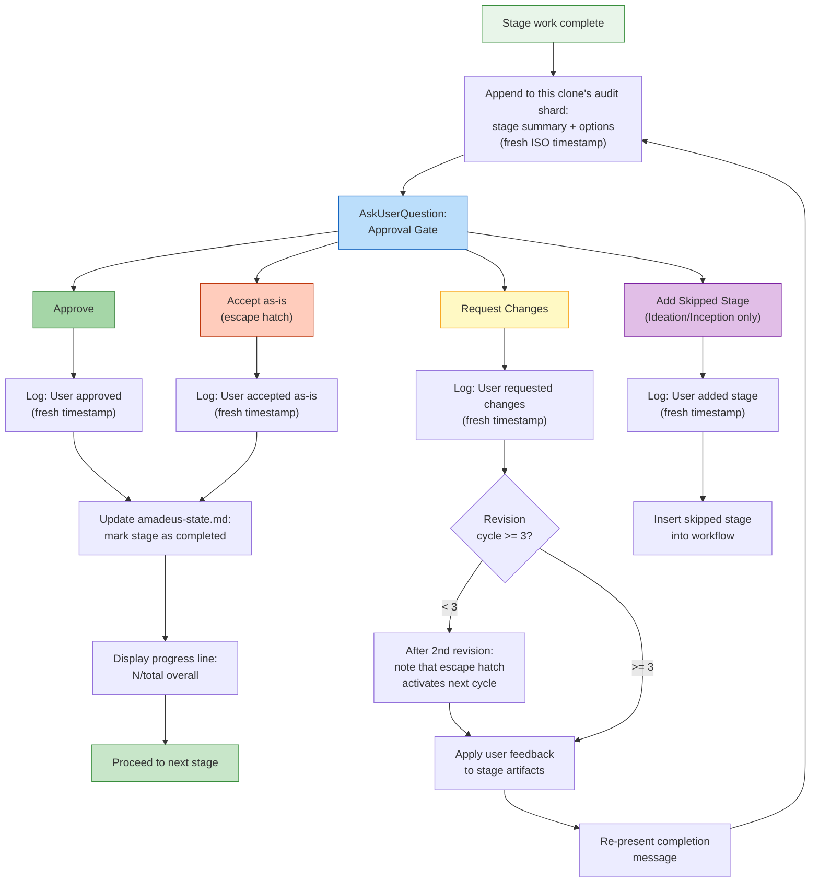

# ステージプロトコルリファレンス

> 言語: [English](04-stage-protocol.md) | **日本語**

機械向けの `dist/claude/.claude/amadeus-common/protocols/stage-protocol.md` を、人間可読に再構成したものです。すべてのルール、条件、振る舞いを保持しつつ、開発者向けに再編成しています。セクション参照(例「Protocol Section 1」)はソースファイルに対応します。

> ステージファイルの *フォーマット*(YAML フロントマター、ボディの慣習)については [Stage Definition](15-stage-definition.ja.md) を参照。この章はランタイムの実行振る舞いをカバーします。

> **パス表記の慣習。** 成果物、状態、監査証跡は、アクティブな intent の **record dir** の下に存在します — `amadeus/spaces/<space>/intents/<YYMMDD>-<label>/`、以下 `<record>/` と表記。監査証跡は、単一ファイルではなく `<record>/audit/<host>-<clone>.md` のクローンごとのシャードのディレクトリです(読み手はタイムスタンプで glob してマージします)。

---

## プロトコルファイル構造

ステージプロトコルは3つのファイルに分割され、ワークフローコンテキストに基づいてコンダクターが条件付きでロードします:

| ファイル | 内容 | ロードされるとき |
|------|----------|-------------|
| `stage-protocol.md` | コアプロトコル: 承認ゲート、完了メッセージ、質問フロー、状態追跡、エージェントペルソナロード、深度ガイダンス、用語、コンテンツ検証、サブエージェント返却フォーマット、§13 Learnings Ritual | すべてのステージ(必須) |
| `stage-protocol-recovery.md` | Error Recovery + Change Handling | セッション再開時、またはステージ途中で変更イベントが検出されたとき |
| `stage-protocol-governance.md` | Phase Boundary Verification(§13) | フェーズ境界(1.7->2.1、2.8->3.1、3.7->4.1)で |

### 条件付きロードロジック(SKILL.md ルーティングから)

コンダクターの Routing セクションがロードルールを定義します:

- **`stage-protocol.md`**: すべてのステージでロード — コアゲート、質問フォーマット、状態追跡、完了メッセージ。
- **`stage-protocol-recovery.md`**: セッション再開時、またはステージ途中で変更イベントが検出されたときにロード。これにより、通常の前進ステージのコンテキストからエラーリカバリと変更処理を除外する。
- **`stage-protocol-governance.md`**: フェーズ境界(1.7->2.1、2.8->3.1、3.7->4.1)で Phase Boundary Verification のトレーサビリティチェックを実行するためにロード。これにより、必要な地点にガバナンスのオーバーヘッドを限定する。

この分割は通常のステージ実行中のコンテキストサイズを削減しつつ、関連するときにリカバリとガバナンスのルールが利用可能であることを保証します。ステージ内の修正を永続的な Rule として捕捉することは、別個のガバナンスフローではなく、`stage-protocol.md`(すべてのステージでロード)の §13 Learnings Ritual によって処理されます。

---

## 概要

ステージプロトコルは、AI-DLC ワークフローのすべてのステージがどう実行されるかを統べる必須の振る舞いの契約です。5つのフェーズ(Initialization、Ideation、Inception、Construction、Operation)にまたがる32ステージすべてが、例外なくこのプロトコルに従います。コンダクター(`SKILL.md`)はステージ実行をエージェントペルソナへ引き渡します。プロトコルはフェーズとエージェントから独立を保ち、任意のステージのドメイン固有の作業を包む構造的ルールを定義します。

プロトコルがカバーするもの: 承認ゲート、完了メッセージ、質問フロー、状態追跡、エージェントペルソナロード、エラーリカバリ、変更処理、深度ガイダンス、コンテンツ検証、サブエージェント返却フォーマット、§13 Learnings Ritual、フェーズ境界検証。

### 重要なコンプライアンスチェックリスト

すべてのステージの前および最中に、よく見落とされる以下のステップを検証してください:

状態遷移と監査発行は、手書きの監査ブロックではなくツールが所有します。コンダクターは `amadeus-orchestrate.ts report --stage <slug>` を通じて前進を報告します。エンジンは状態ツールへ委譲し、それが状態をアトミックに更新し、対になる監査イベントを新鮮なタイムスタンプで発行します。

| # | チェック |
|---|-------|
| 1 | 承認ゲートで、オプションで `bun .claude/tools/amadeus-state.ts gate-start <slug>`(`--stage` ではなく位置引数の slug)を呼ぶ — ツールが状態を `[-]` から `[?]` AwaitingApproval にフリップし、`STAGE_AWAITING_APPROVAL` をアトミックに発行するので、プロンプトが開いている間ステータスに保持中のゲートが表示される。スキップされた場合、エンジンの `report` / `reject` パスが、結果を記録する前に欠落した `STAGE_AWAITING_APPROVAL` 行を(`Recovered=true` タグ付きで)埋め戻す。(`STAGE_STARTED` / `[-]` 遷移は、ステージがアクティブになるとき `advance` / `approve` によって先に発行される。) |
| 2 | `AskUserQuestion` を呼ぶ **前** に `bun .claude/tools/amadeus-log.ts decision` を介してオプションをログする(`audit/` シャードへ手書きしない) |
| 3 | ユーザーが応答した後、`bun .claude/tools/amadeus-log.ts answer` を介して正確な選択をログし、その後、承認には `amadeus-orchestrate.ts report --stage <slug> --result approved` を、変更要求には `amadeus-state.ts reject <slug>` を使う。承認 UI が最初に「Request Changes」の選択のみを捕捉する場合、一度リビジョンフィードバックを尋ね、その後どんなリビジョン作業や再提示ゲートの前にも直ちに `reject` を呼ぶ |
| 4 | ユーザー入力を要約しない — 正確なオプションラベルをログツールへ渡す。自動化ステージには `N/A -- [reason]` を使う |
| 5 | インタラクションごとに1監査エントリ — ログ/状態ツールが単一イベント発行を強制する。複数イベントを1回の呼び出しにマージしない |
| 6 | ステージ終了時、`amadeus-orchestrate.ts report --stage <slug> --result approved`(ゲート済みステージ)または `report --stage <slug> --result completed`(Initialization)を呼ぶ。エンジンが `[?]`/`[-]` を `[x]` にフリップし、ゲート済みなら `GATE_APPROVED` を発行し、状態ツールを通じて `STAGE_COMPLETED` をアトミックに発行する |
| 7 | 作業開始 **前** に、前のステージタスクを `completed`、現在のステージタスクを `activeForm` 付きで `in_progress` にマークする(`sync-statusline` フックが状態同期を処理する) |
| 8 | `knowledge/amadeus-shared/audit-format.md` のイベント種別のみを使う — 状態・ログツールがこれを強制する。`audit/` シャードへ直接書き込まない |
| 9 | `STAGE_STARTED` / `STAGE_COMPLETED` ブロックを `audit/` シャードへ手書きしない。状態ツールのサブコマンドがそれらを発行する。手書きのブロックはアトミック性を壊し、タイムスタンプ保証を欠く |

---

## Approval Gates

3つの Initialization ステージを除くすべてのステージは、進む前に明示的なユーザー承認を要します。承認は構造化 UI オプション付きの `AskUserQuestion` を使います。

ゲートは `amadeus-state.md` の `[?]` AwaitingApproval チェックボックス状態に対応します。却下はステージを `[R]` Revising に遷移させます。完全なステージ状態図と正規の `GATE_APPROVED` / `GATE_REJECTED` / `STAGE_AWAITING_APPROVAL` エミッターについては [State Machine](12-state-machine.ja.md) を参照。

*(Protocol Section 1)*

### 標準2オプションゲート

デフォルトゲートは正確に2つの選択肢を提示します — **Approve**(完了マーク、進む)または **Request Changes**(ユーザーがフィードバックを提供、ステージが再実行、ゲート再提示):

```
AskUserQuestion({
  questions: [{
    question: "[Stage Name] complete. How would you like to proceed?",
    header: "Approval",
    multiSelect: false,
    options: [
      { label: "Approve", description: "Continue to [next stage]" },
      { label: "Request Changes", description: "Provide revision feedback" }
    ]
  }]
})
```

**No Emergent Behavior Rule:** Construction と Operation ステージ(フェーズ 3-4)は常にこの2オプションフォーマットを使わなければなりません。追加のナビゲーションオプションを導入しては決してなりません。

### 条件付き3つ目のオプション

Ideation と Inception ステージ(フェーズ 1-2)は、以前にスキップされたステージを追加し戻せる場合、条件付きで3つ目のオプションを含めてよいです:

```
{ label: "Add [Skipped Stage]", description: "Include [stage] which was skipped" }
```

これがフェーズ 1-2 における3つ目のオプションの唯一の状況です。ラベルは特定のスキップされたステージを参照しなければなりません。

### リビジョンの脱出ハッチ

同じステージで3回の「Request Changes」サイクルの後、4回目以降の承認ゲートは3つ目のオプションを追加します:

```
{ label: "Accept as-is", description: "Archive current version and move on" }
```

質問テキストはサイクルカウントを含むよう変わります:
`"[Stage Name] -- this is revision cycle [N]. How would you like to proceed?"`

**「Accept as-is」が選択されたとき:** `audit/` シャードにログし(「User accepted stage output as-is after [N] revision cycles」)、完了マークし、進む。これは閾値に達したときにのみ Construction ステージについて No Emergent Behavior Rule をオーバーライドします。

**アクティブ化前の通知:** 2回目のサイクル後、含める: 「After one more revision, an 'Accept as-is' option will become available.」

### 承認ゲートフロー



---

## Completion Messages

すべてのステージは、この5部構成で順に終わります。すべての部分は必須です。

*(Protocol Section 2)*

### Part 0: 監査ログ

完了メッセージを表示する前に:
1. `<record>/audit/`(クローンごとのシャード)に append する: ステージ名、作業サマリー、成果物
2. 承認応答を受け取った後、ユーザーの選択を新鮮なタイムスタンプで append する

### Part 1: アナウンス

```markdown
# [emoji] [Stage Name] Complete
```

emoji は各ステージファイルで定義されます。常にレベル1見出し。

### Part 2: サマリー

生成されたものの構造化された箇条書きサマリー:
- 事実的でコンテンツ重視 — ワークフロー指示(「please review」)なし
- 主要成果物のインラインサマリーテーブル(5-10行)を含める:
  ```
  | Artifact | Contents |
  |----------|----------|
  | requirements.md | 6 FR groups (18 sub-requirements), 4 NFRs |
  | requirements-analysis-questions.md | 5 questions, all answered |
  ```
- **セッションの最初の完了** は含めなければならない:
  `**Project depth**: [Minimal/Standard/Comprehensive] -- depth adapts artifact detail. You can request different depth at any approval gate.`

### Part 3: レビュー + 承認

```markdown
**Review:** `<record>/[path to artifacts]`
```

続いて `AskUserQuestion` 承認ゲート(Approval Gates セクションを参照)。

### Part 4: 進捗更新

ユーザーが承認した後、進む前に表示:

```
Progress: [N]/[total] overall | [phase-N]/[phase-total] [Phase] stages complete. Next: [Next Stage Name]
```

現在フェーズのステージのみをカウント。分子には完了とスキップを含める。例: `Progress: 13/32 overall | 3/7 IDEATION stages complete. Next: Approval & Handoff`

---

## Question Flow

ステージが質問を通じてユーザー入力を集めるとき、プロトコルはバッチルール、必須の回答分析、曖昧さ検出を伴う4モードのインタラクションフローを定義します。

*(Protocol Section 3)*

### 質問インタラクションモード

**Step 1: 質問ファイルを作成する** — 適切な `<record>/` ディレクトリに、A-E のオプション付きの `[Answer]:` タグフォーマットで。すべての質問は `X. Other (please specify)` で終わらなければならない — 例外なし。すべての `[Answer]:` タグは空白で始まる。マルチセレクト質問は質問テキストに「(select all that apply)」を追加する。回答フォーマット: `[Answer]: A, B, E`。

**Step 2: モード選択を提示する:**

```
AskUserQuestion({
  questions: [{
    question: "I've created [N] questions at `[file path]`. How would you like to answer them?",
    header: "Questions",
    multiSelect: false,
    options: [
      { label: "Guide me", description: "Walk through each question interactively here" },
      { label: "Grill me", description: "One question at a time, in depth -- recommended answers included, until we reach a shared understanding" },
      { label: "I'll edit the file", description: "I'll fill in the answers in the file directly" },
      { label: "Chat", description: "Discuss freely -- I'll extract decisions from our conversation" }
    ]
  }]
})
```

モード選択を `audit/` シャードにログする。ユーザーはステージ途中でモードを切り替えられる。

#### Guide Me(インタラクティブモード)

- `AskUserQuestion` を介してバッチで提示(呼び出しごとに最大4質問、質問ごとに最大4オプション)
- 5つ以上のオプションを持つ質問: 複数の呼び出しに分割(各4オプション)。ユーザーはすべてのオプションを見なければならない。ファイルは完全なオプションセットを保持する。
- 組み込みの「Other」が議論をトリガーする。最初のバッチの前にユーザーに伝える: 「Select 'Other' on any question to discuss it before answering.」
- 各バッチの後、直ちに回答を質問ファイルに書く
- 各バッチを新鮮な ISO タイムスタンプでログする

#### Grill Me(グリリングモード)

- `amadeus-common/protocols/grilling-protocol.md` に従う — グリリングの規律の単一のソース(mattpocock/skills、MIT から翻案)。一度に1質問。各質問は根拠付きの推奨回答を運ぶ。事実は自己リサーチされ、決定のみが尋ねられる。ハイブリッド終了(いつでも「done」、深度ガイドラインで継続チェック)。生成前に明示的に確認された合意サマリー。
- ワークフロー上の義務: 動的に生成される各質問は、提示する **前** に空白の `[Answer]:` タグとともに質問ファイルに append される。各回答は直ちに書き戻される。質問ごとに `decision`/`answer` 監査イベントがログされる(既存のイベント種別のみ)。
- Construction と Operation フェーズでは、モードオプションは例外的使用として注記される。
- Step 4 以降(完全性検証、矛盾分析、成果物生成、ゲート)は不変 — グリリングは Step 3 の対話のみを置き換える。

#### Edit File(自己主導モード)

- ユーザーに伝える: 「Edit the file at `[file path]`. When done, send **done** or **ready** and I'll continue.」
- 完了シグナルを待つ。シグナルが来るまでファイルを読んだり進んだりしない。

#### Chat(フリーフォームモード)

- オープンエンドの会話。決定が現れるにつれて抽出する
- 終了シグナル: 「When ready to proceed, say **done** and I'll summarize.」
- 抽出した回答を値、タイムスタンプ、`**Mode:** chat` とともにファイルに書く
- 進む前に確認のため決定サマリーを提示する
- 最適: 探索的ステージ、ブレインストーミング、議論を要する質問

**Step 4: 完全性を検証する。** ファイルを読み、すべての `[Answer]:` タグが埋まっていることを確認する。空白があれば、`AskUserQuestion` を介して未回答を提示する。部分的な回答で進まない。ファイルが権威ある記録である。

### バッチルール

| 制約 | 上限 |
|-----------|-------|
| `AskUserQuestion` 呼び出しごとの質問数 | 最大4 |
| 呼び出しごとの質問あたりオプション数 | 最大4 |
| 5つ以上のオプションを持つ質問 | 複数の呼び出しに分割 |

### 回答分析

回答を収集した後、すべての応答を分析する(必須):
- **曖昧な回答**: 「mix of」、「not sure」、「depends」、「probably」
- 回答間の **矛盾**
- 次のステップに必要な **欠落した詳細**

いずれかの曖昧さが見つかった場合、フォローアップの質問を作成し、進む前に解決する。**疑わしいときは尋ねる。**

### 曖昧さ検出

**無効/欠落回答の処理:**

| 条件 | アクション |
|-----------|--------|
| 空白またはアンダースコアのみの `[Answer]:` | 未回答をリストし、ユーザーに完成を求める |
| オプション(A-E、X)にマッチせず、明確な自由記述でもない回答 | ユーザーに明確化を求める |
| 曖昧(「maybe B」、「either A or C」) | ユーザーに単一の選択にコミットするよう求める |

**矛盾検出** — 全回答セットを相互チェックする:

| 種別 | 例 |
|------|---------|
| スコープの不一致 | 「Keep it simple」+ エンタープライズグレードの機能要求 |
| リスクの不一致 | 「Security not a concern」+ 機密データ処理 |
| 技術の衝突 | Offline-first + リアルタイムコラボレーション |
| タイムライン vs スコープ | MVP タイムライン + フル機能スコープ |

検出されたとき: 矛盾する回答を並べて提示し、衝突を説明し、的を絞ったフォローアップを尋ねる。解決するまで進まない。

**過信の防止:**
- 想定ではなく尋ねることをデフォルトにする。曖昧さのまま決して進まない。
- フォローアップを要する危険信号: オープンエンドの質問への単語のみの回答、「whatever you think」/「up to you」、矛盾するシグナル、質問回避
- ユーザーが AI に委ねるとき: 「I want to make sure the design reflects YOUR priorities. Could you tell me [specific aspect]?」

### Plan と Question ファイルの場所

ファイルは集中化されず、ステージ成果物と共置されます。例: `<record>/inception/user-stories/user-stories-questions.md`。ステージのすべての入力、質問、出力は同じディレクトリに存在します。

---

## State Tracking

状態は複数のレベルで維持されます: 状態ファイルのステージチェックボックス、サイドバーのタスク状況、監査エントリの ISO タイムスタンプ、構造化された監査ログエントリ。

*(Protocol Section 4)*

### チェックボックス状態

| チェックボックス | 意味 |
|----------|---------|
| `[ ]` | 未開始 |
| `[-]` | 進行中(実行中、未承認) |
| `[x]` | 完了(ユーザーが承認) |
| `[S]` | `--stage` または `--phase` ジャンプでスキップ |

**強制:** ステージ開始時、`[-]` にマーク。ステージ終了時(承認後)、`[x]` にマーク。`[ ]` から `[x]` へ直接行くことで `[-]` をスキップしない。

**`[S]` の振る舞い:**
- ジャンプターゲット前のすべてのスコープ内ステージについて Stage/Phase Jump ハンドラが設定
- ステータスライン進捗カウントから除外(total にも done にもカウントされない)
- 通常のステージ進行では変更されない(sed パターンは `[S]` にマッチしない)
- 再開時、タスク追跡のため completed として扱う(タスクが作成され直ちに completed マーク)
- 通常のワークフロー実行中には決して設定されない — 明示的な `--stage`/`--phase` ジャンプのみ

### タスク状況遷移

いかなるステージを開始する前にも、サイドバータスクを遷移する:

1. 前のステージタスク `in_progress` -> `completed` にマーク
2. 現在のステージタスク -> `activeForm: "Running [Stage Name]"` で `in_progress` にマーク

ルール: スピナーを表示するにはタスクが `in_progress` でなければならない。ステージファイルを読む **前** に更新。全32ステージに適用。タスク ID が失われた場合(圧縮)、`TaskList` を使って subject で見つける。スキップステージには:
`TaskUpdate({ taskId: [ID], status: "completed", description: "[original] -- Skipped: [reason]" })`

### プランレベルのチェックボックス強制

2レベルの追跡が同期を保たなければなりません:
- **プランレベル**: 個々の作業項目(各ユーザーストーリー、各コンポーネント)
- **状態レベル**: `amadeus-state.md` のステージ完了

ステップが完了していれば、そのチェックボックスはチェックされる。チェックされていれば、ステップは完了していなければならない。各ステップを完了した直後に更新する。

### タイムスタンプ

フォーマット: `date -u +"%Y-%m-%dT%H:%M:%SZ"` を介した ISO 8601 UTC。Bash 経由で実行。日付のみは決して不可。監査エントリごとに1つの Bash 呼び出し — タイムスタンプを決して再利用しない。

### 監査ログフォーマット

`<record>/audit/`(クローンごとのシャード)のルール: 常に append(決して上書きしない)。「User Input」フィールドは COMPLETE かつ UNMODIFIED でなければならない。表示する **前** にプロンプトをログ。受け取った **後** に応答をログ。なければ `# AI-DLC Audit Log` ヘッダーで作成。破損していればバックアップ。Edit が失敗したら一度リトライ(Read と Edit の間にフックが変更するかもしれない)。

#### 標準会話イベント

```markdown
## [Stage Name]
**Timestamp**: [YYYY-MM-DDTHH:MM:SSZ]
**User Input**: "[Complete raw input -- never summarize]"
**AI Response**: "[Action taken]"
**Context**: [Stage, decision made]
---
```

#### エラーログ

```markdown
## Error: [Brief Description]
**Timestamp**: [ISO timestamp]
**Severity**: [Critical/High/Medium/Low]
**Type**: [Parse error/Missing artifact/State corruption/Validation failure]
**Description**: [What went wrong]
**Cause**: [Root cause or best assessment]
**Resolution**: [Action taken]
**Impact**: [Artifacts affected, stages delayed, data lost]
---
```

#### リカバリログ

```markdown
## Recovery: [Brief Description]
**Timestamp**: [ISO timestamp]
**Issue**: [What triggered recovery]
**Recovery Steps**: [Numbered list of actions]
**Outcome**: [Successful/Partial/Failed -- current state after recovery]
**Artifacts Affected**: [Files created, restored, or rebuilt]
---
```

#### 変更要求ログ

```markdown
## Change Request: [Brief Description]
**Timestamp**: [ISO timestamp]
**Request**: [User's exact change request -- complete raw input]
**Current State**: [Which stage, what exists, what would change]
**Impact Assessment**: [Stages affected, artifacts to regenerate, scope change]
**User Confirmation**: [User's approval response]
**Action Taken**: [What was done]
**Artifacts Affected**: [Files changed]
---
```

#### 質問インタラクションログ

```markdown
## Questions: [Stage Name] -- [Mode choice / Batch N of M]
**Timestamp**: [ISO timestamp]
**User Input**: "[Exact user selection -- option labels as displayed]"
**AI Response**: "[Wrote answer to file / Presented next batch / Proceeded to analysis]"
**Context**: [Stage name, file path, question numbers covered]
---
```

### 会話イベントログチェックリスト

`PostToolUse` フックがファイル書き込みを自動ログします。会話イベントは手動でログしなければなりません(最もよく見落とされるステップ)。

**各承認ゲートで:** (1) `AskUserQuestion` の **前** — オプションを新鮮なタイムスタンプで append。(2) 応答の **後** — ユーザーの選択を新鮮なタイムスタンプで append。

**各質問インタラクションで:** 回答を受け取った **後** — Q&A サマリーを append。

---

## Agent Persona Loading

各ステージはリードエージェントとオプションのサポートエージェントを指定します。ペルソナは、広いコンテキストからステージ固有の成果物へ構築する6ステップの知識順序を通じてロードされます。

*(Protocol Section 5)*

### 6ステップの知識ロード順序

完全なロード順序については [Knowledge System](10-knowledge-system.ja.md) を参照。

Step 1-3 はフレームワークとともに出荷されます。Step 4-5 はユーザー管理です。Step 6 はワークフロー位置ごとに動的です。

### インラインステージ

1. リードエージェントのフラットファイルを読む(例 `agents/amadeus-architect-agent.md`)
2. 6ステップ順序に従って知識をロード
3. 実行中にエージェントの視点を適用

### サブエージェントステージ

1. Claude Code の Task ツールプロンプトにエージェントペルソナコンテキストを含める
2. 関連する以前の成果物をコンテキストとして渡す
3. ステージメタデータから `subagent_type` を指定

### マルチエージェントステージ

コンダクターはリードエージェントを最初に投入し、その後リードの出力をコンテキストとして各サポートエージェントを投入します。*どのように* 投入するかは `directive.mode` に従います: インラインステージ(出荷グラフのすべてのマルチエージェントステージ)では、サポートエージェントはコンダクターが自身のコンテキストにロードするペルソナ — `Task` ディスパッチではありません。`Task` は `mode: subagent` ステージのために予約されています。いずれにせよコンダクターがすべての委譲を実行します。エージェントがサブエージェントを起動することは決してありません。

例: Feasibility は `amadeus-architect-agent`(リード)+ `amadeus-aws-platform-agent` + `amadeus-compliance-agent` を、すべてインラインで使います。

### 11個のエージェント

amadeus-product-agent、amadeus-design-agent、amadeus-delivery-agent、amadeus-architect-agent、amadeus-aws-platform-agent、amadeus-compliance-agent、amadeus-devsecops-agent、amadeus-developer-agent、amadeus-quality-agent、amadeus-pipeline-deploy-agent、amadeus-operations-agent。

---

## Error Recovery

*(Protocol Section 6)*

### 再開コンテキスト

セッション開始時に `amadeus-state.md` が存在する場合、コンダクターはそれを読んで完了ステージ(`[x]`)、現在/次のステージ、成果物の存在を判定し、その後最後の未完了ステージから再開することを提示します。

### フェーズごとの再開コンテキストロード

| フェーズ/ステージグループ | ロードするコンテキスト |
|-------------------|----------------|
| **Initialization (0.1-0.3)** | ワークスペースファイルシステム、`amadeus-state.md` |
| **Ideation (1.1-1.7)** | `<record>/ideation/` 成果物、ガードレール |
| **Inception -- RE** | RE 成果物、ideation scope/feasibility |
| **Inception -- Requirements** | RE 成果物(実行された場合)、requirements-analysis ドキュメント |
| **Inception -- Design** | Requirements、user stories、application-design ドキュメント |
| **Inception -- Delivery Planning** | すべての inception 成果物、部分的なら delivery-planning |
| **Construction -- Code Gen** | 現在のユニットの design 成果物、story design、acceptance criteria、以前のコード |
| **Construction -- Build/Test** | 現在のユニットのコード、test plans、acceptance criteria、build config |
| **Construction -- CI/Infra** | infrastructure design、code generation 出力 |
| **Operation (4.1-4.7)** | Construction 出力、これまでの operation 成果物。4.4+ には 4.1-4.3 のデプロイ出力 |

### 再実行の振る舞い

ステージが再実行を要する場合(承認後に変更要求):
1. ステージファイルを再読
2. 以前の成果物をコンテキストとしてロード
3. 再実行、以前の成果物を上書き
4. 新しい完了メッセージを提示

### 圧縮リカバリ

`PreCompact` フックが圧縮前に `amadeus-state.md` 構造を検証します(情報提供のみ、ブロック不可)。最後に検証された状態(ステージ、タイムスタンプ)で `.amadeus-recovery.md` パンくずを書きます。再開時、コンダクターはパンくずを状態ファイルと比較し、圧縮関連の破損を検出します。

### 破損した状態ファイルのリカバリ

`amadeus-state.md` が存在するがパースできない場合:
1. `amadeus-state.md.bak` にバックアップ
2. 実際の完了を判定するため `<record>/` を成果物についてスキャン:
   - RE 分析ファイル -> RE ステージ完了
   - Requirement ドキュメント -> requirements 完了
   - Design ドキュメント -> design 完了
   - story design にマッチするコード -> code gen 完了
3. 成果物の証拠から状態を再構築
4. 「Current Status」を証拠を欠く最初のステージに設定
5. ユーザーに通知: 「State file was corrupted. Rebuilt from artifacts. Please verify.」

### 欠落成果物リカバリ

ステージがディスク上に存在しない成果物を参照する場合:
1. 欠落成果物をリスト
2. 生成ステージが完了マークされているかチェック
3. 完了だが欠落: ユーザーに通知、再実行または手動提供を提示
4. 未完了: ステージを通常どおり実行

### 矛盾する入力のリカバリ

異なるステージのユーザー入力が矛盾する場合:
1. 両方のソースからの引用付きで具体的な矛盾をフラグ
2. 1つの解釈を選ぶことで解決しない
3. どちらが優先するか尋ねる
4. オーバーライドされた成果物を更新
5. `audit/` シャードに解決をログ

### 重大度レベル

| 重大度 | 説明 | 例 | アクション |
|----------|-------------|----------|--------|
| **Critical** | 続行不可 | 状態破損、重要成果物の欠落、回復不能なパースエラー | 停止、直ちにユーザーに尋ねる |
| **High** | 出力が誤りかもしれない | 矛盾する入力、不完全な回答、依存関係の欠落 | 停止、直ちにユーザーに尋ねる |
| **Medium** | 品質低下 | 曖昧な応答、部分的なコンテキスト、曖昧な要件 | 解決を試みる。未解決ならユーザーに尋ねる |
| **Low** | 見た目のみ | フォーマット、命名、スタイルの問題 | 静かに処理、`audit/` シャードにログ |

---

## Change Handling

ワークフロー途中の変更の5カテゴリ。それぞれ異なる処理を持ちます。

*(Protocol Section 7)*

### 軽微な変更

現在のステージのみに影響。成果物に変更を適用し、完了メッセージを再提示。ロールバック不要。

### 重大な変更

以前のステージに影響:
1. 影響を受ける以前のステージを特定
2. `AskUserQuestion` を介して影響分析を提示
3. 承認されれば、影響を受けるステージを順に再実行
4. `amadeus-state.md` を更新

### スコープ変更

新しい要件またはスコープレベルの変更:
1. `audit/` シャードに文書化
2. Requirements Analysis(2.3)または Delivery Planning(2.8)へ戻る
3. その地点から再計画
4. 変更がステージ選択に影響する場合(例 `poc` -> `feature`)、`amadeus-state.md` のスコープを更新

### ユニット変更

| 変更 | 手順 |
|--------|-----------|
| **Add** | プランに追加、story design を作成、build order にスロット。完了したユニットを再実行しない。 |
| **Remove** | スキップマーク、成果物をアーカイブ。依存関係をチェック — 依存先への影響をフラグ。 |
| **Split** | 元をアーカイブ、2つのエントリを作成、ストーリーを分配、各々に story design を実行。 |

### アーキテクチャ変更

アプリケーションアーキテクチャに影響(DB 切り替え、デプロイモデル、主要な統合):
1. スコープを特定: 影響を受ける design 成果物、story design、生成コード
2. 完全な影響分析を提示
3. 承認されれば、App Design ステージへ戻りそこから再実行
4. 影響を受けるユニットのすべての下流成果物を再生成
5. 影響を受けないユニットを保持

### 変更前のアーカイブ

成果物を上書きする重大な変更の前に:
1. 必要なら `<record>/archive/` を作成
2. 影響を受ける成果物を `<record>/archive/[ISO-date]-[stage-name]/` へコピー
3. 進む。以前の作業は永久には失われない。

---

## Depth Guidance

必要な詳細を正確に作成する — それ以上でもそれ以下でもなく。深度はスコープと問題の複雑さに適応します。

*(Protocol Section 8)*

### スコープから深度へ、およびテスト戦略のデフォルト

| スコープ | デフォルト深度 | テスト戦略 | 典型的なステージ | 注 |
|-------|--------------|---------------|---------------:|-------|
| enterprise | Comprehensive | Comprehensive | 32 | 全ステージ |
| feature | Standard | Standard | 32 | 全ステージ |
| mvp | Standard | Standard | 22 | Operation を全スキップ |
| poc | Minimal | Minimal | ~8 | Initialization + Ideation + コア Inception |
| bugfix | Minimal | Minimal | ~8 | 対象を絞る |
| chore | Minimal | Minimal | 5 | 小さな自己完結の修正 |
| refactor | Minimal | Minimal | 8 | 対象を絞る |
| infra | Standard | Standard | ~13 | インフラ重視 |
| security-patch | Minimal | Minimal | ~10 | セキュリティ重視 |
| workshop | Standard | **Minimal** | 25 | 学習のための Standard 深度、ペースのための Nyquist テスト |

ユーザーは任意の承認ゲートで深度またはテスト戦略をオーバーライドできます。

### 3つの深度レベル

**Minimal**(poc、bugfix、chore、refactor、security-patch)— 最小限の成果物、簡潔な分析、オプションステージをスキップ:
- Requirements: 5-10 項目、簡潔な説明、最小限の NFR
- App Design: 単一のコンポーネント図、基本的なデータモデル、ADR なし
- Functional Design: 簡潔なビジネスルール、単純なエンティティ、`frontend-components.md` をスキップ

**Standard**(feature、mvp、infra)— 中程度の詳細でフルの成果物:
- Requirements: 受け入れ基準付きで 15-30、中程度の NFR
- App Design: インタラクション付きのコンポーネント図、関係、2-3 ADR
- Functional Design: 詳細なビジネスロジック、包括的なルール、エンティティライフサイクル

**Comprehensive**(enterprise)— 深い分析、全ステージ実行:
- Requirements: 30+、詳細な基準、全カテゴリにわたる包括的な NFR
- App Design: 多層図、詳細なデータフロー、統合シーケンス、代替案付きの 5+ ADR
- Functional Design: 決定木、状態機械、並行性、エラーリカバリ、ユニット横断パターン

---

## Terminology Glossary

*(Protocol Section 9)*

| 用語 | 定義 |
|------|-----------|
| **AI-DLC** | AI-Driven Development Life Cycle — このシステムが実装する方法論 |
| **Phase** | トップレベルのグループ化: Initialization、Ideation、Inception、Construction、Operation |
| **Stage** | フェーズ内の個別のステップ(例 Intent Capture、Code Generation) |
| **Scope** | どのステージがどの深度で実行されるかを制御(enterprise、feature、mvp、poc、bugfix、chore、refactor、infra、security-patch、workshop) |
| **Depth** | 成果物の詳細スケール: Minimal、Standard、または Comprehensive |
| **Unit of Work** | 独立して実装可能な機能パッケージ。Construction のイテレーション単位。ステージ 3.1-3.7 を1回通過する。 |
| **Service** | デプロイ可能なプロセスまたはコンテナ(API サーバー、ワーカー、フロントエンドアプリ) |
| **Module** | サービス内のコードレベルの組織境界(パッケージ、名前空間) |
| **Component** | モジュール内の論理的な構成要素(クラス、関数グループ、UI コンポーネント) |
| **Planning** | markdown 成果物を生成するステージ(分析、質問、設計) |
| **Generation** | 実行可能コードを生成するステージ(Code Generation、Build and Test) |
| **Artifact** | 決定、設計、または分析を記録する `<record>/` 内のバージョン管理された markdown ファイル |
| **Guardrail** | space メモリ層(`amadeus/spaces/<space>/memory/`)に保存された学習済みの振る舞いのルール |
| **Approval Gate** | ユーザーが承認または変更要求する構造化プロンプト |
| **Inline Stage** | オーケストレーター会話で直接実行するステージ |
| **Subagent Stage** | Claude Code の Task ツール呼び出しへ実行を委譲するステージ |
| **Lead Agent** | ステージの作業に責任を持つ主要なエージェントペルソナ |

---

## Content Validation

*(Protocol Section 10)*

### Mermaid ルール

いかなる Mermaid 図を書く前にも:
1. 構文を検証する(バランスの取れた波括弧、有効なノード/エッジ、エスケープされていない特殊文字なし)
2. 参照されるすべてのノードが宣言されていることを保証する
3. テキストフォールバックを含める: `<!-- Text fallback: [description] -->`

### 作成前チェックリスト

いかなる成果物を作成する前にも:
- 参照されるすべてのエンティティが以前の成果物に存在する
- 既存の成果物と命名の衝突がない
- ファイルパスがステージの慣習に合致する

### ASCII 図の標準

基本 ASCII のみを使う: `+` `-` `|` `^` `v` `<` `>` `/` `\` に加え英数字とスペース。禁止: Unicode 罫線(U+2500-U+257F)。文字幅ルール: ボックス内のすべての行は等しい文字数を持たなければならない。

参照パターン:
```
+------------------+       +---------------------------+
| Component Name   |       | Outer                     |
+------------------+       |  +-----+  +-----+        |
                           |  | A   |  | B   |        |
[Source] -----> [Target]   |  +-----+  +-----+        |
[Source] <----> [Target]   +---------------------------+
```

### 文字エスケープ

| 文字 | ルール |
|-----------|------|
| パイプ(`\|`) | テーブルセル内でエスケープ |
| 山括弧 | HTML タグでないときエスケープ |
| コードフェンス | 言語識別子付きのトリプルバッククォート |
| Mermaid ラベル | 特殊文字を引用符で囲む |

---

## Subagent Return Summary

サブエージェントが完了したとき、コンテキストが失われないよう、構造化サマリーをコンダクターへ返さなければなりません。

*(Protocol Section 11)*

### 必須フォーマット

```markdown
## Subagent Summary: [Stage Name]
### Produced
- [file path]: [brief description]
### Key Decisions
- [Decision]: [rationale]
### Issues / Concerns
- [Problems, edge cases, risks] or "None"
### Next Steps
- [What orchestrator should do next]
```

**コンダクターのルール:** 進む前にサマリーを読まなければならない。空でない Issues/Concerns はユーザーに提示しなければならない。期待より少ないファイルは、完了マークする前に調査を要する。

### コンテキスト予算

| ルール | 詳細 |
|------|--------|
| 現在ユニットのみ | 現在のユニットの design 成果物のみ渡す |
| inception を要約 | inception 成果物ごとにパス付きの1-2行サマリー。サブエージェントが必要なら Read |
| 常に含める | エージェントペルソナ、知識ファイル、`amadeus-state.md`、タスク指示 |
| 知識ファイルを制限 | 最も関連する3つまで。他はパスでリスト |

### 失敗リカバリ

1. **一度リトライ** する。コンテキストを削減して(inception を要約、現在ユニットのみ)
2. リトライが失敗したら、ユーザーに提示: 「Run inline」(オーケストレーターで実行)または「Skip and revisit」(未完了マーク、続行)
3. Error ログフォーマットを使って `audit/` シャードに失敗をログ

---

## Reviewer Invocation

`run-stage` ディレクティブが非 null の `reviewer` フィールドを運ぶとき、コンダクターはステージボディが成果物を生成した後、かつ §13 Learnings Ritual と承認ゲートの前に、そのレビュアーを **別個のサブエージェント** として呼び出します。ステージの儀式シーケンスの全体: questions → artifact → reviewer(宣言されている場合)→ learnings → gate。

*(Protocol Section 12a)*

1. **Invoke.** `directive.reviewer` で名指しされたエージェントへ委譲し、ステージ定義パス、Q&A ファイル、生成された成果物パス、フロントマターの任意の検証ツールを渡す — ビルダーの `memory.md` やプランは決して渡さない。レビュアーが独立した判断を形成するため。
2. **Review.** レビュアーは定義、Q&A、成果物を読み、リストされた検証ツールを実行し、**READY** または **NOT-READY** の判定とともに `## Review` セクションを主要成果物に append する。
3. **Verdict.** READY → learnings の儀式、その後ゲートへ進む。NOT-READY でイテレーションが `reviewer_max_iterations`(デフォルト2)未満で残っている → リードエージェントが指摘に対処するため再実行し、レビュアーが再チェックする。NOT-READY でイテレーションが尽きた → 未解決の指摘を注記してゲートへ進む。

レビュアーは決してブロックしません — 人間が常にゲートで最終決定権を持ちます — そして `reviewer` フィールドのないステージでは発火しません。[Stage Definition](15-stage-definition.ja.md) の `reviewer` / `reviewer_max_iterations` フロントマターフィールドを参照。

---

## Learnings Ritual

人間がエージェントの振る舞いを修正すると、その修正は次のワークフローのための永続的なルール(ガードレール)になり得ます。v0.5.0 はこれを、別個のガードレール発行フローではなく、ツール・アズ・アクターの Learnings Ritual を通じて処理します。

*(Protocol Section 13)*

この儀式は、完了メッセージと承認ゲートの間で、すべてのゲート済みステージで実行されます:

1. **Diary**: エージェントは作業しながらステージごとの `memory.md`(Interpretations / Deviations / Tradeoffs / Open questions)を維持する。
2. **Surface**: `amadeus-learnings.ts surface --slug <slug>` が diary を読み、構造化された候補を発行する — LLM は再パースや分類をしない。
3. **Confirm**: コンダクターが候補をレンダリングする。ユーザーがどれを残すかを選び、自由記述の追加については行き先を導出する見出しを選ぶ。
4. **Admission check**: 残された各学習が `org.md` の対応するセクションに対してチェックされる。矛盾は revise / skip / escalate のため表面化される。
5. **Persist**: `amadeus-learnings.ts persist` が確認された各学習をプラクティスとして `amadeus/spaces/<space>/memory/{project,team}.md` に書き込む(そしてセンサーバインディングの学習については、マニフェスト + ステージ `sensors:` インポートを1つのロックされたトランザクションでインストールする)。`RULE_LEARNED` / `SENSOR_PROPOSED` を発行する。

学習は飛行中の実行ではなく **次の** ワークフローのコンパイルで適用されます。完全なツール・アズ・アクタープロトコルについては `stage-protocol.md` §13 を、書かれたルールが供給される strict-additive 解決については [Rule System](08-rule-system.ja.md) を参照。

---

## Phase Boundary Verification

各フェーズ遷移で、トレーサビリティ検証が、完了したフェーズの出力が次のフェーズに対して十分かつ一貫していることを保証します。

*(`stage-protocol-governance.md` Section 13 — Learnings Ritual とは別。それは `stage-protocol.md` Section 13)*

### トリガー

- 各フェーズの最後のステージが承認された後
- 次のフェーズの最初のステージが始まる前
- `/amadeus --status` を介してオンデマンドで

### プロセス

1. `.claude/knowledge/amadeus-shared/verification.md` から方法論を読む
2. フェーズ固有のトレーサビリティチェックを実行
3. 結果を `<record>/verification/[phase-boundary]-verification.md` に書く
4. 失敗した場合: 進む前に問題(リンク欠落、孤立した成果物、不整合)を提示
5. `PHASE_VERIFIED` を `audit/` シャードにログ

### フェーズごとのチェック

| 境界 | 検証内容 |
|----------|---------|
| **Ideation -> Inception** | intent 捕捉、スコープ定義、feasibility 確認、initiative 承認 |
| **Inception -> Construction** | すべての requirements が design にトレース、units 定義、delivery plan 承認 |
| **Construction -> Operation** | すべての units が build/test 済み、CI pipeline 設定済み、infrastructure 設計済み |

### トレーサビリティマトリクス

検証はトレース可能なチェーンを保証します:
```
Intent -> Scope -> Requirements -> Designs -> Units -> Code -> Tests -> Deployment
```

各境界で、左側のすべての成果物は右側に対応する成果物を持たなければなりません。リンク欠落、孤立、不整合はユーザーレビューのためフラグされます。

---

## 相互参照

- [Architecture](01-architecture.ja.md) — 5層モデル、設計上の決定
- [Orchestrator](03-orchestrator.ja.md) — SKILL.md の詳細
- [Stages](04-stages/) — フェーズごとのステージドキュメント
- [Agent System](05-agent-system.ja.md) — エージェント構造、フロントマター
- [Hooks and Tools](06-hooks-and-tools.ja.md) — フックシステム、監査イベント
- [Knowledge System](10-knowledge-system.ja.md) — ロード順序、テンプレート
- [Diagrams](diagrams.ja.md) — すべての図を一箇所に集約
