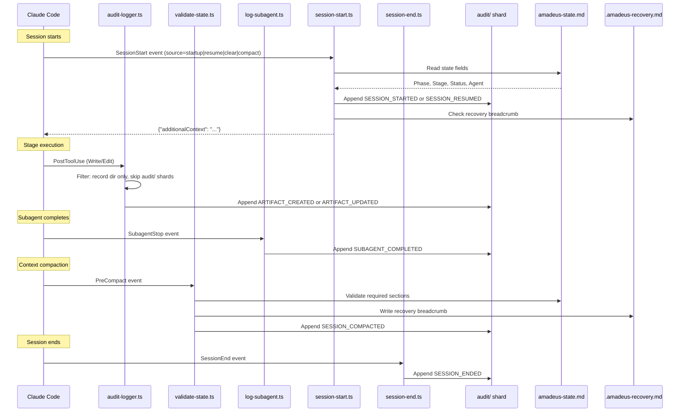

# フックとツール

この章では、フックシステムのアーキテクチャ、11個すべてのフックスクリプト、監査イベントの分類体系、CLIツール設定、および決定論的なユーティリティツールを解説します。

> **パス規約。** 状態、監査、成果物は、アクティブなintentの**record dir** — `amadeus/spaces/<space>/intents/<YYMMDD>-<label>/` — の配下に置かれ、本書では `<record>/` と表記します(record dir が時系列でソートされるよう、コンパクトなUTC日付プレフィックスに短いkebab-caseのラベルを付けたもの。正典のidは `intents.json` レジストリ行のUUIDv7)。監査証跡は単一ファイルではなく、`<record>/audit/` 配下のper-cloneシャードのディレクトリです。

---

## フックシステムのアーキテクチャ

この実装は `.claude/hooks/` にある11個のフックスクリプトを使用します。11個すべてがTypeScript(`bun` 経由で実行)です。11個すべてが**プロジェクト全体**です — `settings.json` に登録され(ステータスラインはトップレベルの `statusLine` キー経由、他の10個は `hooks` ブロック経由)、どのスキルがアクティブかにかかわらず発火します。以前は分割されていました(6個は `amadeus/SKILL.md` フロントマターでスキルスコープとして宣言され、残りはプロジェクト全体)。v0.6.0 でスキルスコープの6個を `settings.json` に移し、すべてのエントリポイント — オーケストレーター、パッケージ化された各スコープ/ステージランナー、任意の手書きのカスタマーランナー — がper-runnerの `hooks:` ブロックなしに決定論的なスパインを継承するようにしました。これが安全なのは、すべてのフックが**セルフゲート**するからです。アクティブなワークフローがない場合(`amadeus-state.md` / アクティブintentの `audit/` シャードが存在しない場合)に早期終了するため、常時オンでもAI-DLCの外では無操作です。

11個のうち10個は**非ブロッキング**です — 観測してexit 0し、制御フローを決して変更しません。1つ、`Stop` フック(`amadeus-stop.ts`)は**フロー変更**です。インタラクティブな転送ループを継続させるために `{"decision":"block"}` を返すことがあります。これはループ強制のための承認済みかつ意図的な契約であり、他のすべてのフックが守るアドバイザリーな `never-block` 契約とは区別されます(後述の「フロー変更する `Stop` フック」を参照)。

```
.claude/hooks/
+-- mint-presence.ts     # UserPromptSubmit + PostToolUse AskUserQuestion (project-wide, settings.json, TypeScript)
+-- audit-logger.ts      # PostToolUse Write|Edit (project-wide, settings.json, TypeScript)
+-- sensor-fire.ts       # PostToolUse Write|Edit (project-wide, settings.json, TypeScript)
+-- sync-statusline.ts   # PostToolUse TaskUpdate (project-wide, settings.json, TypeScript)
+-- runtime-compile.ts   # PostToolUse Bash (project-wide, settings.json, TypeScript)
+-- validate-state.ts    # PreCompact (project-wide, settings.json, TypeScript)
+-- log-subagent.ts      # SubagentStop (project-wide, settings.json, TypeScript)
+-- amadeus-stop.ts        # Stop (project-wide, settings.json, TypeScript, flow-altering)
+-- session-start.ts     # SessionStart (project-wide, settings.json, TypeScript)
+-- session-end.ts       # SessionEnd (project-wide, settings.json, TypeScript)
+-- amadeus-statusline.ts  # statusLine (project-wide, settings.json, TypeScript)
```

### フックの概要

| フック | イベント | スコープ | マッチャー | 目的 |
|------|-------|---------|---------|---------|
| `mint-presence.ts` | UserPromptSubmit + PostToolUse | プロジェクト全体 (settings.json) | (空) / `AskUserQuestion` | 実際の人間のプロンプトごと、および回答済みの `AskUserQuestion` ウィジェットごとに `HUMAN_TURN` イベントを記録する(ゲート承認とインタビュー回答はタイプされたプロンプトではなくウィジェットのクリックである)。承認/インタビューのゲートはこの台帳を確認し、直近のゲート解決以降に1件を要求するため、オートパイロット下のモデルが人間の行動なしに承認を捏造できない |
| `audit-logger.ts` | PostToolUse | プロジェクト全体 (settings.json) | `Write\|Edit` | 成果物の書き込みを `audit/` シャードに自動記録する |
| `sensor-fire.ts` | PostToolUse | プロジェクト全体 (settings.json) | `Write\|Edit` | マッチする書き込みに対してアクティブなステージの解決済みSensorを発火する(アドバイザリー。決してブロックしない) |
| `sync-statusline.ts` | PostToolUse | プロジェクト全体 (settings.json) | `TaskUpdate` | ステージタスクのアクティブ化時に状態ファイルを自動同期する |
| `runtime-compile.ts` | PostToolUse | プロジェクト全体 (settings.json) | `Bash` | 遷移クラスの監査発行時に `runtime-graph.json` を再コンパイルする |
| `validate-state.ts` | PreCompact | プロジェクト全体 (settings.json) | (空) | 状態ファイルを検証し、リカバリのパンくずを書き込む |
| `log-subagent.ts` | SubagentStop | プロジェクト全体 (settings.json) | (空) | サブエージェント完了イベントを記録する |
| `amadeus-stop.ts` | Stop | プロジェクト全体 (settings.json) | (空) | **フロー変更。** ターン終了時に転送ループを強制する。`amadeus-orchestrate next` を実行し、`done` または `parked` ではストップを許可し、保留中のディレクティブではストップをブロックして次の手を `reason` 経由で注入し戻す。現在のステージが承認待ち(`[?]`)、リビジョン中(`[R]`)、`<slug>-questions.md` に未回答の質問がある `[-]` 進行中、または終了するターンが会話的だった(人間の最後のプロンプトがワークフローエンジン呼び出しなしに回答された。ハーネスのトランスクリプトから読み取る)場合はストップを許可する(human-wait カーブアウト) — 後の2つは自律的Constructionでは抑制される。再帰境界あり(no-progress カウンター + `CLAUDE_CODE_STOP_HOOK_BLOCK_CAP` 下の `stop_hook_active`。デフォルトはインタラクティブ実行で2、自律的Constructionで8)。AI-DLCワークフローの外では無操作 |
| `session-start.ts` | SessionStart | プロジェクト全体 (settings.json) | (空) | セッション再開時にワークフローコンテキストを注入する |
| `session-end.ts` | SessionEnd | プロジェクト全体 (settings.json) | (空) | 正常終了時に `SESSION_ENDED` 監査イベントを発行する |
| `amadeus-statusline.ts` | statusLine | プロジェクト全体 (settings.json) | -- | ターミナルでリアルタイムの進捗を表示する |

### 共通の特性

11個すべてのTypeScriptフック:

- TypeScriptで記述され、`bun` 経由で実行される
- 実行権限を必要としない — macOS、Linux、ネイティブWindows PowerShellで同一に動作する
- Claude Code からstdinでJSONを受け取る
- ネイティブJSONパースを使用する(`jq` 依存なし)
- 成功時またはスキップ時に exit code 0 で終了する(`Stop` フックはブロック時にも exit 0 する — ブロックは exit code ではなく stdout の `{"decision":"block"}` JSONオブジェクトで通知される)
- `$CLAUDE_PROJECT_DIR` を複数のフォールバック手法で解決する
- `lib.ts` からロックとユーティリティ関数を共有する

### 監査イベントフロー



---

## ワークフロースパイン・フック

これら6個のフック(audit/sensor/statusline/runtime-compile/state-validation/subagent のスパイン)は `settings.json` にプロジェクト全体で登録されています。常時オンですが、各フックは**セルフゲート**します。アクティブなワークフローがない場合(`amadeus-state.md` / アクティブintentの `audit/` シャードが存在しない場合)に早期終了するため、監査ログと状態同期が非AI-DLCセッションを散らかすことは決してありません。v0.6.0 より前は `amadeus/SKILL.md` フロントマターで宣言されていました(スキルスコープ)。`settings.json` への移行により、すべてのエントリポイント — オーケストレーターとパッケージ化または手書きの各ランナー — が `hooks:` ブロックをコピーせずにスパインを継承できます。

### PostToolUse: audit-logger.ts

**Source:** `.claude/hooks/amadeus-audit-logger.ts`
**Trigger:** すべての `Write` または `Edit` Claude Code ツール呼び出しの後(マッチャー: `"Write|Edit"`)
**Purpose:** 成果物の書き込みをintentの `audit/` シャードに自動記録する

**処理ステップ:**

1. **プロジェクトディレクトリ解決:** `$CLAUDE_PROJECT_DIR` を、スクリプトパスからの導出とCWD検出へのフォールバックとともに解決する。
2. **ヘルスハートビート:** `.amadeus-hooks-health/audit-logger.last` にUTCタイムスタンプを書き込む。
3. **JSONパース:** stdinを読み取り、`tool_name` と `tool_input.file_path` を抽出する。
4. **パスフィルタリング:** intentのrecord dir配下にないファイルをスキップする。`audit/` シャード自体をスキップする(再帰を回避)。
5. **監査ファイルガード:** アクティブintentの `audit/` シャードが存在しない場合は静かに終了する(フレームワークが作成する)。
6. **コンテキスト抽出:** record dirまでのパスプレフィックスを取り除き、`/` を ` > ` に置換してパンくずにする(例: `inception > requirements-analysis > requirements.md`)。
7. **アトミックロック:** システムの一時ディレクトリ(`os.tmpdir()`)で `mkdir` ベースのロックを、3回リトライループ(100msディレイ)で使用する。ハッシュがプロジェクトごとにロックを分離する。
8. **ログエントリ:** 正典の `ARTIFACT_CREATED`(まったく新しいパスへのWrite用)または `ARTIFACT_UPDATED`(Edit、または既存を上書きするWrite用)イベントを `appendAuditEntry` 経由で追記する。フィールド: Timestamp、Event、Tool、File、Context。

### PostToolUse: sync-statusline.ts

**Source:** `.claude/hooks/amadeus-sync-statusline.ts`
**Trigger:** すべての `TaskUpdate` 呼び出しの後(マッチャー: `"TaskUpdate"`)
**Purpose:** ステージタスクが `in_progress` になったとき `amadeus-state.md` を自動同期する

**処理ステップ:**

1. **プロジェクトディレクトリ解決:** audit-logger.ts と同じマルチフォールバックパターン。
2. **ステータスフィルター:** `status` が `in_progress` のときのみ発火する。`completed`、`pending` などでは静かに終了する。
3. **activeForm フィルター:** `activeForm` フィールドがない、または `[slug]` サフィックスパターンがない場合は静かに終了する。
4. **状態ファイルガード:** `amadeus-state.md` が存在しない場合(初期化前)は静かに終了する。
5. **ヘルスハートビート:** `.amadeus-hooks-health/sync-statusline.last` に書き込む。
6. **状態同期:** `bun amadeus-utility.ts set-status --stage <slug>` を呼び出す(Phase、Stage、Agent、チェックボックスを更新)。

**設計ノート:**
- Stage Jump タスク(`[slug]` なし)と依存関係の配線 TaskUpdate(activeForm なし)は自然にフィルタで除外される。
- このフックは既存の `set-status` サブコマンドを呼び出す — 新しいコードパスは不要。

### PostToolUse: sensor-fire.ts

**Source:** `.claude/hooks/amadeus-sensor-fire.ts`
**Trigger:** すべての `Write` または `Edit` Claude Code ツール呼び出しの後(マッチャー: `"Write|Edit"`)
**Purpose:** マッチする書き込みに対してアクティブなステージのコンパイル解決済みSensorを発火する(アドバイザリー。決してブロックしない)

**処理ステップ:**

1. **プロジェクトディレクトリ解決:** audit-logger.ts と同じマルチフォールバックパターン。
2. **監査 + 状態ガード:** `audit/` シャードまたは `amadeus-state.md` が存在しない場合(初期化前)は静かに終了する。
3. **アクティブステージ読み取り:** アクティブステージの `sensors_applicable` 配列を `stage-graph.json` から読み取る — そのステージノード用のコンパイル解決済みセンサーリスト(workspace-scaffold のようなステージでは空)。
4. **ディスパッチ:** 適用可能な各Sensorについて `amadeus-sensor.ts fire <id> --stage <slug> --output-path <path>` を起動する。ディスパッチャは各Sensorの `matches` globをフック側で適用する。マッチしない書き込みはスキップされる。結果はアドバイザリー — フックは書き込みを決してブロックしない。
5. **ヘルスハートビート:** 発火時に `.amadeus-hooks-health/sensor-fire.last` を書き込むため、doctorが健全なアイドルフックとサイレント障害を区別できる。

マニフェストスキーマ、発火ライフサイクルについては[センサーシステム](07-sensor-system.ja.md)を参照してください。

### PostToolUse: runtime-compile.ts

**Source:** `.claude/hooks/amadeus-runtime-compile.ts`
**Trigger:** すべての `Bash` Claude Code ツール呼び出しの後(マッチャー: `"Bash"`)
**Purpose:** 遷移クラスの監査イベントが到着した直後に `runtime-graph.json` を再コンパイルする

**処理ステップ:**

1. **コマンドフィルター:** `bun .claude/tools/amadeus-(state|jump|bolt|utility).ts` の呼び出しのみが早期終了を通過する。`amadeus-runtime.ts` は明示的に拒否される(再帰ガード)。
2. **監査存在ガード:** 初期化前(`audit/` シャードがまだない)にクリーンに終了する。
3. **ヘルスハートビート:** `.amadeus-hooks-health/runtime-compile.last` を書き込む。
4. **末尾読み取り:** マージされた `audit/` シャードを `\n---\n` で分割し、最後の3ブロックを取る(単一の `approve` 呼び出しが追記する上限)。
5. **イベントクラスフィルター:** 最後の3ブロックのいずれかが `GATE_APPROVED`、`STAGE_STARTED`、`STAGE_AWAITING_APPROVAL`、`AUDIT_MERGED`、または `WORKFLOW_COMPLETED` を持つときのみ再コンパイルする。マッチしない場合は終了する。
6. **ディスパッチ:** `bun amadeus-runtime.ts compile` を起動する。非ゼロ終了時は `--doctor` 用にフックドロップを記録する。親のBash呼び出しを決してブロックしない。

コンパイルライフサイクルとロックされたスキーマについては[ランタイムグラフ](13-runtime-graph.ja.md)を参照してください。

### PreCompact: validate-state.ts

**Source:** `.claude/hooks/amadeus-validate-state.ts`
**Trigger:** Claude Code が会話コンテキストをコンパクションする前(マッチャー: 空 = 常時)
**Purpose:** セクション存在チェック(情報提供のみ。コンパクションをブロックしない)とリカバリのパンくずの書き込み

**処理ステップ:**

1. **状態ファイルガード:** `amadeus-state.md` が存在しない場合はクリーンに終了する。
2. **セクション検証:** `grep -q` を使って2つの必須セクションを確認する:
   - `## Stage Progress` -- 全ステージの完了ステータスを含むチェックリスト
   - `## Current Status` -- 現在のフェーズ、ステージ、スコープ
   いずれかのセクションが欠けている場合はWARNINGを出力する(情報提供のみ -- コンパクションをブロックできない)。
3. **リカバリのパンくず:** 現在のステージと検証タイムスタンプを含む `.amadeus-recovery.md` を書き込む。セッション再開時、フレームワークはこれを `amadeus-state.md` と比較し、コンパクション関連の状態破損を検出する。

**なぜこれが重要か:** コンテキストコンパクションは会話履歴を破棄する。コンパクションがステージの途中で起きると、モデルは何をしていたかの認識を失う。リカバリのパンくずは、コンパクションを生き延びる外部チェックポイントを提供する。

### SubagentStop: log-subagent.ts

**Source:** `.claude/hooks/amadeus-log-subagent.ts`
**Trigger:** 任意のサブエージェント(Claude Code Task ツール呼び出し)が完了したとき(マッチャー: 空 = 常時)
**Purpose:** サブエージェント完了イベントを監査証跡に記録する

**処理ステップ:**

1. **プロジェクトディレクトリ解決:** audit-logger.ts と同じマルチフォールバックパターン。
2. **ヘルスハートビート:** `.amadeus-hooks-health/log-subagent.last` に書き込む。
3. **JSONパース:** `agent_type`(デフォルトは `"unknown"`)、`agent_id`、`last_assistant_message`(200文字に切り詰め)を抽出する。
4. **監査ファイルガード:** `audit/` シャードが存在しない場合は静かに終了する。
5. **エントリ組み立て:** 正典の `SUBAGENT_COMPLETED` イベントを `appendAuditEntry` 経由で発行する。フィールド: Timestamp、Event、Agent Type、および任意で Agent ID と切り詰めた Message。
6. **アトミックロック:** audit-logger.ts と同じ `mkdir` ベースのパターン(`lib.ts` に統一)だが、競合を避けるため別のロック名を使う。

**2つのサブエージェントステージで発火:**
- ステージ2.1(Reverse Engineering) -- 2ステップの委譲(2回発火: `amadeus-developer-agent` のコードスキャン、次に `amadeus-architect-agent` の合成)
- ステージ3.5(Code Generation) -- `amadeus-developer-agent` サブエージェント(作業単位ごとに1回発火)

Workspace detection(0.2)は以前サブエージェントでしたが、現在は `amadeus-utility init` 内で決定論的に実行されるため、このフックは初期化中に発火しなくなりました。

---

### Stop: amadeus-stop.ts

**Source:** `.claude/hooks/amadeus-stop.ts`
**Trigger:** コンダクターがターンを終えようとするとき(マッチャー: 空 = 常時、`/amadeus` がアクティブな間)
**Purpose:** インタラクティブな転送ループを強制する — エンジンがワークフローを `done` と報告するまで実行を続ける

これはフレームワークの**最初で唯一のフロー変更フック**です。他のすべてのフックは観測してexit 0します。このフックはターンの終了を止めるために `{"decision":"block"}` を返すことがあります。ゲート付きの会話的なパスでは、人間に質問できるのはコンダクター(LLM)だけなのでコンダクターがループを保持します — そのためエンジンの確認を忘れるとワークフローがドリフトします。このフックはLLMの勤勉さへの依存を取り除きます。ループはハーネスによって強制されます。

**処理ステップ:**

1. **stdinのイディオム:** `log-subagent.ts` をミラーする — TTYはClaude CodeのJSONが来ないこと(テスト/デバッグ)を意味するのでストップを許可する。それ以外の場合はStopフックのJSONを読み、そこから必要なのは `stop_hook_active` のみ。
2. **AI-DLC外では無操作:** プロジェクトディレクトリ下にアクティブintentの `amadeus-state.md` がなければ強制すべきものは何もない — ストップを許可する。フロントマターの `Stop` マッチャーはすでにフックを `/amadeus` にスコープしている。これは非AI-DLCセッションが決してブロックされないための多層防御である。
3. **エンジンをコンポーズ:** `bun .claude/tools/amadeus-orchestrate.ts next --project-dir <dir>` を実行し、ディレクティブの `kind` をパースする。状態を再導出はしない — エンジンをコンポーズする。
4. **`done` → 許可:** ディレクティブが `done` ならワークフローは完了。フックは何も発行せず exit 0 し(先例の非ブロッキングパターン)、再帰カウンターをクリアする。
5. **`parked` -> 許可:** ディレクティブが `parked` なら、ワークフローは後のセッションのために意図的にフロー途中でパークされた(`amadeus-orchestrate park`)。フックは `done` と同様にストップを許可しカウンターをクリアする。これはサポートされたマルチセッションの出口である。これがなければ唯一のクリーンなストップは `done` であり、長いワークフローのエージェントは残りのステージを機械的に承認することでしか到達できない(#367)。**自律性ガード(#365):** `parked` の許可は自律的Construction(`Construction Autonomy Mode: autonomous`)では抑制されるため、そこでの `parked` ディレクティブはキャップ境界のブロックに落ち、ループは動き続ける。
6. **Human-wait -> 許可:** ディレクティブが保留中でも、コンダクターが正しく人間の上でパークしている(または単にチャットしている)場合、フックはストップを許可し、ナッジをスパムするのではなくドロップを記録する。4つのケースが該当する: 現在のステージのチェックボックスが確定的に `[?]` 承認待ち、`[R]` リビジョン中、`<slug>-questions.md` に未回答の `[Answer]:` タグを**伴う** `[-]` 進行中(保留中のステージ途中の明確化質問)、または終了するターンが会話的だった(人間の直近のプロンプトがワークフローエンジン呼び出しなしに回答された。ハーネスのトランスクリプトから読み取る) — 後の2つは自律的Constructionでは抑制される。ポジティブ確認のみ: その他の状態、チェックボックス行なし、オープンな質問なし、トランスクリプトなし / 人間のプロンプトなし / 応答ターンでのエンジン呼び出しあり、またはパースエラーは下記のブロックに落ちる。後述の「Human-wait カーブアウト」を参照。
7. **保留中 -> ブロックして注入:** その他の(保留中の)ディレクティブ - `run-stage`、`dispatch-subagent`、`invoke-swarm`、`present-gate`、`ask`、`print`、`error` - に対しては `{"decision":"block","reason":<オンタスクの継続>}` を出力し、同じセッションが次の手を注入された状態で再開する。注入される `reason` はクリーンな一時停止の代替として `amadeus-orchestrate park` も名指しするため、長いワークフローを止めたいコンダクターは前進する代わりにパークする。
8. **フェイルオープン:** 予期しない障害(読めない状態、非ゼロ終了するエンジンやパース可能なディレクティブを返さないエンジン、不正なstdin)ではストップを許可しドロップを記録する。フェイルオープンは、そうでなければターンをトラップしうるフックにとって唯一の安全な障害モードである。

**セキュリティ特性 — `reason` はオンタスクの継続であり、決してオーバーライドではない。** 注入される `reason` は、コンダクターがまだ負っている作業(「転送ループを実行し、ディレクティブに従い、報告する」)を名指しするのであって、何か新しいことや帯域外のことをするよう指示することは決してない。オーバーライド型のディレクティブはコンダクター自身の安全訓練によって拒否される。その拒否がセキュリティ特性である。したがってバグのあるあるいは侵害されたエンジンは承認済みの作業を*継続*させることしかできず、ユーザーに反する行動をとるためにセッションを乗っ取ることはできない。

**再帰ガード — スタックしたブロックがセッションをトラップすることは決してない。** 永遠に再発火するブロックはフックがターンをトラップしうる唯一の方法なので、再帰は2通り、いずれもネイティブに境界づけられている:

- **`stop_hook_active`** — Claude Code は、現在のストップ自体が以前のStopフックのブロックの産物であるときにこれをtrueに設定する。フックはこれを、すでにブロックされたシーケンスの内部にいるというシグナルとして読む。
- **no-progress カウンター** - フックは `<record>/.amadeus-stop-hook/block-count.json`(intentのrecord dir内)に小さなレコードを永続化し、ワークフローの*進捗シグネチャ*(Current Stage の slug + 監査末尾の長さ)をキーとする。ワークフローを前進させる `report` はそのシグネチャを変えるためカウンターがリセットされる - 健全なループは決してスロットルされない。シグネチャが連続するブロックにわたって変わらないとき(reportが実行されなかった)、カウンターがインクリメントされる。no-progress の連続が上限 - `CLAUDE_CODE_STOP_HOOK_BLOCK_CAP`、そのデフォルトは**実行モード対応: インタラクティブ実行で2、自律的Constructionで8**(インタラクティブは2でチャット中や一時停止中の人間を1回のナッジ後に解放し、自律は8で人間の解放者がいない無人ループが手放す前に完了まで走る) - に達すると、フックはターンを**解放**する(ストップを許可する)ため、スタックしたループは常に手放す。明示的な `CLAUDE_CODE_STOP_HOOK_BLOCK_CAP` は両方のデフォルトを上書きする。

**Human-wait カーブアウト - インタラクティブなゲートは罰されない。** コンダクターが人間を待っている(または単に会話的である)*ために*ターンを終える4つのケースは、フックがナッジをスパムしないよう処理される:

- **Esc は無料。** Stopフックはユーザー割り込み(Esc)では発火しないため、手動割り込みが決してトラップされない — そのケースにコードは不要。
- **承認ゲートは無料ではない。** Stopフックは、コンダクターが `AskUserQuestion` の回答を待つためにターンを終えるとき*発火する*。承認ゲート(現在のステージが `[?]` 承認待ち)や Request-Changes ループ(`[R]` リビジョン中)では、エンジンは進行中のステージに対して保留中の `run-stage` を再発行し続けるため、カーブアウトがなければフックはキャップが尽きるまでブロックして転送ループのナッジを再注入する — インタラクティブなゲートでは紛らわしい。そこで現在のステージのチェックボックスが確定的に `[?]`/`[R]` のとき、フックはストップを許可する。これは**ポジティブ確認のみかつフェイルオープン**である。より容易に解放するだけで、より多くブロックすることは決してない。チェックボックス行の欠落や任意のパースエラーはキャップ境界のブロックに落ちるため、本物のステージ途中の終了は依然としてナッジされる。
- **ステージ途中の明確化質問も無料ではない。** そうした質問はステージを `[-]` 進行中でパークする — 怠惰な終了と同じチェックボックス状態なので、`[-]` だけではカーブアウトできない。しかしコンダクターは質問する前に空の `[Answer]:` タグを持つ `<slug>-questions.md` を作成しなければならない(ステージプロトコル§3)ため、未回答のタグは質問が保留中であるというポジティブなシグナルである。現在の `[-]` ステージの質問ファイルに未回答のタグがあるとき、フックはストップを許可する。これは**厳密にゲートされている**: 自律的Construction(`Construction Autonomy Mode: autonomous`)では決して発火せず(そこではループが無人で走り続けなければならない)、いかなるミス — ファイルなし、すべて回答済み、自律、または読み取りエラー — でもキャップ境界のブロックに落ちるため、本物のステージ途中の終了は依然としてナッジされる。(残余ケースへの即時緩和: `CLAUDE_CODE_STOP_HOOK_BLOCK_CAP=1`。)
- **会話的なターンも無料ではない。** アクティブなワークフロー中に、単にチャットしたい人間(質問する、決定を議論する)はループに引き戻されるべきではない。フックはハーネスのトランスクリプトを読み、直近の本物の人間のプロンプトがワークフローエンジンの関与**なし**に回答されたとき(コンダクターがそのプロンプト以降 `amadeus-orchestrate` も `amadeus-state` も実行しなかった)ストップを許可する。読み取り専用のクエリ(`--status`、`--doctor`、`--help`、`--version`)は関与として**カウントされない**ため、`--status` で回答された「今どのステージ?」も依然としてチャットとして該当する。ClaudeとCodexはStopペイロードで `transcript_path` を配信する。**Kiroは配信しない**ため、Kiroではこのカーブアウトは不活性で、実行モード対応のインタラクティブキャップ(2)が、チャット中の人間を8回でなく1回のナッジ後に解放するリリースパスとなる。これは**厳密にゲートされフェイルクローズ**である: 自律的Constructionでは決して発火せず、欠落または読めないトランスクリプト、人間のプロンプトが見つからない、または応答ターンでの任意のエンジン呼び出しはキャップ境界のブロックに落ちるため、ワークフローに関与してからループの途中で終了したコンダクターは依然としてナッジされる。これは常にALLOWするだけ — より多くブロックすることは決してない。

> **sensor-fire フックのアドバイザリー契約との対比。** `amadeus-sensor-fire.ts` は明示的な*never-block*契約を持つ(`{decision: block}` を決して返さない。`t95` Case 7 でアサート)。それは*そのフックの*アドバイザリー契約であり、ブロッキングのフレームワーク全体での禁止ではない。`Stop` フックがループ強制のために `block` を使うのは、別の承認済み契約である。

---

## プロジェクト全体のフック

これら3つのフックは、`/amadeus` スキルがアクティブかどうかにかかわらず発火します。

### SessionStart: session-start.ts

**Source:** `.claude/hooks/amadeus-session-start.ts`
**Registration:** `settings.json` の `hooks.SessionStart`
**Purpose:** セッション再開時にワークフローコンテキストを `additionalContext` JSONとして注入する

Claude Code がセッションを開始する(またはコンパクション後に再開する)とき、このフックはアクティブなワークフローをチェックし、主要な状態フィールドを会話に注入します。

**処理ステップ:**

1. **プロジェクトディレクトリ解決:** マルチフォールバック手法(`$CLAUDE_PROJECT_DIR`、スクリプトパス、CWD)。
2. **状態ファイルガード:** `amadeus-state.md` が存在しない場合は終了する。
3. **ヘルスハートビート:** `.amadeus-hooks-health/session-start.last` に書き込む。
4. **状態抽出:** 状態ファイルを読み、7つのフィールドを抽出する: Phase、Stage、Status、Last Completed、Next Action、Agent、Scope。
5. **リカバリチェック:** `.amadeus-recovery.md` が存在する場合、コンパクション警告ノートを含める。
6. **JSON出力:** ネイティブJSONシリアライゼーションで `{"additionalContext": "..."}` を出力する。

**出力フォーマット:**

```
AIDLC WORKFLOW ACTIVE
Scope: feature
Lifecycle Phase: Inception
Current Stage: 2.4 User Stories
Status: in_progress
Active Agent: amadeus-product-agent
Last Completed: 2.3 Requirements Analysis
Next Action: resume current stage
```

### SessionEnd: session-end.ts

**Source:** `.claude/hooks/amadeus-session-end.ts`
**Registration:** `settings.json` の `hooks.SessionEnd`
**Purpose:** アクティブなAI-DLCワークフローが存在するとき、Claude Code のすべての正常終了で `SESSION_ENDED` 監査イベントを発行する。

**ライフサイクル:**
1. **ワークフローガード:** アクティブintentの `amadeus-state.md` が存在しない場合は静かに終了する(正典の「アクティブなワークフロー」マーカー — `session-start.ts` と同じガード)。intentが誕生していないワークスペースシェルは何も発行しない。
2. **監査発行:** `amadeus-audit.ts` 経由で `SESSION_ENDED` を `audit/` シャードに追記する。セッションライフサイクルの可観測性のため `session-start.ts` の `SESSION_STARTED` と対になる。

### ステータスライン: amadeus-statusline.ts

**Source:** `.claude/hooks/amadeus-statusline.ts`
**Registration:** `settings.json` の `statusLine`、`bun` 経由で呼び出される
**Purpose:** ターミナルのステータスバーでのリアルタイムのワークフロー進捗

**出力フォーマット:** `[AIDLC] PHASE [▓▓▓▓▓░░░░░] n/m > Display Name -- Agent`

特殊な状態: `[AIDLC] ready`(ワークフローなし)、`[AIDLC] COMPLETE [▓▓▓▓▓▓▓▓▓▓]`(完了)。

**処理ステップ:**

1. **プロジェクトディレクトリ解決:** 4つのフォールバック手法(stdin JSON `workspace.project_dir`、`$CLAUDE_PROJECT_DIR`、`fileURLToPath` 経由のスクリプトパス、CWD)。
2. **Ready フォールバック:** 状態ファイルが存在しないかフェーズが空の場合、`[AIDLC] ready` を出力する。
3. **状態抽出:** 状態ファイルから Phase、Stage、Agent を単一ファイルの正規表現で読む。ステージのslugを表示名にマップする。`-agent` サフィックスを取り除く。
4. **フェーズスコープの進捗:** 現在のフェーズ見出し(`### <Lifecycle Phase> PHASE`)の下の `[x]` チェックボックスを、SKIP と `[S]`(ジャンプでスキップ)のステージを除いてカウントする。`{done, total}` を生成し、これが10文字のunicodeバー(`floor(done·10/total)` 経由の `▓`/`░`)と `done/total` の比率(例 `4/7`)の両方を駆動する。バーと比率は1つのスコープを共有し、一緒に進む。
5. **モデル + コンテキスト:** stdin JSONからモデルIDとコンテキスト割合を抽出する。Bedrockプレフィックスを `BR:` に短縮し、コンテキストを緑/黄/赤で色付けする。
6. **完了検出:** Status が `Completed` なら `[AIDLC] COMPLETE [bar]` を出力する。
7. **グレースフルデグラデーション:** 各セグメントは値がある場合のみ追記される。

---

## 監査イベント分類体系

監査証跡(intentの `audit/` シャード)は、`.claude/knowledge/amadeus-shared/audit-format.md` で定義された**68イベントの分類体系**を使用します。すべてのイベントはツール所有またはフック所有です - コンダクターはもはやプロセスからイベントを発行しません。正典のエミッタレジストリと監査ファースト原子性ルールについては[状態機械](12-state-machine.ja.md)を参照してください。以下のサマリーは相互参照であり、真実の源ではありません。

### イベントカテゴリ

| カテゴリ | 件数 | イベント | 記録元 |
|----------|-------|--------|-----------|
| **Session Lifecycle** | 4 | `SESSION_STARTED`, `SESSION_RESUMED`, `SESSION_COMPACTED`, `SESSION_ENDED` | フック(session-start、validate-state PreCompact、session-end) |
| **Workflow Lifecycle** | 4 | `WORKFLOW_STARTED`, `WORKFLOW_COMPLETED`, `WORKFLOW_PARKED`, `WORKFLOW_UNPARKED` | `amadeus-utility.ts init`、`amadeus-state.ts complete-workflow`/`park`/`unpark` |
| **Phase** | 4 | `PHASE_STARTED`, `PHASE_COMPLETED`, `PHASE_VERIFIED`, `PHASE_SKIPPED` | `amadeus-utility.ts init`、`amadeus-state.ts advance` |
| **Stage** | 6 | `STAGE_STARTED`, `STAGE_AWAITING_APPROVAL`, `STAGE_REVISING`, `STAGE_COMPLETED`, `STAGE_SKIPPED`, `STAGE_JUMPED` | `amadeus-state.ts`(gate-start/approve/reject/skip/advance)、`amadeus-jump.ts` |
| **Initialization** | 3 | `WORKSPACE_SCAFFOLDED`, `WORKSPACE_SCANNED`, `WORKSPACE_INITIALISED` | `amadeus-utility.ts init` |
| **Navigation** | 4 | `SCOPE_CHANGED`, `SCOPE_DETECTED`, `DEPTH_CHANGED`, `TEST_STRATEGY_CHANGED` | `amadeus-utility.ts` |
| **Interaction** | 4 | `DECISION_RECORDED`, `GATE_APPROVED`, `GATE_REJECTED`, `QUESTION_ANSWERED` | `amadeus-log.ts`、`amadeus-state.ts` |
| **Artifact** | 3 | `ARTIFACT_CREATED`, `ARTIFACT_UPDATED`, `ARTIFACT_REUSED` | audit-logger フック、`amadeus-state.ts reuse-artifact` |
| **Subagent** | 1 | `SUBAGENT_COMPLETED` | log-subagent フック |
| **Utility** | 1 | `HEALTH_CHECKED` | `amadeus-utility.ts doctor` |
| **Error/Recovery** | 2 | `ERROR_LOGGED`, `RECOVERY_COMPLETED` | `lib.ts emitError`、`amadeus-state.ts acknowledge-compaction` |
| **Construction Bolt** | 4 | `BOLT_STARTED`, `BOLT_COMPLETED`, `BOLT_FAILED`, `AUTONOMY_MODE_SET` | `amadeus-bolt.ts` |
| **Worktree / fork-merge** | 7 | `WORKTREE_CREATED`, `WORKTREE_MERGED`, `WORKTREE_DISCARDED`, `STATE_FORKED`, `STATE_MERGED`, `AUDIT_FORKED`, `AUDIT_MERGED` | `amadeus-worktree.ts`、`amadeus-state.ts`(fork/merge)、`amadeus-audit.ts`(audit-fork/merge) |
| **Practices** | 4 | `PRACTICES_DISCOVERED`, `PRACTICES_AFFIRMED`, `PRACTICES_OVERRIDE`, `PRACTICES_SECTION_EMPTY` | `amadeus-state.ts`(practices-promote / practices-event) |
| **Merge dispatch** | 3 | `MERGE_DISPATCH_INVOKED`, `MERGE_DISPATCH_RETURNED`, `MERGE_DISPATCH_FALLBACK` | `amadeus-bolt.ts dispatch-event` |
| **Sensors** | 5 | `SENSOR_FIRED`, `SENSOR_PASSED`, `SENSOR_FAILED`, `SENSOR_BUDGET_OVERRIDE`, `GUARDRAIL_LOADED` | `amadeus-sensor.ts fire`、`amadeus-utility.ts doctor`(`GUARDRAIL_LOADED`) |
| **Learning loop** | 3 | `MEMORY_EMPTY`, `RULE_LEARNED`, `SENSOR_PROPOSED` | `amadeus-runtime.ts compile`、`amadeus-learnings.ts persist` |
| **Swarm** | 6 | `SWARM_STARTED`, `SWARM_UNIT_CONVERGED`, `SWARM_UNIT_FAILED`, `SWARM_BATON_RETURNED`, `SWARM_COMPLETED`, `SWARM_DEGRADED` | `amadeus-swarm.ts` レフェリー — `SWARM_STARTED` + `SWARM_DEGRADED` は `prepare` から。per-unit のペア、baton行、バッチ集計は `finalize` から |

### エントリフォーマット

すべての監査イベントは `audit-format.md` で定義されたフォーマットに従います:

```markdown
## EVENT_NAME
**Timestamp**: 2026-01-15T10:30:00Z
**Event**: EVENT_NAME
**Details**: [event-specific content]

---
```

すべてのイベント — フック生成とツール生成 — は同じ正典の `appendAuditEntry` エミッタを使用し、`**Event**:` フィールドを持つ同一の構造化Markdownを生成します。見出しは `amadeus-audit.ts` の `EVENT_HEADINGS` を介してイベント名から導出されます。

### 必須イベント

すべてのステージ実行は正確に2つのイベントを生成しなければなりません:
- `STAGE_STARTED` -- コンダクターがステージを開始したときに記録される
- `STAGE_COMPLETED` -- ステージが完了(承認または自動進行)したときに記録される

### フック生成 vs ツール記録

| ソース | イベント | いつ |
|--------|--------|------|
| `audit-logger.ts` | `ARTIFACT_CREATED` / `ARTIFACT_UPDATED` | intentのrecord dirへのすべてのWrite/Edit(`audit/` シャードを除く) |
| `log-subagent.ts` | `SUBAGENT_COMPLETED` | 任意のサブエージェント停止 |
| `session-start.ts` | `SESSION_STARTED` / `SESSION_RESUMED` | Claude Code の SessionStart フック入力 `source` フィールドに応じて |
| `session-end.ts` | `SESSION_ENDED` | Claude Code の SessionEnd フック |
| `validate-state.ts` | `SESSION_COMPACTED` | Claude Code の PreCompact フック |
| CLIツール | その他すべてのイベント(ステージ/フェーズ/ワークフローのライフサイクル、ゲート、決定、bolt、センサー、学習、リカバリ、…) | コンダクターが呼び出すツールサブコマンド — `amadeus-state.ts`、`amadeus-log.ts`、`amadeus-bolt.ts`、`amadeus-learnings.ts`、`amadeus-utility.ts` — によって発行される。プロセスから手動で追記されることは決してない(`SKILL.md` の「Never emit audit events from prose」を参照)。 |

---

## Claude Code ツール設定

### 権限(settings.json)

`.claude/settings.json` の `permissions.allow` 配列は、呼び出しごとの権限プロンプトを避けるためにClaude Codeツールを事前承認します:

| Claude Code ツール | AI-DLC での用途 |
|------------------|-------------|
| `Read` | ステージファイル、ナレッジファイル、状態ファイル、プロジェクトソースコードの読み取り |
| `Edit` | 既存成果物の変更、状態ファイルの更新 |
| `Write` | 新規成果物、監査ログエントリ、スキャフォールディングディレクトリの作成 |
| `Bash` | ビルドツール、テストコマンド、タイムスタンプ、パッケージマネージャの実行 |
| `Glob` | ワークスペース検出とリバースエンジニアリング中のパターンによるファイル検索 |
| `Grep` | コードベースでのパターン、依存関係、APIエンドポイントの検索 |
| `Task` | Reverse Engineering と Code Generation のためのサブエージェント委譲 |
| `WebSearch` | 市場調査、デザイン参照の検索、コンプライアンスフレームワークの調査 |

`AskUserQuestion` は常にデフォルトで許可され、明示的な承認を必要としません。

### エージェントのツール制限

すべてのエージェントはデフォルトでセッションのツールセット全体を継承します。出荷時の唯一の制限は `disallowedTools: Task` です。ペルソナはフロントマターにオプションの `tools:` allowlist を追加することで絞り込めます(これにより `mcp__<server>__<tool>` の id も列挙しない限り継承したMCPツールが失われます)が、出荷された11エージェントのいずれもそうしていません。以下の表は、どのエージェントがステージ作業でBashとWebSearchを行使することを方法論が*期待している*かを記録したものです。

| Claude Code ツール | それを持つエージェント |
|------------------|---------------------|
| Bash | amadeus-aws-platform-agent, amadeus-devsecops-agent, amadeus-developer-agent, amadeus-quality-agent, amadeus-pipeline-deploy-agent, amadeus-operations-agent |
| WebSearch | amadeus-product-agent, amadeus-design-agent, amadeus-compliance-agent |
| Read/Edit/Write/Glob/Grep/AskUserQuestion | 11エージェントすべて |

**パターン:** BashアクセスはCLIインタラクション(ビルドツール、テストコマンド、インフラ)を必要とするエージェントに与えられる。WebSearchはリサーチ志向のエージェント(市場調査、デザイン参照、規制フレームワーク)に与えられる。

---

## 決定論的ユーティリティツール

ファイル `.claude/tools/amadeus-utility.ts` は、ユーティリティコマンドを決定論的に(LLM推論不要で)処理するBun/TypeScript CLIツールです。コンダクターは単一のBash呼び出しでこれにディスパッチします:

```bash
bun .claude/tools/amadeus-utility.ts <subcommand>
```

### 実装済みサブコマンド

| サブコマンド | 目的 | 発行 |
|------------|---------|-------|
| `help` | 使い方と利用可能なコマンドを表示する | — |
| `status` | `amadeus-state.md` からの読み取り専用ステータスチェック。Statusラインで `[?]` / `[R]` ゲート認識を表面化する。 | — |
| `doctor` | ヘルスチェック: フック、前提条件、ファイル構造を検証する | `HEALTH_CHECKED` |
| `init` | Initializationフェーズを実行する(ディレクトリのスキャフォールド、ワークスペース検出、状態初期化)。`--scope <scope>`(デフォルト `poc`)、`--depth`、`--test-strategy`、`--force` を受け付ける。 | `WORKFLOW_STARTED`, `PHASE_STARTED`, `PHASE_SKIPPED`, `STAGE_STARTED`, `STAGE_COMPLETED`, `WORKSPACE_*`、および init→初期化後最初のフェーズのハンドオフイベント |
| `scope-change` | ワークフロー途中のアトミックなスコープ更新(ステージ包含を再計算)。どのステージがEXECUTE/SKIPかを再計画する。 | `SCOPE_CHANGED` |
| `config-change` | アクティブなワークフローでの `--depth` / `--test-strategy` 更新 | `DEPTH_CHANGED`, `TEST_STRATEGY_CHANGED` |
| `set-status` | 低レベルの状態フィールド同期(TaskUpdate時に `sync-statusline.ts` フックから呼ばれる) | — |
| `detect-scope` | フリーフォーム処理中にスコープ検出イベントを記録する。2つのモード: `--scope <s> --input <text> [--source freeform\|keyword\|env\|cli]`(明示)、または `--from-text --input <text>`(`inferScopeFromText` による推論 — 各スコープの `keywords` を `.claude/scopes/*.md` フロントマターから単語境界マッチングで読み、アルファベット順のタイブレーク、`>5` 語で `feature` にフォールバック)。モードは相互排他。監査イベントにはキーワードが発火したときに任意の `Matched keywords` フィールドを含む。 | `SCOPE_DETECTED` |
| `detect` | 読み取り専用のコンポーザースキャン(ディスパッチされたコンポーザーの最初の呼び出し): ストックのスコープレジストリ、コンパイル済みステージグラフのサマリー、コンポーズされたスコープの2ファイルが着地すべきパスをJSON(`--json`)で表示する。何も変更しない。 | — |
| `recompose` | フライト中のプラン再形成: `--skip <slug,...>` / `--add <slug,...>` が、カーソル前方のPENDINGステージのプランサフィックスをライブの状態ファイル上で、監査ロック下で反転する。厳密に検証し(飢餓した必須入力、フリーズ済み/カーソル後方のステージ、walking-skeleton アンカーの移動、または非RunningのワークフローはすべてREJECT)、導出された状態フィールドを再構築する。 | `RECOMPOSED` |
| `resolve-env-scope` | `AMADEUS_DEFAULT_SCOPE` 環境変数を検証し、その値をstdoutに発行する | — |

### 設計根拠

決定論的ハンドラは、純粋な計算であるオペレーション(テキストの表示、ファイルの読み取り/整形、前提条件のチェック、ディレクトリの作成)についてLLMのオーバーヘッドを回避します。1秒未満で実行され、タスク追跡を必要とせず、`lib.ts` の共有ヘルパー経由で自身の監査ログを処理します。

---

## センサー、学習、ランタイムのツール

さらに3つの `amadeus-*.ts` ツールが v0.5.0 のデータプレーンを支えます。各ツールは薄い決定論的ディスパッチャです。フックがこれらを自動的に呼び出し、デバッグのために人間からも呼び出せます。`amadeus-utility.ts` と同じ3関心分離に従います — 決定論はツールに、conflict/contradiction のVERDICTはオーケストレーターLLMに、keep/skip の判断はゲートでのユーザーにあります。

### `amadeus-sensor.ts` — センサーディスパッチャ

Sensor呼び出しをルーティングします: 入力を検証し、グラフからマニフェストとステージを解決し、監査ロック下で `SENSOR_FIRED` を発行し、per-Sensorスクリプトを起動し(ロックは保持しない)、次に対になる終端行を発行します。マニフェストスキーマ、発火ライフサイクル、結果の真理値表については[センサーシステム](07-sensor-system.ja.md)を参照してください。

| サブコマンド | 目的 | 発行 |
|------------|---------|-------|
| `list` | フレームワークのSensor(`id`、`kind`、`description`)をアルファベット順に列挙する | — |
| `describe <id>` | 1つのSensorのマニフェストフィールド(command、default severity、`matches` glob、任意のtimeout、マニフェストパス)を表示する | — |
| `fire <id> --stage <slug> --output-path <path>` | 出力ファイルに対してSensorを発火する | `SENSOR_FIRED` 次に `SENSOR_PASSED` / `SENSOR_FAILED` / `SENSOR_BUDGET_OVERRIDE` のいずれか |

ディスパッチャが非ゼロで終了するのは、自身の呼び出しエラー(不明なid、欠落したフラグ、`matches` の不一致)のときだけです。Sensorの*結果* — pass、fail、timeout、または任意のスクリプトエラー — はアドバイザリーです: CLIは依然として exit 0 し、常に `SENSOR_FIRED` 行を対になる終端行で閉じます。失敗は詳細ファイルを `<record>/.amadeus-sensors/<stage>/<id>-<fire-id>.md`(intentのrecord dir内)に競合なく書き込みます(`wx` フラグ書き込み + rename)。同じディスパッチャが、マッチするすべての `Write` / `Edit` で `amadeus-sensor-fire.ts` PostToolUse フックによって駆動されます。

### `amadeus-learnings.ts` — 学習ゲートツール

ステージプロトコル§13の学習儀式のツール・アズ・アクター側の半分です。`surface` は承認直後のステージの `memory.md` を読み、`persist` は確定した選択を書き込みます。検出、表面化、ルーティング、書き込みは決定論的(このツール)、admission の conflict-check はオーケストレーターLLM、keep/skip/escalate は `AskUserQuestion` ゲートでのユーザーです。ツール内にLLM呼び出しはありません。学習ループと strict-additive ルールモデルについては[ルールシステム](08-rule-system.ja.md)を参照してください。

| サブコマンド | 目的 | 発行 |
|------------|---------|-------|
| `surface --slug <stage-slug>` | 読み取り専用。`memory.md` エントリを keep-candidates(Interpretations / Deviations / Tradeoffs)とパークされたオープンな質問に分割し、構造化されたJSON候補セットを表示する | — |
| `persist --slug <stage-slug> --selections-json <path>` | 確定した各学習をプラクティス(デフォルトスコープ project)として `amadeus/spaces/<space>/memory/project.md` / `memory/team.md` に日付付きエントリとして書き込む。Sensorバインディングの学習については、project-tier のマニフェストをスキャフォールドし、そのidを起点ステージの `sensors:` フロントマターに追記する — 両方の書き込みは1つの `withAuditLock` 内で行う | `RULE_LEARNED`, `SENSOR_PROPOSED` |

両サブコマンドとも `--project-dir <path>` を受け付けます。`persist` は決して判断しません — conflict-clear またはユーザーがエスカレーションした選択のみを受け取ります — そして監査の in-lock でのフレッシュな読み取りに対して `(Stage, Candidate-ID)` 単位で重複排除するため、同日の再実行は二重追記ではなく無操作になります。

### `amadeus-runtime.ts` — ランタイムグラフのコンパイラ + リーダー

intentの `runtime-graph.json`、すなわち `stage-graph.json` のデータプレーンミラーを実体化します。`compile` は `audit/` シャードとper-stageの `memory.md` ファイルを走査し、`read` は1つのステージ行を表示します。コンパイラは純粋なオブザーバーです — `amadeus-state.md` を決して変更せず、プロンプトも出しません。ロックされたスキーマについては[ランタイムグラフ](13-runtime-graph.ja.md)を参照してください。

| サブコマンド | 目的 | 発行 |
|------------|---------|-------|
| `compile` | 監査 + メモリを走査し、`runtime-graph.json` を書き換える。日記が空の承認済みステージごとに `MEMORY_EMPTY` 行を発行する | `MEMORY_EMPTY` |
| `read <stage-slug>` | `runtime-graph.json` から1つのステージの行を表示する | — |
| `fragment-fork --slug <slug>` | main の `runtime-graph.json` を Bolt worktree にバイトコピーする(ワンショット)。`amadeus-bolt.ts start --worktree` から呼ばれる | — |
| `fragment-merge --slug <slug>` | worktree フラグメントを削除する(冪等)。`amadeus-bolt.ts complete --merge` から呼ばれる | — |

同じ監査に対して `compile` を再実行するとバイト等価なグラフが生成されます。これは、すべての遷移クラスの監査発行(`GATE_APPROVED`、`STAGE_STARTED`、`STAGE_AWAITING_APPROVAL`、`AUDIT_MERGED`、`WORKFLOW_COMPLETED`)で `amadeus-runtime-compile.ts` PostToolUse Bash フックによって自動的に呼び出されます。手動呼び出しはデバッグ用のサーフェスです。`fragment-fork` / `fragment-merge` プリミティブは既存の fork/merge 監査境界(`STATE_FORKED` + `AUDIT_FORKED`、`STATE_MERGED` + `AUDIT_MERGED`)に乗り、独自のイベントは発行しません。すべてのサブコマンドが `--project-dir <path>` を受け付けます。

---

## 前提条件

1. **bun** -- 11個すべてのフックとすべてのCLIツール(`amadeus-utility.ts`、`amadeus-state.ts`、`amadeus-jump.ts`、`amadeus-orchestrate.ts`、`amadeus-audit.ts`、`amadeus-validate.ts`、`amadeus-graph.ts`、`amadeus-sensor.ts`、`amadeus-learnings.ts`、`amadeus-runtime.ts`)に必須。`curl -fsSL https://bun.sh/install | bash` でインストール。Windowsでは: `npm install -g bun` または `powershell -c "irm bun.sh/install.ps1 | iex"`。非インタラクティブシェルではPATHに載っている必要がある。
2. **$CLAUDE_PROJECT_DIR** -- Claude Code によってプロジェクトルートに設定される。すべてのフックが `amadeus/` ワークスペース(およびその中のアクティブintentのrecord dir)を特定するために使う。

その他の前提条件はありません: すべてのフックとツールは bun 経由で実行されるTypeScriptなので、どのプラットフォームでも `jq`、`sed`、`awk`、Git Bash、WSLは不要です。

---

## 相互参照

- [アーキテクチャ](01-architecture.ja.md) -- 5層モデルのフック層
- [ステージプロトコル](04-stage-protocol.ja.md) -- ステージごとの監査ログルール
- [ナレッジシステム](10-knowledge-system.ja.md) -- audit-format.md 分類体系(共有ナレッジで出荷)
- [コントリビュート](11-contributing.ja.md) -- ユーティリティハンドラの追加
- [ハーネスプリミティブマッピング](14-claude-features.ja.md) -- settings.json 設定(Claude固有セクション)
- [状態機械](12-state-machine.ja.md) -- 正典のイベントエミッタレジストリと監査ファースト原子性ルール
