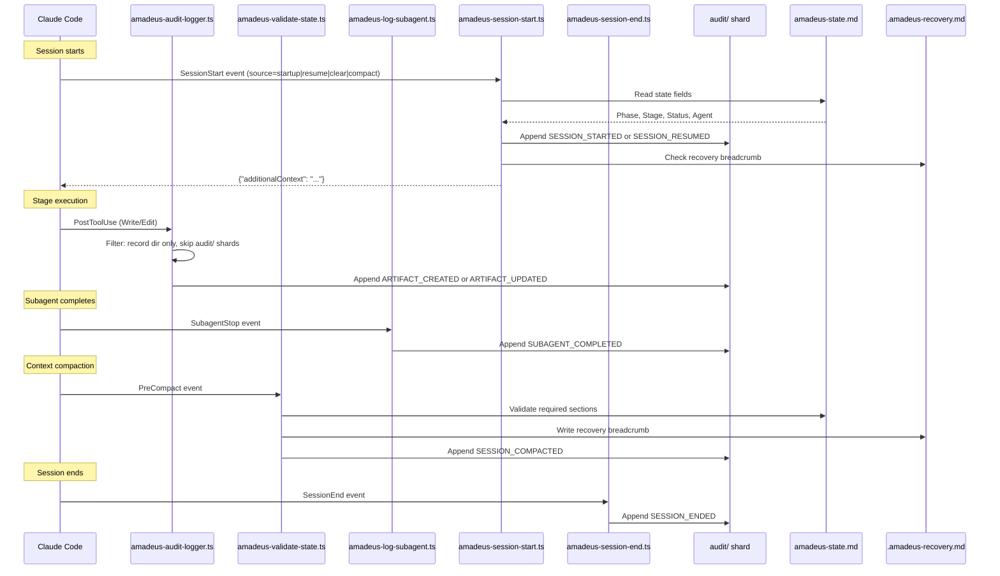

# Hooks and Tools

> Languages: **English** | [日本語](06-hooks-and-tools.ja.md)

This chapter documents the hook system architecture, all framework hook scripts, the audit event taxonomy, CLI tool configuration, and the deterministic utility tool.

> **Path convention.** State, audit, and artifacts live under the active intent's **record dir** — `amadeus/spaces/<space>/intents/<YYMMDD>-<label>/`, written `<record>/` below (a compact UTC date prefix plus a short kebab-case label so record dirs sort chronologically; the canonical id is the UUIDv7 in the `intents.json` registry row). The audit trail is a directory of per-clone shards under `<record>/audit/`, not a single file.

---

## Hook System Architecture

This implementation uses the framework hook scripts in `.claude/hooks/`. All of them are TypeScript (run via `bun`). All of them are **project-wide** — registered in `settings.json` (the statusline via the top-level `statusLine` key, the rest via the `hooks` block), they fire regardless of which skill is active. Every entry point — the orchestrator, each packaged scope/stage runner, and any hand-written customer runner — inherits the deterministic spine with no per-runner `hooks:` block. This is safe because every hook **self-gates**: it early-exits when there is no active workflow (`amadeus-state.md` / the active intent's `audit/` shard absent), so always-on is a no-op outside AI-DLC.

All but two are **non-blocking** — they observe and exit 0, never altering control flow. The `Stop` hook (`amadeus-stop.ts`) is **flow-altering**: it may return `{"decision":"block"}` to keep the interactive forwarding loop running. The subagent model guard (`amadeus-subagent-model-guard.ts`, #2438) is the other: during an active workflow it may deny a dispatch whose model compliance cannot be established. Both are sanctioned, deliberate contracts distinct from the advisory `never-block` contract every other hook honours (see "The flow-altering `Stop` hook" below).

```
.claude/hooks/
+-- amadeus-dispatch.ts          # Self-install settings transport to the generated hooks (project-wide, TypeScript)
+-- amadeus-mint-presence.ts     # UserPromptSubmit + PostToolUse AskUserQuestion (project-wide, settings.json, TypeScript)
+-- amadeus-audit-logger.ts      # PostToolUse Write|Edit (project-wide, settings.json, TypeScript)
+-- amadeus-sensor-fire.ts       # PostToolUse Write|Edit (project-wide, settings.json, TypeScript)
+-- amadeus-sync-statusline.ts   # PostToolUse TaskUpdate (project-wide, settings.json, TypeScript)
+-- amadeus-runtime-compile.ts   # PostToolUse Bash (project-wide, settings.json, TypeScript)
+-- amadeus-validate-state.ts    # PreCompact (project-wide, settings.json, TypeScript)
+-- amadeus-log-subagent-start.ts # PreToolUse Task (project-wide, settings.json, TypeScript)
+-- amadeus-subagent-model-guard.ts # PreToolUse Task (project-wide, settings.json, TypeScript, flow-altering)
+-- amadeus-log-subagent.ts      # SubagentStop (project-wide, settings.json, TypeScript)
+-- amadeus-stop.ts              # Stop (project-wide, settings.json, TypeScript, flow-altering)
+-- amadeus-session-start.ts     # SessionStart (project-wide, settings.json, TypeScript)
+-- amadeus-plugin-compose.ts    # SessionStart (project-wide, settings.json, TypeScript)
+-- amadeus-session-end.ts       # SessionEnd (project-wide, settings.json, TypeScript)
+-- amadeus-statusline.ts        # statusLine (project-wide, settings.json, TypeScript)
```

### Hook Summary

| Hook | Event | Scoping | Matcher | Purpose |
|------|-------|---------|---------|---------|
| `amadeus-dispatch.ts` | Configured hook events | Project-wide (self-install settings transport) | Fixed hook slug | Resolve the project root independently of the caller's working directory, validate the generated hook tree, and forward stdin/stdout/stderr, arguments, exit status, and signals to the selected generated hook |
| `amadeus-mint-presence.ts` | UserPromptSubmit + PostToolUse | Project-wide (settings.json) | (empty) / `AskUserQuestion` | Record a `HUMAN_TURN` event on every real human prompt and on every answered `AskUserQuestion` widget (gate approvals and interview answers are widget clicks, not typed prompts); the approval/interview gate checks the ledger and requires one since the last gate resolution so a model under autopilot cannot fabricate an approval with no human having acted. Claude Code does not fire `UserPromptSubmit` for queued mid-turn input, so that delivery is not presence (#3170) |
| `amadeus-audit-logger.ts` | PostToolUse | Project-wide (settings.json) | `Write\|Edit` | Auto-log artifact writes to the `audit/` shards |
| `amadeus-sensor-fire.ts` | PostToolUse | Project-wide (settings.json) | `Write\|Edit` | Fire the active stage's resolved Sensors on matching writes (advisory; never blocks) |
| `amadeus-sync-statusline.ts` | PostToolUse | Project-wide (settings.json) | `TaskUpdate` | Auto-sync state file on stage task activation |
| `amadeus-runtime-compile.ts` | PostToolUse | Project-wide (settings.json) | `Bash` | Recompile `runtime-graph.json` on transition-class audit emits |
| `amadeus-validate-state.ts` | PreCompact | Project-wide (settings.json) | (empty) | Validate state file, write recovery breadcrumb |
| `amadeus-log-subagent-start.ts` | PreToolUse | Project-wide (settings.json) | `^Task$` | Log subagent dispatch (`SUBAGENT_STARTED`). Claude Code has no subagent-start event, so the seam is the dispatch tool's PreToolUse; the matcher is anchored and the hook re-checks the tool name (admitting both `Task` and the internal name `Agent` the payload actually carries, #2303), because an unanchored `Task` also matches `TaskUpdate` |
| `amadeus-subagent-model-guard.ts` | PreToolUse | Project-wide (settings.json) | `^Task$` | **Flow-altering** (#2438). During an active workflow, deny a subagent dispatch that neither goes through a declared persona whose `model:` pin is inside the enforced set (`opus`, `sonnet`) nor requests an enforced model explicitly — without it, ad-hoc names, builtins and typeless spawns silently inherit the parent session's model. The enforced set is the layered `subagent.dispatch.enforced-models` configuration key (default `["opus","sonnet"]`). Fails open with a stderr advisory on internal errors; strict no-op outside an active amadeus workflow |
| `amadeus-log-subagent.ts` | SubagentStop | Project-wide (settings.json) | (empty) | Log subagent completion events |
| `amadeus-stop.ts` | Stop | Project-wide (settings.json) | (empty) | **Flow-altering.** Enforce the forwarding loop on turn-end: run `amadeus-orchestrate next`; on `done` or `parked` allow the stop, on a pending directive block the stop and inject the next move back via `reason`. Allows the stop (human-wait carve-out) when the current stage is awaiting approval (`[?]`), being revised (`[R]`), `[-]` in-progress with an unanswered question in its `<slug>-questions.md`, or the ending turn was conversational (the human's last prompt was answered with no workflow-engine call, read from the harness transcript) - the question-tag case suppressed under Intent autonomy `full` and human-command `semi`, the conversational case under `full` only. Recursion-bounded (no-progress counter + `stop_hook_active` under `CLAUDE_CODE_STOP_HOOK_BLOCK_CAP`; default 2 in an interactive run and 8 under autonomous Construction). No-op outside an AIDLC workflow |
| `amadeus-session-start.ts` | SessionStart | Project-wide (settings.json) | (empty) | Inject workflow context on session resume |
| `amadeus-plugin-compose.ts` | SessionStart | Project-wide (settings.json) | (empty) | Auto-compose opted-in plugins into the host (`amadeus-plugin.ts compose --if-stale`); non-blocking, no-op when the composition record is current |
| `amadeus-session-end.ts` | SessionEnd | Project-wide (settings.json) | (empty) | Emit `SESSION_ENDED` audit event on graceful exit |
| `amadeus-statusline.ts` | statusLine | Project-wide (settings.json) | -- | Show real-time progress in terminal |

OpenCode exposes the equivalent lifecycle through its JavaScript plugin API,
not this shell-hook table. `.opencode/plugins/amadeus-opencode-plugin.ts` handles
`session.created` and invokes the same `compose --if-stale` operation for
`.opencode` only. All adapters warn on failure without blocking the session.

### Shared Characteristics

All of the TypeScript hooks:

- Written in TypeScript, run via `bun`
- Do not need executable permissions — work identically on macOS, Linux, and native Windows PowerShell
- Receive JSON on stdin from Claude Code
- Use native JSON parsing (no `jq` dependency)
- Exit with code 0 on success or when skipped (the `Stop` hook also exits 0 when it blocks — the block is signalled by a `{"decision":"block"}` JSON object on stdout, not by the exit code)
- Resolve `$CLAUDE_PROJECT_DIR` with multiple fallback methods
- Share locking and utility functions from `lib.ts`

### Audit Event Flow



---

## Workflow-Spine Hooks

These six hooks (the audit/sensor/statusline/runtime-compile/state-validation/subagent spine) are registered project-wide in `settings.json`. They are always on, but each **self-gates**: it early-exits when there is no active workflow (`amadeus-state.md` / the active intent's `audit/` shard absent), so audit logging and state sync never clutter non-AI-DLC sessions. Before v0.6.0 they were declared in `amadeus/SKILL.md` frontmatter (skill-scoped); the move to `settings.json` lets every entry point — the orchestrator and every packaged or hand-written runner — inherit the spine without copying a `hooks:` block.

### PostToolUse: amadeus-audit-logger.ts

**Source:** `.claude/hooks/amadeus-audit-logger.ts`
**Trigger:** After every `Write` or `Edit` Claude Code tool call (matcher: `"Write|Edit"`)
**Purpose:** Auto-log artifact writes to the intent's `audit/` shards

**Processing steps:**

1. **Project directory resolution:** Resolves `$CLAUDE_PROJECT_DIR` with fallback to script path derivation and CWD detection.
2. **Health heartbeat:** Writes UTC timestamp to `.amadeus-hooks-health/audit-logger.last`.
3. **JSON parsing:** Reads stdin, extracts `tool_name` and `tool_input.file_path`.
4. **Path filtering:** Skips files not under the intent's record dir. Skips the `audit/` shards themselves (avoids recursion).
5. **Audit file guard:** Exits silently if the active intent's `audit/` shard does not exist (the framework creates it).
6. **Context extraction:** Strips the path prefix up to the record dir, replaces `/` with ` > ` for a breadcrumb (e.g., `inception > requirements-analysis > requirements.md`).
7. **Atomic locking:** Uses `mkdir`-based lock in the system temp directory (`os.tmpdir()`) with 3-retry loop (100ms delay). The hash isolates locks per project.
8. **Log entry:** Appends a canonical `ARTIFACT_CREATED` (for Write to a net-new path) or `ARTIFACT_UPDATED` (for Edit, or Write overwriting existing) event via `appendAuditEntry`. Fields: Timestamp, Event, Tool, File, Context.

### PostToolUse: amadeus-sync-statusline.ts

**Source:** `.claude/hooks/amadeus-sync-statusline.ts`
**Trigger:** After every `TaskUpdate` call (matcher: `"TaskUpdate"`)
**Purpose:** Auto-sync `amadeus-state.md` when a stage task becomes `in_progress`

**Processing steps:**

1. **Project directory resolution:** Same multi-fallback pattern as amadeus-audit-logger.ts.
2. **Status filter:** Only fires when `status` is `in_progress`. Exits silently for `completed`, `pending`, etc.
3. **activeForm filter:** Exits silently if no `activeForm` field or no `[slug]` suffix pattern.
4. **State file guard:** Exits silently if `amadeus-state.md` does not exist (pre-init).
5. **Health heartbeat:** Writes to `.amadeus-hooks-health/sync-statusline.last`.
6. **State sync:** Calls `bun amadeus-utility.ts set-status --stage <slug>` (updates Phase, Stage, Agent, checkbox).

**Design notes:**
- Stage Jump tasks (no `[slug]`) and dependency-wiring TaskUpdates (no activeForm) are naturally filtered out.
- The hook calls the existing `set-status` subcommand — no new code path needed.

### PostToolUse: amadeus-sensor-fire.ts

**Source:** `.claude/hooks/amadeus-sensor-fire.ts`
**Trigger:** After every `Write` or `Edit` Claude Code tool call (matcher: `"Write|Edit"`)
**Purpose:** Fire the active stage's compile-resolved Sensors on matching writes (advisory; never blocks)

**Processing steps:**

1. **Project directory resolution:** Same multi-fallback pattern as amadeus-audit-logger.ts.
2. **Audit + state guards:** Exits silently if the `audit/` shard or `amadeus-state.md` does not exist (pre-init).
3. **Active-stage read:** Reads the active stage's `sensors_applicable` array off `stage-graph.json` — the compile-resolved sensor list for that stage node (empty for stages like workspace-scaffold).
4. **Dispatch:** For each applicable Sensor, spawns `amadeus-sensor.ts fire <id> --stage <slug> --output-path <path>`. The dispatcher applies each Sensor's `matches` glob hook-side; a non-matching write is skipped. Outcomes are advisory — the hook never blocks the write.
5. **Health heartbeat:** Writes `.amadeus-hooks-health/sensor-fire.last` on a fire, so the doctor can distinguish a healthy idle hook from a silent failure.

See [Sensor System](07-sensor-system.md) for the manifest schema and the fire lifecycle.

### PostToolUse: amadeus-runtime-compile.ts

**Source:** `.claude/hooks/amadeus-runtime-compile.ts`
**Trigger:** After every `Bash` Claude Code tool call (matcher: `"Bash"`)
**Purpose:** Recompile `runtime-graph.json` when a transition-class audit event has just landed

**Processing steps:**

1. **Command filter:** Only `bun .claude/tools/amadeus-(state|jump|bolt|utility).ts` invocations pass the early exit. `amadeus-runtime.ts` is rejected explicitly (recursion guard).
2. **Audit-existence guard:** Exits cleanly before init (no `audit/` shard yet).
3. **Health heartbeat:** Writes `.amadeus-hooks-health/runtime-compile.last`.
4. **Tail-read:** Reads the last 3 journal records (JSONL lines) of the merged `audit/` shards (the upper bound a single `approve` call appends).
5. **Event-class filter:** Recompiles only when one of the last 3 records carries `GATE_APPROVED`, `STAGE_STARTED`, `STAGE_AWAITING_APPROVAL`, `AUDIT_MERGED`, or `WORKFLOW_COMPLETED`. Exits on no match.
6. **Dispatch:** Spawns `bun amadeus-runtime.ts compile`. On non-zero exit, records a hook drop for `--doctor`; never blocks the parent Bash call.

See [Runtime Graph](13-runtime-graph.md) for the compile lifecycle and the locked schema.

### PreCompact: amadeus-validate-state.ts

**Source:** `.claude/hooks/amadeus-validate-state.ts`
**Trigger:** Before Claude Code compacts the conversation context (matcher: empty = always)
**Purpose:** Section presence check (informational only, does not block compaction) and write a recovery breadcrumb

**Processing steps:**

1. **State file guard:** Exits cleanly if `amadeus-state.md` does not exist.
2. **Section validation:** Checks for two mandatory sections using `grep -q`:
   - `## Stage Progress` -- the checklist of all stages with completion status
   - `## Current Status` -- current phase, stage, and scope
   Outputs a WARNING if either section is missing (informational only -- cannot block compaction).
3. **Recovery breadcrumb:** Writes `.amadeus-recovery.md` containing the current stage and a validation timestamp. On session resume, the framework compares this with `amadeus-state.md` to detect compaction-related state corruption.

**Why this matters:** Context compaction discards conversation history. If compaction happens mid-stage, the model loses awareness of what it was doing. The recovery breadcrumb provides an external checkpoint that survives compaction.

### PreToolUse Task: amadeus-log-subagent-start.ts

**Source:** `.claude/hooks/amadeus-log-subagent-start.ts`
**Trigger:** When a subagent is dispatched (matcher: `^Task$`)
**Purpose:** Log subagent dispatch (`SUBAGENT_STARTED`) so a subagent is recorded as an interval rather than a point

**Processing steps:**

1. **Project directory resolution:** Same multi-fallback pattern as amadeus-log-subagent.ts.
2. **Health heartbeat:** Writes to `.amadeus-hooks-health/log-subagent-start.last`.
3. **Dispatch-tool guard:** Exits silently unless the payload is a subagent dispatch. PreToolUse fires for *every* tool, so the hook re-checks the tool name rather than trusting the matcher. The shipped matcher is anchored (`^Task$`) precisely because an unanchored `Task` would also match `TaskUpdate`; the in-hook guard is the second line of that defence, and it is what holds if a workspace edits the matcher. The guard admits **both** `Task` and `Agent`: the matcher is written against `Task`, but the payload Claude Code delivers names the tool by its internal name `Agent` (#2303), so a guard that trusted the matcher's spelling would drop every real dispatch.
4. **Field assembly:** `Agent Type` (blank normalizes to `"unknown"`), optional `Agent ID`, and optional `Purpose` — the first line of the dispatch prompt, escape-normalized and truncated to 200 characters so an unbounded prompt cannot carry its remainder into the audit row.
5. **The same three gates as the completed half:** TTY, an active audit shard, and a workflow that is not already terminal — a start must never be recorded where its completion would be dropped.

**Harness asymmetry:** Two harnesses wire a start seam. Claude Code has no subagent-start event, hence the PreToolUse seam; Kimi has a real `SubagentStart` that also carries the prompt. Codex, Cursor and Kiro CLI register the completed half alone, so on those a completion with no start is the normal steady state. Kiro IDE and OpenCode register neither half — OpenCode's plugin surface owns only the `chat.message` presence seam. Readers pair the halves and drop unmatched rows.

### SubagentStop: amadeus-log-subagent.ts

**Source:** `.claude/hooks/amadeus-log-subagent.ts`
**Trigger:** When any subagent (Claude Code Task tool invocation) completes (matcher: empty = always)
**Purpose:** Log subagent completion events to the audit trail

**Processing steps:**

1. **Project directory resolution:** Same multi-fallback pattern as amadeus-audit-logger.ts.
2. **Health heartbeat:** Writes to `.amadeus-hooks-health/log-subagent.last`.
3. **JSON parsing:** Extracts `agent_type` (defaults to `"unknown"`), `agent_id`, and `last_assistant_message` (truncated to 200 characters).
4. **Audit file guard:** Exits silently if the `audit/` shard does not exist.
5. **Entry assembly:** Emits canonical `SUBAGENT_COMPLETED` event via `appendAuditEntry`. Fields: Timestamp, Event, Agent Type, and optionally Agent ID and truncated Message.
6. **Atomic locking:** Same `mkdir`-based pattern as amadeus-audit-logger.ts (unified in `lib.ts`) but with a separate lock name to avoid contention.

**Fires for the two subagent stages:**
- Stage 2.1 (Reverse Engineering) -- two-step delegation (fires twice: `amadeus-developer-agent` code scan, then `amadeus-architect-agent` synthesis)
- Stage 3.5 (Code Generation) -- `amadeus-developer-agent` subagent (fires once per unit of work)

Workspace detection (0.2) runs deterministically inside `amadeus-utility init`, so this hook does not fire during initialization.

---

### Stop: amadeus-stop.ts

**Source:** `.claude/hooks/amadeus-stop.ts`
**Trigger:** When the conductor tries to end its turn (matcher: empty = always, while `/amadeus` is active)
**Purpose:** Enforce the interactive forwarding loop — keep it running until the engine reports the workflow is `done`

This is the framework's **first and only flow-altering hook**. Every other hook observes and exits 0; this one may return `{"decision":"block"}` to stop the turn from ending. On the gated, conversational path the conductor (the LLM) holds the loop because only it can ask the human a question — so if it forgets to consult the engine, the workflow drifts. This hook removes that dependency on the LLM's diligence: the loop is enforced by the harness.

**Processing steps:**

1. **stdin idiom:** Mirrors `amadeus-log-subagent.ts` — a TTY means no Claude Code JSON is coming (test/debug), so it allows the stop. Otherwise it reads the Stop-hook JSON, from which it needs only `stop_hook_active`.
2. **No-op outside AIDLC:** If there is no active intent's `amadeus-state.md` under the project dir, there is nothing to enforce — it allows the stop. The frontmatter `Stop` matcher already scopes the hook to `/amadeus`; this is defence in depth so a non-AIDLC session is never blocked.
3. **Compose the engine:** Runs `bun .claude/tools/amadeus-orchestrate.ts next --project-dir <dir>` and parses the directive `kind`. It does not re-derive state — it composes the engine.
4. **`done` → allow:** If the directive is `done`, the workflow is complete; the hook emits nothing and exits 0 (the precedent non-blocking pattern), then clears the recursion counter.
5. **`parked` -> allow:** If the directive is `parked`, the workflow reached an explicit safe stop; the hook allows the stop and clears the counter in every Intent mode. In `full`, this is how abnormal `REPAIR_STALLED` / `NORM_CONFLICT` stops terminate safely; the generic manual park command remains guarded against casually interrupting an unattended run — under `Construction Autonomy Mode: autonomous` it is accepted only from a human turn (an unconsumed `HUMAN_TURN` in the record's presence ledger, which the accepted park then consumes) and refused otherwise. That refusal lives in `amadeus-state.ts` alone; this hook branch is not a second copy of it. A `full` grant remains a separate active projection unless explicitly revoked or completed.
6. **Human-wait -> allow:** If the directive is pending but the conductor is correctly parked on the human (or simply chatting), the hook allows the stop and records a drop rather than spamming the nudge. Four cases qualify: the current stage's checkbox is positively `[?]` awaiting-approval, `[R]` revising, `[-]` in-progress **with** an unanswered `[Answer]:` tag in its `<slug>-questions.md` (a pending mid-stage clarifying question), or the ending turn was conversational (the human's most recent prompt was answered with no workflow-engine call, read from the harness transcript) - the question-tag case is suppressed under Intent autonomy `full` and under `semi` set by a human command; the conversational case only under `full`. Positive-confirmation only: any other state, no checkbox row, no open question, no transcript / no human prompt / any engine call in the responding turn, or a parse error falls through to the block below. See "Human-wait carve-out" below.
7. **Pending -> block and inject:** For any other (pending) directive - `run-stage`, `dispatch-subagent`, `invoke-swarm`, `present-gate`, `ask`, `print`, `error` - it prints `{"decision":"block","reason":<on-task continuation>}`, so the same session resumes with the next move injected. The injected `reason` also names `amadeus-orchestrate park` as the clean-pause alternative, so a conductor that wants to stop a long workflow parks rather than advancing.
8. **Fail open:** Any unexpected failure (unreadable state, an engine that exits non-zero or returns no parseable directive, malformed stdin) allows the stop and records a drop. Failing open is the only safe failure mode for a hook that can otherwise trap a turn.

**Security property — the `reason` is an on-task continuation, never an override.** The injected `reason` names the work the conductor still owes ("run the forwarding loop, act on the directive, then report"), never an instruction to do something new or out-of-band. Override-shaped directives are refused by the conductor's own safety training; that refusal is the security property. A buggy or compromised engine therefore can only ever *continue* sanctioned work — it cannot hijack the session to act against the user.

**Recursion guard — a stuck block can never trap the session.** A block that re-fires forever is the one way a hook could trap a turn, so recursion is bounded two ways, both native:

- **`stop_hook_active`** — Claude Code sets this true when the current stop is itself the product of a prior Stop-hook block. The hook reads it as a signal that it is already inside a blocked sequence.
- **A no-progress counter** - the hook persists a small record under `<record>/.amadeus-stop-hook/block-count.json` (in the intent's record dir), keyed on the workflow's *progress signature* (Current Stage slug + audit-tail length). A `report` that advances the workflow changes that signature, so the counter resets - a healthy loop is never throttled. When the signature is unchanged across consecutive blocks (no report ran), the counter increments. Once the no-progress streak reaches the ceiling - `CLAUDE_CODE_STOP_HOOK_BLOCK_CAP`, whose default is **run-mode aware: 2 in an interactive run and 8 under autonomous Construction** (interactive 2 so a chatting or pausing human is released after one nudge; autonomous 8 so an unattended loop, with no human to release it, runs to completion before letting go) - the hook **releases** the turn (allows the stop), so a stuck loop always lets go. An explicit `CLAUDE_CODE_STOP_HOOK_BLOCK_CAP` overrides both defaults.

**Human-wait carve-out - an interactive gate is not punished.** Four cases where the conductor ends its turn *because* it is waiting on the human (or is simply conversational) are handled so the hook never spams the nudge:

- **Esc is free.** Stop hooks do not fire on user interrupt (Esc), so a manual interrupt can never be trapped — no code is needed for that case.
- **The approval gate is not free.** The Stop hook *does* fire when the conductor ends its turn to await an `AskUserQuestion` answer. At an approval gate (the current stage is `[?]` awaiting-approval) or in the Request-Changes loop (`[R]` revising) the engine still re-emits a pending `run-stage` for the in-flight stage, so without a carve-out the hook would block and re-inject the forwarding-loop nudge until the cap bled out — confusing at an interactive gate. So when the current stage's checkbox is positively `[?]`/`[R]`, the hook allows the stop. This is **positive-confirmation only and fail-open**: it only ever releases more readily, never blocks more; a missing checkbox row and any parse error fall through to the cap-bounded block, so a genuine mid-stage quit is still nudged.
- **A mid-stage clarifying question is not free either.** Such a question parks the stage at `[-]` in-progress — the same checkbox state as a lazy quit, so `[-]` alone cannot be carved out. But the conductor must create a `<slug>-questions.md` with blank `[Answer]:` tags before asking (stage protocol §3), so an unanswered tag is a positive signal that a question is pending. When the current `[-]` stage's questions file has an unanswered tag, the hook allows the stop. This is **strictly gated**: it never fires under Intent autonomy `full`, nor under `semi` set by a human command — in both, authorised questions are auto-decided through the resolution ladder — and it falls through to the cap-bounded block on any miss.
- **A conversational turn is not free either.** During an active workflow a human who just wants to chat (ask a question, discuss a decision) should not be nudged back into the loop. The hook reads the harness transcript and allows the stop when the most recent genuine human prompt was answered with **no** workflow-engine engagement. A read-only query (`--status`, `--doctor`, `--help`, `--version`) does **not** count as engagement. Claude and Codex deliver `transcript_path`; harnesses without one rely on the mode-aware cap. This is **strictly gated and fail-closed**: it is suppressed only under Intent autonomy `full`.

> **Contrast with the sensor-fire hook's advisory contract.** `amadeus-sensor-fire.ts` carries an explicit *never-block* contract (it never returns `{decision: block}`, asserted by `t95` Case 7). That is *that hook's* advisory contract, not a framework-wide ban on blocking. The `Stop` hook's use of `block` for loop enforcement is a different, sanctioned contract.

---

## Project-Wide Hooks

These three hooks fire regardless of whether the `/amadeus` skill is active.

### SessionStart: amadeus-session-start.ts

**Source:** `.claude/hooks/amadeus-session-start.ts`
**Registration:** `settings.json` under `hooks.SessionStart`
**Purpose:** Inject workflow context as `additionalContext` JSON on session resume

When Claude Code starts a session (or resumes after compaction), this hook checks for an active workflow and injects key state fields into the conversation.

**Processing steps:**

1. **Project directory resolution:** Multi-fallback methods (`$CLAUDE_PROJECT_DIR`, script path, CWD).
2. **State file guard:** Exits if no `amadeus-state.md` exists.
3. **Health heartbeat:** Writes to `.amadeus-hooks-health/session-start.last`.
4. **State extraction:** Reads state file and extracts 7 fields: Phase, Stage, Status, Last Completed, Next Action, Agent, Scope.
5. **Recovery check:** If `.amadeus-recovery.md` exists, includes a compaction warning note.
6. **JSON output:** Outputs `{"additionalContext": "..."}` with native JSON serialization.

**Output format:**

```
AIDLC WORKFLOW ACTIVE
Scope: feature
Lifecycle Phase: Inception
Current Stage: 2.4 User Stories
Status: in_progress
Active Agent: amadeus-product-agent
Last Completed: 2.3 Requirements Analysis
Next Action: resume current stage
```

### SessionEnd: amadeus-session-end.ts

**Source:** `.claude/hooks/amadeus-session-end.ts`
**Registration:** `settings.json` under `hooks.SessionEnd`
**Purpose:** Emit a `SESSION_ENDED` audit event on every graceful Claude Code exit when an active AI-DLC workflow is present.

**Lifecycle:**
1. **Workflow guard:** Exits silently when no active intent's `amadeus-state.md` exists (the canonical "active workflow" marker — same guard as `amadeus-session-start.ts`). A workspace shell with no born intent emits nothing.
2. **Audit emission:** Appends `SESSION_ENDED` to the `audit/` shard via `amadeus-audit.ts`. Pairs with `amadeus-session-start.ts`'s `SESSION_STARTED` for session lifecycle observability.

### Status Line: amadeus-statusline.ts

**Source:** `.claude/hooks/amadeus-statusline.ts`
**Registration:** `settings.json` under `statusLine`, invoked via `bun`
**Purpose:** Real-time workflow progress in the terminal status bar

**Output format:** `[Amadeus-DLC] PHASE [▓▓▓▓▓░░░░░] n/m > Display Name -- Agent`

Special states: `[Amadeus-DLC] ready` (no workflow), `[Amadeus-DLC] COMPLETE [▓▓▓▓▓▓▓▓▓▓]` (finished).

**Processing steps:**

1. **Project directory resolution:** 4 fallback methods (stdin JSON `workspace.project_dir`, `$CLAUDE_PROJECT_DIR`, script path via `fileURLToPath`, CWD).
2. **Ready fallback:** Outputs `[Amadeus-DLC] ready` if no state file exists or phase is empty.
3. **State extraction:** Reads Phase, Stage, Agent from state file via single-file regex. Maps stage slugs to display names. Strips `-agent` suffix.
4. **Phase-scoped progress:** Counts `[x]` checkboxes under the current phase heading (`### <Lifecycle Phase> PHASE`), excluding SKIP and `[S]` (jump-skipped) stages. Produces `{done, total}` which feeds both the 10-char unicode bar (`▓`/`░` via `floor(done·10/total)`) and the `done/total` ratio (e.g. `4/7`). Bar and ratio share one scope so they advance together.
5. **Model + context:** Extracts model ID and context percentage from stdin JSON. Abbreviates Bedrock prefix to `BR:`, colors context green/yellow/red.
6. **Complete detection:** If Status is `Completed`, outputs `[Amadeus-DLC] COMPLETE [bar]`.
7. **Graceful degradation:** Each segment is appended only if it has a value.

---

## Audit Event Taxonomy

The audit trail (the intent's `audit/` shards) uses the event taxonomy defined in `.claude/knowledge/amadeus-shared/audit-format.md`. Every event is tool-owned or hook-owned - the conductor no longer emits events from prose. See [State Machine](12-state-machine.md) for the canonical emitter registry and the audit-first atomicity rules; the summary below is a cross-reference, not the source of truth.

### Event Categories

| Category | Count | Events | Logged By |
|----------|-------|--------|-----------|
| **Workflow Lifecycle** | 6 | `WORKFLOW_STARTED`, `WORKFLOW_COMPLETED`, `WORKFLOW_PARKED`, `WORKFLOW_UNPARKED`, `INTENT_ARCHIVED`, `INTENT_UNARCHIVED` | `tools/amadeus-utility.ts`, `tools/amadeus-state.ts` |
| **Phase Lifecycle** | 4 | `PHASE_STARTED`, `PHASE_COMPLETED`, `PHASE_VERIFIED`, `PHASE_SKIPPED` | `tools/amadeus-utility.ts`, `tools/amadeus-state.ts` |
| **Stage Lifecycle** | 7 | `STAGE_STARTED`, `STAGE_AWAITING_APPROVAL`, `STAGE_REVISING`, `STAGE_COMPLETED`, `STAGE_JUMPED`, `STAGE_SKIPPED`, `GUARD_EXEMPTED` | `tools/amadeus-state.ts`, `tools/amadeus-utility.ts`, `tools/amadeus-jump.ts` |
| **Session Events** | 5 | `SESSION_STARTED`, `SESSION_RESUMED`, `SESSION_COMPACTED`, `SESSION_ENDED`, `HUMAN_TURN` | `hooks/amadeus-session-start.ts`, `hooks/amadeus-validate-state.ts`, `hooks/amadeus-session-end.ts`, `tools/amadeus-presence-reservation.ts`, `hooks/amadeus-mint-presence.ts` |
| **Initialization Events** | 3 | `WORKSPACE_SCAFFOLDED`, `WORKSPACE_SCANNED`, `WORKSPACE_INITIALISED` | `tools/amadeus-utility.ts` |
| **Navigation Events** | 5 | `SCOPE_CHANGED`, `DEPTH_CHANGED`, `TEST_STRATEGY_CHANGED`, `SCOPE_DETECTED`, `RECOMPOSED` | `tools/amadeus-utility.ts` |
| **Interaction Events** | 6 | `DECISION_RECORDED`, `GATE_APPROVED`, `GATE_REJECTED`, `QUESTION_ANSWERED`, `DELEGATED_APPROVAL`, `DELEGATED_REJECTION` | `tools/amadeus-log.ts`, `tools/amadeus-state.ts` |
| **Legacy Standing Grant Observations** | 3 | `GRANT_ISSUED`, `GRANT_REVOKED`, `GATE_AUTHORIZATION_SELECTED` | Read-only replay/migration projection of historical audit; no live issuer, revoker, or route selector |
| **Artifact Events** | 3 | `ARTIFACT_CREATED`, `ARTIFACT_UPDATED`, `ARTIFACT_REUSED` | `hooks/amadeus-audit-logger.ts`, `tools/amadeus-state.ts` |
| **Subagent Events** | 2 | `SUBAGENT_STARTED`, `SUBAGENT_COMPLETED` | `hooks/amadeus-log-subagent-start.ts`, `hooks/amadeus-log-subagent.ts` |
| **Utility Events** | 1 | `HEALTH_CHECKED` | `tools/amadeus-utility.ts` |
| **Error/Recovery Events** | 2 | `ERROR_LOGGED`, `RECOVERY_COMPLETED` | `tools/amadeus-lib.ts`, `tools/amadeus-state.ts` |
| **Construction Bolt + Legacy Mode Events** | 4 | `BOLT_STARTED`, `BOLT_COMPLETED`, `BOLT_FAILED`, `AUTONOMY_MODE_SET` | `tools/amadeus-bolt.ts`; `AUTONOMY_MODE_SET` is replay/doctor-only |
| **Worktree** | 7 | `WORKTREE_CREATED`, `WORKTREE_MERGED`, `WORKTREE_DISCARDED`, `STATE_FORKED`, `STATE_MERGED`, `AUDIT_FORKED`, `AUDIT_MERGED` | `tools/amadeus-worktree.ts`, `tools/amadeus-state.ts`, `tools/amadeus-audit.ts` |
| **Practices** | 4 | `PRACTICES_DISCOVERED`, `PRACTICES_AFFIRMED`, `PRACTICES_OVERRIDE`, `PRACTICES_SECTION_EMPTY` | `tools/amadeus-state.ts` |
| **Merge Dispatch** | 3 | `MERGE_DISPATCH_INVOKED`, `MERGE_DISPATCH_RETURNED`, `MERGE_DISPATCH_FALLBACK` | `tools/amadeus-bolt.ts` |
| **Sensor Events** | 5 | `SENSOR_FIRED`, `SENSOR_PASSED`, `SENSOR_FAILED`, `SENSOR_BUDGET_OVERRIDE`, `GUARDRAIL_LOADED` | `tools/amadeus-sensor.ts`, `tools/amadeus-utility.ts` |
| **Learning Loop** | 3 | `MEMORY_EMPTY`, `RULE_LEARNED`, `SENSOR_PROPOSED` | `tools/amadeus-runtime.ts`, `tools/amadeus-learnings.ts` |
| **Swarm** | 6 | `SWARM_STARTED`, `SWARM_UNIT_CONVERGED`, `SWARM_UNIT_FAILED`, `SWARM_BATON_RETURNED`, `SWARM_COMPLETED`, `SWARM_DEGRADED` | `tools/amadeus-swarm.ts` |

### Entry Format

All audit events follow the format defined in `audit-format.md` — each shard is a JSONL journal, one JSON record per line, no header:

```json
{"schemaVersion":1,"seq":42,"cloneId":"d4a945003a7f","intentId":"260728-otel-1a2b3c4d","timestamp":"2026-07-28T10:00:00Z","heading":"Stage Start","event":"STAGE_STARTED","fields":{"Stage":"code-generation","Agent":"developer"}}
```

All events — hook-generated and tool-generated — use the same canonical `appendAuditEntry` emitter, producing identical JSONL records with an `event` field and its `fields` payload. The `heading` is derived from the event name via `EVENT_HEADINGS` in `amadeus-audit.ts`.

### Mandatory Events

Every stage execution must produce exactly two events:
- `STAGE_STARTED` -- logged when the conductor begins a stage
- `STAGE_COMPLETED` -- logged when the stage finishes (approval or auto-proceed)

### Hook-Generated vs Tool-Logged

| Source | Events | When |
|--------|--------|------|
| `amadeus-audit-logger.ts` | `ARTIFACT_CREATED` / `ARTIFACT_UPDATED` | Every Write/Edit to the intent's record dir (except the `audit/` shards) |
| `amadeus-log-subagent.ts` | `SUBAGENT_COMPLETED` | Any subagent stop |
| `amadeus-session-start.ts` | `SESSION_STARTED` / `SESSION_RESUMED` | Per Claude Code SessionStart hook input `source` field |
| `amadeus-session-end.ts` | `SESSION_ENDED` | Claude Code SessionEnd hook |
| `amadeus-validate-state.ts` | `SESSION_COMPACTED` | Claude Code PreCompact hook |
| CLI tools | All other events (stage/phase/workflow lifecycle, gates, decisions, bolts, sensors, learnings, recovery, …) | Emitted by the tool subcommands the conductor calls — `amadeus-state.ts`, `amadeus-log.ts`, `amadeus-bolt.ts`, `amadeus-learnings.ts`, `amadeus-utility.ts`. Never hand-appended from prose (see `SKILL.md`: "Never emit audit events from prose"). |

---

## Claude Code Tool Configuration

### Permissions (settings.json)

The `permissions.allow` array in `.claude/settings.json` pre-approves Claude Code tools to avoid per-invocation permission prompts:

| Claude Code Tool | AI-DLC Usage |
|------------------|-------------|
| `Read` | Reading stage files, knowledge files, state files, project source code |
| `Edit` | Modifying existing artifacts, updating state files |
| `Write` | Creating new artifacts, audit log entries, scaffolding directories |
| `Bash` | Running build tools, test commands, timestamps, package managers |
| `Glob` | Finding files by pattern during workspace detection and reverse engineering |
| `Grep` | Searching codebases for patterns, dependencies, and API endpoints |
| `Task` | Delegating to subagents for Reverse Engineering and Code Generation |
| `WebSearch` | Market research, design reference lookups, compliance framework research |

`AskUserQuestion` is always permitted by default and does not require explicit approval.

### Agent Tool Restrictions

Every agent inherits the full session toolset by default; the only shipped restriction is `disallowedTools: Task`. A persona can be narrowed by adding an optional `tools:` allowlist to its frontmatter (which drops inherited MCP tools unless the `mcp__<server>__<tool>` ids are also listed), but none of the 11 shipped agents do so. The table below records which agents the methodology *expects* to exercise Bash and WebSearch in their stage work.

| Claude Code Tool | Agents That Have It |
|------------------|---------------------|
| Bash | amadeus-aws-platform-agent, amadeus-devsecops-agent, amadeus-developer-agent, amadeus-quality-agent, amadeus-pipeline-deploy-agent, amadeus-operations-agent |
| WebSearch | amadeus-product-agent, amadeus-design-agent, amadeus-compliance-agent |
| Read/Edit/Write/Glob/Grep/AskUserQuestion | All 11 agents |

**Pattern:** Bash access is given to agents that need CLI interaction (build tools, test commands, infrastructure). WebSearch is given to research-oriented agents (market research, design references, regulatory frameworks).

---

## Deterministic Utility Tool

The file `.claude/tools/amadeus-utility.ts` is a Bun/TypeScript CLI tool that handles utility commands deterministically (no LLM reasoning needed). The conductor dispatches to it with a single Bash call:

```bash
bun .claude/tools/amadeus-utility.ts <subcommand>
```

### Implemented Subcommands

| Subcommand | Purpose | Emits |
|------------|---------|-------|
| `help` | Print usage information and available commands | — |
| `status` | Read-only status check from `amadeus-state.md`. Surfaces `[?]` / `[R]` gate awareness in the Status line. | — |
| `doctor` | Health check: verify hooks, prerequisites, file structure | `HEALTH_CHECKED` |
| `init` | Run the Initialization phase (scaffold dirs, detect workspace, init state). Accepts `--scope <scope>` (defaults to `poc`), `--depth`, `--test-strategy`, `--force`. | `WORKFLOW_STARTED`, `PHASE_STARTED`, `PHASE_SKIPPED`, `STAGE_STARTED`, `STAGE_COMPLETED`, `WORKSPACE_*`, and the init→first-post-init phase hand-off events |
| `scope-change` | Atomic scope updates mid-workflow (recalculate stage inclusion). Re-plans which stages are EXECUTE/SKIP. | `SCOPE_CHANGED` |
| `config-change` | `--depth` / `--test-strategy` updates on an active workflow | `DEPTH_CHANGED`, `TEST_STRATEGY_CHANGED` |
| `set-status` | Low-level state-field sync (called by `amadeus-sync-statusline.ts` hook on TaskUpdate) | — |
| `detect-scope` | Record a scope-detection event during freeform handling. Two modes: `--scope <s> --input <text> [--source freeform\|keyword\|env\|cli]` (explicit), or `--from-text --input <text>` (inference via `inferScopeFromText` — reads each scope's `keywords` from its `.claude/scopes/*.md` frontmatter with word-boundary matching, alphabetical tie-break, `>5`-word fallback to `feature`). Modes are mutually exclusive. Audit event includes optional `Matched keywords` field when a keyword fires. | `SCOPE_DETECTED` |
| `detect` | Read-only composer scan (the dispatched composer's first call): prints the stock scope registry, the compiled stage graph summary, and the paths a composed scope's two files must land at, as JSON (`--json`). Mutates nothing. | — |
| `recompose` | In-flight plan re-shape: `--skip <slug,...>` / `--add <slug,...>` flips PENDING ahead-of-cursor stages' plan suffixes on the live state file, under the audit lock. Validates strictly (a starved required input, a frozen/behind-cursor stage, a walking-skeleton anchor move, or a non-Running workflow all reject) and rebuilds the derived state fields. | `RECOMPOSED` |
| `resolve-env-scope` | Validate `AMADEUS_DEFAULT_SCOPE` env var and emit its value to stdout | — |

### Runtime environment variables

This table is the canonical contract for the harness-provenance environment override consumed by the deterministic utility runtime. The CLI guide provides the user-facing setup path.

| Variable | Default | Contract |
|----------|---------|----------|
| `AMADEUS_HARNESS_TYPE` | Unset | Optional intent-birth provenance override. Exact valid values are `claude-code`, `codex`, `cursor`, `opencode`, `kiro`, `kimi`, `unknown`, and `manual`. Presence takes priority over `CLAUDECODE` and harness dot-directory detection. An empty or invalid value is normalized to `unknown` without falling through, and only the normalized value is written once to the new state as the optional V7 `Harness` field. Provenance only: no authorization or gating decision reads it. Those call `detectHarnessTypeForAuthorization()`, which ignores this variable (and `AMADEUS_HARNESS_DIR` and `CLAUDECODE`) and derives the harness from the installed tool's path, then the judged workspace's harness directory, then the process cwd. |

### Design Rationale

Deterministic handlers avoid LLM overhead for operations that are pure computation: printing text, reading/formatting files, checking prerequisites, creating directories. They run in under a second, require no task tracking, and handle their own audit logging via shared helpers from `lib.ts`.

---

## Sensor, Learning, and Runtime Tools

Three further `amadeus-*.ts` tools back the v0.5.0 data plane. Each is a thin, deterministic dispatcher: the hooks invoke them automatically, and they are also human-callable for debugging. They follow the same three-concerns split as `amadeus-utility.ts` — determinism lives in the tool, the conflict/contradiction VERDICT is the orchestrator-LLM's, and keep/skip judgement is the user's at a gate.

### `amadeus-sensor.ts` — Sensor dispatcher

Routes a Sensor invocation: it validates inputs, resolves the manifest and stage off the graph, emits `SENSOR_FIRED` under the audit lock, spawns the per-Sensor script (no lock held), then emits the paired terminal row. See [Sensor System](07-sensor-system.md) for the manifest schema, the fire lifecycle, and the outcome truth table.

| Subcommand | Purpose | Emits |
|------------|---------|-------|
| `list` | Enumerate framework Sensors (`id`, `kind`, `description`), alphabetically | — |
| `describe <id>` | Print one Sensor's manifest fields (command, default severity, `matches` glob, optional timeout, manifest path) | — |
| `fire <id> --stage <slug> --output-path <path>` | Fire a Sensor against an output file | `SENSOR_FIRED` then one of `SENSOR_PASSED` / `SENSOR_FAILED` / `SENSOR_BUDGET_OVERRIDE` |

The dispatcher exits non-zero only on its own invocation errors (unknown id, missing flag, `matches` mismatch). A Sensor *outcome* — pass, fail, timeout, or any script error — is advisory: the CLI still exits 0 and always closes the `SENSOR_FIRED` row with a paired terminal row. Failures write a detail file to `<record>/.amadeus-sensors/<stage>/<id>-<fire-id>.md` (in the intent's record dir) race-free (`wx`-flag write + rename). The same dispatcher is driven by the `amadeus-sensor-fire.ts` PostToolUse hook on every matching `Write` / `Edit`.

### `amadeus-learnings.ts` — Learning-gate tool

The tool-as-actor half of the stage-protocol §13 learning ritual. `surface` reads the just-approved stage's `memory.md`; `persist` writes the confirmed selections. Detection, surfacing, routing, and writing are deterministic (this tool); the admission conflict-check is the orchestrator-LLM's; keep/skip/escalate is the user's at the `AskUserQuestion` gate. No LLM call lives in the tool. See [Rule System](08-rule-system.md) for the learning loop and the strict-additive rule model.

| Subcommand | Purpose | Emits |
|------------|---------|-------|
| `surface --slug <stage-slug>` | Read-only. Partition `memory.md` entries into keep-candidates (Interpretations / Deviations / Tradeoffs) and parked open questions; print a structured JSON candidate set | — |
| `persist --slug <stage-slug> --selections-json <path>` | Write each confirmed learning as a practice (default scope project) to `amadeus/spaces/<space>/memory/project.md` / `memory/team.md` as dated entries; for a Sensor-binding learning, scaffold a project-tier manifest and append its id to the originating stage's `sensors:` frontmatter — both writes inside one `withAuditLock` | `RULE_LEARNED`, `SENSOR_PROPOSED` |

Both subcommands accept `--project-dir <path>`. `persist` never judges — it receives only conflict-clear or user-escalated selections — and dedups per `(Stage, Candidate-ID)` against a fresh in-lock read of the audit, so a same-day re-run is a no-op rather than a double-append.

### `amadeus-runtime.ts` — Runtime-graph compiler + reader

Materialises the intent's `runtime-graph.json`, the data-plane mirror of `stage-graph.json`. `compile` walks the `audit/` shards plus the per-stage `memory.md` files; `read` prints one stage row. The compiler is a pure observer — it never mutates `amadeus-state.md` and never prompts. See [Runtime Graph](13-runtime-graph.md) for the locked schema.

| Subcommand | Purpose | Emits |
|------------|---------|-------|
| `compile` | Walk audit + memory, rewrite `runtime-graph.json`; emit a `MEMORY_EMPTY` row per approved stage whose diary is empty | `MEMORY_EMPTY` |
| `read <stage-slug>` | Print one stage's row from `runtime-graph.json` | — |
| `fragment-fork --slug <slug>` | Byte-copy main's `runtime-graph.json` into a Bolt worktree (one-shot). Called by `amadeus-bolt.ts start --worktree` | — |
| `fragment-merge --slug <slug>` | Remove the worktree fragment (idempotent). Called by `amadeus-bolt.ts complete --merge` | — |

Re-running `compile` against the same audit produces a byte-equivalent graph. It is invoked automatically by the `amadeus-runtime-compile.ts` PostToolUse Bash hook on every transition-class audit emit (`GATE_APPROVED`, `STAGE_STARTED`, `STAGE_AWAITING_APPROVAL`, `AUDIT_MERGED`, `WORKFLOW_COMPLETED`); manual invocation is a debug surface. The `fragment-fork` / `fragment-merge` primitives ride on the existing fork/merge audit boundaries (`STATE_FORKED` + `AUDIT_FORKED`, `STATE_MERGED` + `AUDIT_MERGED`) and emit no events of their own. All subcommands accept `--project-dir <path>`.

---

## Prerequisites

1. **bun** -- Required for all framework hooks and every CLI tool (`amadeus-utility.ts`, `amadeus-state.ts`, `amadeus-jump.ts`, `amadeus-orchestrate.ts`, `amadeus-audit.ts`, `amadeus-validate.ts`, `amadeus-graph.ts`, `amadeus-sensor.ts`, `amadeus-learnings.ts`, `amadeus-runtime.ts`). Install via `curl -fsSL https://bun.sh/install | bash`. On Windows: `npm install -g bun` or `powershell -c "irm bun.sh/install.ps1 | iex"`. Must be on PATH for non-interactive shells.
2. **$CLAUDE_PROJECT_DIR** -- Set by Claude Code to the project root. All hooks use it to locate the `amadeus/` workspace (and the active intent's record dir within it).

No other prerequisites: every hook and tool is TypeScript run via bun, so no `jq`, `sed`, `awk`, Git Bash, or WSL is required on any platform.

---

## Cross-References

- [Architecture](01-architecture.md) -- hook layer in the 5-layer model
- [Stage Protocol](04-stage-protocol.md) -- audit logging rules per stage
- [Knowledge System](10-knowledge-system.md) -- audit-format.md taxonomy (shipped in shared knowledge)
- [Contributing](11-contributing.md) -- adding a utility handler
- [Harness Primitives Mapping](14-claude-features.md) -- settings.json configuration (Claude-specific section)
- [State Machine](12-state-machine.md) -- canonical event emitter registry and audit-first atomicity rules
