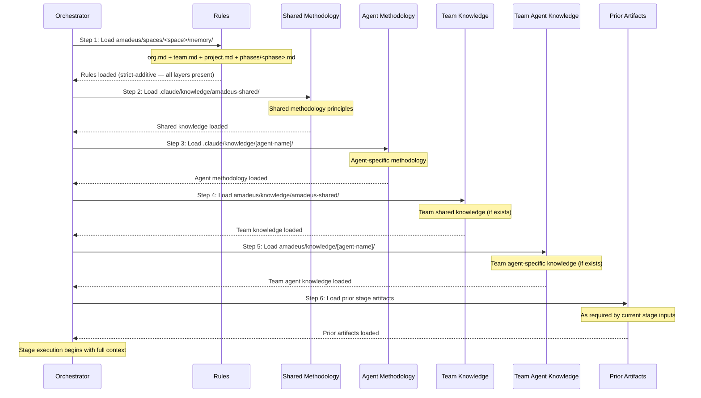

# ナレッジシステム

この章では、2 層構成のナレッジアーキテクチャを解説します。方法論に関するナレッジがどのようにフレームワークに同梱されるか、チームナレッジがプロジェクトごとにどう管理されるか、6 ステップのロード順序、テンプレートシステム、そしてナレッジを拡張する方法を扱います。

---

## 2 層アーキテクチャ

AI-DLC は、フレームワークの方法論とチームのカスタマイズを分離する 2 層構成のナレッジシステムを採用しています。

**Tier 1: 方法論ナレッジ**(`.claude/knowledge/`)-- フレームワークに同梱されます。共有の原則とエージェントごとの方法論リファレンスを含みます。フレームワークのアップグレード時に更新されます。ワークフロー実行中は読み取り専用です。

**Tier 2: チームナレッジ**(アクティブな space — `amadeus/knowledge/`、`amadeus/spaces/<space>/knowledge/` の略記)-- ユーザーが管理します。企業固有の標準、ポリシー、規約を含みます。space の `memory/`、`codekb/`、`intents/` の兄弟であり、space 内のすべての intent をまたいで蓄積されます。ブートストラップ時点では自由形式かつ空です。エンジンは最初の `/amadeus` で空の `amadeus/knowledge/` ディレクトリを作成し、その中には何もシードしません。固定のファイルセットはありません。

### Tier 1 の構造

```
.claude/knowledge/
+-- amadeus-shared/
|   +-- ai-dlc-principles.md       # コア方法論の原則
|   +-- verification.md            # フェーズ境界の検証ルール
|   +-- brownfield.md              # ブラウンフィールドのセーフガード
|   +-- audit-format.md            # 68 イベントの監査タクソノミー
|   +-- knowledge-readme-template.md  # チームが Tier 2 にコピーできる任意の README テンプレート
|   +-- state-template.md          # State ファイルのテンプレート
+-- amadeus-product-agent/
|   +-- requirements-guide.md
|   +-- product-guide.md
|   +-- functional-design-guide.md
|   +-- requirements-elicitation.md
|   +-- prioritization-frameworks.md
|   +-- user-story-patterns.md
|   +-- market-research-methods.md
+-- amadeus-architect-agent/
|   +-- architecture-guide.md
|   +-- nfr-design-guide.md
|   +-- ddd-patterns.md
|   +-- architecture-patterns.md
|   +-- nfr-design-patterns.md
|   +-- adr-template.md
+-- amadeus-developer-agent/
|   +-- code-analysis-guide.md
|   +-- code-generation-guide.md
|   +-- code-generation-patterns.md
|   +-- api-design-guide.md
|   +-- data-modelling-patterns.md
|   +-- re-artifacts.md
+-- [... 他に 8 個のエージェントナレッジディレクトリ]
```

### Tier 2 の構造

ブートストラップ時点では空です。エンジンは空の `amadeus/knowledge/` ディレクトリを作成し、その中には何も作成しません — README もエージェントごとのサブディレクトリもありません。以下の `amadeus-shared/` とエージェントごとのディレクトリは、エージェントペルソナが探す規約であり、チームは自分がコンテンツを持つものだけを作成します。

```
amadeus/knowledge/                    # ブートストラップ時点では空。チームが作成するサブディレクトリ
+-- amadeus-shared/                   # 任意 — 存在すればすべてのエージェントがロード
|   +-- (ユーザーが追加したファイル)
+-- amadeus-product-agent/            # 任意 — そのエージェントがアクティブなときにロード
|   +-- (ユーザーが追加したファイル)
+-- [... チームが投入すると決めたエージェントごとのディレクトリ]
```

---

## 6 ステップのナレッジロード順序

各ステージは、厳密な 6 ステップのシーケンスでナレッジをロードします。まず解決済みのルールセット、次に共有方法論、続いてエージェント固有の方法論、その次にチームのカスタマイズ、最後に前ステージの成果物という順です。



| Step | ソース | Tier | 管理者 | ロード |
|------|--------|------|-----------|--------|
| 1 | `amadeus/spaces/<space>/memory/` | -- | フレームワーク + 自己学習 | 最初 |
| 2 | `.claude/knowledge/amadeus-shared/` | 1 | フレームワーク | 早期 |
| 3 | `.claude/knowledge/[agent]/` | 1 | フレームワーク | 早期 |
| 4 | `amadeus/knowledge/amadeus-shared/` | 2 | チーム | 中間 |
| 5 | `amadeus/knowledge/[agent]/` | 2 | チーム | 中間 |
| 6 | 前ステージの成果物 | -- | 動的 | 最後 |

> **Note:** ステップ 1〜5 はエージェントナレッジのロード(各エージェントファイルで定義)です。ステップ 6(前ステージの成果物)は、ファイルロードのステップではなく、実行時にオーケストレーターが追加するコンテキストです。

### 各レイヤーが提供するもの

- ルール(ステップ 1)は最初にロードされ、厳密加算型の 5 レイヤーチェーン(org → team → project → phase → stage)を通じて解決されます — 該当するすべてのルールがコンテキストに存在し、より広いレイヤーが上書きされることはなく、加算されるだけです。[ルールシステム](08-rule-system.ja.md)を参照してください。
- フレームワーク方法論(ステップ 2〜3)はベースラインの振る舞いを提供します。
- チームナレッジ(ステップ 4〜5)は組織固有のコンテキストを追加します。
- 前ステージの成果物(ステップ 6)はワークフロー固有のコンテキストを提供します。

---

## テンプレートシステム

### ナレッジ README テンプレート

`.claude/knowledge/amadeus-shared/knowledge-readme-template.md` は、チームが Tier 2 のディレクトリをドキュメント化するためにコピーできる任意の README テンプレートを同梱しています。エンジンはこれをスキャフォールドしたりシードしたりしません — space レベルの `amadeus/knowledge/` ディレクトリは空で作成され、チームが望むものを追加します。テンプレートは以下を説明します。

- そのエージェント向けにどの種類のファイルを追加すべきか
- 一般的なカスタマイズファイルの例
- ファイルがどのようにロードされるか(エージェントがアクティブになると自動で)
- 特別な命名規約は不要であること -- どの `.md` ファイルもロードされる

### State テンプレート

`amadeus-state.md` ファイルは `.claude/knowledge/amadeus-shared/state-template.md` から作成されます。このテンプレートは、Project Information、Scope Configuration、Workspace State、Execution Plan Summary、Runtime State、Phase Progress、Stage Progress(チェックボックス)、Current Status、Session Resume Point の各セクションを定義します。

---

## チームナレッジの追加

企業固有のファイルをチームナレッジディレクトリに追加します。

```bash
# チーム全体の標準(すべてのエージェントがロード)
amadeus/knowledge/amadeus-shared/company-coding-standards.md
amadeus/knowledge/amadeus-shared/company-architecture-principles.md

# エージェント固有の標準(そのエージェントがアクティブなときのみロード)
amadeus/knowledge/amadeus-architect-agent/company-architecture-patterns.md
amadeus/knowledge/amadeus-devsecops-agent/company-security-policy.md
amadeus/knowledge/amadeus-developer-agent/company-coding-conventions.md
amadeus/knowledge/amadeus-quality-agent/company-testing-standards.md
```

ファイルはエージェントがアクティブになると自動でロードされます(ロード順序のステップ 4〜5)。設定変更は不要です。ディレクトリに置かれた `.md` ファイルはすべてロードされます。

### エージェント別ナレッジ

> この表はスナップショットです。各エージェントの正となる `display_name` + `examples` は、`core/agents/<slug>-agent.md` にあるエージェントのフロントマターに存在し、`core/tools/amadeus-lib.ts` の `loadAgents()` を通じてプログラム的に公開されます。新しいエージェントはまずそこに追加し、この表は同じ PR で更新してください。

| Directory | 目的 | Example Files |
|-----------|---------|---------------|
| `amadeus-shared/` | チーム全体の標準 | `coding-standards.md`, `api-conventions.md` |
| `amadeus-product-agent/` | プロダクトコンテキスト | `roadmap.md`, `personas.md` |
| `amadeus-design-agent/` | UX/UI ガイドライン | `design-system.md`, `accessibility.md` |
| `amadeus-delivery-agent/` | PM 規約 | `sprint-cadence.md`, `definition-of-done.md` |
| `amadeus-architect-agent/` | アーキテクチャ決定 | `tech-stack.md`, `infrastructure-preferences.md` |
| `amadeus-developer-agent/` | コーディングパターン | `db-conventions.md`, `error-handling.md` |
| `amadeus-quality-agent/` | テスト標準 | `test-strategy.md`, `coverage-requirements.md` |
| `amadeus-devsecops-agent/` | セキュリティポリシー | `security-baseline.md`, `compliance-rules.md` |
| `amadeus-aws-platform-agent/` | クラウドコンテキスト | `account-structure.md`, `service-limits.md` |
| `amadeus-compliance-agent/` | コンプライアンスルール | `data-governance.md`, `audit-requirements.md` |
| `amadeus-pipeline-deploy-agent/` | CI/CD 標準 | `pipeline-standards.md`, `deployment-gates.md` |
| `amadeus-operations-agent/` | Ops ランブック | `monitoring.md`, `incident-response.md` |

---

## クロスリファレンス

- [Architecture](01-architecture.ja.md) -- 5 レイヤーモデルにおけるナレッジレイヤー
- [Agent System](05-agent-system.ja.md) -- エージェントのフロントマターと設定
- [Stage Protocol](04-stage-protocol.ja.md) -- エージェントペルソナのロードに関するセクション
- [Hooks and Tools](06-hooks-and-tools.ja.md) -- audit-format.md タクソノミー(共有ナレッジに同梱)
