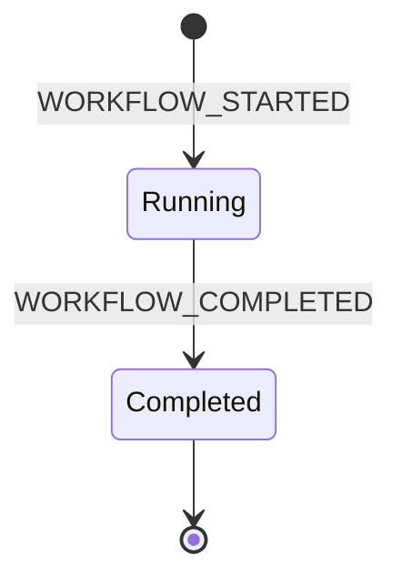
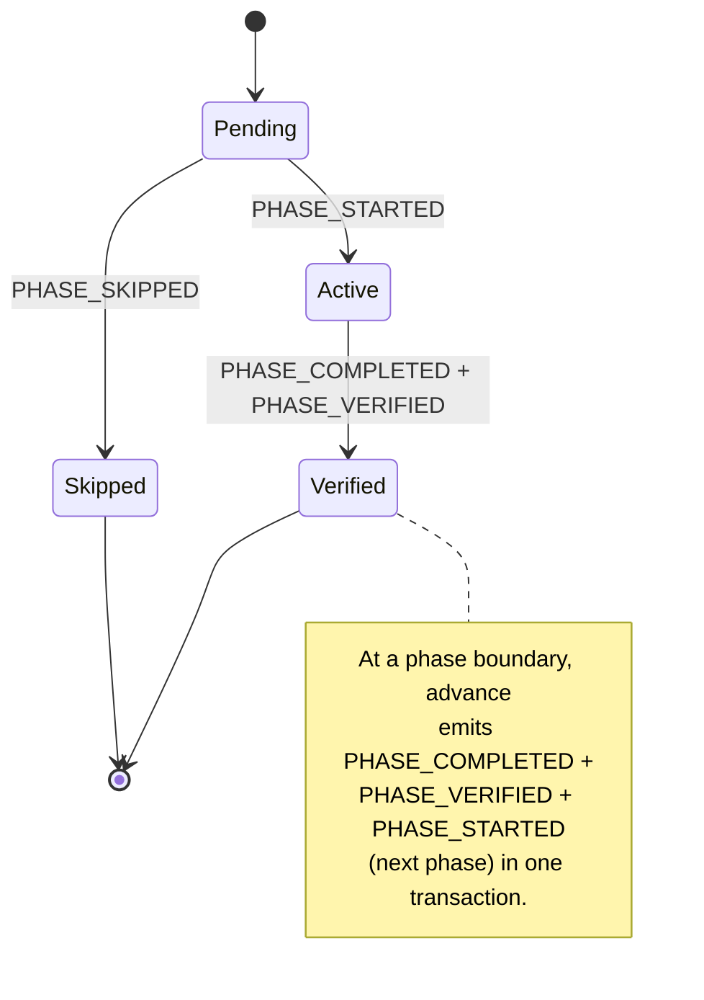
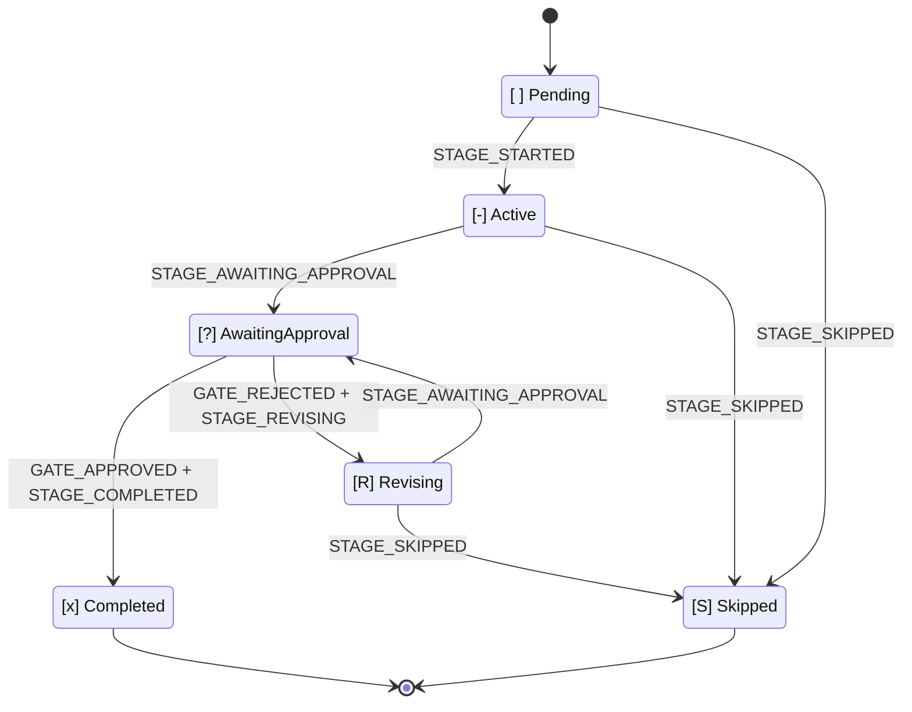

# State Machine

> 言語: [English](12-state-machine.md) | **日本語**

本章は AI-DLC のステートマシン、監査イベントの分類体系、そしてそれらを結びつける規則 — **すべての状態遷移はちょうど1つのツールが所有するエミッタを持つ** — についての正典リファレンスです。本章の各テーブルをコードと同期させることは、`tests/integration/t48-audit-event-emitters.test.ts` のドリフトテストによって強制されます。ドキュメントとコードが食い違えば、t48 は失敗します。

3つの入れ子になったステートマシンが AI-DLC を駆動します: **workflow**、**phase**、**stage** です。4つ目の独立したストリームは、Claude Code のフックが発行する **session** イベントを記録します。これら4つのストリームは intent の監査証跡(record ディレクトリ配下の `audit/` シャードディレクトリ、`<record>/` = `amadeus/spaces/<space>/intents/<YYMMDD>-<label>/`)を共有しますが、それぞれ異なるコードパスが所有します。したがって別々の関心事として読み、それらのタイムラインが交錯することを覚えておくのが最も分かりやすいです。

> **北極星となる不変条件:** TypeScript が決定論的な記録管理を所有し、LLM が判断を所有します。すべての監査発行はツールまたはフックに起源を持ち、LLM の散文を emit パスから排除します。MD ファイルを読んでいて `amadeus-audit.ts append <EVENT>` が散文の指示として書かれているのを見つけたら、それはバグです。
>
> **Audit-first アトミック性:** ツールは状態を変更する *前に* 監査エントリを発行します。監査発行が失敗した場合、ツールは状態に触れる前に例外を投げます — したがって `audit.md` と状態ファイルが食い違うことはありません。本章末尾近くの[「Audit-first アトミック性」セクション](#audit-first-atomicity)が障害モードを詳述します。

---

## Why three state machines

workflow はフェーズを通過することで完了します。フェーズはスコープ内のステージを通過することで完了します。ステージはその承認ゲートが閉じたときに完了します。各レイヤーは異なる決定を所有します:

- **Workflow** — ジョブ全体は実行中か、完了か?
- **Phase** — このライフサイクルフェーズは進行中か、検証済みか、それともスコープが除外したためスキップされたか?
- **Stage** — ステージは作業中か、ユーザー待ちか、却下後に修正中か、それとも完了か?

これらを1つの状態フィールドに平坦化すると、それらの決定が混同されます。分離することで、`/amadeus --status` は「この workflow をブロックしているものは何か?」を1回の読み取りで答えられます: workflow `Running`、phase `Active`、stage `[?]` → 「\<stage\> の承認待ち」。

---

## Workflow machine



<!-- Text fallback: initial state transitions to Running on WORKFLOW_STARTED; Running transitions to Completed on WORKFLOW_COMPLETED; Completed is terminal. -->

**Status 値:** `Running`、`Completed`。

workflow は最初の intent が誕生したとき(`amadeus-utility intent-birth`、最初の `/amadeus` または `/amadeus-init` 経由で自動呼び出し)に開始し、最後のスコープ内ステージの承認ゲートが閉じたときに終了します。`Paused` ステータスも `Waiting for Approval` ステータスも存在しません — 承認はステージレベルの関心事であり、pause には UX がありません。

workflow の `Running` 状態は Claude Code のセッションをまたいで持続します。月曜に workflow を開始し、セッションを止め、火曜に再開する — workflow はまだ `Running` です。終了したのは *セッション* であり、新しいセッションが始まったのです。

| Transition | Trigger | Emitter |
|---|---|---|
| `[*] → Running` | `amadeus-utility init` | `tools/amadeus-utility.ts` |
| `Running → Completed` | `amadeus-state complete-workflow` | `tools/amadeus-state.ts` |

---

## Phase machine



<!-- Text fallback: initial state transitions to Pending; Pending transitions to Active on PHASE_STARTED; Pending transitions to Skipped on PHASE_SKIPPED; Active transitions to Verified on PHASE_COMPLETED + PHASE_VERIFIED. At a phase boundary, advance emits PHASE_COMPLETED + PHASE_VERIFIED + PHASE_STARTED (next phase) atomically, chaining Verified back to the next phase's Pending-to-Active transition. -->

**Status 値:** `Pending`、`Active`、`Verified`、`Skipped`。

フェーズの状態は `amadeus-state.md` の `## Phase Progress` セクションで追跡されます。intent 誕生時にすべてのフェーズへ `Pending` を刻印し、スコープが除外する各フェーズに対して(いずれのステージが開始する前に)`PHASE_SKIPPED` を発行し、その後現在のフェーズを `Active` に昇格させます。フェーズ完了時にはフェーズ境界で `PHASE_COMPLETED` と `PHASE_VERIFIED` の両方を発火し、続いて次のフェーズに対して `PHASE_STARTED` を発火します。

| Transition | Trigger | Emitter |
|---|---|---|
| `Pending → Active` (最初のフェーズ) | `amadeus-utility intent-birth` | `tools/amadeus-utility.ts` |
| `Pending → Skipped` | `amadeus-utility intent-birth` (スコープ除外ごと) | `tools/amadeus-utility.ts` |
| `Active → Verified` | フェーズ境界での `amadeus-state advance` または `complete-workflow` | `tools/amadeus-state.ts` |
| `Pending → Active` (境界) | フェーズ境界での `amadeus-state advance`、または `amadeus-jump execute` | `tools/amadeus-state.ts`、`tools/amadeus-jump.ts` |

init→post-init の引き継ぎでは、`amadeus-utility intent-birth` 自身が最後の init ステージの後に `PHASE_COMPLETED + PHASE_VERIFIED + PHASE_STARTED + STAGE_STARTED` を発行します。これにより、誕生と最初の `advance` の間で監査証跡が沈黙する代わりに、その遷移を捕捉します。

---

## Stage machine



<!-- Text fallback: [ ] Pending transitions to [-] Active on STAGE_STARTED. [-] Active transitions to [?] AwaitingApproval on STAGE_AWAITING_APPROVAL. [?] AwaitingApproval transitions to [x] Completed on GATE_APPROVED + STAGE_COMPLETED, or to [R] Revising on GATE_REJECTED + STAGE_REVISING. [R] Revising transitions back to [?] AwaitingApproval on STAGE_AWAITING_APPROVAL (re-entry). Any of Pending / Active / Revising can transition to [S] Skipped via STAGE_SKIPPED. -->

**チェックボックス凡例(`amadeus-state.md` 内):**

| Checkbox | State | Meaning |
|---|---|---|
| `[ ]` | `Pending` | 未着手 |
| `[-]` | `Active` | 進行中 |
| `[?]` | `AwaitingApproval` | ステージ作業完了、ゲートオープン — ユーザーがブロッカー |
| `[R]` | `Revising` | ユーザーがゲートを却下 — 再入前にステージを修正中 |
| `[x]` | `Completed` | 承認済みで完了 |
| `[S]` | `Skipped` | スコープで除外、jump でスキップ、または実行途中でカット |

`[?]` と `[R]` は、そうでなければ両方とも `[-]` に見える2つの状況を区別します。再開時、`[R]` はコンダクターに対し、ステージをゼロから再実行するのではなく、ゲートに再入する前に以前の成果物とフィードバックを提示するよう伝えます。

| Transition | Trigger | Emitter |
|---|---|---|
| `Pending → Active` | `amadeus-state advance <slug>` | `tools/amadeus-state.ts` |
| `Active → AwaitingApproval` | `amadeus-state gate-start <slug>` | `tools/amadeus-state.ts` |
| `AwaitingApproval → Completed` | `amadeus-state approve <slug>` | `tools/amadeus-state.ts` |
| `AwaitingApproval → Revising` | `amadeus-state reject <slug> --feedback <text>` | `tools/amadeus-state.ts` |
| `Active → Revising` | gate-start がスキップされたときの `amadeus-state reject <slug>` — reject が却下ペアの前に欠落した `STAGE_AWAITING_APPROVAL`(`Recovered=true` タグ付き)をバックフィルする | `tools/amadeus-state.ts` |
| `Revising → AwaitingApproval` | `amadeus-state revise <slug>` (ゲート再入) | `tools/amadeus-state.ts` |
| `{Pending,Active,Revising} → Skipped` | `amadeus-state skip <slug> --reason <text>`、または `amadeus-jump execute` | `tools/amadeus-state.ts`、`tools/amadeus-jump.ts` |

`approve` コマンドはゲート後の遷移全体を所有します: `GATE_APPROVED + STAGE_COMPLETED` を発行し、その後スコープ内の次のステージへ自動的に進行し(`handleAdvance` に委譲)、`STAGE_STARTED` に加えてフェーズ境界では任意の `PHASE_*` イベントを発行します。スコープ内の最終ステージでは、approve は代わりに `complete-workflow` に委譲し、`PHASE_COMPLETED + PHASE_VERIFIED + WORKFLOW_COMPLETED` を発行して Status=Completed を設定します。コンダクターは `approve` の後に `advance` を呼び出しません — approve はゲート応答から次のステージの `[-]` までのすべてを所有します。`advance` コマンドは非ゲート遷移(Initialization ステージ、construction bolt)のために残されており、すでに `[x]` の slug に対して冪等です(重複する `STAGE_COMPLETED` を抑制します)。

**Artifact guard (issue #366).** ステージを `[x]` としてマークするすべての遷移(`approve`、`advance`、`finalize`、`complete-workflow`)は、完了させる前に決定論的な成果物チェックを実行します。これにより、ディスク上に作業の証拠なしにステージを `[x]` としてマークすることはできません(完了サブコマンドがガードなしの裏口となることはありません)。`produces[]` を宣言するステージは、それらの成果物のうち少なくとも1つが存在していなければなりません(アクティブな intent の record ディレクトリ `amadeus/spaces/<space>/intents/<slug>-<id8>/<phase>/<slug>/` 配下、ユニットごとの Construction ステージについてはその record の `construction/<unit>/<slug>/`、あるいは codekb ステージについては `amadeus/spaces/<space>/codekb/<repo>/`)。`workspace_requires: true` のステージは、加えて `amadeus/` ワークスペースツリーおよびハーネスディレクトリの外側での実際のソース作業の証拠を示さなければなりません。git ワークスペースではそれはコミットされていない/追跡されていない非ドキュメント変更、または直近のコミット内の非ドキュメントパスを意味します(これにより本セッションのコードをブラウンフィールドのベースラインと区別しつつ、commit-then-approve を通します)。それ以外の場合はシェルを使わないファイルシステム存在チェックです。チェックが失敗すると、コマンドは非ゼロで終了し何も書き込みません: 遷移は拒否されます(`Refusing to complete "<slug>": ...`)。`produces[]` を宣言しないステージ(Initialization フェーズ)は空虚に通過します。`AMADEUS_SKIP_ARTIFACT_GUARD=1` でバイパスします。

**Park (issue #365/#367).** `amadeus-orchestrate park` は、いずれのステージも進行させずに `Parked` / `Parked At Stage` ランタイムマーカーを書き込みます(`amadeus-state.ts park` 経由、これが `WORKFLOW_PARKED` を発行します)。続く単純な `next` は終端の `parked` ディレクティブを再発行し、Stop フックがターンを終了させます。これにより、長い workflow は残りのステージを機械的に承認して `done` に到達する代わりに、セッションをまたいで一時停止できます。`/amadeus --resume` は続行前にマーカーをクリアします(`unpark` が `WORKFLOW_UNPARKED` を発行)。無人の自律的 Construction 実行(`Construction Autonomy Mode: autonomous`)は park を拒否します: ツールと Stop フックの `parked` allow の両方が autonomous モード下で辞退するため、再開する人間がいなくてもループは動き続けます。

### Revision loop

```
gate-start  →  [?] AwaitingApproval
          ↘ reject  →  [R] Revising  (Revision Count += 1)
                   ↓ revise
                   [?] AwaitingApproval
                   ↘ approve  →  [x] Completed
```

`Revision Count` は状態ファイルに存在し、各 `reject` でインクリメントされます。コンダクターはこれを使って revision-loop の脱出ハッチを検出します(デフォルトは skip を提案する前に3サイクル)。

### Skeleton stance

`amadeus-state set-skeleton-stance <on|off|scope-dependent>` は、コンダクターが分類した walking-skeleton スタンスを `Skeleton Stance` フィールドに記録します。`Revision Count` と同様、これは状態ファイルに存在するランタイムメタデータであり、イベントに乗らず**監査行(audit row)を発行しません**。したがって下記の監査イベントタクソノミー表には現れません。これは状態機械の遷移ではなく、次の `amadeus-orchestrate next` が読み取って遅延された Construction Bolt-1 ゲート(walking-skeleton ラダー)を解決するための値です。classify のラウンドトリップが、この intent のスコープがゲート付き walking-skeleton Bolt 1 を要するかどうかを永続化し、`scope-dependent` はスコープマッピングのデフォルト(greenfield → skeleton-on、incremental → skeleton-off)にフォールバックします。

---

## Session stream (hook-owned, independent)

session イベントは AI-DLC ツールではなく Claude Code のフックが発行します。session は単一の Claude Code 会話であり、workflow は長命のディレクトリ状態です。関係は多対多です — 1つの workflow は複数のセッションにまたがることができ、1つのセッションは複数の workflow に触れることができます — したがってストリームは設計上独立しています。

| Event | Emitter | Trigger |
|---|---|---|
| `SESSION_STARTED` | `hooks/amadeus-session-start.ts` | `source=startup` または `clear` の `SessionStart` |
| `SESSION_RESUMED` | `hooks/amadeus-session-start.ts` | `source=resume` の `SessionStart` |
| `SESSION_COMPACTED` | `hooks/amadeus-validate-state.ts` | `PreCompact` — 確実に捕捉されるよう compaction 時に発火 |
| `SESSION_ENDED` | `hooks/amadeus-session-end.ts` | `SessionEnd` |

session フックは発行前にアクティブな intent の `amadeus-state.md`(`amadeus/spaces/<space>/intents/<YYMMDD>-<label>/` 配下)をチェックします。そのようなファイルが存在しない場合(cwd にアクティブな AI-DLC workflow がない場合)、フックはいずれの監査ログにも書き込まずに静かに終了します。session イベントはアクティブな workflow のタイムラインに注釈を付けるために存在します — workflow のないディレクトリのセッションには注釈すべきものがありません。

### Compaction awareness

`amadeus-state.ts resume` は監査末尾をスキャンして最新の `SESSION_COMPACTED` を探します。それに続くステージアクティビティ(`STAGE_STARTED`、`STAGE_COMPLETED`、`GATE_APPROVED`、`SESSION_RESUMED`、`RECOVERY_COMPLETED`)がない場合、resume は `compaction_pending: true` を返し、コンダクターは続行前に3択のプロンプト(continue / review / restart)を提示します。`RECOVERY_COMPLETED` はユーザーがオプションを選択すると `acknowledge-compaction` によって発行され、アクティビティゲートを満たすため、後続の compaction が新しい境界を検出できます。

---

## Audit event taxonomy

**74 events** で、以下では17カテゴリにグループ化しています(正典の `audit-format.md` レジストリは同じ74を18に分割しています — グループ化は表現上のものであり、イベントセットが不変条件です)。すべてのイベントはちょうど1つのツールまたはフックのエミッタを持ちます。ただし、来たるリリース向けに事前登録され、Emitter セルが `Reserved (v0.4.0 PR N)`、`Reserved (v0.5.0 PR N)`、または `Reserved (v0.6.0 PR N)` と読めるイベントは例外です — これらはコンシューマ PR がエミッタを出荷するまで、ドリフトテストの forward チェックでスキップされます。ドリフトテスト `tests/integration/t48-audit-event-emitters.test.ts` は、本章のテーブルとコードの間の forward/reverse/tertiary/pairing/MD-MD の一貫性を強制します。

### Workflow lifecycle

| Event | Emitter | Notes |
|---|---|---|
| `WORKFLOW_STARTED` | `tools/amadeus-utility.ts` | すべての intent 誕生で必須の最初のイベント |
| `WORKFLOW_COMPLETED` | `tools/amadeus-state.ts` |  |
| `WORKFLOW_PARKED` | `tools/amadeus-state.ts` | `park` - 後のセッション向けに実行途中で park された workflow。ステージ進行なし |
| `WORKFLOW_UNPARKED` | `tools/amadeus-state.ts` | `unpark` - 明示的な `--resume` 再入時に park マーカーがクリアされた |

### Phase lifecycle

| Event | Emitter | Notes |
|---|---|---|
| `PHASE_STARTED` | `tools/amadeus-utility.ts`、`tools/amadeus-state.ts`、`tools/amadeus-jump.ts` | init での最初の発火。以降の発火はステージツールのフェーズ境界で |
| `PHASE_COMPLETED` | `tools/amadeus-utility.ts`、`tools/amadeus-state.ts`、`tools/amadeus-jump.ts` | すべての境界で `PHASE_VERIFIED` とペア |
| `PHASE_VERIFIED` | `tools/amadeus-utility.ts`、`tools/amadeus-state.ts`、`tools/amadeus-jump.ts` | 常に `PHASE_COMPLETED` とペア |
| `PHASE_SKIPPED` | `tools/amadeus-utility.ts` | スコープ除外フェーズごとに1つ、intent 誕生時に発行 |

### Stage lifecycle

| Event | Emitter | Notes |
|---|---|---|
| `STAGE_STARTED` | `tools/amadeus-state.ts`、`tools/amadeus-utility.ts`、`tools/amadeus-jump.ts` | `[ ]` → `[-]` をマーク |
| `STAGE_AWAITING_APPROVAL` | `tools/amadeus-state.ts` | `gate-start`(初回入場)、`revise`(却下後の再入場)、`reject`(gate-start がスキップされたときのバックフィル)。バックフィルされた行 — `gate-start --recovered`(report の明示ステージ recovery)と reject の自己修復 — は `Recovered=true` を持つ。有機的な gate-start と revise 再入場は持たない |
| `STAGE_COMPLETED` | `tools/amadeus-state.ts`、`tools/amadeus-utility.ts` | `approve` によって `GATE_APPROVED` とアトミックに発行。approve が `[x]` を事前マークしなかった場合は `advance` によっても発行 |
| `STAGE_REVISING` | `tools/amadeus-state.ts` | `GATE_REJECTED` とペア |
| `STAGE_SKIPPED` | `tools/amadeus-state.ts`、`tools/amadeus-jump.ts` | `[S]` 遷移ごとに1つ |
| `STAGE_JUMPED` | `tools/amadeus-jump.ts` | `--stage`/`--phase` jump で宛先 slug を記録 |
| `GUARD_EXEMPTED` | `tools/amadeus-state.ts` | intent が registry の docs-only 宣言を持つとき、`verifyStageArtifacts` が `workspace_requires` ステージ完了の拒否を免除する。`Stage` と宣言の `Evidence` を持つ(#499/#848) |

### Gate decisions

| Event | Emitter | Notes |
|---|---|---|
| `GATE_APPROVED` | `tools/amadeus-state.ts` | `--user-input` が正確な選択を捕捉 |
| `GATE_REJECTED` | `tools/amadeus-state.ts` | `--feedback` が却下理由を捕捉 |
| `DELEGATED_APPROVAL` | `tools/amadeus-state.ts` | `delegate-approval` が leader セッションの人間承認を、リモートの conductor intent の監査ディレクトリへ記録。conductor のゲートが検証する発行元 `(space, intent, shard, HUMAN_TURN タイムスタンプ)` を保持(#671) |
| `DELEGATED_REJECTION` | `tools/amadeus-state.ts` | `delegate-rejection` が leader セッションの人間却下を、リモートの conductor intent の監査ディレクトリへ記録。`DELEGATED_APPROVAL` の verb 対称ミラーで、reject ゲートのみを開く(#685) |

### User interaction

| Event | Emitter | Notes |
|---|---|---|
| `DECISION_RECORDED` | `tools/amadeus-log.ts` | オプションを捕捉するため `AskUserQuestion` の前に発火 |
| `QUESTION_ANSWERED` | `tools/amadeus-log.ts` | ユーザー応答の後に発火 |

### Scope and configuration

| Event | Emitter | Notes |
|---|---|---|
| `SCOPE_DETECTED` | `tools/amadeus-utility.ts` | `detect-scope` サブコマンド。`Source` フィールドが由来を記録(freeform / keyword / env / cli) |
| `SCOPE_CHANGED` | `tools/amadeus-utility.ts` | アクティブな workflow での `scope-change` サブコマンド |
| `DEPTH_CHANGED` | `tools/amadeus-utility.ts` | `config-change --depth` |
| `TEST_STRATEGY_CHANGED` | `tools/amadeus-utility.ts` | `config-change --test-strategy` |
| `RECOMPOSED` | `tools/amadeus-utility.ts` | `recompose` サブコマンド - 適応的コンポーザーの実行中プラン再形成(監査ロック下で pending ステージのサフィックスが反転) |

### Artifacts

| Event | Emitter | Notes |
|---|---|---|
| `ARTIFACT_CREATED` | `hooks/amadeus-audit-logger.ts` | 新規パスへの書き込み — `mtimeMs == birthtimeMs` の stat チェックで UPDATED と区別 |
| `ARTIFACT_UPDATED` | `hooks/amadeus-audit-logger.ts` | Edit ツール、または既存ファイルを上書きする Write |
| `ARTIFACT_REUSED` | `tools/amadeus-state.ts` | `reuse-artifact` サブコマンド — keep/modify/redo の決定 |

### Construction Bolts

| Event | Emitter | Notes |
|---|---|---|
| `BOLT_STARTED` | `tools/amadeus-bolt.ts` | 並列バッチ用の CSV bolt 名を受け付ける |
| `BOLT_COMPLETED` | `tools/amadeus-bolt.ts` | 先行する `BOLT_STARTED` とペア |
| `BOLT_FAILED` | `tools/amadeus-bolt.ts`(`fail` + `abort`) | `--succeeded-siblings` が並列バッチの生存者を捕捉。`abort` はサブ分類のため `Reason: aborted` フィールドを追加 |
| `AUTONOMY_MODE_SET` | `tools/amadeus-bolt.ts` | `Construction Autonomy Mode` フィールドをアトミックに更新。まずフィールドの存在を検証(audit-first) |
| `UNIT_DISPOSITION_CHANGED` | `tools/amadeus-unit-disposition.ts` | `amadeus-bolt.ts park`、`skip`、`resume` から呼ばれる、コンダクター所有の監査ベース `(stage, Unit)` disposition 遷移。`From`、`To`、`Reason` を記録し、変更ごとに新しい回答を1件消費する。人間が承認した Unit park は autonomous Construction でも有効であり、ワークフロー全体は park しない |

### Session

| Event | Emitter | Notes |
|---|---|---|
| `SESSION_STARTED` | `hooks/amadeus-session-start.ts` | `source=startup` または `clear` |
| `SESSION_RESUMED` | `hooks/amadeus-session-start.ts` | `source=resume` |
| `SESSION_COMPACTED` | `hooks/amadeus-validate-state.ts` | 重複を避けるため PreCompact 時(次の SessionStart 時ではなく)に発行 |
| `SESSION_ENDED` | `hooks/amadeus-session-end.ts` | Claude Code からの `Reason` フィールドを含む |
| `HUMAN_TURN` | `hooks/amadeus-mint-presence.ts`(+ ハーネスごとの prompt-submit アダプタ) | 実際の人間プロンプトまたは回答済み質問ウィジェットごとに1つ。承認/インタビューゲートは前回のゲート解決以降に1つを要求する |
| `SUBAGENT_COMPLETED` | `hooks/amadeus-log-subagent.ts` | SubagentStop フック経由でサブエージェント完了を記録 |

### Diagnostics and workspace

| Event | Emitter | Notes |
|---|---|---|
| `HEALTH_CHECKED` | `tools/amadeus-utility.ts` | `--doctor` 実行 |
| `WORKSPACE_SCAFFOLDED` | `tools/amadeus-utility.ts` | init によって作成された新規ディレクトリツリー |
| `WORKSPACE_SCANNED` | `tools/amadeus-utility.ts` | ブラウンフィールドワークスペース検出完了 |
| `WORKSPACE_INITIALISED` | `tools/amadeus-utility.ts` | 状態ファイルが実体化された |

### Error and recovery

| Event | Emitter | Trigger |
|---|---|---|
| `ERROR_LOGGED` | `tools/amadeus-lib.ts`(すべてのツールの `error()` からの `emitError` 経由) | 非ゼロ終了のため `error(msg)` を呼ぶ任意のツール CLI。ベストエフォート — cwd に workflow がなければ no-op、再帰に対してガード済み |
| `RECOVERY_COMPLETED` | `tools/amadeus-state.ts` | ユーザーが compaction-awareness の `AskUserQuestion` に回答した後、コンダクターが呼ぶ `acknowledge-compaction --choice <continue|review|restart>` |

### Worktree

v0.4.0 向けに事前登録。3つの `WORKTREE_*` 行は `amadeus-worktree.ts`(milestone 7)とともに出荷。`STATE_*` は milestone 9(状態 fork/merge)で到着。`AUDIT_*` は milestone 10(監査 fork/merge)で到着。t48 forward チェックは Emitter セルがまだ `Reserved` と読める行をスキップします。

| Event | Emitter | Trigger |
|---|---|---|
| `WORKTREE_CREATED` | `tools/amadeus-worktree.ts` | Bolt 開始時に main から作成される Bolt ごとの git worktree(サブコマンド: `create`) |
| `WORKTREE_MERGED` | `tools/amadeus-worktree.ts` | ゲート承認時に main へマージし戻される Bolt の worktree(サブコマンド: `merge`) |
| `WORKTREE_DISCARDED` | `tools/amadeus-worktree.ts` | 中止された Bolt の worktree を明示的に削除(サブコマンド: `discard`) |
| `STATE_FORKED` | `tools/amadeus-state.ts` | Bolt 開始時に worktree へ fork される状態ファイル(サブコマンド: `fork`) |
| `STATE_MERGED` | `tools/amadeus-state.ts` | ゲート承認時に main へマージし戻される worktree の状態。多層防御としてアルファベット順 slug のタイブレーク(サブコマンド: `merge`) |
| `AUDIT_FORKED` | `tools/amadeus-audit.ts`(`audit-fork`) | Bolt 開始時に worktree へ fork される監査ログ。audit-of-intent — emit がバイトコピーに先行 |
| `AUDIT_MERGED` | `tools/amadeus-audit.ts`(`audit-merge`) | ゲート承認時に main 監査へ追記される worktree の監査エントリ。Bolt ごとのエントリ順序は保持、Bolt 間の順序はマージ完了順を反映 |

### Practices

v0.4.0 向けに事前登録。エミッタは milestone 8(ステージ 2.2 practices-discovery)と milestone 13(Construction オーケストレーターランタイム)で到着します。

| Event | Emitter | Trigger |
|---|---|---|
| `PRACTICES_DISCOVERED` | `tools/amadeus-state.ts` `practices-event --type discovered` | ブラウンフィールド発見 + ドラフト完了。ステージ 2.2 ゲートで承認待ちのチームプラクティスドラフト |
| `PRACTICES_AFFIRMED` | `tools/amadeus-state.ts` `practices-promote` | チームがプラクティスを承認。intent の `inception/practices-discovery/` から space メモリ層(`amadeus/spaces/<space>/memory/team.md` および `memory/project.md`)へコンテンツを昇格 |
| `PRACTICES_OVERRIDE` | `tools/amadeus-state.ts` `practices-promote`(milestone 8 の write-failure パス)および `tools/amadeus-state.ts` `practices-event --type override`(milestone 13 の bolt-plan-marker-conflict パス — 別イベントなしで `Reason` フィールドによる discriminator-field 曖昧性解消) | いずれか: ステージ 2.2 affirmation 中に cross-row 昇格が失敗した(Reason: `write-failure-*`)、または `amadeus/spaces/<space>/memory/team.md` の walking-skeleton スタンスが現在の Bolt に対して bolt-plan のマーカーを上書きした(Reason: `bolt-plan-marker-conflict`) |
| `PRACTICES_SECTION_EMPTY` | `tools/amadeus-state.ts` `practices-event --type empty` | コンダクターが空を返した practices セクションを読んだ。アドバイザリのみ、org デフォルトにフォールバック |

### Merge dispatch

milestone 1 で v0.4.0 向けに事前登録。エミッタは新しい `amadeus-bolt dispatch-event` サブコマンド経由で milestone 13 に到着します。コンダクターは各 amadeus-pipeline-deploy-agent ディスパッチをブラケットします — 呼び出し前 INVOKED、YAML パース成功時に呼び出し後 RETURNED、タイムアウト / 不正 YAML / 低信頼度時に FALLBACK。

| Event | Emitter | Trigger |
|---|---|---|
| `MERGE_DISPATCH_INVOKED` | `tools/amadeus-bolt.ts` `dispatch-event --event MERGE_DISPATCH_INVOKED` | コンダクターがチームプラクティスの散文からマージ戦略を判断するため Task 経由で amadeus-pipeline-deploy-agent をディスパッチ |
| `MERGE_DISPATCH_RETURNED` | `tools/amadeus-bolt.ts` `dispatch-event --event MERGE_DISPATCH_RETURNED` | エージェントが戦略、ターゲットブランチ、信頼度、注記を含むパース済み YAML を返した |
| `MERGE_DISPATCH_FALLBACK` | `tools/amadeus-bolt.ts` `dispatch-event --event MERGE_DISPATCH_FALLBACK` | エージェントがタイムアウトまたは不正 YAML を返した。コンダクターは org デフォルトにフォールバック — 重要な可観測性フック |

### Sensors

milestone 1 で v0.5.0 向けに事前登録。エミッタは4つの `SENSOR_*` イベントについて milestone 9(センサーディスパッチャー)に、`GUARDRAIL_LOADED` について milestone 14(paired-coverage doctor 行)に到着します。カバレッジは環境的です — markdown を書くすべての Inception/Construction/Operation ステージは、レジストリデフォルトのセンサーから少なくとも1つの `SENSOR_FIRED` 行を発行します。v0.5.0 ではアドバイザリのみ。v0.8.0 の ralph ドライバが Construction フェーズのセンサーにブロッキングセマンティクスを導入します。

| Event | Emitter | Trigger |
|---|---|---|
| `SENSOR_FIRED` | `tools/amadeus-sensor.ts` `fire` | ディスパッチャーがステージ出力に対してセンサーを起動(センサーの `matches` フィルタに対する PostToolUse Write/Edit マッチごと) |
| `SENSOR_PASSED` | `tools/amadeus-sensor.ts` `fire` | センサーが完了し所見なしを報告(ツール利用不可およびスクリプトエラーのフォールスルーもカバー。`Note` フィールドで区別) |
| `SENSOR_FAILED` | `tools/amadeus-sensor.ts` `fire` | センサーが完了し所見を報告。詳細ファイルは `<record>/.amadeus-sensors/<stage-slug>/<sensor-id>-<fire-id>.md`(intent の record ディレクトリ内)に書き込まれる |
| `SENSOR_BUDGET_OVERRIDE` | `tools/amadeus-sensor.ts` `fire` | センサーが設定された上限(三層 cap モデルによる registry / binding / depth 由来)を超え、終了またはスキップされた |
| `GUARDRAIL_LOADED` | `tools/amadeus-utility.ts` | ガードレールローダーがアクティブな workflow のスコープ階層的ガードレールセット(org → project → phase → stage)を解決。doctor の paired-coverage チェックがこのイベントから読む |

### Learning loop

milestone 4 で v0.5.0 向けに事前登録。`MEMORY_EMPTY` エミッタは milestone 8(`amadeus-runtime.ts compile`)に到着します。§13 の Learnings Ritual は実行中にステージごとの memory.md を書きます。ステージ承認時、runtime-graph の compile が memory.md を読み、4つの標準見出しの下に非空エントリが0のステージについて `MEMORY_EMPTY` を発行します。milestone 12 の learning-gate ツール(`amadeus-learnings.ts persist`)は、保持された学習が `amadeus/spaces/<space>/memory/{project,team}.md` に日付付きのプラクティスエントリとして到着したとき `RULE_LEARNED` を発行し、学習がセンサーバインディング(マニフェスト + 起源ステージの `sensors:` フロントマター)をインストールしたとき `SENSOR_PROPOSED` を発行します。doctor はダイアリー規律の可観測性のためにこれらの行を読みます。

| Event | Emitter | Trigger |
|---|---|---|
| `MEMORY_EMPTY` | `tools/amadeus-runtime.ts` | ステージ承認の runtime-graph compile が memory.md の欠落、または §13 の4見出しの下に非空エントリが0であることを発見 |
| `RULE_LEARNED` | `tools/amadeus-learnings.ts` | learning gate が保持された学習を `amadeus/spaces/<space>/memory/{project,team}.md` へ日付付きプラクティスエントリとして永続化した |
| `SENSOR_PROPOSED` | `tools/amadeus-learnings.ts` | learning gate が project 層のセンサーマニフェストを scaffold し、起源ステージの `sensors:` フロントマターにバインドした |

### Swarm

milestone 2 で v0.6.0 向けに事前登録。6つの swarm イベントはすべて swarm referee `amadeus-swarm.ts` から発行されるようになりました — コンダクターが参照する決定論的な verdict サーフェスです。referee はステートレスです: `prepare` はユニットごとの worktree を fork し `SWARM_STARTED` を発行します(加えて、コンダクターが loud downgrade を報告したときの `SWARM_DEGRADED` は Wave 4 milestone 16 で誕生)。`finalize` はコンダクターが収束を主張したセットを再検証し、Unit ごとのペア、失敗した Unit ごとの baton 行、バッチ集計を発行します。`check` サブコマンドはアドバイザリで何も発行しません。エンジンは読み取り専用でコンダクターは監査イベントを発行しないため、決定論的ツールが swarm 分類体系全体を所有します。これらの行は依存リンクされた Units のバッチのライフサイクルを追跡します: バッチ開始時のファンアウト、Unit ごとの収束または再検証失敗、コンダクターへの return-the-baton の受け渡し、バッチ完了。コンダクターは `invoke-swarm` をステージ `mode` enum と並ぶ直交的なディレクティブ種別として扱います — 予約された `agent-team` モードをアクティブにはしません(そのモードは予約されたままです)。t48 forward チェックは Emitter セルがまだ `Reserved` と読める行をスキップします。

| Event | Emitter | Trigger |
|---|---|---|
| `SWARM_STARTED` | `tools/amadeus-swarm.ts` | swarm referee `prepare` が依存リンクされた Units のバッチを fork した |
| `SWARM_UNIT_CONVERGED` | `tools/amadeus-swarm.ts` | swarm Unit が `finalize` ゲートで green(かつ改ざんなし)を再検証した |
| `SWARM_UNIT_FAILED` | `tools/amadeus-swarm.ts` | swarm Unit が `finalize` 再検証に失敗した(未主張、主張したが red、または改ざん) |
| `SWARM_BATON_RETURNED` | `tools/amadeus-swarm.ts` | swarm Unit がオーケストレーター仲介の調整のためコンダクターへ baton を返した |
| `SWARM_COMPLETED` | `tools/amadeus-swarm.ts` | バッチ内のすべての Units が完了した(収束または失敗)。バッチクローズ |
| `SWARM_DEGRADED` | `tools/amadeus-swarm.ts` | `AMADEUS_USE_SWARM=1` が要求されたが Workflow ツールが利用不可だった。コンダクターがサブエージェント floor を実行した |

分類体系内のすべてのイベントは、実際のエミッタに裏付けられているか、事前登録された来たるコンシューマ向けに `Reserved (v0.4.0 PR N)` / `Reserved (v0.5.0 PR N)` / `Reserved (v0.6.0 PR N)` とマークされているかのいずれかです。ドリフトテストは両方の半分を強制します — `Reserved` の早期スキップはセルが文字通り "Reserved" を含む間だけ適用され、コンシューマ PR は emit 呼び出しを出荷するのと同じコミットでそれを実際のエミッタファイルパスに置き換えます。

---

## Audit-first atomicity

状態を変更するコマンドは、状態ファイルを変更する **前に** 監査エントリを発行します。2つの帰結があります:

1. 監査発行が失敗した場合(ロックタイムアウト、ディスクエラー、無効なイベント型)、ツールは状態に触れる前に例外を投げます。状態は以前の値のまま、audit.md はクリーンなままです。
2. 監査発行の *後に* 状態書き込みが失敗した場合、監査には「意図」エントリがあるが状態は動いていない状態になります。ドリフトは可視で診断可能であり、`--doctor` がそれを表面化します。

`tests/unit/t17.test.ts` のケース `test("65: approve is audit-first ...")` は `approve` についてこれを証明します: audit.md を chmod で読み取り専用にすると監査失敗が強制され、状態ファイルが `[?]` のまま(`[x]` ではない)であることをアサートします。同じ不変条件は `gate-start`、`reject`、`revise`、`skip`、`advance`、`complete-workflow`、`reuse-artifact`、`amadeus-bolt.ts set-autonomy`、`amadeus-state.ts fork` / `amadeus-state.ts merge`(v0.4.0 milestone 9 の状態 fork/merge サブコマンド — 同等の chmod-the-lock-dir Part A および chmod-the-target-after-emit Part B の証明については `tests/unit/t76.test.ts` を参照)についても成立します。

状態の fork/merge は、意図的に下記の audit-of-intent 例外に **含まれていません**: 状態ファイルの再読み取りと再書き込みは冪等です(`git worktree add` とは異なり、これは emit と git の間の kill-9 の後に worktree を残します)。したがって厳格な不変条件がきれいに適用されます。監査発行成功後の状態書き込み失敗は、doctor(v0.4.0 milestone 15)が worktree の record ディレクトリの `amadeus-state.md` の存在に対して照合するファントム `STATE_FORKED` 行になります。

### Audit-of-intent semantics (`WORKTREE_*`, `AUDIT_*`, and merge-dispatch `MERGE_DISPATCH_INVOKED`)

audit-of-intent セマンティクスは、発行前に結果を確認できない副作用に適用されます — ディスク操作(worktree 作成 / 削除、監査バイトコピー)および LLM Task ディスパッチ(amadeus-pipeline-deploy-agent)を含みます。発行するツールはまず監査エントリを書き、その後副作用を実行します。emit の後に副作用が失敗した場合、ツールはメッセージに slug を埋め込んで(`[slug=<slug>]`)`emitError` を呼びます。audit-fork / audit-merge ハンドラはさらに `[fork-emitted:<timestamp>]` で失敗をタグ付けし、`--doctor`(v0.4.0 milestone 15)が「意図は記録されたが副作用は到着しなかった」を以前の障害モードと区別できるようにします。`MERGE_DISPATCH_INVOKED` については、doctor の照合が孤立した INVOKED 行を、欠落した `MERGE_DISPATCH_RETURNED` または `MERGE_DISPATCH_FALLBACK` のパートナーと slug + タイムスタンプウィンドウでマッチします(LLM Task 呼び出しはシーケンスする対象のディスク成果物を持たないため相関タグは不要)。`appendAuditEntry` はディスク副作用の失敗時にディスク上へ `ERROR_LOGGED` エントリを記録します。doctor は観測時に監査ドリフトを照合します。

| Event group | Emitter | emit に続く副作用 |
|---|---|---|
| `WORKTREE_CREATED`、`WORKTREE_MERGED`、`WORKTREE_DISCARDED` | `tools/amadeus-worktree.ts` | `git worktree add`、`git merge` + クリーンアップ、`git worktree remove` + ブランチ削除 |
| `AUDIT_FORKED`、`AUDIT_MERGED` | `tools/amadeus-audit.ts` | main 監査の `mkdir -p` + `copyFileSync`、worktree 監査デルタの main 監査への `appendFileSync` |
| `MERGE_DISPATCH_INVOKED` | `tools/amadeus-bolt.ts` `dispatch-event` | `Task(amadeus-pipeline-deploy-agent, ...)` LLM ディスパッチ — 副作用は LLM 呼び出しそのもの。成功はマッチする `MERGE_DISPATCH_RETURNED` または `MERGE_DISPATCH_FALLBACK` の呼び出し後 emit で観測される |

これはステージ遷移の厳格な audit-first 不変条件からの意図的な逸脱であり、ロールバック emit も `ERROR_LOGGED` も保証できない kill-9 / OS クラッシュのウィンドウが動機です。このパターンは上記のイベントに限定されています。`STATE_FORKED` / `STATE_MERGED`(milestone 9)は意図的にこの例外を **取りません** — strict-first の根拠については前のセクションを参照してください(状態書き込みは冪等なので、書き込み失敗は回復不能な孤立状態ではなく回復可能なドリフトとして表面化します)。`MERGE_DISPATCH_RETURNED` / `MERGE_DISPATCH_FALLBACK` は呼び出し後 emit(意図ではなく結果の監査 — strict-first)であり、例外を取りません。他のすべての状態変更コマンドは上記セクションに従い strict-first のままです。

### Forbidden patterns

LLM の散文から監査イベントを発行してはいけません。以下のアンチパターンがこのリファクタリングが存在する理由です:

- SKILL.md のステップとしての `bun .claude/tools/amadeus-audit.ts append WORKFLOW_STARTED ...` — ツールが内部でそれを発行する形に置き換えられた
- ステージファイルが書く `**Event**: STAGE_COMPLETED` markdown ブロック — イベントはツールまたはフック内の `appendAuditEntry` からのみ来る
- フックが書くフリーフォームの `## Artifact Update` セクション — 正典の `ARTIFACT_CREATED` / `ARTIFACT_UPDATED` に置き換えられた

`tests/integration/t48-audit-event-emitters.test.ts` のドリフトテストは、本章のテーブルとコードの間のドリフトを捕捉します: テーブル内のすべてのイベントは、宣言されたエミッタファイル内にマッチする `appendAuditEntry(..., "EVENT", ...)` 呼び出しを持たなければならず、コードベース内のすべての発行呼び出し箇所はテーブルに現れなければなりません。テストはまた、削除されたイベントの復活に対して、およびペアリング不変条件に対して(例: `handleApprove` は `GATE_APPROVED` と `STAGE_COMPLETED` の両方を発行しなければならない)ガードします。

---

## Same-commit rule

ステートマシンの挙動を変更するときは、コードと本章の両方を **同じコミット** で更新してください。この規則はドリフトテストによって自身を捕捉しますが、事後にドリフトを修正するコスト(3つのファイルにまたがってどのイベントを誰が所有するかを追いかける)は、1つのテーブルを更新するよりもはるかに高くつきます。

具体的には:
- イベントの追加 → `amadeus-audit.ts` の `VALID_EVENT_TYPES` に追加、エミッタを追加、上記の適切なテーブルに追加。
- イベントの削除 → `VALID_EVENT_TYPES` から削除、エミッタを削除、ここの行を削除、古い散文やテストがないかコードベースを grep。
- エミッタファイルのリネーム → それを指すすべてのテーブル行の Emitter 列を更新。

---

## Known limitations

- **マルチプロジェクトセッション。** Claude Code はセッション内の `cd` でフックを発火しません。したがって、ユーザーがプロジェクト A で `/amadeus` を実行してからプロジェクト B に `cd` した場合、session フックは B の audit.md に対して再発火しません。session イベントはすべてのワークスペース切り替えを完全には反映しないことがあります。これは Claude Code の制限であり、AI-DLC の設計上の欠陥ではありません。

---

## Related reference

- [Orchestrator](03-orchestrator.ja.md) — `/amadeus --status`、session チェック、resume パスがステートマシンのシグナルをどう消費するか。
- [Stage Protocol](04-stage-protocol.ja.md) — `[?]` / `[R]` 遷移を駆動する承認ゲート UX を含む、ステージレベルの挙動契約。
- [Hooks and Tools](06-hooks-and-tools.ja.md) — フックのライフサイクル、CLI ツールリファレンス、監査イベントカタログ。
- [Testing](09-testing.ja.md) — ドリフトテストの仕組みと実行タイミング。
