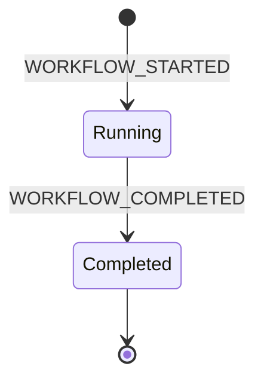
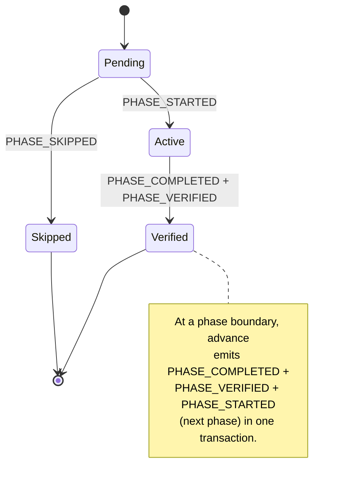
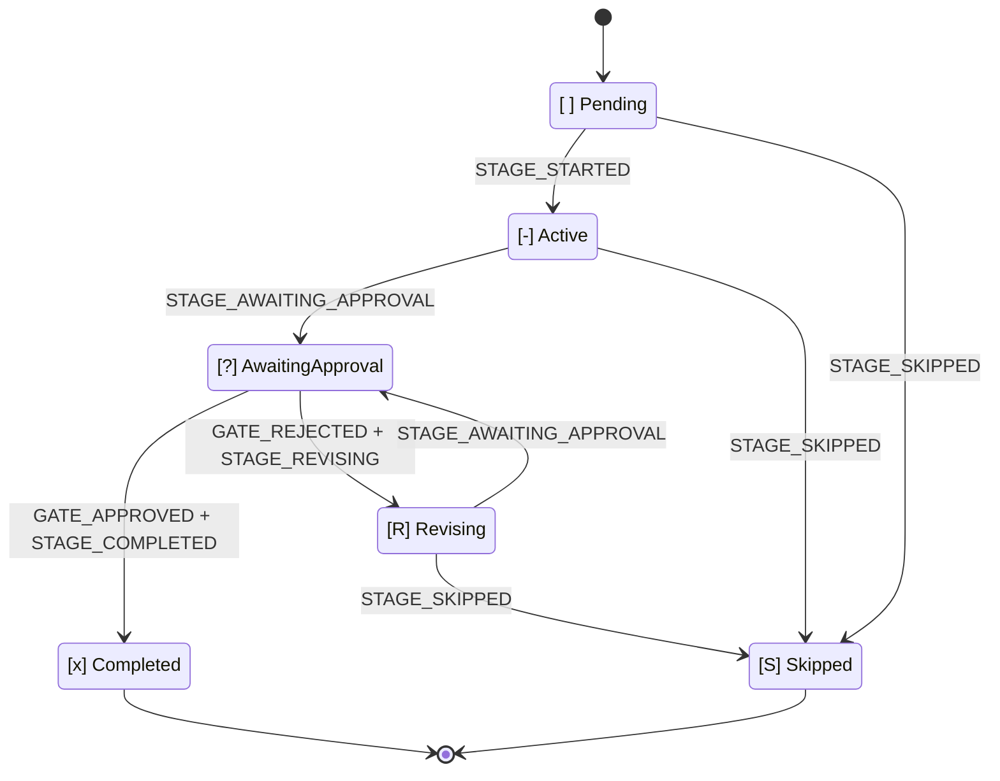

# State Machine

> Languages: **English** | [日本語](12-state-machine.ja.md)

This chapter is the canonical reference for AI-DLC's state machines, the audit-event taxonomy, and the rule that connects them — **every state transition has exactly one tool-owned emitter**. Keeping this chapter's tables in sync with the code is enforced by the drift test at `tests/integration/t48-audit-event-emitters.test.ts`. If the doc and the code disagree, t48 fails.

Three nested state machines drive AI-DLC: **workflow**, **phase**, and **stage**. A fourth, independent stream records **session** events emitted by Claude Code hooks. These four streams share the intent's audit trail (the `audit/` shard dir under its record dir, `<record>/` = `amadeus/spaces/<space>/intents/<YYMMDD>-<label>/`) but are owned by different code paths, so it's easiest to read them as separate concerns and remember that their timelines interleave.

> **North-star invariant:** TypeScript owns deterministic bookkeeping; the LLM owns judgment. Every audit emission originates in a tool or hook, keeping LLM prose out of the emit path. If you're reading an MD file and see `amadeus-audit.ts append <EVENT>` as a prose instruction, that is a bug.
>
> **Audit-first atomicity:** tools emit their audit entries *before* mutating state. If audit emission fails, the tool throws before touching state — so the audit shard and the state file never disagree. The ["Audit-first atomicity" section](#audit-first-atomicity) near the end of this chapter spells out the failure modes.

---

## Why three state machines

A workflow completes by passing through phases; a phase completes by passing through its in-scope stages; a stage completes when its approval gate closes. Each layer owns a distinct decision:

- **Workflow** — is the overall job running, or done?
- **Phase** — is this lifecycle phase in progress, verified, or skipped because the scope excluded it?
- **Stage** — is the stage being worked on, waiting on the user, being revised after rejection, or complete?

Flattening them into one state field conflates those decisions. Separating them means `/amadeus --status` can answer "what's blocking this workflow?" in one read: workflow `Running`, phase `Active`, stage `[?]` → "awaiting your approval on \<stage\>".

---

## Workflow machine



<!-- Text fallback: initial state transitions to Running on WORKFLOW_STARTED; Running transitions to Completed on WORKFLOW_COMPLETED; Completed is terminal. -->

**Status values:** `Running`, `Completed`.

A workflow starts when the first intent is born (`amadeus-utility intent-birth`, auto-invoked on the first `/amadeus` or via `/amadeus-init`) and ends when the last in-scope stage's approval gate closes. There is no `Paused` status and no `Waiting for Approval` status — approval is a stage-level concern, pause has no UX.

A workflow's `Running` state persists across Claude Code sessions. You start a workflow on Monday, stop the session, resume on Tuesday — the workflow is still `Running`; the *session* ended and a new one started.

| Transition | Trigger | Emitter |
|---|---|---|
| `[*] → Running` | `amadeus-utility init` | `tools/amadeus-utility.ts` |
| `Running → Completed` | `amadeus-state complete-workflow` | `tools/amadeus-state.ts` |

---

## Phase machine



<!-- Text fallback: initial state transitions to Pending; Pending transitions to Active on PHASE_STARTED; Pending transitions to Skipped on PHASE_SKIPPED; Active transitions to Verified on PHASE_COMPLETED + PHASE_VERIFIED. At a phase boundary, advance emits PHASE_COMPLETED + PHASE_VERIFIED + PHASE_STARTED (next phase) atomically, chaining Verified back to the next phase's Pending-to-Active transition. -->

**Status values:** `Pending`, `Active`, `Verified`, `Skipped`.

Phase state is tracked in the `## Phase Progress` section of `amadeus-state.md`. Intent birth stamps `Pending` for every phase, emits `PHASE_SKIPPED` per phase the scope excludes (before any stage starts), then promotes the current phase to `Active`. Phase completion fires both `PHASE_COMPLETED` and `PHASE_VERIFIED` at the phase boundary, then `PHASE_STARTED` for the next one.

| Transition | Trigger | Emitter |
|---|---|---|
| `Pending → Active` (first phase) | `amadeus-utility intent-birth` | `tools/amadeus-utility.ts` |
| `Pending → Skipped` | `amadeus-utility intent-birth` (per scope exclusion) | `tools/amadeus-utility.ts` |
| `Active → Verified` | `amadeus-state advance` or `complete-workflow` at phase boundary | `tools/amadeus-state.ts` |
| `Pending → Active` (boundary) | `amadeus-state advance` at phase boundary, or `amadeus-jump execute` | `tools/amadeus-state.ts`, `tools/amadeus-jump.ts` |

At the init→post-init hand-off, `amadeus-utility intent-birth` itself emits `PHASE_COMPLETED + PHASE_VERIFIED + PHASE_STARTED + STAGE_STARTED` after the final init stage so the audit trail captures the transition instead of going silent between birth and the first `advance`.

---

## Stage machine



<!-- Text fallback: [ ] Pending transitions to [-] Active on STAGE_STARTED. [-] Active transitions to [?] AwaitingApproval on STAGE_AWAITING_APPROVAL. [?] AwaitingApproval transitions to [x] Completed on GATE_APPROVED + STAGE_COMPLETED, or to [R] Revising on GATE_REJECTED + STAGE_REVISING. [R] Revising transitions back to [?] AwaitingApproval on STAGE_AWAITING_APPROVAL (re-entry). Any of Pending / Active / Revising can transition to [S] Skipped via STAGE_SKIPPED. -->

**Checkbox legend (in `amadeus-state.md`):**

| Checkbox | State | Meaning |
|---|---|---|
| `[ ]` | `Pending` | Not started |
| `[-]` | `Active` | In progress |
| `[?]` | `AwaitingApproval` | Stage work done, gate open — user is the blocker |
| `[R]` | `Revising` | User rejected the gate — stage is being revised before re-entry |
| `[x]` | `Completed` | Approved and done |
| `[S]` | `Skipped` | Excluded by scope, skipped via jump, or cut mid-flight |

`[?]` and `[R]` disambiguate two situations that would otherwise both look like `[-]`. On resume, `[R]` tells the conductor to present the prior artifact and feedback before re-entering the gate, instead of re-executing the stage from scratch.

| Transition | Trigger | Emitter |
|---|---|---|
| `Pending → Active` | `amadeus-state advance <slug>` | `tools/amadeus-state.ts` |
| `Active → AwaitingApproval` | `amadeus-state gate-start <slug>` | `tools/amadeus-state.ts` |
| `AwaitingApproval → Completed` | `amadeus-state approve <slug>` | `tools/amadeus-state.ts` |
| `AwaitingApproval → Revising` | `amadeus-state reject <slug> --feedback <text>` | `tools/amadeus-state.ts` |
| `Active → Revising` | `amadeus-state reject <slug>` when gate-start was skipped — reject backfills the missing `STAGE_AWAITING_APPROVAL` (tagged `Recovered=true`) before the rejection pair | `tools/amadeus-state.ts` |
| `Revising → AwaitingApproval` | `amadeus-state revise <slug>` (re-enter gate) | `tools/amadeus-state.ts` |
| `{Pending,Active,Revising} → Skipped` | `amadeus-state skip <slug> --reason <text>`, or `amadeus-jump execute` | `tools/amadeus-state.ts`, `tools/amadeus-jump.ts` |

The `approve` command owns the full post-gate transition: it emits `GATE_APPROVED + STAGE_COMPLETED`, then auto-advances to the next in-scope stage (delegating to `handleAdvance`) emitting `STAGE_STARTED` plus any `PHASE_*` events at phase boundaries. On the final in-scope stage, approve delegates to `complete-workflow` instead, emitting `PHASE_COMPLETED + PHASE_VERIFIED + WORKFLOW_COMPLETED` and setting Status=Completed. The conductor does NOT call `advance` after `approve` — approve owns everything from gate-response through to the next stage's `[-]`. The `advance` command remains for non-gated transitions (Initialization stages, construction bolts) and is idempotent on an already-`[x]` slug (suppresses the duplicate `STAGE_COMPLETED`).

**Artifact guard (issue #366).** Every transition that marks a stage `[x]` (`approve`, `advance`, `finalize`, and `complete-workflow`) runs a deterministic artifact check before completing it, so a stage cannot be marked `[x]` without evidence of work on disk (no completing subcommand is an unguarded backdoor). A stage that declares `produces[]` must have at least one of those artifacts present (under the active intent's record dir `amadeus/spaces/<space>/intents/<slug>-<id8>/<phase>/<slug>/`, or that record's `construction/<unit>/<slug>/` for per-unit Construction stages, or `amadeus/spaces/<space>/codekb/<repo>/` for codekb stages); a stage with `workspace_requires: true` must additionally show evidence of real source work outside the `amadeus/` workspace tree and the harness dir. In a git workspace that means an uncommitted/untracked non-doc change or a non-doc path in the last commit (so it distinguishes this session's code from a brownfield baseline and still passes commit-then-approve); otherwise a shell-free filesystem-existence check. If the check fails the command exits non-zero and writes nothing: the transition is refused (`Refusing to complete "<slug>": ...`). Stages that declare no `produces[]` (the Initialization phase) pass vacuously. Bypass with `AMADEUS_SKIP_ARTIFACT_GUARD=1`.

**Park (issue #365/#367/#3016).** `amadeus-orchestrate park` writes a `Parked` / `Parked At Stage` runtime marker (via `amadeus-state.ts park`, which emits `WORKFLOW_PARKED`) without advancing any stage; a subsequent plain `next` re-emits a terminal `parked` directive. Under `Construction Autonomy Mode: autonomous` the park is accepted only when the active record's presence ledger still holds an **unconsumed `HUMAN_TURN`** — the human who typed the turn is the one parking. The accepted park consumes that turn (`WORKFLOW_PARKED` is a presence resolution), so one turn licenses exactly one park; a genuinely unattended run, which has no unconsumed turn, is still refused with a non-zero exit and no marker (the engine relays the refusal as `kind:"error"`). The check fails closed: an absent ledger counts as no turn, and `AMADEUS_SKIP_HUMAN_PRESENCE_GUARD` does not bypass it. Intent autonomy separately uses a durable suspended projection for explicit safe-stop reasons such as `REPAIR_STALLED` and `NORM_CONFLICT`. The Stop hook allows an emitted `parked` directive in every mode; an active `full` grant remains active and separate from workflow execution state until revoked or completed.

**Completion waiting state (issue #2251).** Between the final in-scope stage's approval and the committed completion transaction the workflow sits in a legitimate window: the last stage is `[x]` while `Status` is still `Running`. A plain `next` in that window — and a completion the goal-reconciliation authority or the persisted mirror boundary declines to settle — emits the terminal `await-completion` directive, whose `reason` names the condition and the command that settles it (`complete-workflow`, or the goal-lineage recovery it points at). `complete-workflow` itself answers the same refusals with the same typed shape on stderr and keeps its non-zero, state-untouched fail-closed exit. These are expected waiting states rather than failed steps, so none of them records `ERROR_LOGGED` — previously each `next` into the window appended a fresh `amadeus.operation.failed` row. Genuine engine errors keep the `error` directive and its recording contract (issue #839) unchanged.

### Revision loop

```
gate-start  →  [?] AwaitingApproval
          ↘ reject  →  [R] Revising  (Revision Count += 1)
                   ↓ revise
                   [?] AwaitingApproval
                   ↘ approve  →  [x] Completed
```

`Revision Count` lives in the state file and increments on each `reject`. The conductor uses this to detect the revision-loop escape hatch (default is 3 cycles before offering to skip).

### Skeleton stance

`amadeus-state set-skeleton-stance <on|off|scope-dependent>` records the conductor's classified walking-skeleton stance into the `Skeleton Stance` field. Like `Revision Count`, this is runtime metadata that lives in the state file — it rides no event and **emits no audit row**, so it does NOT appear in the audit event taxonomy below. It is not a state-machine transition; it is a value the next `amadeus-orchestrate next` reads to resolve the deferred Construction Bolt-1 gate (the walking-skeleton ladder): the classify round-trip persists whether this intent's scope warrants a gated walking-skeleton Bolt 1, with `scope-dependent` falling back to the scope-mapping default (greenfield → skeleton-on, incremental → skeleton-off).

### Plan-integrity guards (issue #1892)

The compiled Bolt DAG's `batches` are the plan's declaration of what runs in parallel. Nothing used to hold a run to that declaration: a batch the plan declared parallel could be issued one Unit at a time, and the record would never show the drift. Two guards close that — one before the batch is issued, one before the stage that built it is approved.

Every guard message is assembled from the same parts by a single template, so the exits cannot drift into separate dialects:

| Part | Marker | Content |
|---|---|---|
| Observation | `Observed:` + space | What the engine measured — the declared batch number, its width, and the Unit names |
| Weight | `Why this matters:` + space | Why the mismatch is worth stopping for |
| Exit | `Approved exit:` + space | The one approved way out |

**Issuance-time guard.** Every `next` that may fan a Construction stage out goes through a single issuance point, so the judgement exists in one place and cannot drift between two copies. When the engine declines to fan out, the decline reason and the DECLARED batch (the full Unit list, not the uncovered remainder — a width-2 batch with one Unit already built would otherwise read as serial) go to a pure verdict:

| Verdict | When | Directive |
|---|---|---|
| `ok` | No declared batch, a batch one Unit wide, or a decline that is serial by plan: not a swarm stage, the walking-skeleton gate, an unset grant before the skeleton ships, no compiled DAG, or all Units already covered | The unchanged run-stage emit |
| `redirect` | The autonomy grant is unset after the walking skeleton shipped — the ladder's answer is owed | `ask`, citing the autonomy-ladder exit |
| `violation` | Any other decline against a batch the plan declared parallel | `error`, citing the plan-correction exit |

A decline reason added later without a branch here lands on `violation` rather than quietly serialising the batch.

**Approve-time reconciliation.** At a gated code-generation approve the engine reads the declared batches back against the audit trail, keyed on UNIT NAMES: a declared batch is satisfied when one `SWARM_STARTED` row names all of its units together (the fan-out) AND all of those units converged under ONE batch that also carries a `SWARM_COMPLETED` row (the referee finishing them together). Both halves are group-wise on purpose: an abandoned wide prepare — a start row that never completed — plus N one-unit re-dispatches would otherwise satisfy "named together" and "each converged" while the run was in fact serial. Reading spans every shard, since a batch prepared in one worktree and finalised in another leaves its rows in two files. `SWARM_DEGRADED` needs no arm of its own — `prepare` emits it in addition to the batch-start row, never instead of it, so a degraded batch still supplies its unit names. A batch the plan declared parallel with no fan-out on record refuses the approve, naming every unsatisfied batch rather than the first; N one-unit fan-outs do not satisfy a wide batch, because no row names its units together. The walking-skeleton gate stage is exempt: the engine itself refuses to fan it out, so no SWARM rows there is compliance, not drift. Matching on units rather than batch numbers is what keeps a re-dispatch (which advances the conductor's `prepare --batch` counter and shifts every later row) from being read as a serial run — the false refusal [#2354](https://github.com/amadeus-dlc/amadeus/issues/2354) measured. One known limitation remains: the trail is append-only, so after a replan a superseded plan's SWARM rows can still satisfy the same units — correlating evidence to a compile generation is tracked as [#1953](https://github.com/amadeus-dlc/amadeus/issues/1953).

**The exits.** A `redirect` is answered by selecting the Intent autonomy mode with `amadeus-bolt set-autonomy --mode none|semi|full`, then re-running `next`; `full` additionally requires the displayed Intent-scoped grant to be confirmed by a real human turn. A `violation` or a refused approve is answered by correcting the plan, not the run: record the dependency that makes those Units serial, with its reason, in `unit-of-work-dependency.md`, re-run `amadeus-runtime.ts compile`, then re-run `next`. If the plan is right and the deviation is deliberate, take it to a ruling first.

**Absence versus defect.** A guard needs a declared width to judge against, so a run with no compiled DAG is never a violation. The compile separates the two ways a DAG can be missing. A legitimate absence is exactly one of two states — the scope skips units-generation (`scope-skips-units`), or the stage has not produced its artifact yet (`units-pending`) — and records `bolt_dag_absence` with that reason, exiting 0. Everything else is a defect that fails the compile, writes no graph (removing any stale one), and exits non-zero: an artifact missing after units-generation completed, a malformed edge block, or a cyclic one — see [Runtime Graph](13-runtime-graph.md) § "The Bolt/unit dependency DAG (`bolt_dag`)".

### Legacy standing delegation grants (#1125)

Standing delegation grants are retired as an authorisation mechanism. The `grant-standing-delegation` and `revoke-standing-delegation` commands, grant carriers, route receipts, and active-grant doctor status no longer exist. Existing `GRANT_ISSUED`, `GRANT_REVOKED`, and `GATE_AUTHORIZATION_SELECTED` observations remain readable only by replay and migration projection code; they never create or restore authority and are never converted into a `full` grant.

- `semi` replaces the common in-phase gate-skipping use case without issuing a grant. `full` uses a new Intent-scoped grant bound to one Intent UUID, with no TTL or usage budget; its issue, replacement, exercise, revocation, and completion are canonical audit transactions.

---

## Session stream (hook-owned, independent)

Session events are emitted by Claude Code hooks, not by AI-DLC tools. A session is a single Claude Code conversation; a workflow is a long-lived directory state. The relationship is many-to-many — one workflow can span multiple sessions, one session can touch multiple workflows — so the streams are independent by design.

| Event | Emitter | Trigger |
|---|---|---|
| `SESSION_STARTED` | `hooks/amadeus-session-start.ts` | `SessionStart` with `source=startup` or `clear` |
| `SESSION_RESUMED` | `hooks/amadeus-session-start.ts` | `SessionStart` with `source=resume` |
| `SESSION_COMPACTED` | `hooks/amadeus-validate-state.ts` | `PreCompact` — fires at compaction time so it's captured reliably |
| `SESSION_ENDED` | `hooks/amadeus-session-end.ts` | `SessionEnd` |

Session hooks check for the active intent's `amadeus-state.md` (under `amadeus/spaces/<space>/intents/<YYMMDD>-<label>/`) before emitting. If no such file exists (no active AI-DLC workflow in the cwd), the hook exits silently without writing to any audit log. Session events exist to annotate an active workflow's timeline — a session in a directory with no workflow has nothing to annotate.

### Compaction awareness

`amadeus-state.ts resume` scans the audit tail for the latest `SESSION_COMPACTED`. If no stage activity (`STAGE_STARTED`, `STAGE_COMPLETED`, `GATE_APPROVED`, `SESSION_RESUMED`, `RECOVERY_COMPLETED`) follows it, resume returns `compaction_pending: true` and the conductor surfaces a three-option prompt (continue / review / restart) before proceeding. `RECOVERY_COMPLETED` is emitted by `acknowledge-compaction` once the user picks an option, satisfying the activity gate so subsequent compactions detect a fresh boundary.

---

## Audit event taxonomy

The canonical event set (defined in the `audit-format.md` registry) is grouped below into presentational categories - the canonical registry uses its own grouping; the grouping is presentational, the event set is the invariant. Every event has exactly one tool or hook emitter, except for events pre-registered for an upcoming release whose Emitter cell reads `Reserved (v0.4.0 PR N)`, `Reserved (v0.5.0 PR N)`, or `Reserved (v0.6.0 PR N)` - these are skipped by the drift test's forward check until the consumer PR ships the emitter. The drift test `tests/integration/t48-audit-event-emitters.test.ts` enforces forward/reverse/tertiary/pairing/MD-MD consistency between this chapter's tables and the code.

### Workflow lifecycle

| Event | Emitter | Notes |
|---|---|---|
| `WORKFLOW_STARTED` | `tools/amadeus-utility.ts` | Mandatory first event on every intent birth |
| `WORKFLOW_COMPLETED` | `tools/amadeus-state.ts` |  |
| `WORKFLOW_PARKED` | `tools/amadeus-state.ts` | `park` - workflow parked mid-flow for a later session; no stage advanced |
| `WORKFLOW_UNPARKED` | `tools/amadeus-state.ts` | `unpark` - park marker cleared on explicit `--resume` re-entry |
| `WORKFLOW_WAITING_ENTERED` | `tools/amadeus-intent-autonomy-production.ts` | `enterProductionWaiting` marker - a non-interactive run stopped at a ruling it may not make (RFC-0001 FR-3/ADR-4); the ledger transaction is the record, this row is its projection |
| `WORKFLOW_WAITING_RESUMED` | `tools/amadeus-intent-autonomy-production.ts` | waiting resume marker - the waiting record was re-presented and ruled on |
| `INTENT_ARCHIVED` | `tools/amadeus-state.ts` | Human-authorized archive transaction; emitted once per operation ID |
| `INTENT_UNARCHIVED` | `tools/amadeus-state.ts` | Human-authorized unarchive transaction; emitted once per operation ID |
| `EXECUTION_EVENT_SET_COMMITTED` | `tools/amadeus-execution-lifecycle.ts` | Canonical audit-first execution lifecycle event set committed atomically |

### Goal lifecycle

| Event | Emitter | Notes |
|---|---|---|
| `GOAL_CHANGE_PROPOSED` | `tools/amadeus-goal.ts` | Records an immutable, unapproved Goal revision or legacy migration proposal |
| `GOAL_REVISION_APPROVED` | `tools/amadeus-goal.ts` | Records direct human approval of the proposed Goal revision |
| `GOAL_RECONCILED` | `tools/amadeus-goal.ts` | Records an evidence-bound reconciliation receipt for the current approved Goal |
| `LEGACY_GOAL_MIGRATED` | `tools/amadeus-goal.ts` | Records direct human approval of a legacy Goal migration receipt |

### Phase lifecycle

| Event | Emitter | Notes |
|---|---|---|
| `PHASE_STARTED` | `tools/amadeus-utility.ts`, `tools/amadeus-state.ts`, `tools/amadeus-jump.ts` | First fire in init; subsequent fires at stage-tool phase boundaries |
| `PHASE_COMPLETED` | `tools/amadeus-utility.ts`, `tools/amadeus-state.ts`, `tools/amadeus-jump.ts` | Paired with `PHASE_VERIFIED` at every boundary |
| `PHASE_VERIFIED` | `tools/amadeus-utility.ts`, `tools/amadeus-state.ts`, `tools/amadeus-jump.ts` | Always paired with `PHASE_COMPLETED` |
| `PHASE_SKIPPED` | `tools/amadeus-utility.ts` | One per scope-excluded phase, emitted at intent birth |

### Stage lifecycle

| Event | Emitter | Notes |
|---|---|---|
| `STAGE_STARTED` | `tools/amadeus-state.ts`, `tools/amadeus-utility.ts`, `tools/amadeus-jump.ts` | Marks `[ ]` → `[-]` |
| `STAGE_AWAITING_APPROVAL` | `tools/amadeus-state.ts` | `gate-start` (first entry), `revise` (re-entry after rejection), and `reject` (backfill when gate-start was skipped). Backfilled rows — `gate-start --recovered` (report's explicit-stage recovery) and reject's self-heal — carry `Recovered=true`; organic gate-start and revise re-entry do not |
| `STAGE_COMPLETED` | `tools/amadeus-state.ts`, `tools/amadeus-utility.ts` | Emitted atomically with `GATE_APPROVED` by `approve`; also emitted by `advance` if approve didn't pre-mark `[x]` |
| `STAGE_REVISING` | `tools/amadeus-state.ts` | Paired with `GATE_REJECTED` |
| `STAGE_SKIPPED` | `tools/amadeus-state.ts`, `tools/amadeus-jump.ts` | One per `[S]` transition |
| `STAGE_JUMPED` | `tools/amadeus-jump.ts` | Records the destination slug on `--stage`/`--phase` jump |
| `GUARD_EXEMPTED` | `tools/amadeus-state.ts` | `verifyStageArtifacts` exempts a `workspace_requires` stage-completion refusal when the intent carries a registry docs-only declaration; carries `Stage` + the declaration `Evidence` (#499/#848) |

### Gate decisions

| Event | Emitter | Notes |
|---|---|---|
| `GATE_APPROVED` | `tools/amadeus-state.ts` | `--user-input` captures the exact choice; `Approval Provenance` names the branch that authorised it — `gate-open-turn` (a local HUMAN_TURN), `delegated` (a verified delegation), `intent-grant` (Intent autonomy decided it), `guard-disabled` (`AMADEUS_SKIP_HUMAN_PRESENCE_GUARD`) (#3153) |
| `GATE_REJECTED` | `tools/amadeus-state.ts` | `--feedback` captures the rejection reason |
| `DELEGATED_APPROVAL` | `tools/amadeus-state.ts` | `delegate-approval` records a leader session's human-grounded approval into a remote conductor intent's audit dir; carries the issuer `(space, intent, shard, HUMAN_TURN timestamp)` the conductor's gate verifies (#671) |
| `DELEGATED_REJECTION` | `tools/amadeus-state.ts` | `delegate-rejection` records a leader session's human-grounded rejection into a remote conductor intent's audit dir; verb-scoped mirror of `DELEGATED_APPROVAL` — opens only a reject gate (#685) |
| `GRANT_ISSUED` | Reserved legacy observation | Historical standing-grant evidence remains readable by replay and migration projection code only |
| `GRANT_REVOKED` | Reserved legacy observation | Historical revocation evidence; no live emitter |
| `GATE_AUTHORIZATION_SELECTED` | Reserved legacy observation | Historical route evidence; no live emitter |

### User interaction

| Event | Emitter | Notes |
|---|---|---|
| `DECISION_RECORDED` | `tools/amadeus-log.ts` | Fires before `AskUserQuestion` so options are captured |
| `QUESTION_ANSWERED` | `tools/amadeus-log.ts` | Fires after user response |

#### Accepting an advisory choice

A plugin advisory that holds at a checkpoint puts one question to the human with
exactly two options — `run-now` ("run it now") and `defer-with-risk` ("defer,
accepting the risk"). `tools/amadeus-advisory-choice.ts` owns the acceptance of
that answer, and it is deliberately narrow: an advisory choice is only ever
accepted when it can be tied to a real human turn.

There are two acceptance routes. The **prompt route**
(`recordProtectedAdvisoryChoice`) matches the user's turn text against the exact
option vocabulary — `1`, `run-now`, or the Japanese label, and likewise for
`defer-with-risk` — and accepts nothing else; a paraphrase is not a choice. The
**`record` verb** is the explicit route:

```
bun .claude/tools/amadeus-advisory-choice.ts record \
  --advisory-instance <id> --choice run-now
```

Both routes bind the receipt to a `HUMAN_TURN`. The prompt route requires the
turn to live in this clone's own audit shard, re-derives the event identity by
hashing the recorded `HUMAN_TURN` block, and refuses a turn identity that is
already spent on another receipt — one human turn answers one advisory. Both
routes further require a matching advisory presentation, so a choice cannot be
harvested from a turn where nothing was shown.

Acceptance is **idempotent by choice**: re-recording the same choice for the
same advisory instance returns the existing receipt with `idempotent: true`,
while recording a *different* choice against an instance that already has one is
refused rather than overwriting it. A `defer-with-risk` receipt closes the
question; a `run-now` receipt admits a fresh choice only when the model check it
authorized did not actually produce a clean outcome (detected, harness error, or
invalid).

`correct-misattributed` is the one revocation path, and it is fenced on every
side: it applies only to a `run-now` receipt, only when no matching presentation
grounds it, and only when no model-check evidence exists for that attempt. It
marks the receipt revoked with the reason `misattributed-unpresented-choice`
rather than deleting it. All of these paths run under the audit lock.

#### Store schemas and the migration path

The choice store (`<record>/.amadeus-advisory-choice.json`) is at **schema 2**.
Schema 1 held a receipt whose provenance was a bare `humanTurn`; schema 2 holds
a **provenance union** — either `{ kind: "human-turn", … }` or
`{ kind: "auto-decision", … }` — so one acceptance function covers both the
human route and the autonomy ladder's unattended route. Pending advisories did
not migrate and are still `schema: 1` inside a schema 2 store.

A schema 1 store on disk is **not** translated. It fails to parse, and each
reader turns that into a fail-closed hold rather than guessing what a
`humanTurn`-only receipt means under the union. That refusal is correct but, on
its own, terminal: an intent whose store predates the migration sees `report`
answer `advisory choice evidence is invalid: …` with no answer able to clear it.

`recover-schema-1` is the migration path out of that state:

```sh
bun .claude/tools/amadeus-advisory-choice.ts recover-schema-1 \
  [--project-dir <path>]
```

It operates on **one** store — the active intent's, or the one the
`--project-dir` names. It salvages the pending advisories through the same
parser a schema 2 store uses, **discards** the schema 1 receipts instead of
translating them, and writes a schema 2 store. Discarding is the point rather
than a cost: an advisory with no receipt is one the checkpoint asks again, which
is the same "ask the human again" the fail-closed hold intended.

Before writing anything it checks that the store belongs to the active intent
and refuses loudly, changing nothing, when it does not — a store reached through
a stale intent cursor is never emptied by accident. The check reads the intent
run off the salvaged pending, and off the receipts when there is no pending row
to carry it: a receipts-only store is exactly the case where the pending check
would be vacuous and the whole content is about to be discarded. Reading an
intent run off a receipt is a safety read, not a translation — nothing about
what the receipt meant is interpreted. A receipt whose intent run cannot be read
refuses the recovery too: on the receipts-only path there is no pending row to
name the owner, so passing that receipt over would delete it without ever
establishing whose it was, and silence is not evidence of belonging. The outcome
names what changed: `receipts_dropped`, `re_presentation_required` (false when
no open advisory was salvaged — the store is simply normalised for whatever
comes next), and `run_now_receipts_reset`, since the attempt a formal-check
route is numbered by is derived from the `run-now` receipts now gone.

### Scope and configuration

| Event | Emitter | Notes |
|---|---|---|
| `SCOPE_DETECTED` | `tools/amadeus-utility.ts` | `detect-scope` subcommand; `Source` field records provenance (freeform / keyword / env / cli) |
| `SCOPE_CHANGED` | `tools/amadeus-utility.ts` | `scope-change` subcommand on active workflow |
| `DEPTH_CHANGED` | `tools/amadeus-utility.ts` | `config-change --depth` |
| `TEST_STRATEGY_CHANGED` | `tools/amadeus-utility.ts` | `config-change --test-strategy` |
| `RECOMPOSED` | `tools/amadeus-utility.ts` | `recompose` subcommand - the adaptive composer's in-flight plan re-shape (pending-stage suffix flips under the audit lock) |

### Artifacts

| Event | Emitter | Notes |
|---|---|---|
| `ARTIFACT_CREATED` | `hooks/amadeus-audit-logger.ts` | Write to net-new path — distinguished from UPDATED via `mtimeMs == birthtimeMs` stat check |
| `ARTIFACT_UPDATED` | `hooks/amadeus-audit-logger.ts` | Edit tool or Write overwriting existing file |
| `ARTIFACT_REUSED` | `tools/amadeus-state.ts` | `reuse-artifact` subcommand — keep/modify/redo decisions |
| `ARTIFACT_ATTESTED` | `tools/amadeus-audit.ts` | The PR-convergence plugin submits a canonical report identity through the audit append gateway, bound to the intent, unit, repository, PR, and matching local/remote/PR head SHA |

### Construction Bolts

| Event | Emitter | Notes |
|---|---|---|
| `UNIT_OUTCOME_SETTLED` | `tools/amadeus-orchestrate.ts` | The engine's own per-unit dispatch path settled a Unit's outcome — `succeeded` at its coverage boundary, `cancelled` for a Unit its failure ruling cancelled; keyed by stage, Unit, batch and revision so an unchanged observation appends nothing and a changed one supersedes, and read only where the Unit pool stream has no terminal for that Unit |
| `BOLT_STARTED` | `tools/amadeus-bolt.ts` | Accepts CSV bolt names for parallel batches |
| `BOLT_COMPLETED` | `tools/amadeus-bolt.ts` | Paired with a prior `BOLT_STARTED` |
| `BOLT_FAILED` | `tools/amadeus-bolt.ts` (`fail` + `abort`) | `--succeeded-siblings` captures parallel-batch survivors; `abort` adds `Reason: aborted` field for sub-classification |
| `AUTONOMY_MODE_SET` | Reserved legacy observation | Historical Construction-mode evidence remains readable for replay and doctor diagnostics; it does not issue or restore authority |

### Session

| Event | Emitter | Notes |
|---|---|---|
| `SESSION_STARTED` | `hooks/amadeus-session-start.ts` | `source=startup` or `clear` |
| `SESSION_RESUMED` | `hooks/amadeus-session-start.ts` | `source=resume` |
| `SESSION_COMPACTED` | `hooks/amadeus-validate-state.ts` | Emitted at PreCompact (not at next SessionStart) to avoid duplication |
| `SESSION_ENDED` | `hooks/amadeus-session-end.ts` | Includes `Reason` field from Claude Code |
| `HUMAN_TURN` | `tools/amadeus-presence-reservation.ts` | One per real human prompt or answered question widget; the approval/interview gate requires one since the last gate resolution. The append lives in the canonical presence seam (`mintHumanPresence` for an ordinary turn, `mintArmedPresenceReservation` for a targeted continuation armed in the same host session); the trusted prompt-submit hook and each harness prompt adapter call that seam and never append on their own (#1466) |
| `SUBAGENT_STARTED` | `hooks/amadeus-log-subagent-start.ts` | Records subagent dispatch; only on harnesses with a start seam (Claude PreToolUse on a dispatch tool, Kimi SubagentStart) |
| `SUBAGENT_COMPLETED` | `hooks/amadeus-log-subagent.ts` | Records subagent completion via SubagentStop hook |

### Diagnostics and workspace

| Event | Emitter | Notes |
|---|---|---|
| `HEALTH_CHECKED` | `tools/amadeus-utility.ts` | `--doctor` run |
| `WORKSPACE_SCAFFOLDED` | `tools/amadeus-utility.ts` | Net-new directory tree created by init |
| `WORKSPACE_SCANNED` | `tools/amadeus-utility.ts` | Brownfield workspace detection complete |
| `WORKSPACE_INITIALISED` | `tools/amadeus-utility.ts` | State file materialized |

### Error and recovery

| Event | Emitter | Trigger |
|---|---|---|
| `ERROR_LOGGED` | `tools/amadeus-lib.ts` (via `emitError` from every tool's `error()`) | Any tool CLI that calls `error(msg)` to exit non-zero; best-effort — no-op if no workflow in cwd, guarded against recursion |
| `RECOVERY_COMPLETED` | `tools/amadeus-state.ts` | `acknowledge-compaction --choice <continue\|review\|restart>` called by the conductor after the user answers the compaction-awareness AskUserQuestion; also `session-takeover --confirm`, once the guard confirms a stale Kimi caller carrier was rebound (carries `Reason` = the repaired denial) |

### Worktree

The three `WORKTREE_*` rows are emitted by `amadeus-worktree.ts`, `STATE_*` by `amadeus-state.ts` (state fork/merge), and `AUDIT_*` by `amadeus-audit.ts` (audit fork/merge). t48 forward check skips rows whose Emitter cell still reads `Reserved`.

| Event | Emitter | Trigger |
|---|---|---|
| `WORKTREE_CREATED` | `tools/amadeus-worktree.ts` | Per-Bolt git worktree created from main on Bolt start (subcommand: `create`) |
| `WORKTREE_MERGED` | `tools/amadeus-worktree.ts` | Bolt's worktree merged back to main on gate approval (subcommand: `merge`) |
| `WORKTREE_DISCARDED` | `tools/amadeus-worktree.ts` | Aborted Bolt's worktree explicitly removed (subcommand: `discard`) |
| `STATE_FORKED` | `tools/amadeus-state.ts` | State file forked to worktree on Bolt start (subcommand: `fork`) |
| `STATE_MERGED` | `tools/amadeus-state.ts` | Worktree's state merged back to main on gate approval; alphabetical-slug tiebreak as defence-in-depth (subcommand: `merge`) |
| `AUDIT_FORKED` | `tools/amadeus-audit.ts` (`audit-fork`) | Audit log forked to worktree on Bolt start; audit-of-intent — emit precedes the byte-copy |
| `AUDIT_MERGED` | `tools/amadeus-audit.ts` (`audit-merge`) | Worktree's audit entries appended to main audit on gate approval; per-Bolt entry order preserved, cross-Bolt order reflects merge-completion order |

### Practices

Emitted by stage 2.2 practices-discovery and the Construction orchestrator runtime.

| Event | Emitter | Trigger |
|---|---|---|
| `PRACTICES_DISCOVERED` | `tools/amadeus-state.ts` `practices-event --type discovered` | Brownfield discovery + draft completion; team-practices draft awaiting affirmation at the stage 2.2 gate |
| `PRACTICES_AFFIRMED` | `tools/amadeus-state.ts` `practices-promote` | Team approved practices; content promoted from the intent's `inception/practices-discovery/` to the space memory layer (`amadeus/spaces/<space>/memory/team.md` and `memory/project.md`) |
| `PRACTICES_OVERRIDE` | `tools/amadeus-state.ts` `practices-promote` (write-failure path) and `tools/amadeus-state.ts` `practices-event --type override` (bolt-plan-marker-conflict path — discriminator-field disambiguation via `Reason` field, no separate event) | Either: cross-row promotion failed during stage 2.2 affirmation (Reason: `write-failure-*`); or walking-skeleton stance from `amadeus/spaces/<space>/memory/team.md` overrode bolt-plan's marker for the current Bolt (Reason: `bolt-plan-marker-conflict`) |
| `PRACTICES_SECTION_EMPTY` | `tools/amadeus-state.ts` `practices-event --type empty` | Conductor read a practices section that returned empty; advisory-only, falls back to org defaults |

### Merge dispatch

Emitted via the `amadeus-bolt dispatch-event` subcommand. The conductor brackets each amadeus-pipeline-deploy-agent dispatch — pre-call INVOKED, post-call RETURNED on successful YAML parse, FALLBACK on timeout / malformed-YAML / low-confidence.

| Event | Emitter | Trigger |
|---|---|---|
| `MERGE_DISPATCH_INVOKED` | `tools/amadeus-bolt.ts` `dispatch-event --event MERGE_DISPATCH_INVOKED` | Conductor dispatched amadeus-pipeline-deploy-agent via Task to determine merge strategy from team practices prose |
| `MERGE_DISPATCH_RETURNED` | `tools/amadeus-bolt.ts` `dispatch-event --event MERGE_DISPATCH_RETURNED` | Agent returned parsed YAML with strategy, target branch, confidence, and notes |
| `MERGE_DISPATCH_FALLBACK` | `tools/amadeus-bolt.ts` `dispatch-event --event MERGE_DISPATCH_FALLBACK` | Agent timed out or returned malformed YAML; conductor fell back to org defaults — critical observability hook |

### Merge provenance

Emitted by `recordDelegatedMerge` (`tools/amadeus-audit.ts`; CLI wrapper `tools/amadeus-merge-provenance.ts record`). Records the provenance of a delegated (standing-approval) PR merge — the standing ruling reference and the measured CI/convergence evidence. Recording only; it never performs or decides a merge.

| Event | Emitter | Trigger |
|---|---|---|
| `DELEGATED_MERGE_RECORDED` | `tools/amadeus-audit.ts` `recordDelegatedMerge` | Caller confirms the delegation condition was met and the PR merge already happened |

### Sensors

The four `SENSOR_*` events are emitted by the sensor dispatcher; `GUARDRAIL_LOADED` by the paired-coverage doctor row. Coverage is environmental — every Inception/Construction/Operation stage that writes markdown emits at least one `SENSOR_FIRED` row from the registry-default sensors. Advisory-only; a future ralph driver introduces blocking semantics for Construction-phase sensors.

| Event | Emitter | Trigger |
|---|---|---|
| `SENSOR_FIRED` | `tools/amadeus-sensor.ts` `fire` | Dispatcher invoked a sensor against a stage output (per PostToolUse Write/Edit match on the sensor's `matches` filter) |
| `SENSOR_PASSED` | `tools/amadeus-sensor.ts` `fire` | Sensor completed and reported no findings (also covers tool-unavailable and script-error fall-through; `Note` field discriminates) |
| `SENSOR_FAILED` | `tools/amadeus-sensor.ts` `fire` | Sensor completed and reported findings; detail file written at `<record>/.amadeus-sensors/<stage-slug>/<sensor-id>-<fire-id>.md` (in the intent's record dir) |
| `SENSOR_BUDGET_OVERRIDE` | `tools/amadeus-sensor.ts` `fire` | Sensor exceeded its configured cap (registry / binding / depth-derived per the three-layer cap model) and was terminated or skipped |
| `GUARDRAIL_LOADED` | `tools/amadeus-utility.ts` | Guardrail loader resolved the scope-hierarchical guardrail set for the active workflow (org → project → phase → stage); doctor's paired-coverage check reads from this event |

### Learning loop

`MEMORY_EMPTY` is emitted by `amadeus-runtime.ts compile`. The §13 Learnings Ritual writes a per-stage memory.md during execution; on stage approval, the runtime-graph compile reads memory.md and emits `MEMORY_EMPTY` for any stage with zero non-blank entries under the four standard headings. The learning-gate tool (`amadeus-learnings.ts persist`) emits `RULE_LEARNED` when a kept learning lands as a dated practice entry in `amadeus/spaces/<space>/memory/{project,team}.md`, and `SENSOR_PROPOSED` when a learning installs a sensor binding (manifest + originating stage `sensors:` frontmatter). Doctor reads these rows for diary-discipline observability. `LEARNING_ZERO_CONFIRMED` and `LEARNING_CANDIDATE_ADDED` (unit s13-zero, ADR-6) machine-bind a §13 "0 件" confirmation to the surface run's digest instead of the conductor's self-report: `amadeus-learnings.ts confirm-zero` emits `LEARNING_ZERO_CONFIRMED` only when candidates is empty AND the surface JSON's own `surfaceDigest` recomputes from its candidates + parked_open_questions; `amadeus-learnings.ts add-candidate` emits `LEARNING_CANDIDATE_ADDED` when it accepts an additive, disk-evidence-gated conductor candidate.

| Event | Emitter | Trigger |
|---|---|---|
| `MEMORY_EMPTY` | `tools/amadeus-runtime.ts` | Stage approval's runtime-graph compile found memory.md missing or with zero non-blank entries under §13's four headings |
| `RULE_LEARNED` | `tools/amadeus-learnings.ts` | The learning gate persisted a kept learning as a dated practice entry to `amadeus/spaces/<space>/memory/{project,team}.md` |
| `SENSOR_PROPOSED` | `tools/amadeus-learnings.ts` | The learning gate scaffolded a project-tier sensor manifest and bound it to the originating stage's `sensors:` frontmatter |
| `LEARNING_ZERO_CONFIRMED` | `tools/amadeus-learnings.ts` | `confirmZeroCandidates` minted a ZeroReceipt: candidates was empty and the surfaceDigest recomputed from the same surface output |
| `LEARNING_CANDIDATE_ADDED` | `tools/amadeus-learnings.ts` | `addConductorCandidate` accepted a conductor-observed candidate whose disk evidence path existed and corresponded to the claim |

### Loop monitor and quality repair

The Loop Monitor commits delivery observations, cycle triggers, Judge reservations and results, closed-route applications, and latch transitions as one canonical event set. The Quality Repair runtime commits each quality snapshot, progress, replan, stall, or resume transaction together with its generic Loop Monitor effects. The per-clone Replay Index is a repairable projection of these audit sources of truth.

| Event | Emitter | Trigger |
|---|---|---|
| `LOOP_MONITOR_EVENT_SET_COMMITTED` | `tools/amadeus-loop-monitor-replay.ts` | One atomic Loop Monitor delivery, Judge, or latch transition committed |
| `QUALITY_REPAIR_TRANSACTION_COMMITTED` | `tools/amadeus-quality-repair-replay.ts` | One quality snapshot, progress, replan, stall, or resume transaction and its generic Monitor effects committed atomically |
| `INTENT_AUTONOMY_TRANSACTION_COMMITTED` | `tools/amadeus-intent-autonomy-replay.ts` | One Intent-scoped mode, grant, decision, workflow-effect, park, resume, or invocation-failure transaction committed atomically |
| `INTENT_AUTONOMY_HUMAN_REQUIRED` | `tools/amadeus-intent-autonomy-production.ts` | A gate opened on an occurrence the active mode could not decide on its own, recorded once per presentation with the reason (`SCOPE_OUT` or `MODE_REQUIRES_HUMAN`) it fell to a human |
| `AUTO_DECISION_REVIEWED` | `tools/amadeus-autonomy-review-production.ts` | A human accepted or flagged one immutable auto decision on the review surface (append-only; never replays the decided effect) |
| `INTENT_COMPLETION_TRANSACTION_COMMITTED` | `tools/amadeus-intent-completion.ts` | The Core Intent completion transaction committed atomically, sealing the Intent record with its evidence digest |

### Swarm

All six swarm events emit from the swarm referee `amadeus-swarm.ts` — the deterministic verdict surface the conductor consults. The conductor owns fan-out and retry decisions while the referee owns convergence verdicts, merge, and audit. `prepare` forks per-unit worktrees and emits `SWARM_STARTED` (plus `SWARM_DEGRADED` for a loud downgrade); `finalize` re-verifies claims and emits the per-Unit verdicts, baton rows, and batch tally. The advisory `check` subcommand emits nothing.

The same tool also fronts an audit-folded fixed Unit pool. `UNIT_POOL_EVENT_SET_COMMITTED` atomically records queue, slot, dispatch-confirmation, reconciliation, settlement, and drain transitions; harnesses report native facts but own no scheduler or counter.

| Event | Emitter | Trigger |
|---|---|---|
| `UNIT_POOL_EVENT_SET_COMMITTED` | `tools/amadeus-unit-pool-runtime.ts` | The C2 single writer atomically committed a fixed-pool queue, slot, reconciliation, settlement, or drain transition |
| `SWARM_STARTED` | `tools/amadeus-swarm.ts` | Swarm referee `prepare` forked a batch of dependency-linked Units |
| `SWARM_UNIT_CONVERGED` | `tools/amadeus-swarm.ts` | A swarm Unit re-verified green (and untampered) at the `finalize` gate |
| `SWARM_UNIT_FAILED` | `tools/amadeus-swarm.ts` | A swarm Unit failed the `finalize` re-verify (not claimed, claimed-but-red, or tampered) |
| `SWARM_BATON_RETURNED` | `tools/amadeus-swarm.ts` | A swarm Unit returned the baton to the conductor for orchestrator-mediated coordination |
| `SWARM_COMPLETED` | `tools/amadeus-swarm.ts` | All Units in the batch finished (converged or failed); batch closed |
| `SWARM_DEGRADED` | `tools/amadeus-swarm.ts` | An ultra value (`claude-ultra` or `codex-ultra`) was requested on a harness that is not its native one, so the conductor loud-degraded to the subagent floor (the legacy `1` is fail-closed, not degraded) |

Every event in the taxonomy is either backed by a real emitter or marked `Reserved (v0.4.0 PR N)` / `Reserved (v0.5.0 PR N)` / `Reserved (v0.6.0 PR N)` for a pre-registered upcoming consumer. The drift test enforces both halves — the `Reserved` early-skip applies only while the cell literally contains "Reserved"; consumer PRs replace it with the real emitter file path in the same commit they ship the emit call.

---

## Audit-first atomicity

State-mutating commands emit their audit entries **before** mutating the state file. Two consequences:

1. If audit emission fails (lock timeout, disk error, invalid event type), the tool throws before touching state. The state stays at its previous value; the audit shard stays clean.
2. If state writing fails *after* audit emission, the audit has an "intent" entry but the state didn't move. The drift is visible and diagnosable; `--doctor` surfaces it.

The case `test("65: approve is audit-first ...")` in `tests/unit/t17.test.ts` proves this for `approve`: chmod'ing the audit shard to read-only forces an audit failure and asserts the state file stays at `[?]` (not `[x]`). The same invariant holds for `gate-start`, `reject`, `revise`, `skip`, `advance`, `complete-workflow`, `reuse-artifact`, `amadeus-bolt.ts set-autonomy`, and `amadeus-state.ts fork` / `amadeus-state.ts merge` (the state fork/merge subcommands — see `tests/unit/t76.test.ts` for the equivalent chmod-the-lock-dir Part A and chmod-the-target-after-emit Part B proofs).

State fork/merge are deliberately NOT in the audit-of-intent exception below: re-reading and re-writing a state file is idempotent (unlike `git worktree add`, which leaves the worktree present after a kill-9 between emit and git), so the strict invariant applies cleanly. A failed state write after a successful audit emit becomes a phantom `STATE_FORKED` row that doctor reconciles against the worktree's record-dir `amadeus-state.md` existence.

### Audit-of-intent semantics (`WORKTREE_*`, `AUDIT_*`, and merge-dispatch `MERGE_DISPATCH_INVOKED`)

Audit-of-intent semantics apply to side-effects whose outcome cannot be checked before emission — including disk operations (worktree creation / removal, audit byte-copy) and LLM Task dispatch (amadeus-pipeline-deploy-agent). The emitting tool writes the audit entry first, then performs the side-effect. If the side-effect fails after the emit, the tool calls `emitError` with the slug embedded in the message (`[slug=<slug>]`); the audit-fork / audit-merge handlers additionally tag failures with `[fork-emitted:<timestamp>]` so `--doctor` can distinguish "intent recorded, side-effect never landed" from earlier failure modes. For `MERGE_DISPATCH_INVOKED`, doctor reconciliation matches orphan INVOKED rows to a missing `MERGE_DISPATCH_RETURNED` or `MERGE_DISPATCH_FALLBACK` partner via slug + timestamp window (no correlation tag needed because the LLM Task call has no disk artifact to sequence against). `appendAuditEntry` records an `ERROR_LOGGED` entry on disk-side-effect failure; doctor reconciles audit drift at observation time.

| Event group | Emitter | Side-effect that follows the emit |
|---|---|---|
| `WORKTREE_CREATED`, `WORKTREE_MERGED`, `WORKTREE_DISCARDED` | `tools/amadeus-worktree.ts` | `git worktree add`, `git merge` + cleanup, `git worktree remove` + branch delete |
| `AUDIT_FORKED`, `AUDIT_MERGED` | `tools/amadeus-audit.ts` | `mkdir -p` + `copyFileSync` of main audit; `appendFileSync` of worktree-audit delta to main audit |
| `MERGE_DISPATCH_INVOKED` | `tools/amadeus-bolt.ts` `dispatch-event` | `Task(amadeus-pipeline-deploy-agent, ...)` LLM dispatch — the side-effect is the LLM call itself; success is observed via the matching `MERGE_DISPATCH_RETURNED` or `MERGE_DISPATCH_FALLBACK` post-call emit |

This is a deliberate departure from the strict audit-first invariant for stage transitions, motivated by the kill-9 / OS-crash window where neither the rollback emit nor `ERROR_LOGGED` can be guaranteed. The pattern is bounded to the events listed above. `STATE_FORKED` / `STATE_MERGED` deliberately do NOT take this exception — see the previous section for the strict-first rationale (state writes are idempotent, so a failed write surfaces as recoverable drift instead of unrecoverable orphan state). `MERGE_DISPATCH_RETURNED` / `MERGE_DISPATCH_FALLBACK` are post-call emits (audit-of-result, not intent — strict-first) and don't take the exception. All other state-mutating commands stay strict-first per the section above.

### Forbidden patterns

Don't emit audit events from LLM prose. The following anti-patterns are the reason this refactor exists:

- `bun .claude/tools/amadeus-audit.ts append WORKFLOW_STARTED ...` as a step in SKILL.md — replaced by the tool emitting it internally
- A hand-written `STAGE_COMPLETED` journal record appended by a stage file — events only come from `appendAuditEntry` in a tool or hook
- Freeform `## Artifact Update` sections written by hooks — replaced by canonical `ARTIFACT_CREATED` / `ARTIFACT_UPDATED`

The drift test at `tests/integration/t48-audit-event-emitters.test.ts` catches drift between this chapter's tables and the code: every event in the tables must have a matching `appendAuditEntry(..., "EVENT", ...)` call in the declared emitter file, and every emission call site in the codebase must appear in the tables. The test also guards against deleted events being resurrected and against pairing invariants (e.g., `handleApprove` must emit both `GATE_APPROVED` and `STAGE_COMPLETED`).

---

## Same-commit rule

When you change state-machine behavior, update both the code and this chapter in the **same commit**. The rule catches itself via the drift test, but the cost of fixing drift after the fact (chasing down who owns which event across three files) is much higher than updating one table.

Specifically:
- Adding an event → add it to the canonical Event Registry, add the emitter, and add it to the appropriate table above.
- Deleting an event → remove it from the canonical Event Registry, remove the emitter, remove the row here, and grep the codebase for stale prose or tests.
- Renaming an emitter file → update the Emitter column in every table row that points at it.

---

## Known limitations

- **Multi-project sessions.** Claude Code doesn't fire a hook on `cd` within a session, so if a user runs `/amadeus` in project A and then `cd`s to project B, the session hooks won't re-fire against B's audit shards. Session events may not perfectly reflect every workspace switch. This is a Claude Code limitation, not an AI-DLC design flaw.

---

## Related reference

- [Orchestrator](03-orchestrator.md) — how `/amadeus --status`, session check, and the resume path consume state-machine signals.
- [Stage Protocol](04-stage-protocol.md) — the stage-level behavioral contract, including the approval-gate UX that drives `[?]` / `[R]` transitions.
- [Hooks and Tools](06-hooks-and-tools.md) — hook lifecycle, CLI tool reference, and the audit-event catalog.
- [Testing](09-testing.md) — how the drift test works and when to run it.
