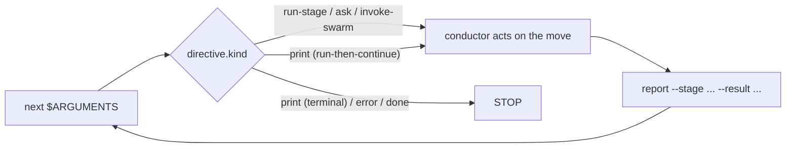

# オーケストレーションエンジンとスキルシステム

> 対象読者: Tier 2/3(チーム導入者、フレームワーク貢献者)。

> **パス規約。** 以下の `<record>/` = アクティブな intent のレコードディレクトリ `amadeus/spaces/<space>/intents/<YYMMDD>-<label>/`。ここに per-intent の状態とランタイムファイルが存在します。

この章は、すべての `/amadeus` 実行を駆動するオーケストレーションアーキテクチャの正規リファレンスです。「次は何か?」に答える決定論的な**エンジン**(`amadeus-orchestrate.ts`)、エンジンの答えに基づいて動作する薄い**コンダクター**(`skills/amadeus/SKILL.md`)、両者を結ぶ**型付きディレクティブ契約**、ランナージェネレーターが発行する**複数スキル**セット、どのステージが実行されるかを決める**スコープの形式**、そして並列 Construction 作業を収束させる**スウォーム**レフェリーを扱います。これは、`SKILL.md` の本体そのものがすべてのルーティングロジックを保持していた古い prose-orchestrator モデルを置き換えます。[Orchestrator](03-orchestrator.md)(コンダクター自身の章)、[Runtime Graph](13-runtime-graph.md)(エンジンとスウォームが読む execution-truth のミラー)、[State Machine](12-state-machine.md)(`report` がコミットする遷移)、[Hooks and Tools](06-hooks-and-tools.md)(Stop フックを含む決定論的な背骨)へ相互リンクします。

---

## 1. エンジンとコンダクター

このカットオーバーは1つの関心事を2つに分割します。**エンジン**は*ステージ間ルーティング* — スコープ解決、フラグの優先順位ラダー、ジャンプ方向の計算、resume と init のガード、ステージシーケンス、ゲートステータス、ワークフロー完了 — を所有します。**コンダクター**は*エンジンが指名した move の内部の実行品質* — ペルソナのフレーミング、良い質問をすること、ステージダイアリーの維持、ステージ内の Keep/Modify/Redo ループ、ゲートでの人間への判断の提示 — を所有します。

エンジンは `core/tools/amadeus-orchestrate.ts` で作成され、各ハーネスへ `<harness-dir>/tools/amadeus-orchestrate.ts`(例 `.claude/tools/`)として出荷されます。これはちょうど2つのサブコマンドを持つ Bun CLI です:

| サブコマンド | 役割 | 状態を変更する? |
|------------|------|----------------|
| `next` | ワークフロー状態(アクティブな intent の `amadeus-state.md`、`amadeus/spaces/<space>/intents/<YYMMDD>-<label>/` 配下)とコンパイル済みステージグラフ(`tools/data/stage-graph.json`)を読み取り、スコープと位置を解決し、**ちょうど1つ**の型付きディレクティブ(JSON)を stdout に発行する。 | しない(1つの文書化された推移的な例外: 既に intent を保持するワークスペース上での no-state birth は、重複を birth するのではなく intent-pick プロンプトを発行する)。 |
| `report` | コンダクターがディレクティブに基づいて動作した後、遷移をコミットする。ステージ認識ディスパッチャ: `--stage <slug>` は動作したディレクティブを固定し、復元された `Current Stage` が report のターゲットをドリフトさせられないようにする。状態ツールの transition(s) にシェルアウトし、明示的に report されたステージがまだ `[-]` の場合は承認の前に欠落したゲートを開く。 | する。 |

エンジンは設計上決定論的なコードです — ルーティングは決定論の関心事なので、LLM の prose ではなくツールに存在します(ルート文字列の構築を LLM に渡すことは、tool/agent/human のテーゼを反転させることになります)。既存の決定論的ライブラリを**組み合わせます**: コンパイル済みグラフには `loadGraph()`、シーケンスには `nextInScopeStage()` / `firstInScopeStageOfPhase()`、スコープ名セットには `validScopes()`、状態読み取りには `getField` / `parseCheckboxes`。非ハッピーパスのブランチ(ジャンプ、resume、intent birth、スコープ/設定変更、env-scope 検証)は兄弟の CLI ツールをシェルアウトで組み合わせ、その stderr をそのまま中継するため、ユーザー向けのエラー文言は決して再構築されません。エンジンが組み合わせるのではなく*追加*する唯一のものは、`(観測された状態 + グラフ) → ディレクティブ種別` をマッピングする決定ルールと、グラフノードの語彙名を正規のレコードディレクトリパス(`amadeus/spaces/<space>/intents/<YYMMDD>-<label>/<phase>/<stage>/...`)に変換する artifact-path リゾルバです。

すべてのディレクティブは、表示される前に `amadeus-directive.ts` の凍結された契約に対して検証されます。不正なディレクティブは、コンダクターが動作するであろう嘘を発行するのではなく、非ゼロで終了します。

---

## 2. 型付きディレクティブ契約

`amadeus-directive.ts` は、`kind` フィールドをキーとする**9つ**のディレクティブ種別にわたる判別可能な共用体(discriminated union)を定義します。各ディレクティブは、その種別が必要とするフィールドのみを持ち、種別ごとの許可キーセットによって強制されます(種別のセット外のフィールドは未知のキーとして拒否されます)。エンジンは**今日7つの種別を発行**します。2つは、後のウェーブがそれらを配線するまでループを complete-shaped に保つ文書化されたプレースホルダです。

| `kind` | 今日発行される? | コンダクターが行うこと |
|--------|----------------|--------------------------|
| `print` | Yes | `directive.message` が言うことを正確に行う — それが権威的です。2つの形式: **terminal**(status/help/doctor/version のような読み取り専用ユーティリティを指名; 実行し、stdout をそのまま表示し、STOP)と **run-then-continue**(スコープ変更、ジャンプ `execute`、またはユーザーが新規ワークスペースでスコープを明示的に指名した(フラグまたは位置引数)ときに発行される workflow-birth `init --scope <scope>` のような変更を伴うツールを指名; 実行し、ループのステップ1に戻る)。変更は指名されたツールに存在し、`next` には決して存在しない。 |
| `error` | Yes | `directive.message` をそのまま表示し、STOP。回復したり取り繕ったりしない — メッセージはユーザー向けのエラーそのものです。 |
| `done` | Yes | ワークフロー(または single-stage 実行)が完了した。完了サマリを提示し、STOP。 |
| `parked` | Yes | ワークフローは後のセッションのために、クリーンなステージ間境界(`directive.stage`)でフロー途中で park された。park されたこととどう resume するか(`/amadeus --resume`)をユーザーに伝え、STOP。`Parked` マーカーがセットされている間(`amadeus-orchestrate park` によって書き込まれる)の素の `next` で発行される; ステージは前進しない。Stop フックは `parked` を terminal allow として扱うため、コンダクターは `done` に到達するためにステージをラバースタンプするのではなく park する(#367)。 |
| `run-stage` | Yes | リードエージェントのペルソナと任意の `support_agents` をロードし、`directive.stage_file` を読み、ステージ本体を実行し、`produces` を書き、`directive.memory_path` にダイアリーを保持し、`directive.gate` で分岐する([Orchestrator](03-orchestrator.md) を参照)。解決されたルーティングフィールドをグラフノードからそのまま持ち込む: `lead_agent`、`support_agents`、`mode`、`gate`、`consumes`、`produces`、`rules_in_context`、`sensors_applicable`、`stage_file`。 |
| `ask` | Yes | `directive.question` を `AskUserQuestion` 経由でレンダリングし、次の `report` で `--user-input` を通じて人間の答えをフィードバックする。エンジン自体は決して `AskUserQuestion` を呼ばない — 人間のターンをコンダクターに委ねる。 |
| `invoke-swarm` | Yes | エンジンが適格な Construction バッチをスウォームに付与した。コンダクターは `directive.units` のユニットをファンアウトし、収束ループを実行し、スウォームレフェリーに相談する(§6 を参照)。`autonomous` 付与の下での適格な Construction バッチに対してのみ発行される。 |
| `dispatch-subagent` | No(engine-future プレースホルダ) | 指名されたステージをインラインではなく `Task` 呼び出しで実行*する予定*。今日は発行されない; 投機的に実装しない。 |
| `present-gate` | No(engine-future プレースホルダ) | ゲートの儀式を独自のディレクティブとして実行*する予定*; 今日ゲートの決定は `run-stage` の `gate` フィールドに折り込まれている。 |

**ゲートのセンチネル。** `run-stage` の `gate` は、すべての決定論的なケースでブール値です(auto-proceeding のブートストラップ initialization ステージでは `false`、他のすべての EXECUTE ステージでは `true`)。1つのケースは決定論的ではありません: 最初の Construction Bolt のゲートは、チームの自由形式の `## Walking Skeleton` プラクティスの prose に依存し、どのパーサもそれを導出できません。エンジンは文字列センチネル `GATE_UNRESOLVED`(`"unresolved"`)を発行し、分類をコンダクターのナレッジワークに委ねます。コンダクターは `report --skeleton-stance <on|off|scope-dependent>` を通じてスタンスを返し、次の `next` は今や決定されたブールゲートで同じステージを再発行します。

**コンダクターのペルソナ配信。** コンダクターの実行品質チャーターは `amadeus-common/conductor.md` に一度だけ存在します。どのスキルもそれをパスで参照しません。代わりにエンジンがそれを読み、その内容を**ワークフローの最初の `run-stage` ディレクティブ**の `conductor_persona` フィールドに焼き込みます。コンダクターがそのフィールドを受け取ると、実行全体でそのペルソナを採用します。これにより、すべてのエントリポイント — フレームワークランナーも手書きも同様に — がスキルごとの diligence なしに1つのペルソナに揃います。

---

## 3. 転送ループと Stop フック

`skills/amadeus/SKILL.md` が**コンダクター**です: エンジンのディレクティブに基づいて動作する薄い転送ループ。その制御構造全体は以下のとおりです:

```
Loop:
  1. directive = `bun .claude/tools/amadeus-orchestrate.ts next $ARGUMENTS`
  2. act on directive.kind
  3. `bun .claude/tools/amadeus-orchestrate.ts report --stage <directive.stage> --result <outcome> [--user-input "<text>"]` when the directive names a stage; omit `--stage` only for non-stage report round-trips.
  4. repeat unless directive.kind == done
```



図のテキスト説明: `next`(`$ARGUMENTS` がそのまま渡される)は1つのディレクティブを返します。コンダクターは `directive.kind` で分岐します。`run-stage`、`ask`、`invoke-swarm`、および run-then-continue の `print` ディレクティブに対しては、指名された move を実行し `report` を呼び、これが `next` にループバックします。terminal の `print`、`error`、`done` に対してはループを停止します。

`$ARGUMENTS` は最初の `next` にそのまま渡されます — エンジンがフラグ(`--status`、`--stage`、`--scope`、`--depth`、自由形式テキスト)をパースするため、コンダクターは決して事前パースやストリップをしません。`next` は何も変更しないため、ループは `report` が遷移をコミットしたときにのみ前進し、次の `next` は常に新鮮な状態を読みます。

インタラクティブなパスではコンダクターがループを保持します。人間に質問できるのはコンダクターだけだからです。ループが LLM の良い振る舞いに依存しないように、**Stop フック**(`hooks/amadeus-stop.ts`)がそれを決定論的に強制します - フレームワークで最初のフロー変更フックです(他のすべてのフレームワークフックは advisory で常に 0 で終了します)。コンダクターがターンを終えようとすると、Stop フックは `amadeus-orchestrate next` を実行します; ディレクティブがまだ保留中の場合、停止をブロックし、`reason` フィールドを通じてディレクティブを再注入し、**on-task continuation**(タスク継続)として表現します(まだ owed の作業 - ループを実行し、動作し、report する - を指名し、override 形式の指示は決して指名しません。それはコンダクターの安全訓練が拒否するでしょう)。`done` または `parked` ディレクティブ(後者は `amadeus-orchestrate park` から、後のセッションのためのサポートされる mid-flow 一時停止)は停止を許可します。一部の保留ケースも*ブロックされません*: **human-wait carve-out** は、コンダクターが正しく人間に park されている(または単にチャットしている)ときに停止を許可します - 現在のステージが positively `[?]` の awaiting-approval、`[R]` の revising、`[-]` の in-progress で `<slug>-questions.md` に未回答の `[Answer]:` タグがある(保留中の mid-stage 明確化質問)場合、または終了するターンが会話的だった(人間の最後のプロンプトがワークフローエンジン呼び出しなしで回答された、ハーネストランスクリプトから読み取る; 読み取り専用の `--status`/`--doctor` クエリは engagement とみなされない)場合です。最後の2つは autonomous Construction の下では抑制され、無人実行が動き続けます; 会話ケースも Kiro では inert です。Kiro はトランスクリプトを配信せず、そこではインタラクティブキャップがリリースパスの代わりになります。そこでブロックしても nudge をスパムするだけです(positive-confirmation のみ; human-wait チェックは fail open、会話チェックは fail closed; ステートレスケースと真の mid-stage quit は依然としてブロックします)。2つの境界が、スタックしたループがセッションをトラップするのを防ぎます: Claude Code の `stop_hook_active` シグナルと、`<record>/.amadeus-stop-hook/`(アクティブな intent のレコードディレクトリ内)配下に永続化される no-progress カウンタです。連続した no-progress ブロックが上限(`CLAUDE_CODE_STOP_HOOK_BLOCK_CAP`、そのデフォルトは run-mode 認識: **インタラクティブ実行では 2、autonomous Construction では 8**)に達すると、フックは手放します; ワークフローの前進は位置シグネチャを変え、カウンタを 0 にリセットするため、健全なループが throttle されることは決してありません。アクティブなワークフローがない場合、または予期しないエラーの場合、フックは fail open します - 非 AIDLC セッションを決してブロックしません。

---

## 4. 複数スキル、ランナー、共有された背骨

オーケストレーターは数多くのスキルの1つです。各ハーネスはそのスキルディレクトリ(`<harness-dir>/skills/`、例 `dist/claude/.claude/skills/`)配下に複数セットを出荷します: ベースの `amadeus` オーケストレーター、実行可能なステージごとに1つの**ステージランナー**(`amadeus-<slug>`)、first-batch スコープごとに1つの**スコープランナー**(`amadeus-<scope>`)、読み取り専用のセッションスキル(`amadeus-session-cost`、`amadeus-replay`、`amadeus-outcomes-pack`、`amadeus-grilling`)、そして `amadeus-init`。すべてのルーティングと実行の知識は、`core/amadeus-common/` で作成される**共有された背骨**(`<harness-dir>/amadeus-common/` として出荷)に一度だけ存在します: `conductor.md` ペルソナ、`protocols/`、そして `stages/{initialization,ideation,inception,construction,operation}/` 配下の32個のステージファイル。

ランナースキルは生成されるものであり、決して手書きされません。`tools/amadeus-runner-gen.ts` によって:

- **ステージランナー**はオプトインのシュガーです。各 `/amadeus-<slug>` は `/amadeus --stage <slug> --single`(これはランナーなしで動作する)を、エンジンの `--single` モード経由で1つのステージを分離して実行し、メインワークフローの `Current Stage` を決して前進させない、タイプ可能なコマンドにパッケージします。slug リストは `loadGraph()` — 唯一のコンパイル済み真実のソース — から来るため、グラフに追加されたステージはここでの編集なしにランナーに流れ込みます。ブートストラップ initialization ステージは除外されます(スタンドアロンの `--single` の意味を持たない; `--single` はそれらを拒否する)。そして initialization フェーズ全体は、エンジンの intent-birth の move をパッケージする1つの `/amadeus-init` ランナーとして出荷されます。
- **スコープランナー**は既に実行可能なコマンドをパッケージします; スコープファイルが定義を保持します。それぞれは、固定されたスコープと検出なしで `amadeus-orchestrate next --scope <scope>` を `done` まで駆動する短いシェルです。完全なスコープセットは `/amadeus --scope <name>` 経由で到達可能なままです; ランナーは高トラフィックなものに対するタイプ可能なシュガーです。

2つのドリフトガードが、ディスク上のランナーセットをそのソースに固定します: ステージランナーには `amadeus-runner-gen.ts check`、スコープランナーには `scopes --check`、両方とも CI で実行されます。ランナーは**`hooks:` ブロックを持ちません** — ワークフロー背骨フックはプロジェクト全体で `settings.json` に存在するため、決定論的な背骨はコピーではなく継承されます。そしてどのランナーも `conductor.md` を手動でロードしません: エンジンが最初の `next` でペルソナを配信します。

---

## 5. スコープの形式

スコープはファイルで作成されるプリミティブであり、センサーやエージェントを作成するのと同じ筋肉記憶です。**`scope-mapping.json` は存在しません** — 出荷ツリーから削除されました。スコープの identity とステージメンバーシップは、2つのファイルで作成されるサーフェスに分割され、コンパイル済みグリッドに転置されます:

1. **Identity** はスコープごとに1ファイル `dist/claude/.claude/scopes/amadeus-<name>.md` に存在します — フロントマター(`name`、`depth`、`keywords`、`description`)にスコープを記述する prose を加えたもの。出荷セットは `bugfix`、`enterprise`、`feature`、`infra`、`mvp`、`poc`、`refactor`、`security-patch`、`workshop` です。
2. **Membership** は各ステージの `scopes:` フロントマターに存在します — そのステージが EXECUTE となるスコープのリスト。

`bun .claude/tools/amadeus-graph.ts compile`(`stage-graph.json` を生成するのと同じコンパイルパス)は、これらを `tools/data/scope-grid.json` のグリッド — エンジンがすべての scope-level ルーティングのために読む `scope → {stages: {slug: EXECUTE|SKIP}}` マップ — に転置します。エンジンの `validScopes()` は、そのコンパイル済みグリッドから正規スコープ名セットを導出します。

スコープの追加は純粋に加算的です: `.claude/scopes/amadeus-<name>.md` を配置し、メンバーステージの `scopes:` リストにタグ付けし、再コンパイルし、`SKILL.md` の人間可読なサマリテーブルを再生成します。ディスパッチロジックの編集は不要で、ドリフトガードがディスク上のセットの乖離を防ぎます。

---

## 6. スウォームレフェリー、ドライバーの継ぎ目、Bolt-DAG

**スウォーム**は、人間から付与された自律性の下で並列 Construction 作業がどう収束するかです。ライブな `/amadeus` セッション内でのみ発火するため、コンダクター(そのセッション)がファンアウトとリトライループを所有します; `tools/amadeus-swarm.ts` は、コンダクターがループ自体を所有する間に相談する決定論的な**レフェリー**です。これは収束に適用された three-concerns 分割です: コンダクターがファンアウトとリトライ決定を所有し(ナレッジ)、ツールが収束判定 + マージ + 監査を所有し(決定論)、人間が自律性を付与し失敗エンベロープでバトンを取り戻す(判断)。

レフェリーは**ステートレス**です — イテレーションカウンタなし、永続化された progress なし — で、3つのサブコマンドを持ちます:

| サブコマンド | 役割 | 発行 |
|------------|------|------|
| `prepare --batch <n> --units <a,b,c> [--base <branch>] [--degraded-from <subagent\|ultracode>]` | ユニットごとに分離された git worktree をフォークする(`amadeus-worktree create` + `amadeus-bolt start --worktree` を組み合わせる)。どのワーカーよりも前に実行されるため、`check` に折り込めない。 | `SWARM_STARTED`(loud downgrade が報告されたときは `SWARM_DEGRADED` も)。 |
| `check <unit> --check-cmd <cmd> [--test-file <path>]` | ステートレスな単一ユニット判定: プロジェクト自身の check コマンドを実行(exit 0 = green、権威あるシグナル — ワーカーの自己申告は決して信頼されない)し、保護されたファイルを fork-git のベースラインと比較する anti-tamper を行う。`{converged, tampered, reason}` を表示し、genuinely converged の場合にのみ exit 0。 | なし(advisory; コンダクターのリトライ決定に情報を与える)。 |
| `finalize --batch <n> --units <a,b,c> --claimed <a,b> --check-cmd <cmd> [--test-file <path>] [--reasons <unit>=<reason>,…]` | 権威あるゲート: どのマージよりも前に**すべての claimed ユニットで check を再実行**し(`--claimed` で名指しされたがディスク上では red のユニットはマージを拒否され、失敗エンベロープに入る — lying-conductor ガード)、その後 genuine passes の直列化された HOLD-MERGE のマージバック。exit 0(バッチが収束しマージされた)または 2(失敗エンベロープ)。 | `SWARM_UNIT_CONVERGED` / `SWARM_UNIT_FAILED` / `SWARM_BATON_RETURNED` / `SWARM_COMPLETED`。 |

これら6つの `SWARM_*` イベントは 68-event 監査分類の一部です([State Machine](12-state-machine.md) を参照)。exit-2 エンベロープでは、コンダクターがバトンを取り戻します - 失敗は自律モードに関係なく常に停止し、人間を再エンゲージします。

**ドライバーの継ぎ目。** `AMADEUS_USE_SWARM=1` はインラインの Dynamic Workflow ドライバーを選択します(コンダクターが、その JS が per-unit パイプラインとイテレーションキャップを所有する `Workflow` を作成する); unset は subagent floor(1つのメッセージ内の N 個の並列 `Task` 呼び出し、ユニットごとに1つ)を選択します。`=1` だが Workflow ツールが利用不可の場合、コンダクターは floor へ**loud-degrade** し、`--degraded-from ultracode` を渡してレフェリーが `SWARM_DEGRADED` を発行するようにします。runaway backstop はツール内のキャップではありません - ハーネスの Stop フックの上限であり、この autonomous-Construction パスでは 8 ブロックです(§3)。

**Bolt-DAG。** スウォームがファンアウトするバッチは、`runtime-graph.json` の `bolt_dag` ノード([Runtime Graph](13-runtime-graph.md) を参照)から来ます。これは units-generation の `unit-of-work-dependency.md` エッジブロックからパースされます。ノードは `units`(それぞれ `depends_on` リストを持つ)と `batches` — すべてのユニットの依存が先行するバッチによって満たされるトポロジカルレベルなので、バッチのユニットは並列にファンアウトできる — を持ちます。ノードは、有効なエッジブロックがディスク上に存在するときにのみ存在します; 欠落、不正、または循環したブロックはノードを完全に省略します(gate-time の required-sections センサーがそれらを上流でフラグします)。

---

## 次のステップ

- **コンダクター自身の章** — 転送ループ、ゲートの儀式、学習の儀式を完全に。[Orchestrator](03-orchestrator.md) を参照。
- **エンジンとスウォームが読む execution-truth の成果物** — `runtime-graph.json` とその `bolt_dag` ノード。[Runtime Graph](13-runtime-graph.md) を参照。
- **`report` がコミットする遷移** - ワークフロー / フェーズ / ステージのマシンと 68-event 監査分類。[State Machine](12-state-machine.md) を参照。
- **決定論的な背骨** — Stop フックと他のフレームワークフックおよびツール。[Hooks and Tools](06-hooks-and-tools.md) を参照。
- **ランナーを日々使う** — タイプ可能な `/amadeus-<stage>` と `/amadeus-<scope>` コマンド。User Guide の [Skills and Runner Commands](../guide/17-skills.md) を参照。
