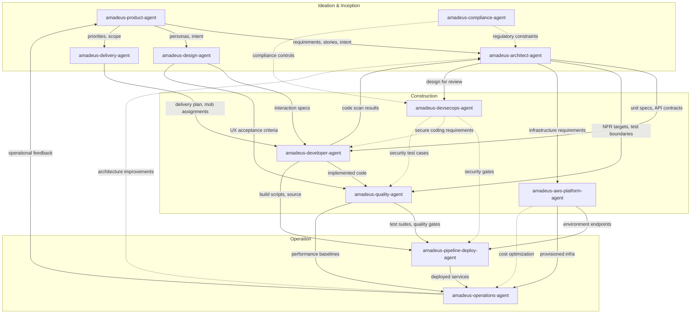

# エージェントリファレンス

11 の AI-DLC エージェントに関する技術リファレンス: 設定、ステージの担当、
協調パターン、および比較データ。

設計思想と根拠については、
[User Guide の Agents 章](../../guide/06-agents.ja.md)を参照してください。

---

## 13 のエージェント(11 のドメインエキスパート + 2 のレビュアー)

| # | Agent | Domain |
|---|-------|--------|
| 1 | [amadeus-product-agent](product-agent.ja.md) | 要件、スコープ、ユーザーストーリー、市場調査 |
| 2 | [amadeus-design-agent](design-agent.ja.md) | UX/UI、ワイヤーフレーム、インタラクション設計、アクセシビリティ |
| 3 | [amadeus-delivery-agent](delivery-agent.ja.md) | チーム編成、キャパシティプランニング、デリバリーシーケンス |
| 4 | [amadeus-architect-agent](architect-agent.ja.md) | アプリケーション設計、ドメインモデリング、NFR、分解 |
| 5 | [amadeus-aws-platform-agent](aws-platform-agent.ja.md) | AWS インフラ、IaC、FinOps、環境プロビジョニング |
| 6 | [amadeus-compliance-agent](compliance-agent.ja.md) | GRC、規制マッピング、データ分類、リスク |
| 7 | [amadeus-devsecops-agent](devsecops-agent.ja.md) | 脅威モデリング、セキュリティパイプライン、セキュア設計レビュー |
| 8 | [amadeus-developer-agent](developer-agent.ja.md) | コード生成、ワークスペース検出、リバースエンジニアリング |
| 9 | [amadeus-quality-agent](quality-agent.ja.md) | テスト戦略、テスト生成、パフォーマンス検証 |
| 10 | [amadeus-pipeline-deploy-agent](pipeline-deploy-agent.ja.md) | CI/CD パイプライン、デプロイ戦略、リリース実行 |
| 11 | [amadeus-operations-agent](operations-agent.ja.md) | 可観測性、インシデント対応、フィードバックループ |
| 12 | amadeus-product-lead-agent | レビュー専用: 要件 / ユーザーストーリー / UX 品質ゲート(sonnet) |
| 13 | amadeus-architecture-reviewer-agent | レビュー専用: 技術設計の健全性 / 実装可能性ゲート(sonnet) |

---

## 共有設定

14 のエージェントすべては、フロントマターで定義された共通の設定ベースラインを共有します。どのエージェントも `tools:` allowlist を宣言していないため、すべてのエージェントは**セッションのフルツールセット** — Claude Code のすべての組み込みツールに加え、セッションにプロビジョニングされた MCP ツール — を継承します。出荷時の唯一の制限は `disallowedTools: Task` です。

### セッションのツールセット(すべてのエージェントが継承)

すべてのエージェントは、以下を含む Claude Code の組み込みツールを継承します:

| Claude Code Tool | Purpose |
|------------------|---------|
| Read | ファイルシステムからファイルを読み込む |
| Edit | ファイル内で厳密な文字列置換を行う |
| Write | ファイルシステムにファイルを書き込む |
| Glob | 高速なファイルパターンマッチング |
| Grep | ripgrep を使ったコンテンツ検索 |
| AskUserQuestion | 対話的なユーザープロンプト(メインスレッドのステージのみ) |

### 共通で許可されない Claude Code ツール

| Claude Code Tool | Reason |
|------------------|--------|
| Task | エージェントは委譲されたワーカーとして動作します。コンダクター(ライブの `/amadeus` セッション)がエージェントを実行する `Task` 呼び出しを行います。エージェント自身がサブエージェントを生成することはありません。`disallowedTools: Task` により、サブエージェントの連鎖的なカスケードを回避します。 |

### 各ペルソナが行使すると期待されるツール

すべてのエージェントは継承によって Bash と WebSearch に*到達できます*。この表は、per-agent の付与ではなく、方法論がどのペルソナにそれらの使用を**期待している**かを記録したものです。ペルソナを真に制限するには、オプションの `tools:` allowlist を追加します(これは、`mcp__<server>__<tool>` の id も列挙されていない限り、継承された MCP を落とします)。この実装ではそのような制限は出荷されていません。

| Claude Code Tool | 行使すると期待されるペルソナ |
|------------------|---------------------|
| Bash | amadeus-aws-platform-agent, amadeus-devsecops-agent, amadeus-developer-agent, amadeus-quality-agent, amadeus-pipeline-deploy-agent, amadeus-operations-agent |
| WebSearch | amadeus-product-agent, amadeus-design-agent, amadeus-compliance-agent |

### モデルのオーバーライド

| Model | Agents |
|-------|--------|
| opus | amadeus-architect-agent, amadeus-product-agent, amadeus-design-agent, amadeus-developer-agent, amadeus-quality-agent, amadeus-devsecops-agent, amadeus-compliance-agent, amadeus-aws-platform-agent |
| sonnet | amadeus-delivery-agent, amadeus-pipeline-deploy-agent, amadeus-operations-agent |

opus がデフォルトです。エージェントが sonnet を使うのは、その出力が主にテンプレート化されている場合 — デリバリー計画、CI/CD の YAML、可観測性や runbook のスキャフォールディング — であり、かつ方法論がすでにエージェントの知識ファイルにエンコードされている場合に限られます。

8 つの opus エージェントは 1 つの性質を共有しています。それらの作業には、判断を要し、複数の制約にまたがる推論が必要であり、その決定は下流にカスケードします。アーキテクチャの境界、曖昧な intent の解釈、UX のトレードオフ、密なコンテキスト下でのコード合成、リスクベースのテスト戦略、脅威の優先順位付け、規制上のエッジケース、クラウドアーキテクチャのトレードオフは、すべてこのカテゴリに該当します。

---

## エージェント一覧表

| Agent | Lead Stages | Support Stages | Model | Tools Expected to Exercise |
|-------|-------------|----------------|-------|------------------------------|
| [amadeus-product-agent](product-agent.ja.md) | intent-capture, market-research, scope-definition, requirements-analysis, user-stories | rough-mockups, approval-handoff, refined-mockups | opus | WebSearch |
| [amadeus-design-agent](design-agent.ja.md) | rough-mockups, refined-mockups | user-stories, application-design | opus | WebSearch |
| [amadeus-delivery-agent](delivery-agent.ja.md) | team-formation, approval-handoff, delivery-planning | scope-definition, units-generation | sonnet | -- |
| [amadeus-architect-agent](architect-agent.ja.md) | feasibility, application-design, units-generation, functional-design, nfr-requirements, nfr-design | intent-capture, reverse-engineering (synthesis), delivery-planning | opus | -- |
| [amadeus-aws-platform-agent](aws-platform-agent.ja.md) | infrastructure-design, environment-provisioning | feasibility, application-design, nfr-design, feedback-optimization | opus | Bash |
| [amadeus-compliance-agent](compliance-agent.ja.md) | (none) | feasibility, nfr-requirements, infrastructure-design, environment-provisioning | opus | WebSearch |
| [amadeus-devsecops-agent](devsecops-agent.ja.md) | (none) | practices-discovery, nfr-requirements, infrastructure-design, build-and-test, environment-provisioning | opus | Bash |
| [amadeus-developer-agent](developer-agent.ja.md) | reverse-engineering (code scan), code-generation | practices-discovery, functional-design, deployment-execution | opus | Bash |
| [amadeus-quality-agent](quality-agent.ja.md) | build-and-test, performance-validation | practices-discovery, nfr-requirements | opus | Bash |
| [amadeus-pipeline-deploy-agent](pipeline-deploy-agent.ja.md) | practices-discovery, ci-pipeline, deployment-pipeline, deployment-execution | (none) | sonnet | Bash |
| [amadeus-operations-agent](operations-agent.ja.md) | observability-setup, incident-response, feedback-optimization | (none) | sonnet | Bash |

---

## エージェント比較マトリクス

| Agent | Bash | WebSearch | Opus Model | Lead Stages | Support Stages | Total Stage Involvement |
|-------|------|-----------|------------|-------------|----------------|-------------------------|
| amadeus-product-agent | No | Yes | Yes | 5 | 3 | 8 |
| amadeus-design-agent | No | Yes | Yes | 2 | 2 | 4 |
| amadeus-delivery-agent | No | No | No | 3 | 2 | 5 |
| amadeus-architect-agent | No | No | Yes | 6 | 3 | 9 |
| amadeus-aws-platform-agent | Yes | No | Yes | 2 | 4 | 6 |
| amadeus-compliance-agent | No | Yes | Yes | 0 | 4 | 4 |
| amadeus-devsecops-agent | Yes | No | Yes | 0 | 5 | 5 |
| amadeus-developer-agent | Yes | No | Yes | 2 | 3 | 5 |
| amadeus-quality-agent | Yes | No | Yes | 2 | 2 | 4 |
| amadeus-pipeline-deploy-agent | Yes | No | No | 4 | 0 | 4 |
| amadeus-operations-agent | Yes | No | No | 3 | 0 | 3 |

**観察:**
- amadeus-architect-agent は最も広範なステージ関与(3 フェーズにまたがる 9 ステージ)を持ち、中心的な設計権威としての役割を反映しています。
- 11 のエージェントのうち 8 つが opus で動作します。3 つの sonnet エージェント(delivery、pipeline-deploy、operations)は、方法論がすでに知識ファイルにエンコードされている、主にテンプレート化された計画、CI/CD、runbook の出力を生成します。
- amadeus-compliance-agent は純粋に助言的な立場で動作します(Ideation、Construction、Operation にまたがる 4 つのサポートステージ、リードステージなし)。
- 11 のエージェントのうち 6 つが Bash アクセスを持ち、いずれも CLI 操作を必要とする役割(インフラ、セキュリティ、開発、テスト、デプロイ、運用)です。
- 3 つのエージェントが調査タスクのために WebSearch アクセスを持っています(product、design、compliance)。

---

## フェーズ参加

この表は、どのエージェントがどのフェーズでアクティブか、そしてそのフェーズでリード(L)またはサポート(S)のいずれとして機能するかを示しています。

| Agent | Initialization (Phase 0) | Ideation (Phase 1) | Inception (Phase 2) | Construction (Phase 3) | Operation (Phase 4) |
|-------|--------------------------|---------------------|---------------------|------------------------|---------------------|
| amadeus-product-agent | -- | L (intent-capture, market-research, scope-definition), S (rough-mockups, approval-handoff) | L (requirements-analysis, user-stories), S (refined-mockups) | -- | -- |
| amadeus-design-agent | -- | L (rough-mockups) | L (refined-mockups), S (user-stories, application-design) | -- | -- |
| amadeus-delivery-agent | -- | L (team-formation, approval-handoff), S (scope-definition) | L (delivery-planning), S (units-generation) | -- | -- |
| amadeus-architect-agent | -- | L (feasibility), S (intent-capture) | L (application-design, units-generation), S (reverse-engineering, delivery-planning) | L (functional-design, nfr-requirements, nfr-design) | -- |
| amadeus-aws-platform-agent | -- | S (feasibility) | S (application-design) | L (infrastructure-design), S (nfr-design) | L (environment-provisioning), S (feedback-optimization) |
| amadeus-compliance-agent | -- | S (feasibility) | -- | S (nfr-requirements, infrastructure-design) | S (environment-provisioning) |
| amadeus-devsecops-agent | -- | -- | S (practices-discovery) | S (nfr-requirements, infrastructure-design, build-and-test) | S (environment-provisioning) |
| amadeus-developer-agent | -- | -- | L (reverse-engineering), S (practices-discovery) | L (code-generation), S (functional-design) | S (deployment-execution) |
| amadeus-quality-agent | -- | -- | S (practices-discovery) | L (build-and-test), S (nfr-requirements) | L (performance-validation) |
| amadeus-pipeline-deploy-agent | -- | -- | L (practices-discovery) | L (ci-pipeline) | L (deployment-pipeline, deployment-execution) |
| amadeus-operations-agent | -- | -- | -- | -- | L (observability-setup, incident-response, feedback-optimization) |

---

## エージェント協調マップ



### テキストフォールバック

```
amadeus-product-agent
  |-- requirements, stories --> amadeus-architect-agent
  |-- personas, intent -------> amadeus-design-agent
  |-- priorities, scope ------> amadeus-delivery-agent

amadeus-design-agent
  |-- interaction specs ------> amadeus-developer-agent
  |-- UX acceptance criteria -> amadeus-quality-agent

amadeus-architect-agent
  |-- unit specs, API contracts --> amadeus-developer-agent
  |-- NFR targets, test boundaries --> amadeus-quality-agent
  |-- infrastructure requirements --> amadeus-aws-platform-agent
  |-- design for review -----------> amadeus-devsecops-agent

amadeus-compliance-agent
  |-- regulatory constraints ....> amadeus-architect-agent
  |-- compliance controls .......> amadeus-devsecops-agent

amadeus-devsecops-agent
  |-- security gates ............> amadeus-pipeline-deploy-agent
  |-- secure coding requirements > amadeus-developer-agent
  |-- security test cases .......> amadeus-quality-agent

amadeus-delivery-agent
  |-- delivery plan, mob assignments --> amadeus-developer-agent

amadeus-developer-agent
  |-- code scan results --> amadeus-architect-agent
  |-- implemented code ---> amadeus-quality-agent
  |-- build scripts ------> amadeus-pipeline-deploy-agent

amadeus-quality-agent
  |-- test suites, quality gates --> amadeus-pipeline-deploy-agent
  |-- performance baselines ------> amadeus-operations-agent

amadeus-aws-platform-agent
  |-- environment endpoints --> amadeus-pipeline-deploy-agent
  |-- provisioned infra -----> amadeus-operations-agent

amadeus-pipeline-deploy-agent
  |-- deployed services --> amadeus-operations-agent

amadeus-operations-agent
  |-- operational feedback -------> amadeus-product-agent  (CLOSES THE LOOP)
  |-- architecture improvements .> amadeus-architect-agent
```

---

## 相互参照

- [Architecture Overview](../01-architecture.ja.md)
- [Orchestrator](../03-orchestrator.ja.md)
- [Agent System](../05-agent-system.ja.md)
- [Stage Documentation](../04-stages/)
- [User Guide の Agents 章(設計思想と根拠)](../../guide/06-agents.ja.md)
- [SKILL.md (Conductor)](../../../dist/claude/.claude/skills/amadeus/SKILL.md) -- エンジンの指示に基づいて動作する forwarding loop。人間が読める stage-graph のミラーを含む
