# AI-DLC ワークフロー図

> 言語: [English](diagrams.md) | **日本語**

このドキュメントには、AI-DLC(AI-Driven Development Life Cycle)方法論を可視化するすべての Mermaid 図が含まれています。各セクションは簡単な説明と、それに続くレンダリング済みの図で構成されています。これらの図は、エンジンとコンダクター(`amadeus-orchestrate.ts` + `SKILL.md`)、ステージプロトコル(`stage-protocol.md`)、ステージファイル、およびエージェント定義から導出されています。

> **注:** これらの図は、関連するリファレンス各章にもインラインで埋め込まれています。このファイルは、すべての図を一箇所にまとめた統合インデックスとして機能します。以下の図における `<record>/` は、アクティブな intent の record ディレクトリ `amadeus/spaces/<space>/intents/<YYMMDD>-<label>/` を指します。
>
> - 図 1 と 7: [Architecture](01-architecture.ja.md)
> - 図 8: [Orchestrator](03-orchestrator.ja.md) -- Session Management セクション
> - 図 9: [Orchestrator](03-orchestrator.ja.md) -- Scope Routing セクション
> - 図 10: [Knowledge System](10-knowledge-system.ja.md)
> - 図 11: [Stage Protocol](04-stage-protocol.ja.md) -- Approval Gates セクション
> - 図 12: [Orchestrator](03-orchestrator.ja.md) -- State Tracking セクション

---

## 1. エンドツーエンドのライフサイクル

AI-DLC 方法論は、作業を 5 つの連続したフェーズに編成します。各フェーズにはその境界に検証ゲートがあり、次のフェーズが開始する前に通過しなければなりません。ライフサイクル全体は 5 フェーズにまたがる 32 ステージに及び、スコープによって実際に実行されるステージが決まります。

```mermaid
graph LR
    subgraph INITIALIZATION["INITIALIZATION (0.1-0.3)"]
        Z1["Workspace Scaffold"]
        Z4["State Init"]
        Z1 -.->|"3 stages"| Z4
    end

    subgraph IDEATION["IDEATION (1.1-1.7)"]
        I1["Intent Capture"]
        I7["Approval & Handoff"]
        I1 -.->|"7 stages"| I7
    end

    subgraph INCEPTION["INCEPTION (2.1-2.8)"]
        N1["Reverse Engineering"]
        N7["Delivery Planning"]
        N1 -.->|"8 stages"| N7
    end

    subgraph CONSTRUCTION["CONSTRUCTION (3.1-3.7)"]
        C1["Functional Design"]
        C7["CI Pipeline"]
        C1 -.->|"3.1-3.5 per Bolt; 3.6-3.7 once after all Bolts"| C7
    end

    subgraph OPERATION["OPERATION (4.1-4.7)"]
        O1["Deployment Pipeline"]
        O7["Feedback & Optimization"]
        O1 -.->|"7 stages"| O7
    end

    Z4 -->|"auto-proceed"| I1
    I7 -->|"Verification Gate 1"| N1
    N7 -->|"Verification Gate 2"| C1
    C7 -->|"Verification Gate 3"| O1
    O7 -.->|"Feedback Loop"| I1

    style INITIALIZATION fill:#f3e5f5,stroke:#9c27b0
    style IDEATION fill:#e8f5e9,stroke:#4caf50
    style INCEPTION fill:#e3f2fd,stroke:#2196f3
    style CONSTRUCTION fill:#fff3e0,stroke:#ff9800
    style OPERATION fill:#fce4ec,stroke:#e91e63
```

---

## 2. Ideation フロー

Ideation フェーズでは、ビジネス上の intent を捕捉し、実現可能性を検証し、スコープを定義し、チームを編成し、ラフなモックアップを作成し、承認のためのイニシアチブブリーフを作成します。ALWAYS とマークされたステージはすべてのスコープで実行されます。CONDITIONAL のステージは特定のスコープではスキップされます(例: poc、bugfix、chore、refactor は Market Research をスキップ)。実線の矢印は ALWAYS のルーティングを、破線の矢印は CONDITIONAL のルーティングを示します。

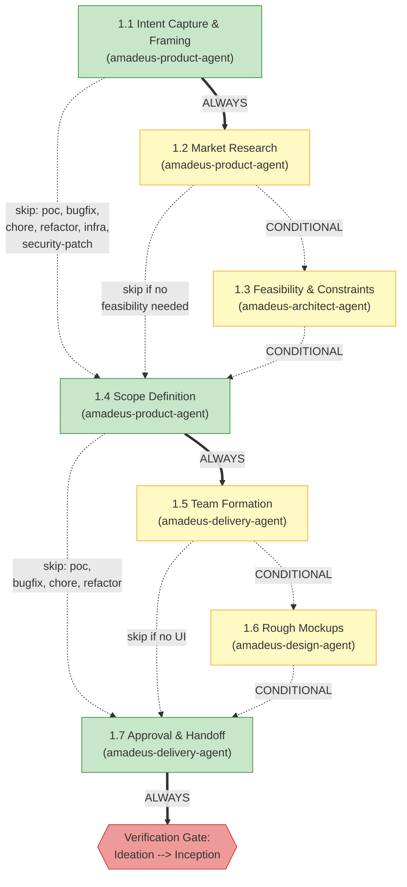

---

## 3. Inception フロー

Inception フェーズでは、(ブラウンフィールドプロジェクトの場合)コードベースを分析し、チームのプラクティスを発見し、要件を引き出し、ユーザーストーリーとモックアップを作成し、アプリケーションアーキテクチャを設計し、実装単位へ分解し、デリバリーを計画します。ステージ 2.1(Reverse Engineering)はサブエージェントとして実行され、六角形の形状で示されています。これは 2 ステップの RE パターンを使用します。まず developer サブエージェントがコードをスキャンし、次に architect サブエージェントが結果を統合します。

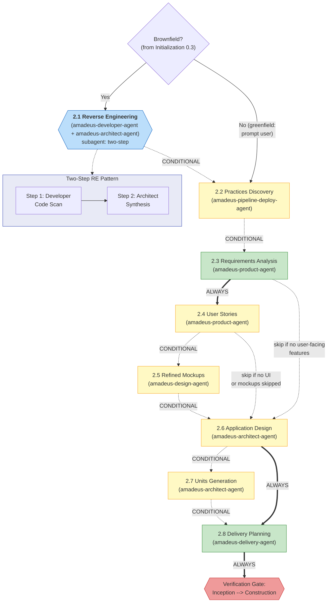

---

## 4. Construction フロー

Construction フェーズは、`bolt-plan.md` に従って Bolt ごとに実行します。各 Bolt は 1 つ以上の作業単位(Unit of Work)からなる一貫したスライスをカバーし、ステージ 3.1〜3.5 を一度実行します。walking-skeleton の Bolt は常に単一 Bolt バッチとして最初に実行されます。後続の Bolt は、依存グラフが許す限り並列バッチで実行される場合があります。最後の Bolt の後、ステージ 3.6(Build and Test)と 3.7(CI Pipeline)がすべての Bolt にわたって一度実行されます。ステージ 3.5(Code Generation)はサブエージェントとして実行され、六角形の形状で示されています。

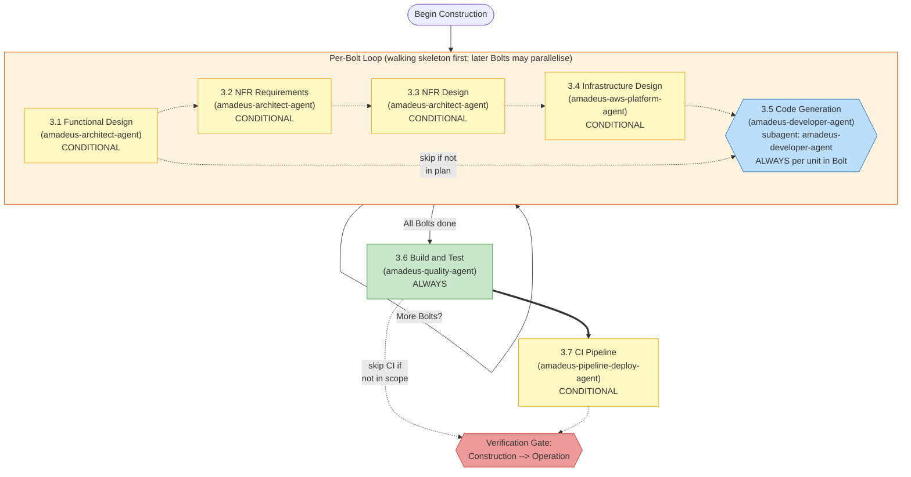

---

## 5. Operation フロー

Operation フェーズは、デプロイ、環境プロビジョニング、可観測性、インシデント対応、パフォーマンス検証、およびフィードバックをカバーします。7 つのステージはすべて CONDITIONAL です(poc、bugfix、および chore スコープではフェーズ全体がスキップされる場合があります)。すべてのステージはインラインで実行されます。ステージ 4.7 は終端ステージです。承認されると、ワークフローが完了するか、新しい Ideation サイクルを開始できます。

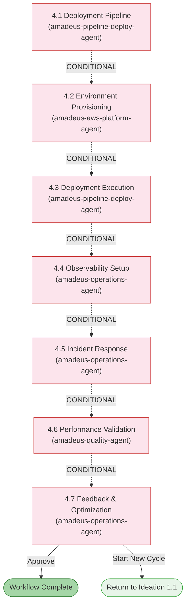

---

## 6. エージェント協調マップ

AI-DLC システムは 11 のドメインエキスパートエージェントを使用します。コンダクター(SKILL.md)は、エンジンの指示に従って各エージェントの呼び出しを実行します。エージェント同士が直接呼び合うことはありません。エージェント間の情報は、intent の record ディレクトリ(`amadeus/spaces/<space>/intents/<YYMMDD>-<label>/`)に保存された成果物を介して流れます。以下の図は、エージェント間の主要な情報フローを示しており、amadeus-operations-agent から amadeus-product-agent へのフィードバックループで結ばれています。

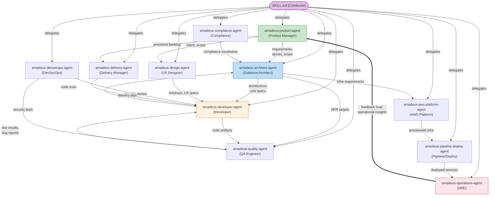

---

## 7. 実行モデル

この実装では、ステージに 3 つの実行モードを使用します。**Inline** ステージは、オーケストレーターの会話内で直接実行されます(ユーザーが対話可能)。**Subagent(simple)** ステージは、Claude Code の Task ツールを介して単一のエージェントに委譲します。**Subagent(two-step RE)** は、2 つのエージェントに順次委譲する Reverse Engineering 専用の特殊なパターンです。

```mermaid
flowchart LR
    subgraph INLINE["Mode 1: Inline"]
        direction TB
        IN1["Orchestrator reads\nstage file"]
        IN2["Load agent persona\n+ knowledge"]
        IN3["Execute stage steps\ndirectly in conversation"]
        IN4["User interaction\navailable"]
        IN5["Approval gate\n(AskUserQuestion)"]
        IN1 --> IN2 --> IN3 --> IN4 --> IN5
    end

    subgraph SUBAGENT["Mode 2: Subagent (simple)"]
        direction TB
        SA1["Orchestrator reads\nstage file"]
        SA2["Prepare context:\nartifacts + persona"]
        SA3["Task tool call\n(subagent_type specified)"]
        SA4["Subagent executes\n(no user interaction)"]
        SA5["Return structured\nsummary to orchestrator"]
        SA6["Orchestrator presents\ncompletion + approval"]
        SA1 --> SA2 --> SA3 --> SA4 --> SA5 --> SA6
    end

    subgraph TWOSTEP["Mode 3: Subagent (two-step RE)"]
        direction TB
        TS1["Orchestrator reads\nRE stage file"]
        TS2["Task: amadeus-developer-agent\ncode scan"]
        TS3["Developer returns\nscan results"]
        TS4["Task: amadeus-architect-agent\nsynthesis"]
        TS5["Architect produces\n9 artifacts"]
        TS6["Orchestrator presents\ncompletion + approval"]
        TS1 --> TS2 --> TS3 --> TS4 --> TS5 --> TS6
    end

    style INLINE fill:#e8f5e9,stroke:#4caf50
    style SUBAGENT fill:#e3f2fd,stroke:#2196f3
    style TWOSTEP fill:#fff3e0,stroke:#ff9800
```

---

## 8. セッション再開フロー

ユーザーが `/amadeus` を実行すると、オーケストレーターはアクティブな intent の `amadeus-state.md` を確認します。見つかった場合は 4 つの再開オプションを提示します。見つからない場合は最初の intent を誕生させます。オーケストレーターはまた、コンテキストのコンパクションによる状態の破損の可能性を検出するために `.amadeus-recovery.md` も確認します。

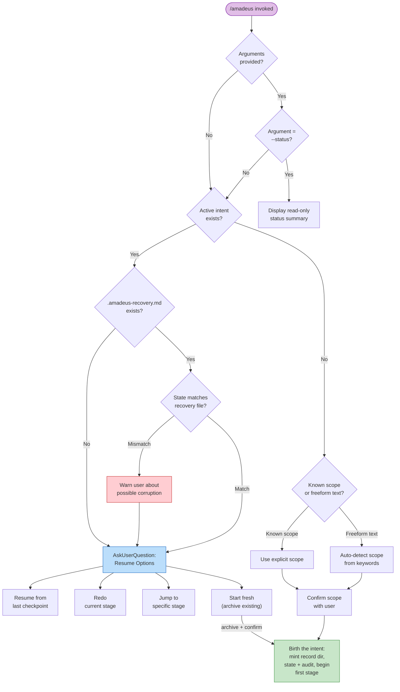

---

## 9. スコープルーティング

> スコープルーティングテーブル: [Orchestrator Reference -- Scope Mapping](03-orchestrator.ja.md#scope-to-stage-mapping) を参照。

---

## 10. 知識の読み込み順序

各ステージは、厳密な 6 ステップの順序で知識を読み込みます。これにより、ガードレールが最優先され、続いて共有方法論、次にエージェント固有の知識、次にチームのカスタマイズ、最後に前段ステージの成果物が読み込まれます。以下のシーケンス図は、任意のステージ起動時の読み込み順序を示しています。

> **注:** ステップ 1〜5 はエージェント知識の読み込み(各エージェントファイルで定義)です。ステップ 6(前段ステージの成果物)は、ファイル読み込みステップではなく、実行時にオーケストレーターが追加するコンテキストです。

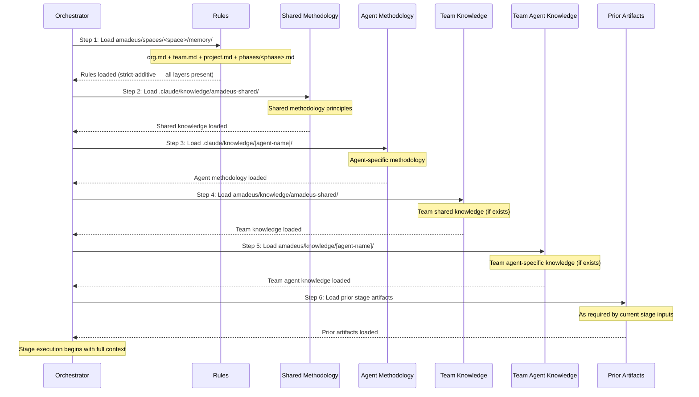

---

## 11. 承認ゲートフロー

すべてのステージ(3 つの Initialization ステージを除く)は承認ゲートで終わります。オーケストレーターは、ユーザーにオプションを提示する前に監査証跡にオプションを記録し、その後ユーザーの応答を記録します。3 回の修正サイクルの後、「Accept as-is(現状のまま受け入れる)」というエスケープハッチが利用可能になります。Ideation および Inception のステージには、以前スキップしたステージを追加する条件付きの第 3 オプションが含まれる場合もあります。

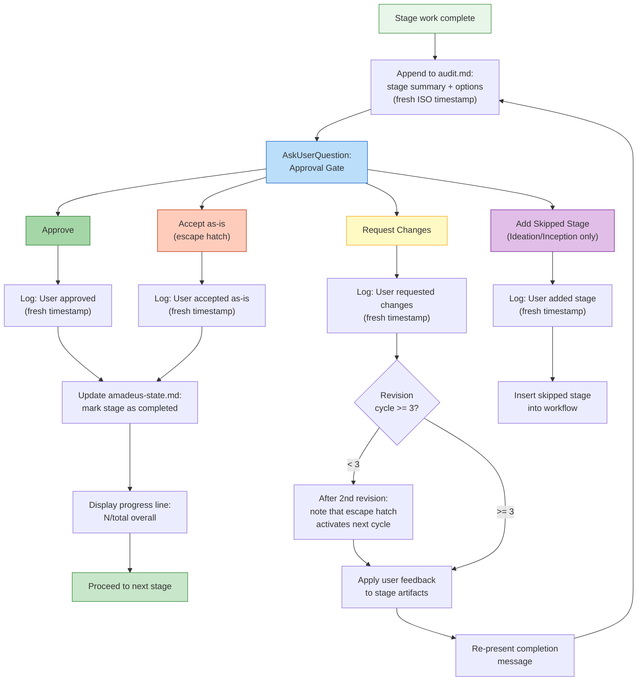

---

## 12. 状態トラッキング

`amadeus-state.md` ファイルは、チェックボックス記法で各ステージを追跡します: `[ ]`(未開始)、`[-]`(進行中)、`[x]`(完了)。ステージは常に中間の `[-]` 状態を経由して遷移します。`[ ]` から直接 `[x]` にジャンプすることはありません。この図はまた、skip、redo、jump 操作のサイドフローも示しています。

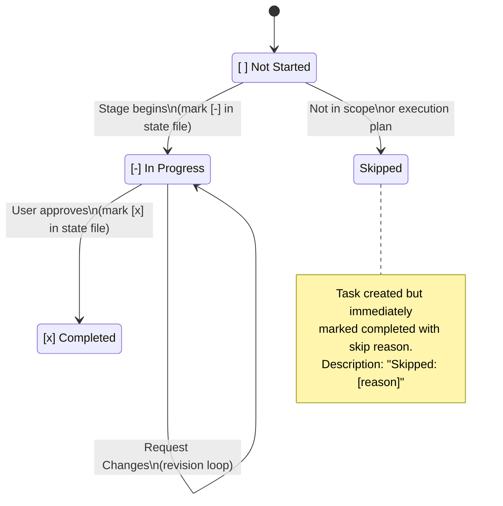

```mermaid
flowchart TD
    subgraph NORMAL["Normal Flow"]
        direction LR
        NS1["[ ] Not Started"]
        IP1["[-] In Progress"]
        CO1["[x] Completed"]
        NS1 -->|"stage begins"| IP1
        IP1 -->|"user approves"| CO1
    end

    subgraph SKIP["Skip Flow"]
        direction LR
        NS2["[ ] Not Started"]
        SK2["[x] Completed\n(Skipped: reason)"]
        NS2 -->|"not in scope"| SK2
    end

    subgraph REDO["Redo Flow"]
        direction LR
        CO3["[x] Completed\nor [-] In Progress"]
        NS3["[ ] Not Started"]
        IP3["[-] In Progress"]
        CO3 -->|"user requests redo\n(delete artifacts)"| NS3
        NS3 -->|"re-execute stage"| IP3
    end

    subgraph JUMP["Jump Flow"]
        direction LR
        IP4["[-] In Progress\n(stage A)"]
        NS4["[ ] Not Started\n(stage B)"]
        IP4B["[-] In Progress\n(stage B)"]
        IP4 -->|"user requests jump\n(warn about skipped stages)"| NS4
        NS4 -->|"begin target stage"| IP4B
    end

    style NORMAL fill:#e8f5e9,stroke:#4caf50
    style SKIP fill:#fff9c4,stroke:#f9a825
    style REDO fill:#e3f2fd,stroke:#2196f3
    style JUMP fill:#fce4ec,stroke:#e91e63
```

---

## ステージ別実行モードのまとめ

このリファレンステーブルは、素早く参照できるように、すべてのステージをその実行モードとリードエージェントに対応付けています。

| Stage | Name | Mode | Lead Agent |
|-------|------|------|------------|
| 0.1 | Workspace Scaffold | inline (auto-proceed) | orchestrator |
| 0.2 | Workspace Detection | inline (auto-proceed, deterministic scanner) | orchestrator |
| 0.3 | State Init | inline (auto-proceed) | orchestrator |
| 1.1 | Intent Capture | inline | amadeus-product-agent |
| 1.2 | Market Research | inline | amadeus-product-agent |
| 1.3 | Feasibility | inline | amadeus-architect-agent |
| 1.4 | Scope Definition | inline | amadeus-product-agent |
| 1.5 | Team Formation | inline | amadeus-delivery-agent |
| 1.6 | Rough Mockups | inline | amadeus-design-agent |
| 1.7 | Approval & Handoff | inline | amadeus-delivery-agent |
| 2.1 | Reverse Engineering | subagent (two-step) | amadeus-developer-agent + amadeus-architect-agent |
| 2.2 | Practices Discovery | inline | amadeus-pipeline-deploy-agent |
| 2.3 | Requirements Analysis | inline | amadeus-product-agent |
| 2.4 | User Stories | inline | amadeus-product-agent |
| 2.5 | Refined Mockups | inline | amadeus-design-agent |
| 2.6 | Application Design | inline | amadeus-architect-agent |
| 2.7 | Units Generation | inline | amadeus-architect-agent |
| 2.8 | Delivery Planning | inline | amadeus-delivery-agent |
| 3.1 | Functional Design | inline | amadeus-architect-agent |
| 3.2 | NFR Requirements | inline | amadeus-architect-agent |
| 3.3 | NFR Design | inline | amadeus-architect-agent |
| 3.4 | Infrastructure Design | inline | amadeus-aws-platform-agent |
| 3.5 | Code Generation | subagent (amadeus-developer-agent) | amadeus-developer-agent |
| 3.6 | Build and Test | inline | amadeus-quality-agent |
| 3.7 | CI Pipeline | inline | amadeus-pipeline-deploy-agent |
| 4.1 | Deployment Pipeline | inline | amadeus-pipeline-deploy-agent |
| 4.2 | Environment Provisioning | inline | amadeus-aws-platform-agent |
| 4.3 | Deployment Execution | inline | amadeus-pipeline-deploy-agent |
| 4.4 | Observability Setup | inline | amadeus-operations-agent |
| 4.5 | Incident Response | inline | amadeus-operations-agent |
| 4.6 | Performance Validation | inline | amadeus-quality-agent |
| 4.7 | Feedback & Optimization | inline | amadeus-operations-agent |
