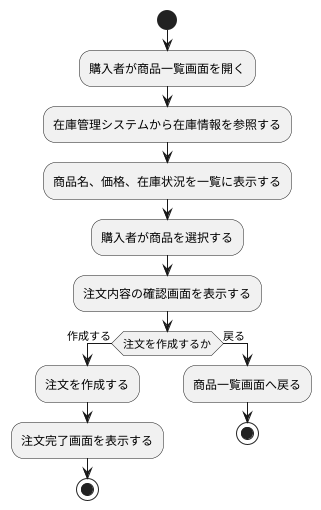

# User Flow：最小購入フロー

## 商品選択から注文作成までのフロー

開始: 購入者が商品一覧画面を開く
終了: 購入者が注文完了画面で注文の作成結果を確認する

```plantuml
@startuml
start
:購入者が商品一覧画面を開く;
:在庫管理システムから在庫情報を参照する;
:商品名、価格、在庫状況を一覧に表示する;
:購入者が商品を選択する;
:注文内容の確認画面を表示する;
if (注文を作成するか) then (作成する)
  :注文を作成する;
  :注文完了画面を表示する;
  stop
else (戻る)
  :商品一覧画面へ戻る;
  stop
endif
@enduml
```

在庫がない商品は選択できないため、在庫参照はフローの先頭で行う。
障害時の振る舞い（在庫管理システムを参照できない場合）は未確認であり、Inception の要求分析で確定する。
