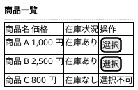
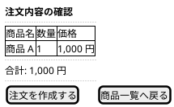
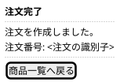

# Wireframes：最小購入フロー

低忠実度のワイヤーフレームである。
画面のレイアウトと表示要素の確認だけを目的にし、デザインシステム対応は Inception の Refined Mockups が扱う。

## 商品一覧画面

購入者が最初に確認する画面である。
商品ごとに名前、価格、在庫状況を表示し、注文対象の商品を選択できる。
在庫状況は在庫管理システムから参照した在庫情報を表示する。

## 注文内容の確認画面

選択した商品と数量を確認し、注文を作成する画面である。

## 注文完了画面

注文の作成結果を確認する画面である。

