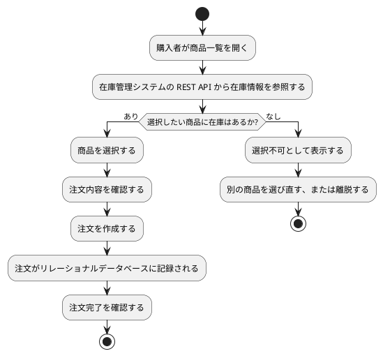

# User Flow：260703-minimum-purchase-flow

## 商品選択から注文作成までのフロー

開始: 購入者が商品一覧を開く
終了: 購入者が注文完了を確認する

```plantuml
@startuml
start
:購入者が商品一覧を開く;
:在庫管理システムの REST API から在庫情報を参照する;
if (選択したい商品に在庫はあるか?) then (あり)
  :商品を選択する;
  :注文内容を確認する;
  :注文を作成する;
  :注文がリレーショナルデータベースに記録される;
  :注文完了を確認する;
  stop
else (なし)
  :選択不可として表示する;
  :別の商品を選び直す、または離脱する;
  stop
endif
@enduml
```

在庫管理システムの在庫参照に失敗した場合の振る舞いは未確認であり、Inception の要求分析で確定する（ideation/feasibility/raid-log.md 参照）。
