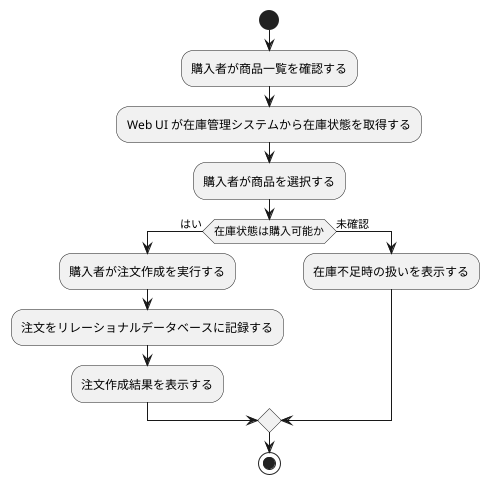

# User Flow：利用者が商品を選択して注文を作成できる最小の購入フローを実現する

## 最小購入フロー

開始: 購入者が購入者向け Web UI を開く。
終了: 注文が作成され、リレーショナルデータベースに記録される。

```plantuml
@startuml
start
:購入者が商品一覧を確認する;
:Web UI が在庫管理システムから在庫状態を取得する;
:購入者が商品を選択する;
if (在庫状態は購入可能か) then (はい)
  :購入者が注文作成を実行する;
  :注文をリレーショナルデータベースに記録する;
  :注文作成結果を表示する;
else (未確認)
  :在庫不足時の扱いを表示する;
endif
stop
@enduml
```
