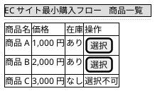
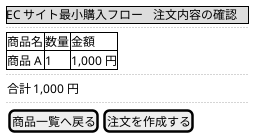
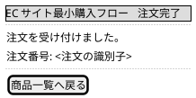

# Wireframes：260703-minimum-purchase-flow

低忠実度のワイヤーフレームであり、画面の詳細化は Inception の Refined Mockups が扱う。

## 商品一覧画面

購入者が最初に開く画面である。
商品ごとに在庫管理システムから参照した在庫状況を示し、在庫がある商品だけを選択できる。

## 注文内容確認画面

選択した商品と数量を確認し、注文を作成する画面である。

## 注文完了画面

作成した注文の識別子を示し、注文が記録されたことを購入者に伝える画面である。

数量の指定方法と価格の表示形式は例示であり、確定は Inception の要求分析と Refined Mockups が扱う。
