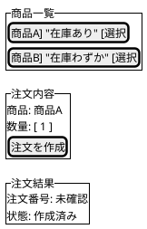
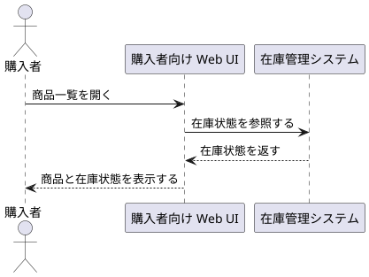

# Wireframes：利用者が商品を選択して注文を作成できる最小の購入フローを実現する

## 商品選択と注文作成

購入者が商品を確認し、在庫状態を見て注文を作成するための粗い画面構成である。

```plantuml
@startsalt
{
  {^"商品一覧"
    [商品A] "在庫あり" [選択]
    [商品B] "在庫わずか" [選択]
  }
  {^"注文内容"
    商品: 商品A
    数量: [ 1 ]
    [注文を作成]
  }
  {^"注文結果"
    注文番号: 未確認
    状態: 作成済み
  }
}
@endsalt
```

## 在庫参照の相互作用

購入者向け UI は、在庫管理システムから取得した在庫状態を購入判断の材料として表示する。

```plantuml
@startuml
actor 購入者
participant "購入者向け Web UI" as UI
participant "在庫管理システム" as Stock

購入者 -> UI: 商品一覧を開く
UI -> Stock: 在庫状態を参照する
Stock --> UI: 在庫状態を返す
UI --> 購入者: 商品と在庫状態を表示する
@enduml
```
